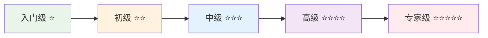

# NestJS进阶项目学习路径

> **🚀 技能进阶指南** - 从入门到专家的完整项目实战路径

## 📊 项目难度分级体系

---

## 🎯 项目学习路径总览

### 📈 技能成长曲线

| 项目阶段 | 核心技能 | 项目数量 | 预计时间 |
|---------|---------|---------|---------|
| **入门级** | 基础CRUD、简单认证 | 2个项目 | 2-3个月 |
| **初级** | 复杂业务、文件处理 | 2个项目 | 3-4个月 |
| **中级** | 微服务、高并发 | 3个项目 | 4-6个月 |
| **高级** | 分布式、大数据 | 2个项目 | 6-8个月 |
| **专家级** | 架构设计、技术创新 | 2个项目 | 持续学习 |

---

## 🌟 入门级项目 (⭐)

### 项目1：个人任务管理系统 (Todo List Pro)

#### 🎯 项目概述
一个功能完善的个人任务管理系统，支持任务分类、优先级、提醒等功能。

#### 🔧 技术栈
- **后端**：NestJS + TypeORM + SQLite
- **认证**：JWT基础认证
- **文档**：Swagger
- **测试**：Jest基础测试

#### 📋 核心功能
- 用户注册登录
- 任务CRUD操作
- 任务分类管理
- 任务状态跟踪
- 简单的数据统计

#### 🎓 学习目标
- 掌握NestJS基础架构
- 理解TypeORM基本用法
- 学会JWT认证实现
- 熟悉RESTful API设计

#### ⏰ 预计时间：3-4周

---

### 项目2：在线书签管理器

#### 🎯 项目概述
一个在线书签收藏和管理系统，支持标签分类、搜索、导入导出等功能。

#### 🔧 技术栈
- **后端**：NestJS + TypeORM + MySQL
- **缓存**：Redis基础缓存
- **搜索**：MySQL全文搜索
- **文件**：文件上传处理

#### 📋 核心功能
- 书签收藏管理
- 标签分类系统
- 全文搜索功能
- 书签导入导出
- 用户偏好设置

#### 🎓 学习目标
- 掌握MySQL数据库设计
- 学会Redis缓存使用
- 理解全文搜索实现
- 熟悉文件处理机制

#### ⏰ 预计时间：4-5周

---

## 🚀 初级项目 (⭐⭐)

### 项目3：企业级博客系统 (已完成)

#### 🎯 项目概述
功能完善的博客平台，支持文章发布、评论互动、用户关注等社交功能。

#### 🔧 技术栈
- **后端**：NestJS + TypeORM + MySQL
- **缓存**：Redis
- **搜索**：MySQL全文索引
- **认证**：JWT + RBAC权限
- **部署**：Docker + Nginx

#### 📋 核心功能
- 用户认证授权系统
- 文章发布管理
- 评论互动功能
- 搜索推荐系统
- 文件上传处理

#### 🎓 学习目标
- 掌握复杂业务逻辑设计
- 理解RBAC权限模型
- 学会推荐算法实现
- 熟悉Docker部署

#### ⏰ 预计时间：6-8周

---

### 项目4：在线教育平台API

#### 🎯 项目概述
一个在线教育平台的后端API系统，支持课程管理、学习进度跟踪、在线考试等功能。

#### 🔧 技术栈
- **后端**：NestJS + TypeORM + PostgreSQL
- **缓存**：Redis + Bull队列
- **文件**：AWS S3 / 阿里云OSS
- **支付**：第三方支付集成
- **实时**：WebSocket

#### 📋 核心功能
- 课程内容管理
- 学习进度跟踪
- 在线考试系统
- 支付订单管理
- 实时聊天功能
- 数据分析报表

#### 🎓 学习目标
- 掌握PostgreSQL高级特性
- 学会消息队列使用
- 理解第三方服务集成
- 熟悉WebSocket实时通信

#### ⏰ 预计时间：8-10周

---

## 💼 中级项目 (⭐⭐⭐)

### 项目5：电商平台微服务架构

#### 🎯 项目概述
基于微服务架构的电商平台，包含用户服务、商品服务、订单服务、支付服务等多个微服务。

#### 🔧 技术栈
- **架构**：微服务 + API Gateway
- **后端**：NestJS + TypeORM + MongoDB/PostgreSQL
- **消息**：RabbitMQ / Apache Kafka
- **缓存**：Redis Cluster
- **搜索**：Elasticsearch
- **监控**：Prometheus + Grafana
- **部署**：Kubernetes + Docker

#### 📋 核心功能
- 用户管理服务
- 商品目录服务
- 购物车服务
- 订单管理服务
- 支付处理服务
- 库存管理服务
- 推荐引擎服务

#### 🎓 学习目标
- 掌握微服务架构设计
- 学会服务间通信
- 理解分布式事务
- 熟悉容器编排

#### ⏰ 预计时间：12-16周

---

### 项目6：实时协作文档系统

#### 🎯 项目概述
类似Google Docs的实时协作文档编辑系统，支持多人同时编辑、版本控制、权限管理等功能。

#### 🔧 技术栈
- **后端**：NestJS + TypeORM + PostgreSQL
- **实时**：Socket.IO + Redis Adapter
- **存储**：MinIO / AWS S3
- **搜索**：Elasticsearch
- **协作**：Operational Transformation (OT)
- **缓存**：Redis + Bull队列

#### 📋 核心功能
- 实时文档编辑
- 多人协作冲突解决
- 文档版本控制
- 权限管理系统
- 文档模板管理
- 导出多种格式

#### 🎓 学习目标
- 掌握实时协作算法
- 学会冲突解决机制
- 理解版本控制系统
- 熟悉高并发处理

#### ⏰ 预计时间：14-18周

---

### 项目7：智能客服系统

#### 🎯 项目概述
集成AI的智能客服系统，支持多渠道接入、智能问答、人工客服转接、数据分析等功能。

#### 🔧 技术栈
- **后端**：NestJS + TypeORM + MongoDB
- **AI**：OpenAI API / 本地NLP模型
- **实时**：WebSocket + Redis
- **消息**：RabbitMQ
- **分析**：ClickHouse + Apache Superset
- **监控**：ELK Stack

#### 📋 核心功能
- 多渠道消息接入
- AI智能问答
- 人工客服系统
- 工单管理系统
- 知识库管理
- 数据分析报表

#### 🎓 学习目标
- 掌握AI服务集成
- 学会多渠道架构
- 理解数据分析系统
- 熟悉实时消息处理

#### ⏰ 预计时间：16-20周

---

## 🏆 高级项目 (⭐⭐⭐⭐)

### 项目8：分布式视频流媒体平台

#### 🎯 项目概述
大规模视频流媒体平台，支持视频上传、转码、CDN分发、直播、弹幕等功能。

#### 🔧 技术栈
- **架构**：分布式微服务
- **后端**：NestJS + TypeORM + PostgreSQL
- **存储**：分布式文件系统 (MinIO Cluster)
- **CDN**：自建CDN / 第三方CDN
- **流媒体**：FFmpeg + HLS/DASH
- **消息**：Apache Kafka
- **缓存**：Redis Cluster
- **搜索**：Elasticsearch
- **监控**：完整监控体系

#### 📋 核心功能
- 视频上传处理
- 多格式转码
- CDN内容分发
- 直播推流拉流
- 弹幕系统
- 推荐算法
- 数据统计分析

#### 🎓 学习目标
- 掌握大规模系统架构
- 学会视频处理技术
- 理解CDN分发机制
- 熟悉高并发优化

#### ⏰ 预计时间：20-24周

---

### 项目9：金融交易系统

#### 🎯 项目概述
高性能金融交易系统，支持股票、期货、数字货币等多种交易品种，要求极高的性能和可靠性。

#### 🔧 技术栈
- **架构**：高性能分布式架构
- **后端**：NestJS + TypeORM + PostgreSQL
- **缓存**：Redis + Hazelcast
- **消息**：Apache Kafka + RocketMQ
- **数据库**：分库分表 + 读写分离
- **监控**：全链路监控
- **安全**：多重安全防护

#### 📋 核心功能
- 高频交易处理
- 实时行情推送
- 风险控制系统
- 清算结算系统
- 用户资产管理
- 合规报告系统

#### 🎓 学习目标
- 掌握高性能系统设计
- 学会金融业务建模
- 理解风险控制机制
- 熟悉安全防护体系

#### ⏰ 预计时间：24-30周

---

## 🎖️ 专家级项目 (⭐⭐⭐⭐⭐)

### 项目10：云原生PaaS平台

#### 🎯 项目概述
企业级云原生PaaS平台，提供应用部署、服务治理、监控告警、DevOps等完整的云服务能力。

#### 🔧 技术栈
- **架构**：云原生微服务架构
- **容器**：Kubernetes + Docker
- **服务网格**：Istio
- **后端**：NestJS + 多种数据库
- **消息**：Apache Pulsar
- **监控**：Prometheus + Grafana + Jaeger
- **CI/CD**：GitLab CI + ArgoCD
- **安全**：零信任安全架构

#### 📋 核心功能
- 应用生命周期管理
- 服务网格治理
- 多租户资源隔离
- 自动扩缩容
- 全链路监控
- DevOps工具链
- 成本优化分析

#### 🎓 学习目标
- 掌握云原生架构
- 学会平台化思维
- 理解服务治理
- 熟悉DevOps实践

#### ⏰ 预计时间：30-40周

---

### 项目11：AI驱动的智能运维平台

#### 🎯 项目概述
基于AI的智能运维平台，提供异常检测、故障预测、自动修复、容量规划等智能化运维能力。

#### 🔧 技术栈
- **架构**：事件驱动架构
- **后端**：NestJS + 时序数据库
- **AI/ML**：TensorFlow + PyTorch
- **数据**：Apache Spark + Flink
- **存储**：InfluxDB + ClickHouse
- **消息**：Apache Kafka
- **可视化**：自研前端 + D3.js

#### 📋 核心功能
- 智能监控告警
- 异常检测算法
- 故障根因分析
- 自动故障修复
- 容量规划预测
- 性能优化建议

#### 🎓 学习目标
- 掌握AI/ML集成
- 学会时序数据处理
- 理解智能运维理念
- 熟悉大数据技术

#### ⏰ 预计时间：持续迭代

---

## 📊 技能发展矩阵

### 🎯 核心技能进阶路径

| 技能领域 | 入门级 | 初级 | 中级 | 高级 | 专家级 |
|---------|--------|------|------|------|--------|
| **架构设计** | 单体应用 | 分层架构 | 微服务 | 分布式 | 云原生 |
| **数据库** | SQLite | MySQL | PostgreSQL | 分库分表 | 多模数据库 |
| **缓存** | 内存缓存 | Redis | Redis集群 | 多级缓存 | 智能缓存 |
| **消息队列** | - | 简单队列 | RabbitMQ | Kafka | 事件驱动 |
| **搜索** | SQL查询 | 全文搜索 | Elasticsearch | 智能搜索 | AI搜索 |
| **监控** | 日志 | 基础监控 | APM | 全链路 | 智能运维 |
| **部署** | 本地部署 | Docker | K8s | 云原生 | 自动化 |
| **安全** | 基础认证 | JWT+RBAC | OAuth2 | 零信任 | 安全架构 |

### 🚀 学习建议

#### 📚 每个阶段的学习重点

**入门级阶段**：
- 重点掌握NestJS基础概念
- 熟悉TypeORM和数据库操作
- 理解RESTful API设计原则
- 学会基础的测试编写

**初级阶段**：
- 深入理解业务逻辑设计
- 掌握文件处理和第三方集成
- 学会缓存和性能优化
- 熟悉Docker容器化部署

**中级阶段**：
- 掌握微服务架构设计
- 学会分布式系统开发
- 理解高并发处理技术
- 熟悉云原生技术栈

**高级阶段**：
- 掌握大规模系统架构
- 学会性能调优和故障排查
- 理解业务架构设计
- 熟悉技术选型和决策

**专家级阶段**：
- 掌握前沿技术和架构模式
- 学会技术创新和突破
- 理解技术战略规划
- 熟悉团队技术管理

---

## 🎯 项目选择建议

### 📋 根据个人情况选择项目

#### 🎓 学生/初学者
**推荐路径**：项目1 → 项目2 → 项目3 → 项目4
- 重点掌握基础技能
- 循序渐进提升难度
- 注重代码质量和规范

#### 💼 在职开发者
**推荐路径**：项目3 → 项目5 → 项目7 → 项目8
- 结合工作需求选择
- 重点提升架构能力
- 关注业务价值实现

#### 🚀 技术专家
**推荐路径**：项目8 → 项目10 → 项目11
- 挑战技术难点
- 探索前沿技术
- 推动技术创新

### 🔄 学习方式建议

#### 1. 项目驱动学习
- 以项目为载体学习技术
- 在实践中理解原理
- 通过问题驱动深入学习

#### 2. 渐进式提升
- 不要跳跃式学习
- 确保每个阶段都扎实掌握
- 定期回顾和总结

#### 3. 社区参与
- 参与开源项目
- 分享学习心得
- 与同行交流讨论

#### 4. 持续迭代
- 定期重构和优化代码
- 关注新技术和最佳实践
- 保持学习的热情

---

## 🎉 结语

这个进阶项目学习路径为您提供了从入门到专家的完整技术成长路径。每个项目都经过精心设计，确保技能的渐进式提升和知识的系统性积累。

**记住**：
- 🎯 **循序渐进**：不要急于求成，扎实掌握每个阶段的技能
- 🚀 **实践为王**：理论学习要结合项目实践
- 🤝 **交流分享**：与同行交流，分享学习心得
- 💡 **持续创新**：在掌握基础的同时，勇于探索新技术

**祝您在技术成长的道路上越走越远，成为真正的技术专家！** 🌟 