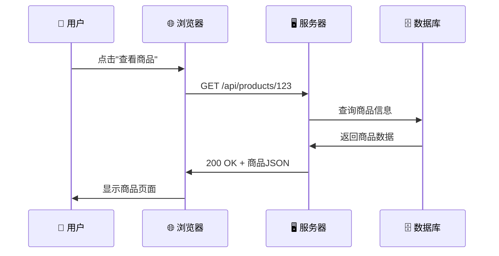
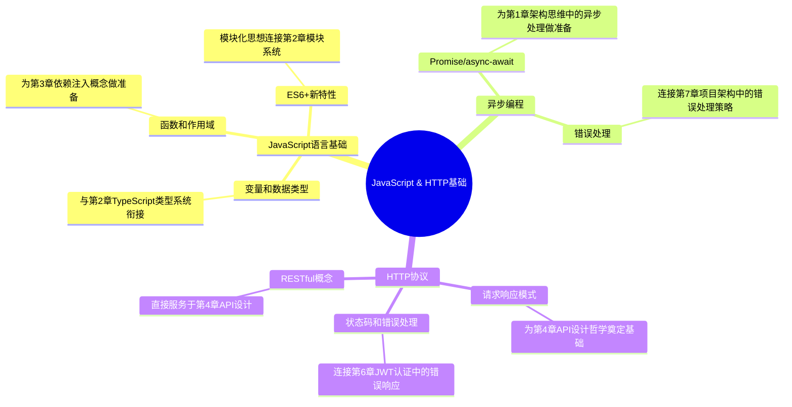

# 第1章前置知识：JavaScript基础与HTTP协议

> **入门必备基础** - 为学习后端架构思维做好准备

## 📚 前置知识学习目标

### 🎯 知识目标
- [ ] **JavaScript语言基础**：掌握ES6+语法、异步编程、面向对象基础
- [ ] **HTTP协议基础**：理解HTTP请求响应机制、状态码、请求方法
- [ ] **Web开发概念**：了解客户端-服务器架构、API概念
- [ ] **开发工具使用**：熟悉浏览器开发者工具、基础调试技能

### 🛠️ 技能目标
- [ ] 能够编写基础的JavaScript程序
- [ ] 能够理解HTTP请求和响应的基本流程
- [ ] 能够使用浏览器开发者工具进行基础调试
- [ ] 具备基本的Web开发概念认知

### ⏰ 学习时长
- **JavaScript基础**：6-8小时
- **HTTP协议**：3-4小时
- **实践练习**：4-6小时
- **总计时长**：13-18小时

---

## 1.1 JavaScript语言基础

### 💡 核心思想：JavaScript是Web的通用语言

> **通俗理解**：如果把网页比作一个房子，HTML是房子的结构（墙壁、门窗），CSS是装修风格（颜色、布局），那么JavaScript就是房子里的电器和智能系统，让房子"活"起来，能够响应用户的操作。

### 🌍 现实应用场景

1. **电商平台**：淘宝、京东的购物车功能
   - 点击"加入购物车"按钮
   - 实时更新商品数量和总价
   - 动态显示优惠券和折扣

2. **社交媒体**：微博、朋友圈的互动功能
   - 点赞、评论、转发的即时反馈
   - 无限滚动加载新内容
   - 实时消息通知

3. **在线办公**：腾讯文档、石墨文档的协作编辑
   - 多人同时编辑文档
   - 实时同步修改内容
   - 自动保存和版本控制

### 1.1.1 基本语法和数据类型

#### 🔤 变量声明：程序的"记忆系统"

> **生活类比**：变量就像是贴了标签的盒子，你可以往盒子里放东西（赋值），也可以从盒子里取东西（使用）。

```javascript
// 🎯 思想解读：为什么要有不同的声明方式？
// var：老式的"公共储物柜"，任何人都能访问和修改
// let：现代的"私人储物柜"，只有在特定区域才能使用
// const：永久的"保险箱"，一旦存入就不能更改

// ❌ 常见错误：使用var导致的作用域混乱
var globalVar = "我是全局变量";
function badExample() {
  if (true) {
    var localVar = "我以为是局部变量";
  }
  console.log(localVar); // 竟然能访问到！这就是var的问题
}

// ✅ 正确做法：使用let和const
let modernWay = "推荐使用"; // 可以修改的变量
const constant = "常量";    // 不可修改的常量

// 🧠 记忆口诀：
// "let让变量有边界，const常量不可改，var变量到处跑，现代开发要避开"
```

#### 📦 数据类型：程序世界的"物质分类"

```javascript
// 🎯 思想解读：为什么要有数据类型？
// 就像现实世界中，我们需要区分苹果、汽车、音乐一样
// 计算机也需要知道数据是什么类型，才能正确处理

// 基本数据类型（原始类型）- 像是"原子"，不可再分
let name = "张三";              // 字符串：文字信息
let age = 25;                  // 数字：数值计算
let isStudent = true;          // 布尔值：是非判断
let nothing = null;            // 空值：故意为空
let notDefined = undefined;    // 未定义：忘记赋值

// 🌟 现实应用场景：
// 1. 电商系统：商品名称(string)、价格(number)、是否有库存(boolean)
// 2. 用户系统：用户名(string)、年龄(number)、是否VIP(boolean)
// 3. 游戏系统：角色名(string)、血量(number)、是否存活(boolean)

// 复合数据类型 - 像是"分子"，由多个原子组成
let fruits = ["苹果", "香蕉", "橙子"]; // 数组：有序的列表
let person = {                         // 对象：属性的集合
  name: "李四",
  age: 30,
  city: "北京"
};

// 🧠 记忆技巧：
// "字符串存文字，数字做计算，布尔判真假，数组装列表，对象存属性"

// ⚠️ 常见错误预警：
console.log(typeof null);        // "object" - 这是JavaScript的历史bug！
console.log(typeof undefined);   // "undefined" - 这才是正确的
console.log(typeof []);          // "object" - 数组也被认为是对象
console.log(typeof {});          // "object" - 纯对象
```

#### 🔧 函数：程序的"工具箱"

> **生活类比**：函数就像是一个专门的工具或机器。你给它原材料（参数），它按照固定的流程处理，然后给你成品（返回值）。

```javascript
// 🎯 思想解读：函数的三大作用
// 1. 代码复用：写一次，用多次
// 2. 逻辑封装：把复杂的操作包装成简单的调用
// 3. 模块化：把大问题分解成小问题

// 🌟 现实应用场景对比：

// 1. 餐厅场景：点餐系统
function orderFood(dishName, quantity = 1) {
  console.log(`您点了 ${quantity} 份 ${dishName}`);
  const price = calculatePrice(dishName, quantity);
  return `总价：${price}元`;
}

// 2. 银行场景：转账系统
function transferMoney(fromAccount, toAccount, amount) {
  if (amount <= 0) {
    return "转账金额必须大于0";
  }
  console.log(`从账户 ${fromAccount} 向账户 ${toAccount} 转账 ${amount} 元`);
  return "转账成功";
}

// 3. 教育场景：成绩计算
function calculateGrade(scores) {
  const average = scores.reduce((sum, score) => sum + score, 0) / scores.length;
  if (average >= 90) return "优秀";
  if (average >= 80) return "良好";
  if (average >= 70) return "中等";
  if (average >= 60) return "及格";
  return "不及格";
}

// 🧠 记忆口诀：
// "函数像工厂，参数是原料，处理有流程，返回是产品"

// ⚠️ 常见错误预警：
// 错误1：忘记return语句
function badAdd(a, b) {
  a + b; // 没有return，函数返回undefined
}

// 错误2：参数类型不匹配
function goodAdd(a, b) {
  if (typeof a !== 'number' || typeof b !== 'number') {
    throw new Error('参数必须是数字');
  }
  return a + b;
}

// 错误3：函数名不够描述性
function calc(x, y) { return x + y; } // ❌ 不清楚做什么
function addTwoNumbers(x, y) { return x + y; } // ✅ 清楚明了
```

### 1.1.2 ES6+新特性：现代JavaScript的"升级包"

#### 🚀 模板字符串：告别字符串拼接的痛苦

> **思想转变**：从"拼积木"式的字符串拼接，升级到"填空题"式的模板字符串

```javascript
// 🎯 对比：旧方式 vs 新方式

// ❌ 旧方式：像拼图一样麻烦
const oldWay = "用户" + name + "今年" + age + "岁，来自" + city;

// ✅ 新方式：像填空题一样简单
const newWay = `用户${name}今年${age}岁，来自${city}`;

// 🌟 现实应用场景：

// 1. 邮件模板系统
function generateEmailTemplate(userName, productName, price) {
  return `
    亲爱的${userName}，
    
    您购买的商品"${productName}"已确认，
    订单金额：￥${price}
    
    感谢您的购买！
  `;
}

// 2. SQL查询构建
function buildQuery(tableName, conditions) {
  return `
    SELECT * FROM ${tableName} 
    WHERE ${conditions.map(c => `${c.field} = '${c.value}'`).join(' AND ')}
  `;
}

// 3. HTML模板生成
function createUserCard(user) {
  return `
    <div class="user-card">
      <h3>${user.name}</h3>
      <p>年龄：${user.age}</p>
      <p>邮箱：${user.email}</p>
    </div>
  `;
}

// 🧠 记忆技巧：
// "反引号包字符串，美元花括号嵌变量，多行文本更清晰"
```

#### 🔄 解构赋值：数据提取的"魔法"

> **生活类比**：解构赋值就像是从快递包裹中取出你需要的物品，不用把整个包裹都搬回家。

```javascript
// 🎯 思想解读：解构赋值解决了什么问题？
// 问题：从复杂的数据结构中提取需要的部分很麻烦
// 解决：一行代码就能提取多个值

// 🌟 现实应用场景：

// 1. API响应数据处理
const apiResponse = {
  status: 200,
  data: {
    user: { name: "张三", age: 25, email: "zhangsan@example.com" },
    permissions: ["read", "write"]
  },
  message: "success"
};

// ❌ 传统方式：一个一个取
const status = apiResponse.status;
const userName = apiResponse.data.user.name;
const userAge = apiResponse.data.user.age;

// ✅ 解构方式：一次性提取
const { status, data: { user: { name, age } }, message } = apiResponse;

// 2. 函数参数解构：配置对象
function createUser({ name, age, email, role = "user" }) {
  console.log(`创建用户：${name}，角色：${role}`);
}

createUser({ name: "李四", age: 30, email: "lisi@example.com" });

// 3. 数组解构：坐标处理
const coordinates = [120.123, 30.456];
const [longitude, latitude] = coordinates;
console.log(`经度：${longitude}，纬度：${latitude}`);

// 🧠 记忆口诀：
// "花括号解对象，方括号解数组，冒号改名字，等号设默认"

// ⚠️ 常见错误预警：
// 错误1：解构不存在的属性
const { nonExistent } = {}; // undefined，不会报错但要小心

// 错误2：解构null或undefined
// const { prop } = null; // 报错！TypeError

// 正确做法：提供默认值
const { prop } = someObject || {};
```

### 1.1.3 异步编程：处理"等待"的艺术

> **核心思想**：异步编程就像是在餐厅点餐，你不需要站在厨房门口等菜做好，而是可以坐下来聊天，菜好了服务员会通知你。

#### ⏰ Promise：异步操作的"承诺书"

```javascript
// 🎯 思想解读：为什么需要Promise？
// 问题：回调地狱 - 异步操作嵌套太深，代码难以维护
// 解决：Promise链式调用 - 让异步代码看起来像同步代码

// 🌟 现实应用场景对比：

// 1. 在线购物流程
function onlineShopping() {
  // 传统回调方式（回调地狱）
  checkInventory(productId, function(available) {
    if (available) {
      processPayment(paymentInfo, function(paymentResult) {
        if (paymentResult.success) {
          shipProduct(orderInfo, function(shipmentInfo) {
            console.log("订单完成");
          });
        }
      });
    }
  });
  
  // Promise方式（链式调用）
  checkInventory(productId)
    .then(available => {
      if (!available) throw new Error("库存不足");
      return processPayment(paymentInfo);
    })
    .then(paymentResult => {
      if (!paymentResult.success) throw new Error("支付失败");
      return shipProduct(orderInfo);
    })
    .then(shipmentInfo => {
      console.log("订单完成", shipmentInfo);
    })
    .catch(error => {
      console.error("订单失败：", error.message);
    });
}

// 2. 用户注册流程
function userRegistration(userData) {
  return validateUserData(userData)
    .then(validData => saveToDatabase(validData))
    .then(savedUser => sendWelcomeEmail(savedUser.email))
    .then(() => console.log("注册成功"))
    .catch(error => console.error("注册失败：", error.message));
}

// 3. 文件上传流程
function uploadFile(file) {
  return compressFile(file)
    .then(compressedFile => uploadToServer(compressedFile))
    .then(uploadResult => updateDatabase(uploadResult))
    .then(result => console.log("上传完成", result))
    .catch(error => console.error("上传失败：", error.message));
}

// 🧠 记忆技巧：
// "Promise是承诺，then是成功，catch是失败，链式调用不嵌套"
```

#### 🎭 async/await：让异步代码"看起来"同步

```javascript
// 🎯 思想转变：从"回调思维"到"同步思维"
// async/await让异步代码读起来像同步代码，降低心理负担

// 🌟 现实应用场景：

// 1. 数据获取和处理
async function getUserProfile(userId) {
  try {
    console.log("开始获取用户信息...");
    
    // 获取基本信息
    const userInfo = await fetchUserInfo(userId);
    console.log("用户基本信息获取成功");
    
    // 获取用户权限
    const permissions = await fetchUserPermissions(userId);
    console.log("用户权限获取成功");
    
    // 获取用户设置
    const settings = await fetchUserSettings(userId);
    console.log("用户设置获取成功");
    
    // 组合数据
    const profile = {
      ...userInfo,
      permissions,
      settings
    };
    
    console.log("用户档案构建完成");
    return profile;
    
  } catch (error) {
    console.error("获取用户档案失败：", error.message);
    throw error;
  }
}

// 2. 批量数据处理
async function processBatchData(dataList) {
  const results = [];
  
  for (const data of dataList) {
    try {
      console.log(`处理数据：${data.id}`);
      
      // 验证数据
      await validateData(data);
      
      // 处理数据
      const processedData = await processData(data);
      
      // 保存结果
      const savedResult = await saveData(processedData);
      
      results.push(savedResult);
      console.log(`数据 ${data.id} 处理完成`);
      
    } catch (error) {
      console.error(`数据 ${data.id} 处理失败：`, error.message);
      // 继续处理下一个数据
    }
  }
  
  return results;
}

// 3. 错误处理和重试机制
async function fetchWithRetry(url, maxRetries = 3) {
  for (let attempt = 1; attempt <= maxRetries; attempt++) {
    try {
      console.log(`第 ${attempt} 次尝试获取数据...`);
      
      const response = await fetch(url);
      
      if (!response.ok) {
        throw new Error(`HTTP ${response.status}: ${response.statusText}`);
      }
      
      const data = await response.json();
      console.log("数据获取成功");
      return data;
      
    } catch (error) {
      console.error(`第 ${attempt} 次尝试失败：`, error.message);
      
      if (attempt === maxRetries) {
        throw new Error(`经过 ${maxRetries} 次尝试后仍然失败`);
      }
      
      // 等待一段时间后重试
      await new Promise(resolve => setTimeout(resolve, 1000 * attempt));
    }
  }
}

// 🧠 记忆口诀：
// "async标记函数，await等待结果，try包成功，catch抓错误"

// ⚠️ 常见错误预警：
// 错误1：忘记await关键字
async function badExample() {
  const result = fetchData(); // 返回Promise对象，不是实际数据
  console.log(result); // [object Promise]
}

// 错误2：在非async函数中使用await
function anotherBadExample() {
  // const result = await fetchData(); // 语法错误
}

// 错误3：没有错误处理
async function riskyExample() {
  const data = await fetchData(); // 如果失败，整个程序可能崩溃
  return data;
}
```

---

## 1.2 HTTP协议基础

### 💡 核心思想：HTTP是Web世界的"通用语言"

> **通俗理解**：HTTP协议就像是邮政系统的规则。无论你寄什么东西，都要按照统一的格式写地址、贴邮票、选择邮寄方式。HTTP也是这样，规定了客户端和服务器之间如何"写信"和"回信"。

### 🌍 现实应用场景

1. **在线购物**：淘宝、京东的商品浏览和购买
   - 浏览商品列表（GET请求）
   - 搜索商品（GET请求带参数）
   - 添加到购物车（POST请求）
   - 提交订单（POST请求）

2. **社交媒体**：微信、微博的内容发布和互动
   - 查看朋友圈（GET请求）
   - 发布动态（POST请求）
   - 点赞评论（PUT/PATCH请求）
   - 删除内容（DELETE请求）

3. **在线教育**：网易云课堂、腾讯课堂的学习系统
   - 获取课程列表（GET请求）
   - 提交作业（POST请求）
   - 更新学习进度（PUT请求）
   - 下载课件（GET请求）

### 1.2.1 HTTP协议概述

#### 🌐 HTTP：Web世界的"邮政系统"



> **思想解读**：HTTP请求就像寄快递，你需要告诉快递员：
> - **去哪里**（URL地址）
> - **做什么**（HTTP方法）
> - **带什么**（请求数据）
> - **怎么联系你**（请求头信息）

```javascript
// 🎯 HTTP请求的组成部分解析

// 1. 请求行：告诉服务器"我要做什么"
// GET /api/users?page=1&limit=10 HTTP/1.1
// ↑     ↑                        ↑
// 方法   URL路径和参数              协议版本

// 2. 请求头：告诉服务器"我的身份和需求"
const headers = {
  'Host': 'api.example.com',           // 目标服务器
  'User-Agent': 'Mozilla/5.0...',      // 浏览器信息
  'Accept': 'application/json',        // 期望的响应格式
  'Authorization': 'Bearer token123',  // 身份验证
  'Content-Type': 'application/json'   // 发送数据的格式
};

// 3. 请求体：告诉服务器"我要发送的数据"
const requestBody = {
  name: "张三",
  email: "zhangsan@example.com",
  age: 25
};

// 🌟 现实类比：HTTP请求像填写快递单
// - 收件人地址 = URL
// - 快递类型 = HTTP方法（普通/加急/到付等）
// - 寄件人信息 = 请求头
// - 包裹内容 = 请求体
```

### 1.2.2 HTTP请求方法：不同的"办事方式"

#### 🎯 HTTP方法：告诉服务器你想做什么

> **生活类比**：HTTP方法就像去银行办不同的业务，每种业务有不同的流程和要求。

```javascript
// 🌟 现实应用场景详解：

// 1. 图书管理系统
class LibraryAPI {
  // GET：查询图书（像去图书馆查书目）
  async getBooks(category) {
    const response = await fetch(`/api/books?category=${category}`);
    // 特点：只查询，不修改任何数据
    // 可以重复执行，结果相同（幂等性）
    return response.json();
  }
  
  // POST：添加新图书（像向图书馆捐赠新书）
  async addBook(bookData) {
    const response = await fetch('/api/books', {
      method: 'POST',
      headers: { 'Content-Type': 'application/json' },
      body: JSON.stringify(bookData)
    });
    // 特点：创建新资源，每次执行都会创建新的
    // 不是幂等的（多次执行结果不同）
    return response.json();
  }
  
  // PUT：更新整本图书信息（像重新编写图书信息卡）
  async updateBook(bookId, completeBookData) {
    const response = await fetch(`/api/books/${bookId}`, {
      method: 'PUT',
      headers: { 'Content-Type': 'application/json' },
      body: JSON.stringify(completeBookData)
    });
    // 特点：完整替换资源，需要提供所有字段
    // 是幂等的（多次执行结果相同）
    return response.json();
  }
  
  // PATCH：部分更新图书信息（像修改图书的某个信息）
  async updateBookPrice(bookId, newPrice) {
    const response = await fetch(`/api/books/${bookId}`, {
      method: 'PATCH',
      headers: { 'Content-Type': 'application/json' },
      body: JSON.stringify({ price: newPrice })
    });
    // 特点：只更新指定字段，其他字段保持不变
    return response.json();
  }
  
  // DELETE：删除图书（像从图书馆移除图书）
  async deleteBook(bookId) {
    const response = await fetch(`/api/books/${bookId}`, {
      method: 'DELETE'
    });
    // 特点：删除资源，是幂等的
    // 删除不存在的资源通常返回404或200
    return response.ok;
  }
}

// 🧠 记忆口诀：
// "GET取数据，POST创建新，PUT全替换，PATCH改一点，DELETE删除掉"

// ⚠️ 常见错误预警：
// 错误1：用GET发送敏感数据
// ❌ 错误：密码会出现在URL中
fetch('/api/login?username=admin&password=123456');

// ✅ 正确：使用POST，数据在请求体中
fetch('/api/login', {
  method: 'POST',
  body: JSON.stringify({ username: 'admin', password: '123456' })
});

// 错误2：混淆PUT和PATCH
// ❌ 错误：用PUT只更新一个字段，可能导致其他字段被清空
fetch('/api/users/123', {
  method: 'PUT',
  body: JSON.stringify({ email: 'new@example.com' })
  // 其他字段如name、age可能被清空！
});

// ✅ 正确：用PATCH更新部分字段
fetch('/api/users/123', {
  method: 'PATCH',
  body: JSON.stringify({ email: 'new@example.com' })
  // 只更新email，其他字段保持不变
});
```

### 1.2.3 HTTP状态码：服务器的"回复语言"

#### 📊 状态码：服务器告诉你"办事结果"

> **生活类比**：HTTP状态码就像政府办事大厅的回执单，告诉你办事的结果：成功了、需要补材料、找错窗口了、还是系统故障了。

```javascript
// 🎯 状态码分类和含义：

const HTTP_STATUS_MEANINGS = {
  // 1xx：信息性状态码（"正在处理中..."）
  100: "继续发送请求体", // 像银行说"请继续填写表格"
  101: "协议切换成功", // 像从普通窗口转到VIP窗口
  
  // 2xx：成功状态码（"办成了！"）
  200: "请求成功",     // 最常见，像拿到了办事结果
  201: "资源创建成功", // 像成功开了新账户
  204: "成功但无内容", // 像删除成功，没有返回数据
  
  // 3xx：重定向状态码（"请到别处办理"）
  301: "永久搬迁",     // 像银行永久搬到新地址
  302: "临时搬迁",     // 像银行临时在别处办公
  304: "内容未修改",   // 像查询结果和上次一样
  
  // 4xx：客户端错误（"你的问题"）
  400: "请求格式错误", // 像表格填写有误
  401: "需要身份验证", // 像需要出示身份证
  403: "权限不足",     // 像VIP业务普通用户不能办
  404: "资源不存在",   // 像要办的业务不存在
  405: "方法不允许",   // 像在取款机上想存钱
  
  // 5xx：服务器错误（"我们的问题"）
  500: "服务器内部错误", // 像银行系统故障
  502: "网关错误",       // 像银行和总行连接有问题
  503: "服务不可用",     // 像银行临时停业维护
  504: "网关超时"        // 像银行处理太慢超时了
};

// 🌟 现实应用场景：电商购物流程

class ShoppingAPI {
  async handlePurchase(productId, quantity) {
    try {
      const response = await fetch('/api/purchase', {
        method: 'POST',
        headers: { 'Content-Type': 'application/json' },
        body: JSON.stringify({ productId, quantity })
      });
      
      // 根据状态码处理不同情况
      switch (response.status) {
        case 200:
          console.log("✅ 购买成功！");
          return await response.json();
          
        case 201:
          console.log("✅ 订单创建成功！");
          return await response.json();
          
        case 400:
          console.log("❌ 请求参数有误，请检查商品ID和数量");
          break;
          
        case 401:
          console.log("❌ 请先登录");
          // 跳转到登录页面
          window.location.href = '/login';
          break;
          
        case 403:
          console.log("❌ 您没有购买权限（可能是VIP商品）");
          break;
          
        case 404:
          console.log("❌ 商品不存在或已下架");
          break;
          
        case 409:
          console.log("❌ 库存不足");
          break;
          
        case 500:
          console.log("❌ 服务器错误，请稍后重试");
          break;
          
        case 503:
          console.log("❌ 服务暂时不可用，系统维护中");
          break;
          
        default:
          console.log(`❓ 未知状态码：${response.status}`);
      }
      
    } catch (error) {
      console.log("❌ 网络错误：", error.message);
    }
  }
}

// 🧠 记忆技巧：
// "1开头在处理，2开头是成功，3开头要跳转，4开头你的错，5开头我的错"

// 🎯 状态码使用最佳实践：
function createAPIResponse(data, statusCode = 200) {
  const responses = {
    200: { success: true, data, message: "操作成功" },
    201: { success: true, data, message: "创建成功" },
    400: { success: false, error: "请求参数错误" },
    401: { success: false, error: "未授权访问" },
    404: { success: false, error: "资源不存在" },
    500: { success: false, error: "服务器内部错误" }
  };
  
  return {
    status: statusCode,
    body: responses[statusCode] || responses[500]
  };
}
```

### 🔗 知识关联网络图



---

## 📝 前置知识检查清单

### ✅ JavaScript基础
- [ ] 理解变量声明（let、const、var）和数据类型
- [ ] 掌握函数定义和调用方式
- [ ] 理解作用域和闭包的基本概念
- [ ] 掌握ES6+新特性（模板字符串、解构、展开运算符）
- [ ] 理解异步编程（Promise、async/await）
- [ ] 能够使用数组和对象的常用方法

### ✅ HTTP协议基础
- [ ] 理解HTTP协议的基本概念和作用
- [ ] 掌握常用HTTP请求方法（GET、POST、PUT、DELETE）
- [ ] 理解HTTP状态码的含义和分类
- [ ] 了解HTTP请求头和响应头的作用
- [ ] 能够使用fetch API发送HTTP请求

### ✅ Web开发概念
- [ ] 理解客户端-服务器架构模式
- [ ] 了解API的基本概念和作用
- [ ] 理解请求-响应循环的工作原理
- [ ] 能够区分前端和后端的职责

### ✅ 开发工具使用
- [ ] 能够使用浏览器开发者工具
- [ ] 掌握Network面板监控HTTP请求
- [ ] 能够使用控制台进行基础调试
- [ ] 了解断点调试的基本方法

---

## 🎯 实践练习

### 练习1：JavaScript基础练习
**目标**：巩固JavaScript语法和异步编程

**分步骤操作**：
1. **创建用户管理对象**
   ```javascript
   // 第一步：定义用户类
   class User {
     constructor(name, email) {
       this.name = name;
       this.email = email;
       this.id = Date.now();
     }
   }
   
   // 第二步：创建管理器
   class UserManager {
     constructor() {
       this.users = [];
     }
     
     // 添加用户
     addUser(name, email) {
       const user = new User(name, email);
       this.users.push(user);
       return user;
     }
   }
   ```

2. **使用Promise模拟异步操作**
3. **使用async/await重写异步代码**
4. **练习数组和对象的操作方法**

**常见错误预警**：
- ⚠️ 忘记使用`await`关键字
- ⚠️ 没有正确处理异步错误
- ⚠️ 混淆`let`和`const`的使用场景

### 练习2：HTTP请求练习
**目标**：熟悉HTTP协议和API调用

**现实场景**：模拟在线书店系统
1. **获取图书列表**（GET请求）
2. **搜索图书**（GET请求带参数）
3. **添加新图书**（POST请求）
4. **更新图书信息**（PUT/PATCH请求）
5. **删除图书**（DELETE请求）

---

## 📚 推荐学习资源

### 📖 在线教程
1. **MDN Web Docs**：https://developer.mozilla.org/zh-CN/
   - JavaScript权威参考文档
   - HTTP协议详细说明

2. **现代JavaScript教程**：https://zh.javascript.info/
   - 从基础到高级的完整教程
   - 包含大量实例和练习

### 🎥 视频教程
1. **JavaScript基础教程**（推荐B站）
2. **HTTP协议详解**
3. **浏览器开发者工具使用指南**

### 🛠️ 实践平台
1. **JSONPlaceholder**：https://jsonplaceholder.typicode.com/
   - 免费的REST API测试服务
   - 适合练习HTTP请求

2. **CodePen**：https://codepen.io/
   - 在线代码编辑器
   - 适合JavaScript练习

---

> **🎯 前置知识完成标志**：
> 
> 当您能够：
> 1. 熟练编写JavaScript代码，理解异步编程
> 2. 理解HTTP协议，能够发送各种HTTP请求
> 3. 掌握基本的Web开发概念
> 4. 能够使用浏览器开发者工具进行调试
> 
> 恭喜您已经具备了学习第1章《后端架构思维导引》的基础条件！

---

**下一步**：完成前置知识学习后，您就可以开始第1章的正式学习了。第1章将在这些基础知识之上，深入探讨后端架构的设计思维和核心原则。 