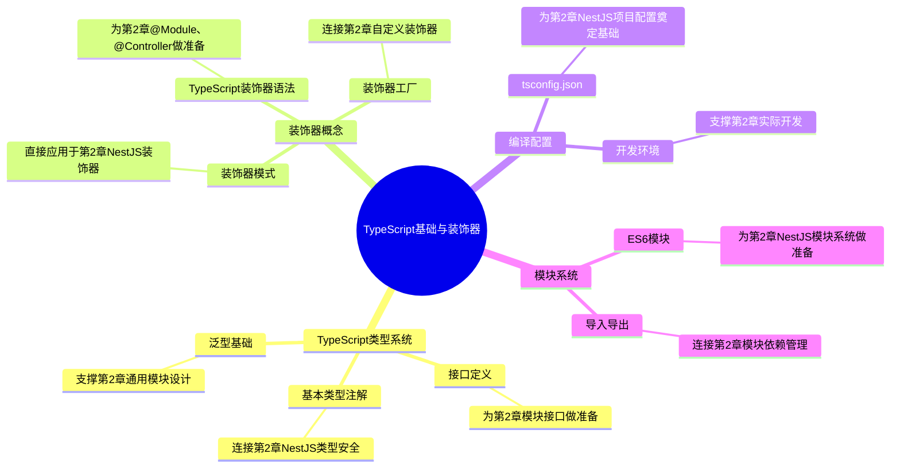

# 第2章前置知识：TypeScript基础与装饰器概念

> **JavaScript的"安全卫士"** - 为学习NestJS模块系统做好准备

## 📚 前置知识学习目标

### 🎯 知识目标
- [ ] **TypeScript类型系统**：掌握基本类型注解、接口定义、泛型基础
- [ ] **装饰器概念**：理解装饰器模式思想和TypeScript装饰器语法
- [ ] **编译配置基础**：了解TypeScript编译器和基本配置
- [ ] **模块系统基础**：掌握ES6模块导入导出语法

### 🛠️ 技能目标
- [ ] 能够编写基本的TypeScript代码
- [ ] 能够理解和使用简单的装饰器
- [ ] 能够配置基础的TypeScript开发环境
- [ ] 具备模块化编程的基础认知

### ⏰ 学习时长
- **TypeScript基础**：4-6小时
- **装饰器概念**：3-4小时
- **实践练习**：3-4小时
- **总计时长**：10-14小时

---

## 2.1 TypeScript基础类型系统

### 💡 核心思想：TypeScript是JavaScript的"安全卫士"

> **通俗理解**：如果把JavaScript比作一个自由的城市，任何人都可以随意进出，那么TypeScript就像是给这个城市加上了门禁系统和身份验证。每个"居民"（变量）都要有明确的身份证（类型），这样就能避免很多混乱和错误。

### 🌍 现实应用场景

1. **大型企业应用**：阿里巴巴、腾讯的前端项目
   - 团队协作时需要明确的接口定义
   - 代码重构时需要类型安全保障
   - 大型项目需要编译时错误检查

2. **开源框架**：Angular、NestJS、Vue 3
   - 框架需要提供类型定义给开发者
   - API设计需要清晰的类型约束
   - 插件系统需要类型安全的扩展机制

3. **金融科技项目**：支付宝、微信支付的后端服务
   - 金额计算不能有类型错误
   - 用户数据需要严格的类型验证
   - 接口调用需要类型安全保障

### 2.1.1 基本类型注解：给变量贴上"身份标签"

> **生活类比**：类型注解就像给每个人贴上职业标签。看到"医生"标签，你就知道这个人会治病；看到"string"标签，你就知道这个变量存储文字。

```typescript
// 🎯 思想解读：为什么需要类型注解？
// 问题：JavaScript变量类型不明确，容易出错
// 解决：TypeScript通过类型注解明确变量的用途和限制

// 🌟 现实应用场景：用户信息管理系统

// 基本类型注解 - 像给变量办身份证
let userName: string = "张三";        // 字符串类型：存储文字信息
let userAge: number = 25;            // 数字类型：存储数值信息
let isVIP: boolean = true;           // 布尔类型：存储是非判断
let loginTime: Date = new Date();    // 日期类型：存储时间信息

// 🧠 记忆口诀：
// "冒号后面跟类型，string文字number数，boolean真假Date时间"

// 数组类型注解 - 像给一群人统一标识
let hobbies: string[] = ["读书", "游泳", "编程"];     // 字符串数组
let scores: number[] = [85, 92, 78, 96];            // 数字数组
let permissions: boolean[] = [true, false, true];   // 布尔数组

// 🌟 现实应用：电商购物车系统
interface CartItem {
  id: number;
  name: string;
  price: number;
  quantity: number;
}

let shoppingCart: CartItem[] = [
  { id: 1, name: "笔记本电脑", price: 5999, quantity: 1 },
  { id: 2, name: "无线鼠标", price: 199, quantity: 2 }
];

// 函数类型注解 - 像给工具标明用途和要求
function calculateTotal(items: CartItem[]): number {
  return items.reduce((total, item) => total + item.price * item.quantity, 0);
}

// 🌟 生活类比：函数像是一个专门的工具
// 输入参数 = 原材料（需要什么类型的材料）
// 返回值 = 产品（会产出什么类型的结果）
function greetUser(name: string, age: number): string {
  return `你好，${name}！你今年${age}岁了。`;
}

// ⚠️ 常见错误预警：
// 错误1：类型不匹配
// let wrongAge: number = "25";  // ❌ 错误：不能将字符串赋值给数字类型

// 错误2：参数类型错误
// greetUser(123, "25");  // ❌ 错误：参数类型不匹配

// 正确做法：类型一致
let correctAge: number = 25;
let greeting = greetUser("李四", correctAge);
console.log(greeting); // 你好，李四！你今年25岁了。

// 🎯 类型推断：TypeScript的"智能助手"
let autoString = "自动推断为string";  // TypeScript自动推断为string类型
let autoNumber = 42;                  // TypeScript自动推断为number类型
let autoBoolean = true;               // TypeScript自动推断为boolean类型

// 🧠 记忆技巧：
// "有注解听注解，无注解看赋值，TypeScript很聪明，类型自动推"
```

### 2.1.2 接口定义：对象的"设计图纸"

> **建筑类比**：接口就像建筑的设计图纸，规定了房子必须有几个房间、每个房间的用途。按照图纸建造的房子（对象）都会有相同的结构。

```typescript
// 🎯 思想解读：接口解决什么问题？
// 问题：对象结构不统一，属性名容易写错
// 解决：接口定义统一的对象结构规范

// 🌟 现实应用场景：社交媒体用户系统

// 基础接口定义 - 像制定用户信息标准
interface User {
  id: number;           // 必需属性：用户ID
  name: string;         // 必需属性：用户姓名
  email: string;        // 必需属性：邮箱地址
  avatar?: string;      // 可选属性：头像（?表示可选）
  readonly createdAt: Date;  // 只读属性：创建时间（不能修改）
}

// 使用接口创建用户对象
const user1: User = {
  id: 1,
  name: "张三",
  email: "zhangsan@example.com",
  createdAt: new Date()
  // avatar是可选的，可以不提供
};

const user2: User = {
  id: 2,
  name: "李四",
  email: "lisi@example.com",
  avatar: "https://example.com/avatar.jpg",
  createdAt: new Date()
};

// ⚠️ 常见错误预警：
// user1.createdAt = new Date();  // ❌ 错误：不能修改只读属性

// 🌟 接口继承：像家族传承
interface AdminUser extends User {
  permissions: string[];    // 管理员特有的权限列表
  lastLogin?: Date;         // 最后登录时间
}

const admin: AdminUser = {
  id: 3,
  name: "管理员",
  email: "admin@example.com",
  createdAt: new Date(),
  permissions: ["read", "write", "delete"]
};

// 🌟 函数接口：规定函数的"工作方式"
interface Calculator {
  (a: number, b: number): number;  // 函数签名：接收两个数字，返回一个数字
}

// 实现函数接口
const add: Calculator = (a, b) => a + b;
const multiply: Calculator = (a, b) => a * b;

console.log(add(5, 3));      // 8
console.log(multiply(4, 6)); // 24

// 🧠 记忆口诀：
// "interface定规范，属性类型要对应，问号表可选，readonly不能改"

// 🌟 现实应用：API响应格式标准化
interface ApiResponse<T> {
  success: boolean;
  data: T;
  message: string;
  timestamp: Date;
}

// 用户列表API响应
interface UserListResponse extends ApiResponse<User[]> {
  pagination: {
    page: number;
    limit: number;
    total: number;
  };
}

// 模拟API响应
const userListResponse: UserListResponse = {
  success: true,
  data: [user1, user2],
  message: "获取用户列表成功",
  timestamp: new Date(),
  pagination: {
    page: 1,
    limit: 10,
    total: 2
  }
};
```

### 2.1.3 泛型基础：代码的"万能模板"

> **生活类比**：泛型就像万能的生产线。同一条生产线可以生产不同的产品（汽车、自行车、玩具），只要换个模具（类型参数）就行。代码也是如此，同一个函数可以处理不同类型的数据。

```typescript
// 🎯 思想解读：泛型解决什么问题？
// 问题：同样的逻辑要为不同类型重复编写
// 解决：泛型让代码可以适用于多种类型，提高复用性

// 🌟 现实应用场景：数据容器系统

// 没有泛型的重复代码（不好的做法）
function getFirstString(arr: string[]): string | undefined {
  return arr.length > 0 ? arr[0] : undefined;
}

function getFirstNumber(arr: number[]): number | undefined {
  return arr.length > 0 ? arr[0] : undefined;
}

// 使用泛型的优雅解决方案
function getFirst<T>(arr: T[]): T | undefined {
  return arr.length > 0 ? arr[0] : undefined;
}

// 🌟 泛型的威力：一个函数，多种用途
const firstString = getFirst(["苹果", "香蕉", "橙子"]);     // string | undefined
const firstNumber = getFirst([1, 2, 3, 4, 5]);             // number | undefined
const firstUser = getFirst([user1, user2]);                // User | undefined

console.log(firstString); // "苹果"
console.log(firstNumber); // 1
console.log(firstUser?.name); // "张三"

// 🧠 记忆口诀：
// "尖括号里放类型，T代表任意型，一套代码多复用，泛型威力无穷"

// 🌟 泛型接口：通用的数据结构
interface Container<T> {
  value: T;
  getValue(): T;
  setValue(value: T): void;
}

// 字符串容器
class StringContainer implements Container<string> {
  constructor(public value: string) {}
  
  getValue(): string {
    return this.value;
  }
  
  setValue(value: string): void {
    this.value = value;
  }
}

// 数字容器
class NumberContainer implements Container<number> {
  constructor(public value: number) {}
  
  getValue(): number {
    return this.value;
  }
  
  setValue(value: number): void {
    this.value = value;
  }
}

// 使用泛型容器
const stringBox = new StringContainer("Hello TypeScript");
const numberBox = new NumberContainer(42);

console.log(stringBox.getValue()); // "Hello TypeScript"
console.log(numberBox.getValue()); // 42

// 🌟 现实应用：通用的数据获取函数
async function fetchData<T>(url: string): Promise<T> {
  const response = await fetch(url);
  const data = await response.json();
  return data as T;
}

// 使用泛型函数获取不同类型的数据
// const users = await fetchData<User[]>('/api/users');
// const products = await fetchData<Product[]>('/api/products');

// ⚠️ 常见错误预警：
// 错误1：忘记指定泛型类型
// const result = getFirst([1, 2, 3]);  // TypeScript会自动推断，但最好明确指定

// 正确做法：明确指定类型
const result = getFirst<number>([1, 2, 3]);
```

---

## 2.2 装饰器概念与基础应用

### 💡 核心思想：装饰器是代码的"魔法贴纸"

> **通俗理解**：装饰器就像给手机贴保护膜、装手机壳一样。手机本身的功能不变，但通过"装饰"可以增加新的特性（防摔、美观、支架等）。在代码中，装饰器可以给类、方法、属性添加额外的功能，而不需要修改原始代码。

### 🌍 现实应用场景

1. **咖啡店点餐系统**：星巴克、瑞幸咖啡的定制服务
   - 基础咖啡 + 加奶 + 加糖 + 加香草 = 定制咖啡
   - 每个"加料"就像一个装饰器，增强原有功能

2. **游戏装备系统**：王者荣耀、英雄联盟的装备强化
   - 基础武器 + 攻击力宝石 + 暴击宝石 = 强化武器
   - 每个宝石就像装饰器，为武器添加属性

3. **Web开发框架**：NestJS、Angular的注解系统
   - 普通类 + @Controller + @Get + @Post = 控制器类
   - 每个@注解都是装饰器，为类添加特定功能

### 2.2.1 装饰器模式理解：咖啡店的"加料"系统

> **咖啡店类比**：想象你在咖啡店点咖啡。基础咖啡是5元，加奶+2元，加糖+1元，加香草+3元。每种"加料"都不改变咖啡本身，但会增加新的味道和价格。

```typescript
// 🎯 思想解读：装饰器模式的核心思想
// 问题：想给对象添加功能，但不想修改原始类
// 解决：通过装饰器包装对象，动态添加新功能

// 🌟 现实应用场景：咖啡店点餐系统

// 咖啡接口：定义咖啡的基本规范
interface Coffee {
  cost(): number;           // 计算价格
  description(): string;    // 获取描述
}

// 基础咖啡类：最简单的咖啡
class SimpleCoffee implements Coffee {
  cost(): number {
    return 5; // 基础咖啡5元
  }
  
  description(): string {
    return "简单咖啡";
  }
}

// 装饰器基类：所有"加料"的基础
abstract class CoffeeDecorator implements Coffee {
  protected coffee: Coffee; // 被装饰的咖啡
  
  constructor(coffee: Coffee) {
    this.coffee = coffee;
  }
  
  // 默认实现：直接调用被装饰对象的方法
  cost(): number {
    return this.coffee.cost();
  }
  
  description(): string {
    return this.coffee.description();
  }
}

// 牛奶装饰器：给咖啡加牛奶
class MilkDecorator extends CoffeeDecorator {
  cost(): number {
    return this.coffee.cost() + 2; // 加牛奶+2元
  }
  
  description(): string {
    return this.coffee.description() + " + 牛奶";
  }
}

// 糖装饰器：给咖啡加糖
class SugarDecorator extends CoffeeDecorator {
  cost(): number {
    return this.coffee.cost() + 1; // 加糖+1元
  }
  
  description(): string {
    return this.coffee.description() + " + 糖";
  }
}

// 香草装饰器：给咖啡加香草
class VanillaDecorator extends CoffeeDecorator {
  cost(): number {
    return this.coffee.cost() + 3; // 加香草+3元
  }
  
  description(): string {
    return this.coffee.description() + " + 香草";
  }
}

// 🌟 装饰器的威力：灵活组合
function demonstrateDecorator() {
  // 1. 基础咖啡
  let coffee: Coffee = new SimpleCoffee();
  console.log(`${coffee.description()}: ${coffee.cost()}元`);
  // 输出：简单咖啡: 5元
  
  // 2. 加牛奶的咖啡
  coffee = new MilkDecorator(coffee);
  console.log(`${coffee.description()}: ${coffee.cost()}元`);
  // 输出：简单咖啡 + 牛奶: 7元
  
  // 3. 加牛奶和糖的咖啡
  coffee = new SugarDecorator(coffee);
  console.log(`${coffee.description()}: ${coffee.cost()}元`);
  // 输出：简单咖啡 + 牛奶 + 糖: 8元
  
  // 4. 加牛奶、糖和香草的咖啡
  coffee = new VanillaDecorator(coffee);
  console.log(`${coffee.description()}: ${coffee.cost()}元`);
  // 输出：简单咖啡 + 牛奶 + 糖 + 香草: 11元
}

// 🧠 记忆口诀：
// "装饰器像加料，功能一层层包，原对象不改变，新功能动态加"
```

### 2.2.2 TypeScript装饰器语法：代码的"注解标签"

> **标签类比**：TypeScript装饰器就像给代码贴标签。@Controller标签告诉框架"这是一个控制器"，@Get标签告诉框架"这是一个GET请求处理器"。

```typescript
// 🎯 启用装饰器支持
// 需要在tsconfig.json中设置：
// "experimentalDecorators": true

// 🌟 现实应用场景：用户管理系统

// 1. 类装饰器：给整个类添加功能
function Entity(tableName: string) {
  return function <T extends { new (...args: any[]): {} }>(constructor: T) {
    // 返回一个新的类，继承原类并添加新功能
    return class extends constructor {
      tableName = tableName;
      
      save() {
        console.log(`💾 保存到数据表：${tableName}`);
      }
      
      delete() {
        console.log(`🗑️ 从数据表删除：${tableName}`);
      }
    };
  };
}

// 使用类装饰器
@Entity('users')  // 像给类贴上"用户表"的标签
class User {
  constructor(public name: string, public email: string) {}
  
  greet() {
    console.log(`👋 你好，我是 ${this.name}`);
  }
}

// 装饰器为User类添加了数据库操作功能
const user = new User("张三", "zhangsan@example.com");
user.greet();           // 👋 你好，我是 张三
(user as any).save();   // 💾 保存到数据表：users
(user as any).delete(); // 🗑️ 从数据表删除：users

// 2. 方法装饰器：给方法添加功能
function Log(target: any, propertyName: string, descriptor: PropertyDescriptor) {
  const method = descriptor.value; // 获取原始方法
  
  // 替换原始方法
  descriptor.value = function (...args: any[]) {
    console.log(`📝 调用方法 ${propertyName}，参数:`, args);
    const result = method.apply(this, args); // 调用原始方法
    console.log(`✅ 方法 ${propertyName} 返回:`, result);
    return result;
  };
}

class Calculator {
  @Log  // 给add方法添加日志功能
  add(a: number, b: number): number {
    return a + b;
  }
  
  @Log  // 给multiply方法添加日志功能
  multiply(a: number, b: number): number {
    return a * b;
  }
}

// 使用带装饰器的方法
const calc = new Calculator();
calc.add(5, 3);      // 会自动打印日志
calc.multiply(4, 6); // 会自动打印日志

// 3. 属性装饰器：给属性添加验证
function Required(target: any, propertyName: string) {
  let value: any;
  
  // 定义getter和setter
  const getter = () => value;
  const setter = (newValue: any) => {
    if (newValue === null || newValue === undefined || newValue === '') {
      throw new Error(`❌ 属性 ${propertyName} 是必需的`);
    }
    value = newValue;
  };
  
  // 重新定义属性
  Object.defineProperty(target, propertyName, {
    get: getter,
    set: setter,
    enumerable: true,
    configurable: true
  });
}

class Person {
  @Required  // name属性必须有值
  name: string;
  
  constructor(name: string) {
    this.name = name;
  }
}

// 使用带验证的属性
try {
  const person1 = new Person("李四");  // ✅ 正常
  console.log(`👤 创建用户：${person1.name}`);
  
  // const person2 = new Person("");     // ❌ 会抛出错误
} catch (error) {
  console.log(error.message);
}

// 🧠 记忆技巧：
// "@符号加函数名，装饰器就这样，类方法和属性，都能被装饰"

// 🌟 装饰器工厂：可配置的装饰器
function Throttle(delay: number) {
  return function (target: any, propertyName: string, descriptor: PropertyDescriptor) {
    const method = descriptor.value;
    let lastCallTime = 0;
    
    descriptor.value = function (...args: any[]) {
      const now = Date.now();
      
      if (now - lastCallTime >= delay) {
        lastCallTime = now;
        return method.apply(this, args);
      } else {
        console.log(`⏳ 方法 ${propertyName} 被限流，请等待 ${delay}ms`);
      }
    };
  };
}

class ApiService {
  @Throttle(1000)  // 1秒内只能调用一次
  fetchData() {
    console.log("🌐 正在获取数据...");
    return "数据获取成功";
  }
}

// ⚠️ 常见错误预警：
// 错误1：忘记在tsconfig.json中启用装饰器支持
// 错误2：装饰器函数的参数顺序错误
// 错误3：在装饰器中没有正确处理this上下文
```

---

## 2.3 编译配置基础

### 💡 核心思想：tsconfig.json是TypeScript的"说明书"

> **通俗理解**：tsconfig.json就像是给TypeScript编译器的说明书，告诉它应该怎么工作：要编译哪些文件、编译到什么版本、要不要检查类型错误等等。

```json
// 🌟 基础的tsconfig.json配置
{
  "compilerOptions": {
    // 基本选项
    "target": "ES2020",                    // 编译目标：编译成什么版本的JavaScript
    "module": "commonjs",                  // 模块系统：使用什么模块规范
    "outDir": "./dist",                   // 输出目录：编译后的文件放哪里
    "rootDir": "./src",                   // 根目录：源代码在哪里
    
    // 类型检查
    "strict": true,                       // 严格模式：开启所有严格检查
    "noImplicitAny": true,               // 不允许隐式any类型
    "strictNullChecks": true,            // 严格空值检查
    
    // 装饰器支持
    "experimentalDecorators": true,       // 启用装饰器（NestJS必需）
    "emitDecoratorMetadata": true,       // 发出装饰器元数据
    
    // 模块解析
    "esModuleInterop": true,             // ES模块互操作
    "allowSyntheticDefaultImports": true, // 允许合成默认导入
    
    // 代码生成
    "sourceMap": true,                   // 生成源映射文件（调试用）
    "declaration": true                  // 生成类型声明文件
  },
  
  "include": [
    "src/**/*"                           // 包含src目录下的所有文件
  ],
  
  "exclude": [
    "node_modules",                      // 排除node_modules
    "dist"                              // 排除输出目录
  ]
}
```

### 🛠️ 开发环境配置

```json
// package.json中的脚本配置
{
  "scripts": {
    "build": "tsc",                      // 编译TypeScript
    "dev": "ts-node src/index.ts",      // 直接运行TypeScript文件
    "watch": "tsc --watch"               // 监听文件变化自动编译
  },
  "devDependencies": {
    "typescript": "^4.8.0",             // TypeScript编译器
    "ts-node": "^10.9.0",               // 直接运行TypeScript
    "@types/node": "^18.0.0"            // Node.js类型定义
  }
}
```

---

## 2.4 模块系统基础

### 💡 核心思想：模块是代码的"积木块"

> **积木类比**：模块就像乐高积木，每个积木块都有特定的功能，可以组合成复杂的作品。在编程中，每个模块负责特定的功能，多个模块组合成完整的应用。

```typescript
// 🌟 现实应用场景：用户管理系统

// user.ts - 用户模块
export interface User {
  id: number;
  name: string;
  email: string;
}

export class UserService {
  private users: User[] = [];
  
  addUser(user: User): void {
    this.users.push(user);
    console.log(`✅ 添加用户：${user.name}`);
  }
  
  getUsers(): User[] {
    return [...this.users];
  }
}

// 默认导出
export default class UserManager {
  constructor(private userService: UserService) {}
  
  createUser(name: string, email: string): User {
    const user: User = {
      id: Date.now(),
      name,
      email
    };
    
    this.userService.addUser(user);
    return user;
  }
}

// main.ts - 主模块
import UserManager, { User, UserService } from './user';  // 导入模块

// 使用导入的模块
const userService = new UserService();
const userManager = new UserManager(userService);

const newUser = userManager.createUser("张三", "zhangsan@example.com");
console.log("创建的用户：", newUser);

// 🧠 记忆口诀：
// "export导出功能，import导入使用，模块化编程，代码更清晰"
```

---

## 🔗 知识关联网络图



---

## 📝 前置知识检查清单

### ✅ TypeScript基础类型系统
- [ ] 掌握基本类型注解（string、number、boolean等）
- [ ] 理解接口定义和使用方法
- [ ] 了解泛型的基本概念和简单应用
- [ ] 能够进行基本的类型推断和类型检查
- [ ] 掌握数组和对象的类型定义

### ✅ 装饰器概念
- [ ] 理解装饰器模式的基本思想
- [ ] 掌握TypeScript装饰器的基本语法
- [ ] 了解类装饰器、方法装饰器、属性装饰器的区别
- [ ] 能够创建简单的装饰器函数
- [ ] 理解装饰器的执行时机和作用

### ✅ 编译配置基础
- [ ] 了解tsconfig.json的基本配置项
- [ ] 能够配置装饰器支持
- [ ] 掌握基本的编译选项设置
- [ ] 了解开发环境的搭建方法
- [ ] 能够使用ts-node进行开发调试

### ✅ 模块系统基础
- [ ] 掌握ES6模块的导入导出语法
- [ ] 理解默认导出和命名导出的区别
- [ ] 能够组织基本的模块结构
- [ ] 了解模块间的依赖关系
- [ ] 掌握相对路径和绝对路径的使用

---

## 🎯 实践练习

### 练习1：TypeScript基础练习
**目标**：熟练使用TypeScript类型系统

**现实场景**：图书管理系统
1. **定义图书接口**：包含标题、作者、价格、分类等属性
2. **创建图书管理类**：使用泛型实现通用的增删改查
3. **实现类型安全的搜索功能**
4. **练习接口继承和组合**

**分步骤操作**：
```typescript
// 第一步：定义基础接口
interface Book {
  id: number;
  title: string;
  author: string;
  price: number;
  category: string;
  publishDate: Date;
}

// 第二步：创建管理类
class BookManager<T extends Book> {
  private books: T[] = [];
  
  addBook(book: T): void {
    this.books.push(book);
  }
  
  findBooks(predicate: (book: T) => boolean): T[] {
    return this.books.filter(predicate);
  }
}
```

**常见错误预警**：
- ⚠️ 忘记指定泛型约束
- ⚠️ 接口属性类型不匹配
- ⚠️ 可选属性和必需属性混淆

### 练习2：装饰器应用练习
**目标**：创建实用的装饰器

**现实场景**：用户操作日志系统
1. **创建日志装饰器**：记录方法调用时间和参数
2. **实现权限验证装饰器**：检查用户权限
3. **设计缓存装饰器**：缓存方法执行结果
4. **组合多个装饰器**：实现复杂功能

---

## 📚 推荐学习资源

### 📖 官方文档
1. **TypeScript官方文档**：https://www.typescriptlang.org/docs/
   - 类型系统详解
   - 装饰器使用指南

2. **TypeScript中文文档**：https://www.tslang.cn/docs/home.html
   - 中文版官方文档
   - 适合中文开发者

### 🎥 视频教程
1. **TypeScript入门教程**（推荐B站）
2. **装饰器模式详解**
3. **TypeScript实战项目**

### 🛠️ 实践工具
1. **TypeScript Playground**：https://www.typescriptlang.org/play
   - 在线TypeScript编辑器
   - 适合快速验证代码

2. **VS Code**：推荐的TypeScript开发环境
   - 内置TypeScript支持
   - 丰富的插件生态

---

> **🎯 前置知识完成标志**：
> 
> 当您能够：
> 1. 熟练使用TypeScript基本类型系统编写类型安全的代码
> 2. 理解装饰器的基本概念和简单应用
> 3. 配置基础的TypeScript开发环境
> 4. 使用ES6模块系统组织代码结构
> 5. 能够阅读和理解简单的TypeScript装饰器代码
> 
> 恭喜您已经具备了学习第2章《NestJS模块系统详解》的基础条件！

---

**下一步**：完成前置知识学习后，您就可以开始第2章的正式学习了。第2章将在这些基础知识之上，深入探讨NestJS框架的模块系统设计和实际应用。 