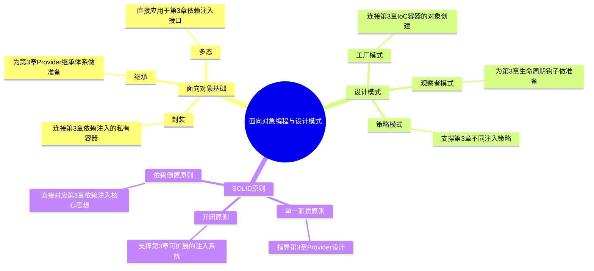

# 第3章前置知识：面向对象编程与设计模式

> **软件设计的基础思想** - 为学习依赖注入原理做好准备

## 📚 前置知识学习目标

### 🎯 知识目标
- [ ] **面向对象编程基础**：掌握封装、继承、多态等核心概念
- [ ] **设计模式入门**：了解常用设计模式的基本思想和应用
- [ ] **SOLID原则基础**：理解面向对象设计的基本原则
- [ ] **软件设计思维**：培养良好的软件设计思维和抽象能力

### 🛠️ 技能目标
- [ ] 能够运用面向对象思想设计程序
- [ ] 能够识别和应用基本的设计模式
- [ ] 能够理解类之间的关系和交互
- [ ] 具备代码重构和优化的基础能力

### ⏰ 学习时长
- **面向对象基础**：4-6小时
- **设计模式入门**：4-6小时
- **SOLID原则**：3-4小时
- **实践练习**：3-4小时
- **总计时长**：14-20小时

---

## 3.1 面向对象编程基础

### 💡 核心思想：面向对象是模拟现实世界的编程方式

> **通俗理解**：面向对象编程就像是用代码来模拟现实世界。现实中有各种物体（对象），每个物体都有自己的特征（属性）和能力（方法）。比如一只猫有颜色、年龄等特征，会叫、会跑等能力。面向对象编程就是把这种思维方式搬到代码中。

### 🌍 现实应用场景

1. **游戏开发**：王者荣耀、和平精英的角色系统
   - 每个英雄都是一个对象，有血量、攻击力等属性
   - 不同英雄继承基础角色类，但有各自的技能
   - 装备系统通过组合模式增强角色能力

2. **电商平台**：淘宝、京东的商品管理系统
   - 商品、用户、订单都是不同的对象
   - 不同类型的商品（实物、虚拟）继承基础商品类
   - 支付方式通过策略模式实现多样化

3. **企业管理系统**：钉钉、企业微信的组织架构
   - 员工、部门、职位都是对象
   - 管理层级通过继承和组合实现
   - 权限系统通过装饰器模式灵活配置

### 3.1.1 封装（Encapsulation）：给对象穿上"保护衣"

> **生活类比**：封装就像给手机装保护壳，外界只能通过特定的接口（按钮、接口）来操作手机，不能直接接触内部电路。这样既保护了内部结构，又提供了安全的操作方式。

```typescript
// 🎯 思想解读：封装解决什么问题？
// 问题：数据和操作分离，容易出现不一致的状态
// 解决：将数据和操作数据的方法绑定在一起，控制访问权限

// 🌟 现实应用场景：银行账户系统

class BankAccount {
  private balance: number;        // 私有属性：余额不能直接修改
  private accountNumber: string;  // 私有属性：账号不能被外部访问
  
  constructor(accountNumber: string, initialBalance: number = 0) {
    this.accountNumber = accountNumber;
    this.balance = initialBalance;
  }
  
  // 公共方法：存款（安全的操作接口）
  public deposit(amount: number): boolean {
    if (amount <= 0) {
      console.log("❌ 存款金额必须大于0");
      return false;
    }
    
    this.balance += amount;
    console.log(`✅ 存款成功，当前余额：${this.balance}元`);
    return true;
  }
  
  // 公共方法：取款（带业务逻辑的安全操作）
  public withdraw(amount: number): boolean {
    if (amount <= 0) {
      console.log("❌ 取款金额必须大于0");
      return false;
    }
    
    if (amount > this.balance) {
      console.log("❌ 余额不足");
      return false;
    }
    
    this.balance -= amount;
    console.log(`✅ 取款成功，当前余额：${this.balance}元`);
    return true;
  }
  
  // 公共方法：查询余额（只读访问）
  public getBalance(): number {
    return this.balance;
  }
}

// 🌟 封装的好处演示
const account = new BankAccount("123456789", 1000);

// ✅ 通过公共接口安全操作
account.deposit(500);    // 存款 500 元，当前余额：1500 元
account.withdraw(200);   // 取款 200 元，当前余额：1300 元
console.log(`余额：${account.getBalance()}元`); // 余额：1300元

// ❌ 无法直接访问私有属性（编译错误）
// account.balance = 10000;        // 错误：无法访问私有属性

// 🧠 记忆口诀：
// "私有属性藏内部，公共方法做接口，数据安全有保障，业务逻辑不分离"
```

### 3.1.2 继承（Inheritance）：代码的"家族传承"

> **家族类比**：继承就像家族传承，孩子会继承父母的一些特征（眼睛、身高），但也会有自己独特的特点。在编程中，子类继承父类的属性和方法，同时可以添加自己的特性或修改继承来的行为。

```typescript
// 🎯 思想解读：继承解决什么问题？
// 问题：相似的类有大量重复代码
// 解决：提取共同特征到父类，子类继承并扩展

// 🌟 现实应用场景：动物管理系统

// 基础动物类
class Animal {
  protected name: string;    // 受保护属性：子类可以访问
  protected age: number;
  
  constructor(name: string, age: number) {
    this.name = name;
    this.age = age;
  }
  
  // 通用方法：所有动物都会吃
  public eat(): void {
    console.log(`${this.name} 正在吃东西`);
  }
  
  // 通用方法：所有动物都会睡觉
  public sleep(): void {
    console.log(`${this.name} 正在睡觉`);
  }
  
  // 抽象概念：不同动物叫声不同，由子类实现
  public makeSound(): void {
    console.log(`${this.name} 发出声音`);
  }
  
  // 获取基本信息
  public getInfo(): string {
    return `${this.name}，${this.age}岁`;
  }
}

// 狗类：继承动物类
class Dog extends Animal {
  private breed: string; // 狗特有的品种属性
  
  constructor(name: string, age: number, breed: string) {
    super(name, age); // 调用父类构造函数
    this.breed = breed;
  }
  
  // 重写父类方法：狗的叫声
  public makeSound(): void {
    console.log(`${this.name} 汪汪叫`);
  }
  
  // 狗特有的方法
  public fetch(): void {
    console.log(`${this.name} 正在捡球`);
  }
  
  // 重写获取信息方法，添加品种信息
  public getInfo(): string {
    return `${super.getInfo()}，品种：${this.breed}`;
  }
}

// 猫类：继承动物类
class Cat extends Animal {
  private isIndoor: boolean; // 猫特有的室内/室外属性
  
  constructor(name: string, age: number, isIndoor: boolean = true) {
    super(name, age);
    this.isIndoor = isIndoor;
  }
  
  // 重写父类方法：猫的叫声
  public makeSound(): void {
    console.log(`${this.name} 喵喵叫`);
  }
  
  // 猫特有的方法
  public climb(): void {
    console.log(`${this.name} 正在爬树`);
  }
  
  // 重写获取信息方法，添加居住环境信息
  public getInfo(): string {
    const environment = this.isIndoor ? "室内" : "室外";
    return `${super.getInfo()}，居住环境：${environment}`;
  }
}

// 🌟 继承的威力演示
const dog = new Dog("旺财", 3, "金毛");
const cat = new Cat("咪咪", 2, true);

// 使用继承来的方法
dog.eat();        // 旺财 正在吃东西
cat.sleep();      // 咪咪 正在睡觉

// 使用重写的方法
dog.makeSound();  // 旺财 汪汪叫
cat.makeSound();  // 咪咪 喵喵叫

// 使用特有的方法
dog.fetch();      // 旺财 正在捡球
cat.climb();      // 咪咪 正在爬树

// 获取信息
console.log(dog.getInfo()); // 旺财，3岁，品种：金毛
console.log(cat.getInfo()); // 咪咪，2岁，居住环境：室内

// 🧠 记忆技巧：
// "父类定共性，子类加特性，super调父类，重写改行为"
```

### 3.1.3 多态（Polymorphism）：同一接口，不同表现

> **演员类比**：多态就像不同的演员演同一个角色，虽然都是"英雄"这个角色，但每个演员的表演风格不同。在编程中，不同的类可以实现同一个接口，但具体的行为实现各不相同。

```typescript
// 🎯 思想解读：多态解决什么问题？
// 问题：需要根据对象类型执行不同的操作，代码充满if-else判断
// 解决：统一接口，让对象自己决定如何执行操作

// 🌟 现实应用场景：图形绘制系统

// 图形接口：定义统一的图形规范
interface Shape {
  calculateArea(): number;      // 计算面积
  calculatePerimeter(): number; // 计算周长
  draw(): void;                // 绘制图形
}

// 圆形类：实现图形接口
class Circle implements Shape {
  constructor(private radius: number) {}
  
  calculateArea(): number {
    return Math.PI * this.radius * this.radius;
  }
  
  calculatePerimeter(): number {
    return 2 * Math.PI * this.radius;
  }
  
  draw(): void {
    console.log(`🔵 绘制圆形，半径：${this.radius}`);
  }
}

// 矩形类：实现图形接口
class Rectangle implements Shape {
  constructor(private width: number, private height: number) {}
  
  calculateArea(): number {
    return this.width * this.height;
  }
  
  calculatePerimeter(): number {
    return 2 * (this.width + this.height);
  }
  
  draw(): void {
    console.log(`🔲 绘制矩形，宽：${this.width}，高：${this.height}`);
  }
}

// 三角形类：实现图形接口
class Triangle implements Shape {
  constructor(private base: number, private height: number, private side1: number, private side2: number) {}
  
  calculateArea(): number {
    return 0.5 * this.base * this.height;
  }
  
  calculatePerimeter(): number {
    return this.base + this.side1 + this.side2;
  }
  
  draw(): void {
    console.log(`🔺 绘制三角形，底：${this.base}，高：${this.height}`);
  }
}

// 图形管理器：使用多态统一处理不同图形
class ShapeManager {
  private shapes: Shape[] = [];
  
  // 添加图形
  addShape(shape: Shape): void {
    this.shapes.push(shape);
    console.log(`✅ 添加图形成功`);
  }
  
  // 多态方法：绘制所有图形
  drawAllShapes(): void {
    console.log("\n🎨 开始绘制所有图形：");
    this.shapes.forEach((shape, index) => {
      console.log(`第${index + 1}个图形：`);
      shape.draw(); // 多态调用：不同的图形有不同的绘制方式
    });
  }
  
  // 多态方法：计算总面积
  calculateTotalArea(): number {
    const totalArea = this.shapes.reduce((total, shape) => {
      return total + shape.calculateArea(); // 多态调用
    }, 0);
    
    console.log(`\n📊 总面积：${totalArea.toFixed(2)}`);
    return totalArea;
  }
  
  // 多态方法：显示所有图形信息
  showShapeInfo(): void {
    console.log("\n📋 图形信息统计：");
    this.shapes.forEach((shape, index) => {
      const area = shape.calculateArea();
      const perimeter = shape.calculatePerimeter();
      console.log(`第${index + 1}个图形 - 面积：${area.toFixed(2)}，周长：${perimeter.toFixed(2)}`);
    });
  }
}

// 🌟 多态的威力演示
function demonstratePolymorphism() {
  const shapeManager = new ShapeManager();
  
  // 创建不同类型的图形
  const circle = new Circle(5);
  const rectangle = new Rectangle(4, 6);
  const triangle = new Triangle(3, 4, 3, 5);
  
  // 添加图形（多态：同一个接口，不同的实现）
  shapeManager.addShape(circle);
  shapeManager.addShape(rectangle);
  shapeManager.addShape(triangle);
  
  // 多态操作：统一的方法调用，不同的行为表现
  shapeManager.drawAllShapes();
  shapeManager.showShapeInfo();
  shapeManager.calculateTotalArea();
}

// 🧠 记忆技巧：
// "同一接口多实现，运行时才定行为，代码简洁易扩展，新类型无需改调用"

// ⚠️ 常见错误预警：
// 错误1：过度使用继承而不是多态
class BadShapeManager {
  drawCircle(circle: Circle): void { /* ... */ }
  drawRectangle(rectangle: Rectangle): void { /* ... */ }
  drawTriangle(triangle: Triangle): void { /* ... */ }
  
  // 每增加一种图形就要修改这个类 ❌
}

// 正确做法：使用多态
class GoodShapeManager {
  drawShape(shape: Shape): void {
    shape.draw(); // ✅ 多态调用
  }
}
```

---

## 3.2 设计模式入门

### 💡 核心思想：设计模式是解决常见问题的"标准答案"

> **通俗理解**：设计模式就像是建筑师的标准图纸。当你要建造不同类型的建筑时，不需要从零开始设计，可以参考已有的成熟方案。设计模式就是程序员总结出来的解决常见编程问题的成熟方案。

### 🌍 现实应用场景

1. **工厂模式**：汽车制造厂、手机生产线
   - 根据订单生产不同型号的产品
   - 统一的生产流程，不同的产品规格

2. **观察者模式**：微信朋友圈、微博关注系统
   - 用户发布动态，关注者自动收到通知
   - 一对多的消息传播机制

3. **策略模式**：导航软件的路线规划
   - 最短路径、最快路径、避开拥堵等不同策略
   - 根据用户选择采用不同的算法

### 3.2.1 工厂模式：对象创建的"生产线"

> **工厂类比**：工厂模式就像现实中的工厂。你告诉工厂"我要一台iPhone"，工厂就会按照iPhone的生产流程制造出来。你不需要知道具体的制造过程，只需要告诉工厂你要什么产品。

```typescript
// 🎯 思想解读：工厂模式解决什么问题？
// 问题：创建对象的代码分散在各处，难以管理和修改
// 解决：集中管理对象创建逻辑，降低代码耦合度

// 🌟 现实应用场景：咖啡店饮品制作系统

// 饮品接口
interface Beverage {
  name: string;
  price: number;
  prepare(): void;
  serve(): void;
}

// 咖啡类
class Coffee implements Beverage {
  name = "咖啡";
  price = 15;
  
  prepare(): void {
    console.log("☕ 研磨咖啡豆...");
    console.log("☕ 冲泡咖啡...");
  }
  
  serve(): void {
    console.log(`✅ ${this.name} 制作完成，价格：${this.price}元`);
  }
}

// 奶茶类
class MilkTea implements Beverage {
  name = "奶茶";
  price = 12;
  
  prepare(): void {
    console.log("🧋 煮茶叶...");
    console.log("🧋 加入牛奶...");
    console.log("🧋 添加珍珠...");
  }
  
  serve(): void {
    console.log(`✅ ${this.name} 制作完成，价格：${this.price}元`);
  }
}

// 果汁类
class Juice implements Beverage {
  name = "果汁";
  price = 10;
  
  prepare(): void {
    console.log("🥤 清洗水果...");
    console.log("🥤 榨取果汁...");
  }
  
  serve(): void {
    console.log(`✅ ${this.name} 制作完成，价格：${this.price}元`);
  }
}

// 饮品工厂：统一的饮品创建入口
class BeverageFactory {
  // 工厂方法：根据类型创建饮品
  static createBeverage(type: string): Beverage | null {
    switch (type.toLowerCase()) {
      case 'coffee':
      case '咖啡':
        return new Coffee();
      case 'milktea':
      case '奶茶':
        return new MilkTea();
      case 'juice':
      case '果汁':
        return new Juice();
      default:
        console.log(`❌ 不支持的饮品类型：${type}`);
        return null;
    }
  }
  
  // 获取菜单
  static getMenu(): string[] {
    return ['咖啡', '奶茶', '果汁'];
  }
}

// 咖啡店服务
class CoffeeShop {
  // 处理订单
  processOrder(beverageType: string): void {
    console.log(`\n📝 收到订单：${beverageType}`);
    
    // 使用工厂创建饮品
    const beverage = BeverageFactory.createBeverage(beverageType);
    
    if (beverage) {
      beverage.prepare();
      beverage.serve();
    }
  }
  
  // 显示菜单
  showMenu(): void {
    console.log("\n📋 今日菜单：");
    const menu = BeverageFactory.getMenu();
    menu.forEach((item, index) => {
      console.log(`${index + 1}. ${item}`);
    });
  }
}

// 🌟 工厂模式的好处演示
const coffeeShop = new CoffeeShop();
coffeeShop.showMenu();
coffeeShop.processOrder('咖啡');
coffeeShop.processOrder('奶茶');
coffeeShop.processOrder('果汁');

// 🧠 记忆口诀：
// "工厂统一造，类型传参数，创建逻辑集中管，扩展修改都方便"
```

### 3.2.2 观察者模式：消息传播的"广播站"

> **广播类比**：观察者模式就像电台广播。电台（主题）播放音乐，所有调到这个频道的收音机（观察者）都能听到。当电台换歌时，所有收音机都会自动播放新歌，不需要电台逐个通知每台收音机。

```typescript
// 🎯 思想解读：观察者模式解决什么问题？
// 问题：对象间存在一对多依赖关系，状态变化需要通知多个对象
// 解决：定义统一的通知机制，实现松耦合的消息传播

// 🌟 现实应用场景：新闻订阅系统

// 观察者接口
interface Observer {
  update(news: string): void;
}

// 主题接口
interface Subject {
  addObserver(observer: Observer): void;
  removeObserver(observer: Observer): void;
  notifyObservers(news: string): void;
}

// 新闻发布者（主题）
class NewsPublisher implements Subject {
  private observers: Observer[] = [];
  private latestNews: string = "";
  
  // 添加订阅者
  addObserver(observer: Observer): void {
    this.observers.push(observer);
    console.log(`📱 新增订阅者，当前订阅人数：${this.observers.length}`);
  }
  
  // 移除订阅者
  removeObserver(observer: Observer): void {
    const index = this.observers.indexOf(observer);
    if (index > -1) {
      this.observers.splice(index, 1);
      console.log(`📱 移除订阅者，当前订阅人数：${this.observers.length}`);
    }
  }
  
  // 通知所有订阅者
  notifyObservers(news: string): void {
    this.latestNews = news;
    console.log(`\n📢 发布新闻：${news}`);
    console.log(`📤 正在通知 ${this.observers.length} 位订阅者...`);
    
    this.observers.forEach((observer, index) => {
      console.log(`  通知第${index + 1}位订阅者`);
      observer.update(news);
    });
  }
  
  // 发布新闻
  publishNews(news: string): void {
    this.notifyObservers(news);
  }
}

// 手机用户（观察者）
class MobileUser implements Observer {
  constructor(private name: string) {}
  
  update(news: string): void {
    console.log(`📱 ${this.name} 收到推送：${news}`);
  }
}

// 邮箱用户（观察者）
class EmailUser implements Observer {
  constructor(private email: string) {}
  
  update(news: string): void {
    console.log(`📧 ${this.email} 收到邮件：${news}`);
  }
}

// 微信用户（观察者）
class WeChatUser implements Observer {
  constructor(private nickname: string) {}
  
  update(news: string): void {
    console.log(`💬 ${this.nickname} 收到微信消息：${news}`);
  }
}

// 🌟 观察者模式的威力演示
function demonstrateObserver() {
  // 创建新闻发布者
  const newsPublisher = new NewsPublisher();
  
  // 创建不同类型的订阅者
  const mobileUser1 = new MobileUser("张三");
  const mobileUser2 = new MobileUser("李四");
  const emailUser = new EmailUser("user@example.com");
  const wechatUser = new WeChatUser("王五");
  
  // 添加订阅者
  newsPublisher.addObserver(mobileUser1);
  newsPublisher.addObserver(mobileUser2);
  newsPublisher.addObserver(emailUser);
  newsPublisher.addObserver(wechatUser);
  
  // 发布新闻（所有订阅者都会收到通知）
  newsPublisher.publishNews("科技新闻：TypeScript 5.0 正式发布！");
  
  // 移除一个订阅者
  newsPublisher.removeObserver(mobileUser2);
  
  // 再次发布新闻
  newsPublisher.publishNews("体育新闻：世界杯决赛今晚开始！");
}

// 🧠 记忆技巧：
// "一个主题多观察，状态改变全通知，松耦合易扩展，发布订阅好模式"
```

### 3.2.3 策略模式：算法的"工具箱"

> **工具箱类比**：策略模式就像工具箱，里面有不同的工具（螺丝刀、扳手、锤子）。根据不同的任务选择合适的工具，但使用工具的人（上下文）不需要知道工具的内部构造。

```typescript
// 🎯 思想解读：策略模式解决什么问题？
// 问题：一个功能有多种实现方式，代码中充满if-else分支
// 解决：将算法封装成独立的策略类，可以动态切换

// 🌟 现实应用场景：购物车折扣计算系统

// 折扣策略接口
interface DiscountStrategy {
  calculateDiscount(amount: number): number;
  getDescription(): string;
}

// 无折扣策略
class NoDiscountStrategy implements DiscountStrategy {
  calculateDiscount(amount: number): number {
    return 0;
  }
  
  getDescription(): string {
    return "无折扣";
  }
}

// 百分比折扣策略
class PercentageDiscountStrategy implements DiscountStrategy {
  constructor(private percentage: number) {}
  
  calculateDiscount(amount: number): number {
    return amount * (this.percentage / 100);
  }
  
  getDescription(): string {
    return `${this.percentage}%折扣`;
  }
}

// 满减折扣策略
class FixedAmountDiscountStrategy implements DiscountStrategy {
  constructor(private threshold: number, private discountAmount: number) {}
  
  calculateDiscount(amount: number): number {
    return amount >= this.threshold ? this.discountAmount : 0;
  }
  
  getDescription(): string {
    return `满${this.threshold}减${this.discountAmount}`;
  }
}

// VIP折扣策略
class VIPDiscountStrategy implements DiscountStrategy {
  calculateDiscount(amount: number): number {
    if (amount >= 1000) return amount * 0.2;      // 满1000享8折
    if (amount >= 500) return amount * 0.15;      // 满500享85折
    if (amount >= 200) return amount * 0.1;       // 满200享9折
    return 0;
  }
  
  getDescription(): string {
    return "VIP阶梯折扣";
  }
}

// 购物车类（上下文）
class ShoppingCart {
  private items: Array<{name: string, price: number}> = [];
  private discountStrategy: DiscountStrategy = new NoDiscountStrategy();
  
  // 添加商品
  addItem(name: string, price: number): void {
    this.items.push({name, price});
    console.log(`🛒 添加商品：${name} - ¥${price}`);
  }
  
  // 设置折扣策略
  setDiscountStrategy(strategy: DiscountStrategy): void {
    this.discountStrategy = strategy;
    console.log(`💳 应用折扣策略：${strategy.getDescription()}`);
  }
  
  // 计算总价
  calculateTotal(): {subtotal: number, discount: number, total: number} {
    const subtotal = this.items.reduce((sum, item) => sum + item.price, 0);
    const discount = this.discountStrategy.calculateDiscount(subtotal);
    const total = subtotal - discount;
    
    return {subtotal, discount, total};
  }
  
  // 显示购物车详情
  showCart(): void {
    console.log("\n🛒 购物车详情：");
    this.items.forEach(item => {
      console.log(`  ${item.name}: ¥${item.price}`);
    });
    
    const {subtotal, discount, total} = this.calculateTotal();
    console.log(`\n小计: ¥${subtotal}`);
    console.log(`优惠 (${this.discountStrategy.getDescription()}): -¥${discount}`);
    console.log(`总计: ¥${total}`);
  }
}

// 🌟 策略模式的威力演示
function demonstrateStrategy() {
  const cart = new ShoppingCart();
  
  // 添加商品
  cart.addItem("笔记本电脑", 5999);
  cart.addItem("无线鼠标", 199);
  cart.addItem("机械键盘", 599);
  
  // 尝试不同的折扣策略
  console.log("\n=== 无折扣 ===");
  cart.setDiscountStrategy(new NoDiscountStrategy());
  cart.showCart();
  
  console.log("\n=== 9折优惠 ===");
  cart.setDiscountStrategy(new PercentageDiscountStrategy(10));
  cart.showCart();
  
  console.log("\n=== 满1000减200 ===");
  cart.setDiscountStrategy(new FixedAmountDiscountStrategy(1000, 200));
  cart.showCart();
  
  console.log("\n=== VIP阶梯折扣 ===");
  cart.setDiscountStrategy(new VIPDiscountStrategy());
  cart.showCart();
}

// 🧠 记忆技巧：
// "策略接口定规范，具体策略各实现，上下文来选策略，算法切换很灵活"
```

---

## 3.3 SOLID原则基础

### 💡 核心思想：SOLID是面向对象设计的"五大法则"

> **通俗理解**：SOLID原则就像建筑设计的基本法则。遵循这些法则，建造出来的建筑（软件）就会稳固、美观、易于维护。违反这些法则，建筑就容易出现问题。

### 3.3.1 单一职责原则（SRP）：一个类只做一件事

> **生活类比**：就像厨师专门做菜、服务员专门上菜、收银员专门收钱。每个人都有明确的职责，这样分工明确，效率更高。

```typescript
// ❌ 违反SRP的例子：一个类承担多个职责
class BadUser {
  constructor(public name: string, public email: string) {}
  
  // 职责1：用户数据管理
  updateProfile(name: string, email: string): void {
    this.name = name;
    this.email = email;
  }
  
  // 职责2：数据库操作
  save(): void {
    console.log("保存用户到数据库");
  }
  
  // 职责3：邮件发送
  sendWelcomeEmail(): void {
    console.log(`发送欢迎邮件到 ${this.email}`);
  }
  
  // 职责4：数据验证
  validateEmail(): boolean {
    return this.email.includes('@');
  }
}

// ✅ 遵循SRP的例子：职责分离
class User {
  constructor(public name: string, public email: string) {}
  
  updateProfile(name: string, email: string): void {
    this.name = name;
    this.email = email;
  }
}

class UserRepository {
  save(user: User): void {
    console.log("保存用户到数据库");
  }
  
  findById(id: string): User | null {
    console.log(`查找用户 ${id}`);
    return null;
  }
}

class EmailService {
  sendWelcomeEmail(email: string): void {
    console.log(`发送欢迎邮件到 ${email}`);
  }
}

class UserValidator {
  validateEmail(email: string): boolean {
    return email.includes('@');
  }
}

// 🧠 记忆口诀：
// "一个类只做一件事，职责单一好维护，修改影响范围小，代码清晰易理解"
```

### 3.3.2 开闭原则（OCP）：对扩展开放，对修改关闭

> **插件类比**：就像浏览器的插件系统，你可以安装新插件来扩展功能，但不需要修改浏览器本身的代码。

```typescript
// ❌ 违反OCP的例子：每次添加新功能都要修改原有代码
class BadShapeCalculator {
  calculateArea(shape: any): number {
    if (shape.type === 'circle') {
      return Math.PI * shape.radius * shape.radius;
    } else if (shape.type === 'rectangle') {
      return shape.width * shape.height;
    }
    // 每次添加新图形都要修改这里 ❌
    return 0;
  }
}

// ✅ 遵循OCP的例子：通过接口扩展功能
interface Shape {
  calculateArea(): number;
}

class Circle implements Shape {
  constructor(private radius: number) {}
  
  calculateArea(): number {
    return Math.PI * this.radius * this.radius;
  }
}

class Rectangle implements Shape {
  constructor(private width: number, private height: number) {}
  
  calculateArea(): number {
    return this.width * this.height;
  }
}

// 新增图形不需要修改计算器 ✅
class Triangle implements Shape {
  constructor(private base: number, private height: number) {}
  
  calculateArea(): number {
    return 0.5 * this.base * this.height;
  }
}

class ShapeCalculator {
  calculateArea(shape: Shape): number {
    return shape.calculateArea(); // 不需要修改这个方法
  }
}

// 🧠 记忆口诀：
// "扩展开放修改关，接口抽象是关键，新功能用新类加，老代码不用改"
```

---

## 🔗 知识关联网络图



---

## 📝 前置知识检查清单

### ✅ 面向对象编程基础
- [ ] 理解封装、继承、多态的概念和应用
- [ ] 掌握类、接口、抽象类的定义和使用
- [ ] 理解类之间的关系（关联、聚合、组合）
- [ ] 能够设计面向对象的程序结构
- [ ] 掌握访问修饰符和作用域概念

### ✅ 设计模式入门
- [ ] 理解设计模式的基本概念和作用
- [ ] 掌握工厂模式的思想和实现
- [ ] 理解观察者模式的消息传播机制
- [ ] 掌握策略模式的算法封装思想
- [ ] 能够识别和应用合适的设计模式

### ✅ SOLID原则基础
- [ ] 理解单一职责原则（SRP）的重要性
- [ ] 掌握开闭原则（OCP）的应用方法
- [ ] 了解里氏替换原则（LSP）的基本要求
- [ ] 理解接口隔离原则（ISP）的设计思想
- [ ] 掌握依赖倒置原则（DIP）的核心理念

### ✅ 软件设计思维
- [ ] 具备抽象思维和建模能力
- [ ] 理解高内聚、低耦合的设计原则
- [ ] 能够进行基本的架构设计
- [ ] 掌握代码重构的基本方法
- [ ] 培养良好的编程习惯和代码质量意识

---

## 🎯 实践练习

### 练习1：面向对象设计
**目标**：应用面向对象思想设计一个简单的图书管理系统

**现实场景**：学校图书馆管理系统
1. **设计图书、读者、借阅记录等类**
2. **实现封装、继承、多态的特性**
3. **定义合适的接口和抽象类**
4. **展示类之间的关系**

### 练习2：设计模式应用
**目标**：在实际项目中应用设计模式

**现实场景**：简单的订餐系统
1. **使用工厂模式创建不同类型的菜品**
2. **使用观察者模式实现订单状态通知**
3. **使用策略模式实现不同的优惠计算**

---

## 📚 推荐学习资源

### 📖 经典书籍
1. **《设计模式：可复用面向对象软件的基础》** - GoF
   - 设计模式的经典教材
   - 23种设计模式详解

2. **《Head First 设计模式》** - Eric Freeman
   - 通俗易懂的设计模式入门书
   - 大量实例和图解

### 🌐 在线资源
1. **Refactoring Guru**：https://refactoring.guru/
   - 设计模式图解教程
   - 重构技巧和最佳实践

### 🎥 视频教程
1. **面向对象编程基础**（推荐B站）
2. **设计模式详解系列**
3. **SOLID原则实战教程**

---

> **🎯 前置知识完成标志**：
> 
> 当您能够：
> 1. 熟练运用面向对象编程思想设计程序
> 2. 识别和应用常见的设计模式
> 3. 理解并遵循SOLID设计原则
> 4. 具备基本的软件架构设计能力
> 5. 能够进行代码重构和质量优化
> 
> 恭喜您已经具备了学习第3章《依赖注入原理深度解析》的基础条件！

---

**下一步**：完成前置知识学习后，您就可以开始第3章的正式学习了。第3章将在这些设计基础之上，深入探讨依赖注入的原理、实现和在NestJS中的应用。 