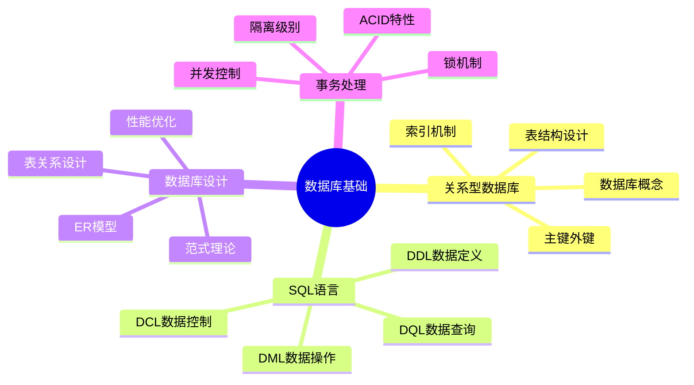
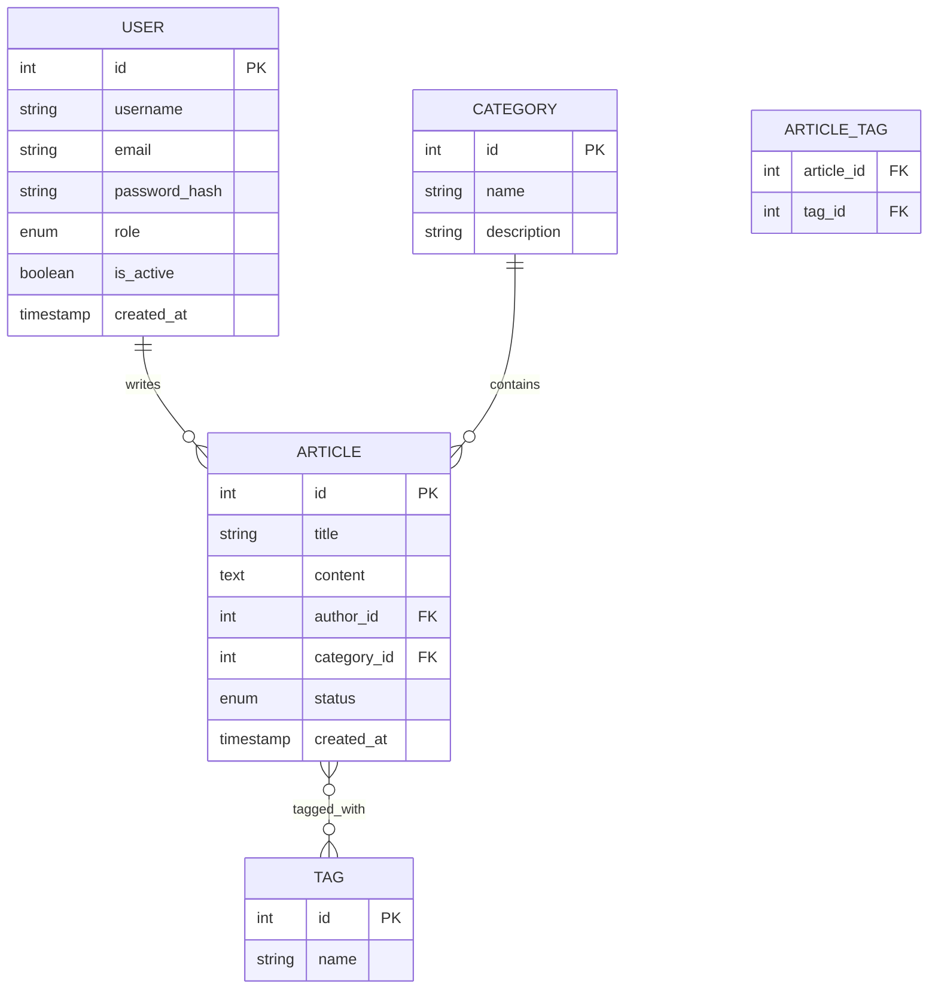

# 🗃️ 第4章前置知识：数据库基础与SQL语言

> **学习目标**：为学习NestJS数据持久化策略打下坚实的数据库理论基础

## 📋 前置知识概览

### 🎯 学习目标
- 理解关系型数据库的基本概念和设计原理
- 掌握SQL语言的核心语法和常用操作
- 了解数据库设计的基本原则和范式理论
- 熟悉数据库事务和并发控制机制
- 为学习ORM框架做好理论准备

### ⏰ 预计学习时间
- **总时长**：6-8小时
- **理论学习**：3-4小时
- **实践练习**：3-4小时

### 📚 知识结构图



## 🏗️ 第一部分：关系型数据库基础

### 📖 1.1 数据库核心概念

#### 🎯 什么是数据库？
**一句话概括**：数据库是有组织地存储和管理数据的仓库。

**生活类比**：
想象一个超大型的图书馆：
- **数据库** = 整个图书馆
- **表(Table)** = 不同类型的书架（小说架、技术书架等）
- **行(Row)** = 书架上的每一本书
- **列(Column)** = 书的属性（书名、作者、出版社等）
- **主键** = 每本书的唯一编号（ISBN）

#### 🔑 核心术语解释

```sql
-- 数据库：存储相关数据的容器
CREATE DATABASE blog_system;

-- 表：存储特定类型数据的结构
CREATE TABLE users (
    id INT PRIMARY KEY,        -- 主键：唯一标识
    username VARCHAR(50),      -- 列：数据属性
    email VARCHAR(100),
    created_at TIMESTAMP
);

-- 记录：表中的一行数据
INSERT INTO users VALUES (1, 'john_doe', 'john@example.com', NOW());
```

### 🔗 1.2 表关系设计

#### 📊 三种基本关系类型

**1. 一对一关系 (1:1)**
```sql
-- 用户表
CREATE TABLE users (
    id INT PRIMARY KEY,
    username VARCHAR(50)
);

-- 用户详情表（一对一）
CREATE TABLE user_profiles (
    id INT PRIMARY KEY,
    user_id INT UNIQUE,        -- 外键，且唯一
    bio TEXT,
    avatar_url VARCHAR(255),
    FOREIGN KEY (user_id) REFERENCES users(id)
);
```

**2. 一对多关系 (1:N)**
```sql
-- 分类表（一）
CREATE TABLE categories (
    id INT PRIMARY KEY,
    name VARCHAR(50)
);

-- 文章表（多）
CREATE TABLE articles (
    id INT PRIMARY KEY,
    title VARCHAR(200),
    category_id INT,           -- 外键
    FOREIGN KEY (category_id) REFERENCES categories(id)
);
```

**3. 多对多关系 (M:N)**
```sql
-- 文章表
CREATE TABLE articles (
    id INT PRIMARY KEY,
    title VARCHAR(200)
);

-- 标签表
CREATE TABLE tags (
    id INT PRIMARY KEY,
    name VARCHAR(50)
);

-- 中间表（解决多对多关系）
CREATE TABLE article_tags (
    article_id INT,
    tag_id INT,
    PRIMARY KEY (article_id, tag_id),
    FOREIGN KEY (article_id) REFERENCES articles(id),
    FOREIGN KEY (tag_id) REFERENCES tags(id)
);
```

### 🔍 1.3 索引机制

#### 💡 索引的作用
**类比解释**：索引就像书的目录，帮助快速找到需要的内容。

```sql
-- 创建索引提高查询性能
CREATE INDEX idx_username ON users(username);
CREATE INDEX idx_email ON users(email);
CREATE INDEX idx_created_at ON articles(created_at);

-- 复合索引
CREATE INDEX idx_category_status ON articles(category_id, status);
```

## 📝 第二部分：SQL语言核心

### 🛠️ 2.1 DDL - 数据定义语言

#### 🏗️ 创建和修改表结构

```sql
-- 创建数据库
CREATE DATABASE blog_system 
CHARACTER SET utf8mb4 
COLLATE utf8mb4_unicode_ci;

-- 使用数据库
USE blog_system;

-- 创建用户表
CREATE TABLE users (
    id INT AUTO_INCREMENT PRIMARY KEY,
    username VARCHAR(50) NOT NULL UNIQUE,
    email VARCHAR(100) NOT NULL UNIQUE,
    password_hash VARCHAR(255) NOT NULL,
    role ENUM('admin', 'author', 'reader') DEFAULT 'reader',
    is_active BOOLEAN DEFAULT TRUE,
    created_at TIMESTAMP DEFAULT CURRENT_TIMESTAMP,
    updated_at TIMESTAMP DEFAULT CURRENT_TIMESTAMP ON UPDATE CURRENT_TIMESTAMP
);

-- 修改表结构
ALTER TABLE users ADD COLUMN last_login TIMESTAMP;
ALTER TABLE users MODIFY COLUMN username VARCHAR(60);
ALTER TABLE users DROP COLUMN last_login;

-- 删除表
DROP TABLE IF EXISTS temp_table;
```

### 📊 2.2 DML - 数据操作语言

#### ➕ 插入数据
```sql
-- 单行插入
INSERT INTO users (username, email, password_hash) 
VALUES ('john_doe', 'john@example.com', 'hashed_password');

-- 多行插入
INSERT INTO users (username, email, password_hash) VALUES
('alice', 'alice@example.com', 'hash1'),
('bob', 'bob@example.com', 'hash2'),
('charlie', 'charlie@example.com', 'hash3');

-- 从其他表插入
INSERT INTO backup_users 
SELECT * FROM users WHERE created_at < '2023-01-01';
```

#### 🔄 更新数据
```sql
-- 更新单个字段
UPDATE users SET last_login = NOW() WHERE id = 1;

-- 更新多个字段
UPDATE users 
SET email = 'newemail@example.com', 
    updated_at = NOW() 
WHERE username = 'john_doe';

-- 条件更新
UPDATE users 
SET is_active = FALSE 
WHERE last_login < DATE_SUB(NOW(), INTERVAL 1 YEAR);
```

#### ❌ 删除数据
```sql
-- 删除特定记录
DELETE FROM users WHERE id = 1;

-- 条件删除
DELETE FROM users WHERE is_active = FALSE;

-- 清空表（保留结构）
TRUNCATE TABLE temp_logs;
```

### 🔍 2.3 DQL - 数据查询语言

#### 📋 基础查询
```sql
-- 查询所有字段
SELECT * FROM users;

-- 查询特定字段
SELECT id, username, email FROM users;

-- 条件查询
SELECT * FROM users WHERE role = 'admin';
SELECT * FROM users WHERE created_at > '2023-01-01';
SELECT * FROM users WHERE username LIKE '%john%';

-- 排序
SELECT * FROM users ORDER BY created_at DESC;
SELECT * FROM users ORDER BY role ASC, username ASC;

-- 限制结果数量
SELECT * FROM users LIMIT 10;
SELECT * FROM users LIMIT 10 OFFSET 20;  -- 分页
```

#### 🔗 连接查询
```sql
-- 内连接
SELECT u.username, a.title 
FROM users u 
INNER JOIN articles a ON u.id = a.author_id;

-- 左连接
SELECT u.username, COUNT(a.id) as article_count
FROM users u 
LEFT JOIN articles a ON u.id = a.author_id
GROUP BY u.id, u.username;

-- 右连接
SELECT c.name, a.title
FROM categories c
RIGHT JOIN articles a ON c.id = a.category_id;

-- 多表连接
SELECT u.username, a.title, c.name as category
FROM users u
INNER JOIN articles a ON u.id = a.author_id
INNER JOIN categories c ON a.category_id = c.id;
```

#### 📊 聚合查询
```sql
-- 统计函数
SELECT COUNT(*) FROM users;
SELECT COUNT(DISTINCT role) FROM users;
SELECT AVG(LENGTH(title)) FROM articles;
SELECT MAX(created_at), MIN(created_at) FROM articles;

-- 分组查询
SELECT role, COUNT(*) as user_count 
FROM users 
GROUP BY role;

SELECT category_id, COUNT(*) as article_count
FROM articles 
GROUP BY category_id
HAVING COUNT(*) > 5;  -- HAVING用于分组后的条件
```

#### 🔍 子查询
```sql
-- 标量子查询
SELECT username 
FROM users 
WHERE id = (SELECT author_id FROM articles WHERE title = 'NestJS Guide');

-- 列表子查询
SELECT username 
FROM users 
WHERE id IN (SELECT DISTINCT author_id FROM articles);

-- 存在性子查询
SELECT username 
FROM users u
WHERE EXISTS (SELECT 1 FROM articles a WHERE a.author_id = u.id);
```

## 🎨 第三部分：数据库设计原理

### 📐 3.1 ER模型设计

#### 🎯 实体关系图基础


### 📏 3.2 数据库范式

#### 🥇 第一范式 (1NF)
**原则**：每个字段都是原子性的，不可再分。

```sql
-- ❌ 违反1NF（电话字段包含多个值）
CREATE TABLE users_bad (
    id INT PRIMARY KEY,
    name VARCHAR(50),
    phones VARCHAR(100)  -- "123-456-7890,098-765-4321"
);

-- ✅ 符合1NF
CREATE TABLE users (
    id INT PRIMARY KEY,
    name VARCHAR(50)
);

CREATE TABLE user_phones (
    id INT PRIMARY KEY,
    user_id INT,
    phone VARCHAR(20),
    type ENUM('mobile', 'home', 'work'),
    FOREIGN KEY (user_id) REFERENCES users(id)
);
```

#### 🥈 第二范式 (2NF)
**原则**：在1NF基础上，非主键字段完全依赖于主键。

```sql
-- ❌ 违反2NF（课程名称只依赖于课程ID，不依赖于完整主键）
CREATE TABLE student_courses_bad (
    student_id INT,
    course_id INT,
    course_name VARCHAR(100),  -- 只依赖course_id
    grade DECIMAL(3,2),
    PRIMARY KEY (student_id, course_id)
);

-- ✅ 符合2NF
CREATE TABLE courses (
    id INT PRIMARY KEY,
    name VARCHAR(100)
);

CREATE TABLE student_courses (
    student_id INT,
    course_id INT,
    grade DECIMAL(3,2),
    PRIMARY KEY (student_id, course_id),
    FOREIGN KEY (course_id) REFERENCES courses(id)
);
```

#### 🥉 第三范式 (3NF)
**原则**：在2NF基础上，非主键字段不依赖于其他非主键字段。

```sql
-- ❌ 违反3NF（部门名称依赖于部门ID，而不是员工ID）
CREATE TABLE employees_bad (
    id INT PRIMARY KEY,
    name VARCHAR(50),
    department_id INT,
    department_name VARCHAR(50)  -- 依赖于department_id
);

-- ✅ 符合3NF
CREATE TABLE departments (
    id INT PRIMARY KEY,
    name VARCHAR(50)
);

CREATE TABLE employees (
    id INT PRIMARY KEY,
    name VARCHAR(50),
    department_id INT,
    FOREIGN KEY (department_id) REFERENCES departments(id)
);
```

## ⚡ 第四部分：事务与并发控制

### 🔒 4.1 ACID特性

#### 🎯 四大特性详解

**A - 原子性 (Atomicity)**
```sql
-- 转账操作：要么全部成功，要么全部失败
START TRANSACTION;

UPDATE accounts SET balance = balance - 100 WHERE id = 1;
UPDATE accounts SET balance = balance + 100 WHERE id = 2;

-- 如果任何一步失败，回滚所有操作
COMMIT;  -- 或 ROLLBACK;
```

**C - 一致性 (Consistency)**
```sql
-- 约束确保数据一致性
ALTER TABLE accounts ADD CONSTRAINT chk_balance CHECK (balance >= 0);
```

**I - 隔离性 (Isolation)**
```sql
-- 设置事务隔离级别
SET TRANSACTION ISOLATION LEVEL READ COMMITTED;
```

**D - 持久性 (Durability)**
```sql
-- 一旦提交，数据永久保存
COMMIT;
```

### 🔐 4.2 事务隔离级别

| 隔离级别 | 脏读 | 不可重复读 | 幻读 |
|---------|------|-----------|------|
| READ UNCOMMITTED | ✅ | ✅ | ✅ |
| READ COMMITTED | ❌ | ✅ | ✅ |
| REPEATABLE READ | ❌ | ❌ | ✅ |
| SERIALIZABLE | ❌ | ❌ | ❌ |

```sql
-- 设置不同的隔离级别
SET SESSION TRANSACTION ISOLATION LEVEL READ COMMITTED;
SET SESSION TRANSACTION ISOLATION LEVEL REPEATABLE READ;
```

## 🛠️ 实践练习

### 📝 练习1：博客系统数据库设计

设计一个简单的博客系统数据库，包含以下功能：
- 用户管理（注册、登录）
- 文章发布（标题、内容、分类）
- 评论系统
- 标签系统

```sql
-- 请完成以下表的创建
CREATE TABLE users (
    -- 补充字段定义
);

CREATE TABLE categories (
    -- 补充字段定义
);

CREATE TABLE articles (
    -- 补充字段定义
);

-- 继续创建其他必要的表...
```

### 📝 练习2：复杂查询编写

基于上面的数据库结构，编写以下查询：

1. 查询每个分类下的文章数量
2. 查询最受欢迎的10篇文章（按评论数排序）
3. 查询每个用户发布的文章数量和总评论数
4. 查询包含特定标签的所有文章

### 📝 练习3：事务处理

编写一个事务，实现以下业务逻辑：
- 用户发布新文章
- 更新用户的文章计数
- 如果是用户的第一篇文章，升级用户角色为作者

## 🎯 自我检测

### ✅ 知识点检查清单

- [ ] 理解关系型数据库的基本概念
- [ ] 掌握表关系设计（一对一、一对多、多对多）
- [ ] 熟悉SQL的四大类语言（DDL、DML、DQL、DCL）
- [ ] 了解数据库范式理论
- [ ] 理解事务的ACID特性
- [ ] 掌握基本的查询优化概念

### 🧪 快速测试

1. **概念题**：解释什么是外键约束？
2. **设计题**：如何设计用户和角色的多对多关系？
3. **SQL题**：写出查询每个分类下文章数量的SQL语句
4. **事务题**：解释为什么需要事务隔离级别？

## 🔗 与第4章的联系

### 🎯 为什么需要这些前置知识？

1. **数据建模基础** → ORM实体设计
2. **SQL语法熟练** → 理解ORM生成的查询
3. **事务概念** → NestJS中的事务处理
4. **性能优化** → 数据库查询优化策略

### 🚀 下一步学习重点

在掌握了这些数据库基础知识后，第4章将重点学习：
- TypeORM的使用方法
- 实体关系映射
- 查询构建器
- 数据库迁移
- 性能优化策略

---

> **💡 学习建议**：
> 
> 1. **理论与实践结合**：边学概念边动手练习SQL
> 2. **多做练习**：通过大量的SQL练习熟悉语法
> 3. **理解原理**：不仅要会写SQL，更要理解为什么这样写
> 4. **关注性能**：从一开始就培养性能意识
> 5. **实际项目**：尝试为真实项目设计数据库结构

**🎯 准备好了吗？让我们进入第4章，学习如何在NestJS中优雅地处理数据持久化！** 