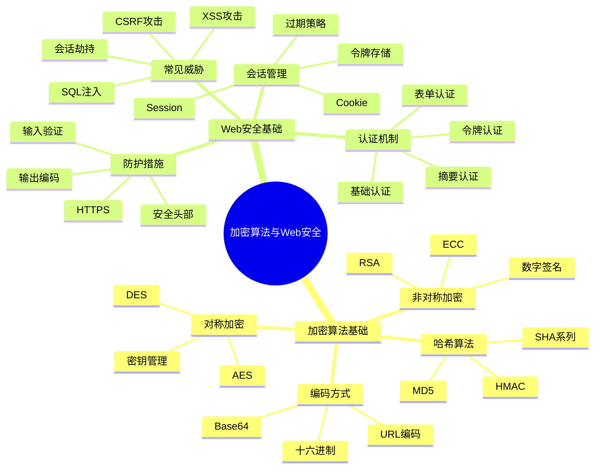

# 📚 第6章前置知识：加密算法基础与Web安全

> **学习目标**：掌握加密算法基础和Web安全核心概念，为JWT认证机制学习奠定坚实基础

## 🎯 学习目标

通过本章学习，你将能够：

- 🔐 **理解加密算法基础**：掌握对称加密、非对称加密和哈希算法的原理
- 🛡️ **掌握Web安全概念**：理解常见的Web安全威胁和防护措施
- 🔑 **理解身份认证机制**：掌握传统认证方式和现代认证技术
- 🎫 **了解令牌机制**：理解各种令牌类型和应用场景

## 📖 知识体系概览



## 🔐 加密算法基础

### 🎨 加密算法概述

#### 🏠 生活类比：保险箱的故事

想象你有一个保险箱来保护重要物品：

```
🏠 传统保险箱（对称加密）
├── 🔑 一把钥匙（密钥）
├── 🔒 锁定机制（加密算法）
└── 💎 贵重物品（敏感数据）

🏛️ 银行保险箱（非对称加密）
├── 🔑 客户钥匙（私钥）
├── 🗝️ 银行钥匙（公钥）
├── 🔒 双重锁定（加密算法）
└── 💎 贵重物品（敏感数据）

🔍 指纹识别（哈希算法）
├── 👆 指纹扫描（输入数据）
├── 🧮 特征提取（哈希函数）
└── 📊 特征码（哈希值）
```

### 🔄 对称加密算法

#### 📝 基本原理

对称加密使用相同的密钥进行加密和解密：

```typescript
// 对称加密示例（概念演示）
class SymmetricEncryption {
  private key: string;
  
  constructor(key: string) {
    this.key = key;
  }
  
  // 加密
  encrypt(plaintext: string): string {
    // 使用密钥对明文进行加密
    return this.xorCipher(plaintext, this.key);
  }
  
  // 解密
  decrypt(ciphertext: string): string {
    // 使用相同密钥对密文进行解密
    return this.xorCipher(ciphertext, this.key);
  }
  
  // 简单的XOR加密（仅用于演示）
  private xorCipher(text: string, key: string): string {
    let result = '';
    for (let i = 0; i < text.length; i++) {
      const textChar = text.charCodeAt(i);
      const keyChar = key.charCodeAt(i % key.length);
      result += String.fromCharCode(textChar ^ keyChar);
    }
    return result;
  }
}

// 使用示例
const cipher = new SymmetricEncryption('mySecretKey');
const plaintext = 'Hello, World!';
const encrypted = cipher.encrypt(plaintext);
const decrypted = cipher.decrypt(encrypted);

console.log('原文:', plaintext);
console.log('密文:', encrypted);
console.log('解密:', decrypted);
```

#### 🔧 常见对称加密算法

**1. AES（高级加密标准）**

```typescript
import * as crypto from 'crypto';

class AESEncryption {
  private algorithm = 'aes-256-cbc';
  private key: Buffer;
  
  constructor(password: string) {
    // 从密码生成密钥
    this.key = crypto.scryptSync(password, 'salt', 32);
  }
  
  encrypt(text: string): { encrypted: string; iv: string } {
    const iv = crypto.randomBytes(16); // 初始化向量
    const cipher = crypto.createCipher(this.algorithm, this.key);
    cipher.setAutoPadding(true);
    
    let encrypted = cipher.update(text, 'utf8', 'hex');
    encrypted += cipher.final('hex');
    
    return {
      encrypted,
      iv: iv.toString('hex')
    };
  }
  
  decrypt(encryptedData: { encrypted: string; iv: string }): string {
    const decipher = crypto.createDecipher(this.algorithm, this.key);
    
    let decrypted = decipher.update(encryptedData.encrypted, 'hex', 'utf8');
    decrypted += decipher.final('utf8');
    
    return decrypted;
  }
}
```

**2. 密钥管理最佳实践**

```typescript
// 密钥生成
class KeyManager {
  // 生成随机密钥
  static generateKey(length: number = 32): string {
    return crypto.randomBytes(length).toString('hex');
  }
  
  // 从密码派生密钥
  static deriveKey(password: string, salt: string): Buffer {
    return crypto.scryptSync(password, salt, 32);
  }
  
  // 密钥轮换
  static rotateKey(oldKey: string): string {
    const newKey = this.generateKey();
    // 在实际应用中，需要安全地存储和管理密钥
    return newKey;
  }
}
```

### 🔑 非对称加密算法

#### 📝 基本原理

非对称加密使用一对密钥：公钥用于加密，私钥用于解密。

```typescript
import * as crypto from 'crypto';

class RSAEncryption {
  private publicKey: string;
  private privateKey: string;
  
  constructor() {
    // 生成RSA密钥对
    const { publicKey, privateKey } = crypto.generateKeyPairSync('rsa', {
      modulusLength: 2048,
      publicKeyEncoding: {
        type: 'spki',
        format: 'pem'
      },
      privateKeyEncoding: {
        type: 'pkcs8',
        format: 'pem'
      }
    });
    
    this.publicKey = publicKey;
    this.privateKey = privateKey;
  }
  
  // 使用公钥加密
  encrypt(text: string): string {
    const buffer = Buffer.from(text, 'utf8');
    const encrypted = crypto.publicEncrypt(this.publicKey, buffer);
    return encrypted.toString('base64');
  }
  
  // 使用私钥解密
  decrypt(encryptedText: string): string {
    const buffer = Buffer.from(encryptedText, 'base64');
    const decrypted = crypto.privateDecrypt(this.privateKey, buffer);
    return decrypted.toString('utf8');
  }
  
  // 数字签名
  sign(text: string): string {
    const sign = crypto.createSign('SHA256');
    sign.update(text);
    sign.end();
    return sign.sign(this.privateKey, 'base64');
  }
  
  // 验证签名
  verify(text: string, signature: string): boolean {
    const verify = crypto.createVerify('SHA256');
    verify.update(text);
    verify.end();
    return verify.verify(this.publicKey, signature, 'base64');
  }
  
  getPublicKey(): string {
    return this.publicKey;
  }
}
```

#### 🎯 应用场景

```typescript
// 数字证书验证示例
class DigitalCertificate {
  private rsa: RSAEncryption;
  
  constructor() {
    this.rsa = new RSAEncryption();
  }
  
  // 颁发证书
  issueCertificate(userInfo: any): {
    certificate: string;
    signature: string;
  } {
    const certificate = JSON.stringify({
      ...userInfo,
      issuer: 'MyCA',
      validFrom: new Date(),
      validTo: new Date(Date.now() + 365 * 24 * 60 * 60 * 1000) // 1年有效期
    });
    
    const signature = this.rsa.sign(certificate);
    
    return { certificate, signature };
  }
  
  // 验证证书
  verifyCertificate(certificate: string, signature: string): boolean {
    return this.rsa.verify(certificate, signature);
  }
}
```

### 🔍 哈希算法

#### 📝 基本概念

哈希算法将任意长度的输入转换为固定长度的输出：

```typescript
import * as crypto from 'crypto';

class HashUtils {
  // MD5哈希（不推荐用于安全场景）
  static md5(text: string): string {
    return crypto.createHash('md5').update(text).digest('hex');
  }
  
  // SHA-256哈希
  static sha256(text: string): string {
    return crypto.createHash('sha256').update(text).digest('hex');
  }
  
  // SHA-512哈希
  static sha512(text: string): string {
    return crypto.createHash('sha512').update(text).digest('hex');
  }
  
  // HMAC（基于哈希的消息认证码）
  static hmac(text: string, secret: string, algorithm: string = 'sha256'): string {
    return crypto.createHmac(algorithm, secret).update(text).digest('hex');
  }
  
  // 密码哈希（加盐）
  static hashPassword(password: string, salt?: string): {
    hash: string;
    salt: string;
  } {
    if (!salt) {
      salt = crypto.randomBytes(16).toString('hex');
    }
    
    const hash = crypto.scryptSync(password, salt, 64).toString('hex');
    
    return { hash, salt };
  }
  
  // 验证密码
  static verifyPassword(password: string, hash: string, salt: string): boolean {
    const { hash: newHash } = this.hashPassword(password, salt);
    return newHash === hash;
  }
}
```

#### 🎯 实际应用

```typescript
// 数据完整性验证
class DataIntegrity {
  // 计算文件哈希
  static calculateFileHash(filePath: string): Promise<string> {
    return new Promise((resolve, reject) => {
      const hash = crypto.createHash('sha256');
      const stream = require('fs').createReadStream(filePath);
      
      stream.on('data', (data: Buffer) => {
        hash.update(data);
      });
      
      stream.on('end', () => {
        resolve(hash.digest('hex'));
      });
      
      stream.on('error', reject);
    });
  }
  
  // 验证数据完整性
  static verifyIntegrity(data: string, expectedHash: string): boolean {
    const actualHash = HashUtils.sha256(data);
    return actualHash === expectedHash;
  }
}

// 使用示例
const userData = JSON.stringify({ id: 1, name: 'John', email: 'john@example.com' });
const dataHash = HashUtils.sha256(userData);

console.log('数据:', userData);
console.log('哈希:', dataHash);
console.log('验证:', DataIntegrity.verifyIntegrity(userData, dataHash));
```

## 🛡️ Web安全基础

### ⚠️ 常见Web安全威胁

#### 🎭 XSS（跨站脚本攻击）

**攻击原理**：在网页中注入恶意脚本代码

```typescript
// XSS攻击示例（仅用于理解，请勿用于恶意用途）
class XSSExample {
  // 存储型XSS
  static storedXSS() {
    const maliciousComment = '<script>alert("XSS Attack!")</script>';
    // 如果直接将用户输入存储到数据库并在页面显示，就会执行恶意脚本
    return maliciousComment;
  }
  
  // 反射型XSS
  static reflectedXSS(userInput: string) {
    // 如果直接将用户输入反射到页面，可能导致XSS
    return `<div>您搜索的内容：${userInput}</div>`;
  }
}

// XSS防护措施
class XSSProtection {
  // HTML实体编码
  static escapeHtml(text: string): string {
    const map: { [key: string]: string } = {
      '&': '&amp;',
      '<': '&lt;',
      '>': '&gt;',
      '"': '&quot;',
      "'": '&#39;'
    };
    
    return text.replace(/[&<>"']/g, (match) => map[match]);
  }
  
  // 内容安全策略（CSP）
  static generateCSPHeader(): string {
    return "default-src 'self'; script-src 'self' 'unsafe-inline'; style-src 'self' 'unsafe-inline'";
  }
  
  // 输入验证
  static validateInput(input: string): boolean {
    // 检查是否包含潜在的恶意脚本
    const dangerousPatterns = [
      /<script/i,
      /javascript:/i,
      /on\w+\s*=/i,
      /<iframe/i
    ];
    
    return !dangerousPatterns.some(pattern => pattern.test(input));
  }
}
```

#### 🔄 CSRF（跨站请求伪造）

**攻击原理**：利用用户的登录状态执行未授权操作

```typescript
// CSRF防护措施
class CSRFProtection {
  private static tokens = new Map<string, string>();
  
  // 生成CSRF令牌
  static generateToken(sessionId: string): string {
    const token = crypto.randomBytes(32).toString('hex');
    this.tokens.set(sessionId, token);
    return token;
  }
  
  // 验证CSRF令牌
  static verifyToken(sessionId: string, token: string): boolean {
    const storedToken = this.tokens.get(sessionId);
    return storedToken === token;
  }
  
  // 双重提交Cookie
  static generateDoubleSubmitToken(): string {
    return crypto.randomBytes(32).toString('hex');
  }
  
  // SameSite Cookie设置
  static setSameSiteCookie(name: string, value: string): string {
    return `${name}=${value}; SameSite=Strict; Secure; HttpOnly`;
  }
}

// 在Express中使用CSRF保护
class CSRFMiddleware {
  static middleware(req: any, res: any, next: any) {
    if (req.method === 'POST' || req.method === 'PUT' || req.method === 'DELETE') {
      const sessionId = req.session?.id;
      const token = req.headers['x-csrf-token'] || req.body._token;
      
      if (!CSRFProtection.verifyToken(sessionId, token)) {
        return res.status(403).json({ error: 'CSRF token mismatch' });
      }
    }
    
    next();
  }
}
```

#### 💉 SQL注入攻击

**攻击原理**：通过恶意SQL代码获取或修改数据库数据

```typescript
// SQL注入示例（危险做法）
class SQLInjectionExample {
  // 危险：直接拼接SQL
  static unsafeQuery(username: string, password: string): string {
    return `SELECT * FROM users WHERE username = '${username}' AND password = '${password}'`;
  }
  
  // 恶意输入示例
  static maliciousInput() {
    const username = "admin'; DROP TABLE users; --";
    const password = "anything";
    
    const query = this.unsafeQuery(username, password);
    console.log('危险查询:', query);
    // 结果：SELECT * FROM users WHERE username = 'admin'; DROP TABLE users; --' AND password = 'anything'
  }
}

// SQL注入防护
class SQLInjectionProtection {
  // 使用参数化查询
  static safeQuery(db: any, username: string, password: string) {
    const query = 'SELECT * FROM users WHERE username = ? AND password = ?';
    return db.query(query, [username, password]);
  }
  
  // 输入验证
  static validateInput(input: string): boolean {
    // 检查SQL关键字
    const sqlKeywords = [
      'SELECT', 'INSERT', 'UPDATE', 'DELETE', 'DROP', 'CREATE',
      'ALTER', 'EXEC', 'UNION', 'SCRIPT', '--', ';'
    ];
    
    const upperInput = input.toUpperCase();
    return !sqlKeywords.some(keyword => upperInput.includes(keyword));
  }
  
  // 转义特殊字符
  static escapeSQL(input: string): string {
    return input.replace(/'/g, "''").replace(/;/g, '\\;');
  }
}
```

### 🔐 身份认证机制

#### 📝 传统认证方式

**1. 基础认证（Basic Authentication）**

```typescript
class BasicAuth {
  // 生成Basic认证头
  static generateAuthHeader(username: string, password: string): string {
    const credentials = `${username}:${password}`;
    const encoded = Buffer.from(credentials).toString('base64');
    return `Basic ${encoded}`;
  }
  
  // 解析Basic认证头
  static parseAuthHeader(authHeader: string): { username: string; password: string } | null {
    if (!authHeader.startsWith('Basic ')) {
      return null;
    }
    
    const encoded = authHeader.substring(6);
    const decoded = Buffer.from(encoded, 'base64').toString('utf8');
    const [username, password] = decoded.split(':');
    
    return { username, password };
  }
  
  // 验证中间件
  static middleware(req: any, res: any, next: any) {
    const authHeader = req.headers.authorization;
    
    if (!authHeader) {
      res.setHeader('WWW-Authenticate', 'Basic realm="Secure Area"');
      return res.status(401).json({ error: 'Authentication required' });
    }
    
    const credentials = this.parseAuthHeader(authHeader);
    if (!credentials) {
      return res.status(401).json({ error: 'Invalid authentication format' });
    }
    
    // 验证用户凭据
    if (this.validateCredentials(credentials.username, credentials.password)) {
      req.user = { username: credentials.username };
      next();
    } else {
      return res.status(401).json({ error: 'Invalid credentials' });
    }
  }
  
  private static validateCredentials(username: string, password: string): boolean {
    // 实际应用中应该查询数据库验证
    return username === 'admin' && password === 'password';
  }
}
```

**2. 摘要认证（Digest Authentication）**

```typescript
class DigestAuth {
  private static realm = 'Secure Area';
  private static nonces = new Map<string, { timestamp: number; count: number }>();
  
  // 生成nonce
  static generateNonce(): string {
    const timestamp = Date.now();
    const random = crypto.randomBytes(16).toString('hex');
    const nonce = crypto.createHash('md5').update(`${timestamp}:${random}`).digest('hex');
    
    this.nonces.set(nonce, { timestamp, count: 0 });
    return nonce;
  }
  
  // 计算响应哈希
  static calculateResponse(
    username: string,
    password: string,
    method: string,
    uri: string,
    nonce: string,
    nc: string,
    cnonce: string
  ): string {
    const ha1 = crypto.createHash('md5').update(`${username}:${this.realm}:${password}`).digest('hex');
    const ha2 = crypto.createHash('md5').update(`${method}:${uri}`).digest('hex');
    
    return crypto.createHash('md5')
      .update(`${ha1}:${nonce}:${nc}:${cnonce}:auth:${ha2}`)
      .digest('hex');
  }
  
  // 验证摘要认证
  static verifyDigest(authHeader: string, method: string, uri: string): boolean {
    // 解析认证头部
    const authParams = this.parseDigestHeader(authHeader);
    if (!authParams) return false;
    
    // 验证nonce
    const nonceInfo = this.nonces.get(authParams.nonce);
    if (!nonceInfo) return false;
    
    // 计算期望的响应
    const expectedResponse = this.calculateResponse(
      authParams.username,
      'password', // 实际应用中从数据库获取
      method,
      uri,
      authParams.nonce,
      authParams.nc,
      authParams.cnonce
    );
    
    return expectedResponse === authParams.response;
  }
  
  private static parseDigestHeader(authHeader: string): any {
    // 解析Digest认证头部的实现
    // 这里简化处理，实际应用中需要完整的解析逻辑
    return null;
  }
}
```

#### 🎫 现代令牌认证

**1. 会话令牌（Session Token）**

```typescript
class SessionManager {
  private static sessions = new Map<string, {
    userId: string;
    createdAt: Date;
    lastAccess: Date;
    data: any;
  }>();
  
  // 创建会话
  static createSession(userId: string, data: any = {}): string {
    const sessionId = crypto.randomBytes(32).toString('hex');
    const now = new Date();
    
    this.sessions.set(sessionId, {
      userId,
      createdAt: now,
      lastAccess: now,
      data
    });
    
    return sessionId;
  }
  
  // 获取会话
  static getSession(sessionId: string): any {
    const session = this.sessions.get(sessionId);
    if (!session) return null;
    
    // 检查会话是否过期
    const maxAge = 24 * 60 * 60 * 1000; // 24小时
    if (Date.now() - session.lastAccess.getTime() > maxAge) {
      this.sessions.delete(sessionId);
      return null;
    }
    
    // 更新最后访问时间
    session.lastAccess = new Date();
    return session;
  }
  
  // 销毁会话
  static destroySession(sessionId: string): boolean {
    return this.sessions.delete(sessionId);
  }
  
  // 清理过期会话
  static cleanupExpiredSessions(): void {
    const maxAge = 24 * 60 * 60 * 1000;
    const now = Date.now();
    
    for (const [sessionId, session] of this.sessions.entries()) {
      if (now - session.lastAccess.getTime() > maxAge) {
        this.sessions.delete(sessionId);
      }
    }
  }
}
```

**2. API密钥认证**

```typescript
class APIKeyManager {
  private static apiKeys = new Map<string, {
    userId: string;
    permissions: string[];
    rateLimit: number;
    usage: { count: number; resetTime: number };
  }>();
  
  // 生成API密钥
  static generateAPIKey(userId: string, permissions: string[] = []): string {
    const apiKey = 'ak_' + crypto.randomBytes(32).toString('hex');
    
    this.apiKeys.set(apiKey, {
      userId,
      permissions,
      rateLimit: 1000, // 每小时1000次请求
      usage: { count: 0, resetTime: Date.now() + 60 * 60 * 1000 }
    });
    
    return apiKey;
  }
  
  // 验证API密钥
  static validateAPIKey(apiKey: string): {
    valid: boolean;
    userId?: string;
    permissions?: string[];
    rateLimitExceeded?: boolean;
  } {
    const keyInfo = this.apiKeys.get(apiKey);
    if (!keyInfo) {
      return { valid: false };
    }
    
    // 检查速率限制
    const now = Date.now();
    if (now > keyInfo.usage.resetTime) {
      keyInfo.usage.count = 0;
      keyInfo.usage.resetTime = now + 60 * 60 * 1000;
    }
    
    if (keyInfo.usage.count >= keyInfo.rateLimit) {
      return { valid: true, rateLimitExceeded: true };
    }
    
    keyInfo.usage.count++;
    
    return {
      valid: true,
      userId: keyInfo.userId,
      permissions: keyInfo.permissions,
      rateLimitExceeded: false
    };
  }
  
  // 检查权限
  static hasPermission(apiKey: string, requiredPermission: string): boolean {
    const keyInfo = this.apiKeys.get(apiKey);
    if (!keyInfo) return false;
    
    return keyInfo.permissions.includes(requiredPermission) || 
           keyInfo.permissions.includes('*');
  }
}
```

## 🔍 编码与解码

### 📝 Base64编码

```typescript
class Base64Utils {
  // Base64编码
  static encode(text: string): string {
    return Buffer.from(text, 'utf8').toString('base64');
  }
  
  // Base64解码
  static decode(encoded: string): string {
    return Buffer.from(encoded, 'base64').toString('utf8');
  }
  
  // URL安全的Base64编码
  static encodeURL(text: string): string {
    return Buffer.from(text, 'utf8')
      .toString('base64')
      .replace(/\+/g, '-')
      .replace(/\//g, '_')
      .replace(/=/g, '');
  }
  
  // URL安全的Base64解码
  static decodeURL(encoded: string): string {
    // 补充填充字符
    let padded = encoded;
    while (padded.length % 4) {
      padded += '=';
    }
    
    // 替换URL安全字符
    padded = padded.replace(/-/g, '+').replace(/_/g, '/');
    
    return Buffer.from(padded, 'base64').toString('utf8');
  }
}
```

### 🌐 URL编码

```typescript
class URLUtils {
  // URL编码
  static encode(text: string): string {
    return encodeURIComponent(text);
  }
  
  // URL解码
  static decode(encoded: string): string {
    return decodeURIComponent(encoded);
  }
  
  // 查询参数编码
  static encodeQueryParams(params: Record<string, any>): string {
    return Object.entries(params)
      .map(([key, value]) => `${encodeURIComponent(key)}=${encodeURIComponent(value)}`)
      .join('&');
  }
  
  // 查询参数解码
  static decodeQueryParams(queryString: string): Record<string, string> {
    const params: Record<string, string> = {};
    
    queryString.split('&').forEach(param => {
      const [key, value] = param.split('=');
      if (key && value) {
        params[decodeURIComponent(key)] = decodeURIComponent(value);
      }
    });
    
    return params;
  }
}
```

## 🧪 实践练习

### 📝 练习1：实现简单的加密工具

```typescript
// 创建一个综合加密工具类
class CryptoToolkit {
  // 对称加密
  symmetricEncrypt(text: string, password: string): {
    encrypted: string;
    salt: string;
    iv: string;
  } {
    // 实现AES加密
    // TODO: 学生实现
    throw new Error('请实现对称加密方法');
  }
  
  // 对称解密
  symmetricDecrypt(encryptedData: {
    encrypted: string;
    salt: string;
    iv: string;
  }, password: string): string {
    // 实现AES解密
    // TODO: 学生实现
    throw new Error('请实现对称解密方法');
  }
  
  // 数字签名
  signData(data: string, privateKey: string): string {
    // 实现数字签名
    // TODO: 学生实现
    throw new Error('请实现数字签名方法');
  }
  
  // 验证签名
  verifySignature(data: string, signature: string, publicKey: string): boolean {
    // 实现签名验证
    // TODO: 学生实现
    throw new Error('请实现签名验证方法');
  }
}
```

### 📝 练习2：实现安全的密码管理

```typescript
// 创建密码管理器
class PasswordManager {
  // 生成强密码
  generatePassword(length: number = 12, options: {
    includeUppercase?: boolean;
    includeLowercase?: boolean;
    includeNumbers?: boolean;
    includeSymbols?: boolean;
  } = {}): string {
    // TODO: 学生实现
    throw new Error('请实现密码生成方法');
  }
  
  // 检查密码强度
  checkPasswordStrength(password: string): {
    score: number; // 0-100
    feedback: string[];
  } {
    // TODO: 学生实现
    throw new Error('请实现密码强度检查方法');
  }
  
  // 安全存储密码
  storePassword(password: string): {
    hash: string;
    salt: string;
  } {
    // TODO: 学生实现
    throw new Error('请实现密码存储方法');
  }
  
  // 验证密码
  verifyPassword(password: string, hash: string, salt: string): boolean {
    // TODO: 学生实现
    throw new Error('请实现密码验证方法');
  }
}
```

## 🔍 自我检测

### 📋 知识点检查清单

- [ ] 我理解对称加密和非对称加密的区别
- [ ] 我知道哈希算法的特点和应用场景
- [ ] 我了解常见的Web安全威胁
- [ ] 我掌握XSS和CSRF的防护措施
- [ ] 我理解不同的身份认证机制
- [ ] 我知道如何安全地存储和验证密码
- [ ] 我了解Base64和URL编码的用途
- [ ] 我能识别和防范SQL注入攻击

### 🎯 理解程度测试

**初级水平**（能回答60%以上）：
1. 对称加密和非对称加密有什么区别？
2. 什么是哈希算法？它有什么特点？
3. XSS攻击是什么？如何防护？
4. 什么是CSRF攻击？
5. Base64编码的作用是什么？

**中级水平**（能回答70%以上）：
1. 解释数字签名的工作原理
2. 如何安全地存储用户密码？
3. 什么是盐值？为什么要使用盐值？
4. 如何防范SQL注入攻击？
5. 会话管理有哪些安全考虑？

**高级水平**（能回答80%以上）：
1. 设计一个安全的API认证机制
2. 如何实现安全的密钥管理？
3. 解释HMAC的工作原理和应用场景
4. 如何设计防重放攻击的机制？
5. 什么是零知识证明？

## 📚 扩展阅读

### 📖 推荐资源

1. **经典书籍**
   - 《应用密码学》- Bruce Schneier
   - 《Web应用安全权威指南》- Dafydd Stuttard
   - 《白帽子讲Web安全》- 吴翰清

2. **在线资源**
   - [OWASP Top 10](https://owasp.org/www-project-top-ten/)
   - [Crypto 101](https://www.crypto101.io/)
   - [Web Security Academy](https://portswigger.net/web-security)

3. **实践平台**
   - [CryptoHack](https://cryptohack.org/)
   - [OverTheWire](https://overthewire.org/)
   - [WebGoat](https://owasp.org/www-project-webgoat/)

### 🎯 下一步学习

完成本章学习后，你已经具备了：
- ✅ 加密算法的基础理解
- ✅ Web安全威胁的认知
- ✅ 身份认证机制的掌握
- ✅ 安全编程的意识

**准备好进入第6章：JWT认证机制深度解析了吗？** 🚀

在下一章中，我们将：
- 🔐 深入学习JWT的结构和原理
- 🛡️ 掌握JWT的安全最佳实践
- 👥 实现完整的用户认证系统
- 🔄 建立高可用的会话管理机制

让我们继续这个精彩的学习之旅！ 