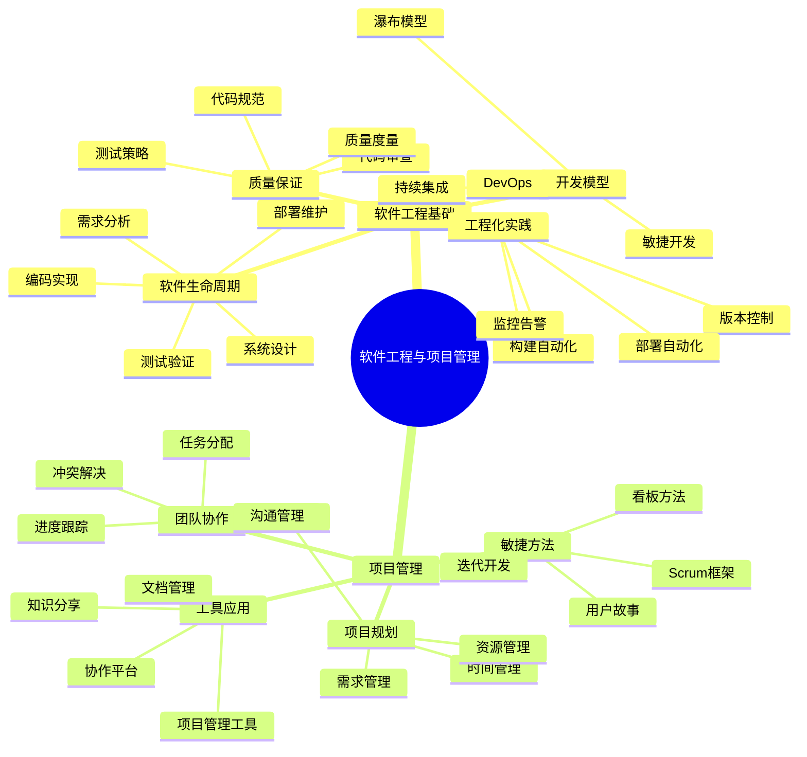
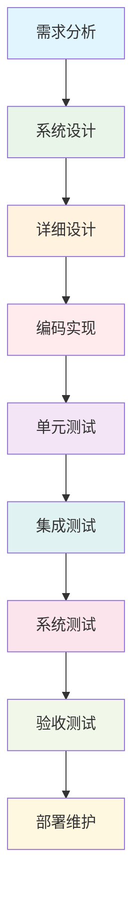
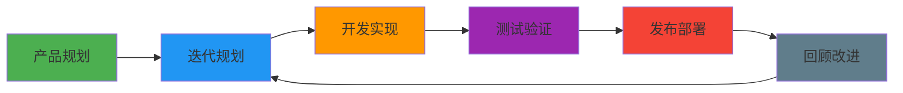
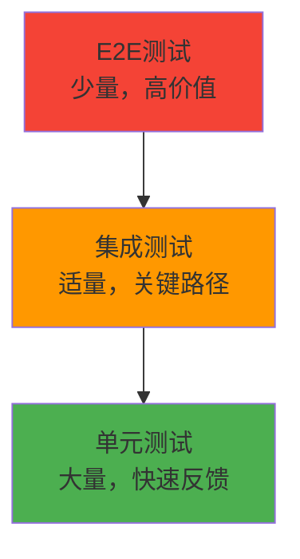
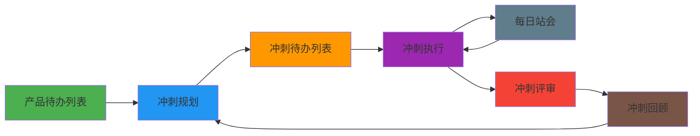
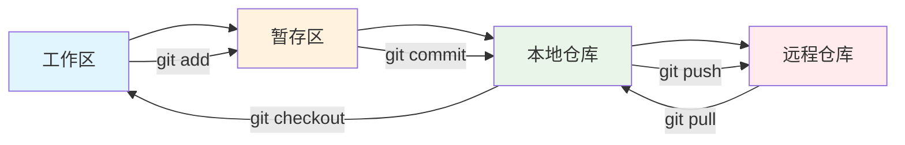

# 📚 第7章前置知识：软件工程与项目管理

> **学习目标**：掌握软件工程基础理论和项目管理核心概念，为项目架构与最佳实践学习奠定基础

## 🎯 学习目标

通过本章学习，你将能够：

- 🏗️ **理解软件工程基础**：掌握软件开发生命周期和工程化思维
- 📊 **掌握项目管理概念**：理解项目管理的核心原理和方法
- 🔧 **了解开发流程**：掌握现代软件开发流程和最佳实践
- 📏 **理解质量保证**：掌握软件质量保证的方法和标准

## 📖 知识体系概览



## 🏗️ 软件工程基础

### 🎨 软件工程概述

#### 🏠 生活类比：建筑工程

想象软件开发就像建造一座大楼：

```
🏢 建筑工程（软件工程）
├── 📋 需求调研（用户需求）
├── 🎨 建筑设计（系统设计）
├── 🏗️ 施工建造（编码实现）
├── 🔍 质量检验（测试验证）
├── 🏠 交付使用（部署上线）
└── 🔧 维护保养（运维维护）

🎯 关键要素对比
├── 📐 设计图纸 → 系统架构图
├── 🧱 建筑材料 → 代码组件
├── 👷 施工队伍 → 开发团队
├── 📏 质量标准 → 代码规范
├── ⏰ 工期管理 → 项目进度
└── 💰 成本控制 → 资源管理
```

#### 🎯 软件工程的核心原则

```typescript
// 软件工程核心原则
interface SoftwareEngineeringPrinciples {
  // 1. 模块化原则
  modularity: {
    principle: '分而治之';
    benefit: '降低复杂度，提高可维护性';
    implementation: '组件化、服务化、微服务';
  };
  
  // 2. 抽象化原则
  abstraction: {
    principle: '隐藏实现细节';
    benefit: '简化接口，提高复用性';
    implementation: '接口设计、API设计、分层架构';
  };
  
  // 3. 封装原则
  encapsulation: {
    principle: '数据和行为封装';
    benefit: '提高安全性和可控性';
    implementation: '类设计、模块设计、权限控制';
  };
  
  // 4. 层次化原则
  hierarchy: {
    principle: '分层组织系统';
    benefit: '清晰的职责分离';
    implementation: 'MVC、三层架构、微服务架构';
  };
}
```

### 📊 软件开发生命周期（SDLC）

#### 🔄 传统瀑布模型



**瀑布模型特点**：

```typescript
class WaterfallModel {
  // 优点
  static advantages = [
    '流程清晰，易于管理',
    '文档完整，便于维护',
    '适合需求稳定的项目',
    '质量控制严格'
  ];
  
  // 缺点
  static disadvantages = [
    '缺乏灵活性',
    '反馈周期长',
    '风险发现较晚',
    '不适应需求变化'
  ];
  
  // 适用场景
  static suitableFor = [
    '需求明确且稳定的项目',
    '技术成熟的项目',
    '对质量要求极高的项目',
    '团队经验丰富的项目'
  ];
}
```

#### 🚀 敏捷开发模型



**敏捷开发核心价值观**：

```typescript
interface AgileValues {
  // 个体和互动 胜过 流程和工具
  individualsAndInteractions: {
    focus: '人的价值';
    practice: '面对面沟通、团队协作、快速反馈';
  };
  
  // 工作的软件 胜过 详尽的文档
  workingSoftware: {
    focus: '可用的产品';
    practice: '快速迭代、持续交付、用户反馈';
  };
  
  // 客户合作 胜过 合同谈判
  customerCollaboration: {
    focus: '用户价值';
    practice: '用户参与、需求澄清、价值导向';
  };
  
  // 响应变化 胜过 遵循计划
  respondingToChange: {
    focus: '适应性';
    practice: '拥抱变化、快速调整、持续改进';
  };
}
```

#### 🔄 DevOps文化

```typescript
class DevOpsCulture {
  // 核心理念
  static coreIdeas = {
    collaboration: '开发与运维协作',
    automation: '自动化一切可自动化的',
    measurement: '度量和监控',
    sharing: '知识和经验分享'
  };
  
  // 实践方法
  static practices = {
    continuousIntegration: '持续集成',
    continuousDelivery: '持续交付',
    infrastructureAsCode: '基础设施即代码',
    monitoringAndLogging: '监控和日志',
    microservices: '微服务架构',
    containerization: '容器化'
  };
  
  // 工具链
  static toolchain = {
    versionControl: ['Git', 'SVN'],
    cicd: ['Jenkins', 'GitLab CI', 'GitHub Actions'],
    containerization: ['Docker', 'Kubernetes'],
    monitoring: ['Prometheus', 'Grafana', 'ELK Stack'],
    infrastructure: ['Terraform', 'Ansible', 'CloudFormation']
  };
}
```

### 🔧 软件质量保证

#### 📏 代码质量标准

```typescript
// 代码质量评估维度
interface CodeQualityMetrics {
  // 可读性
  readability: {
    naming: '命名规范';
    comments: '注释质量';
    structure: '代码结构';
    consistency: '一致性';
  };
  
  // 可维护性
  maintainability: {
    complexity: '复杂度控制';
    coupling: '耦合度';
    cohesion: '内聚性';
    modularity: '模块化程度';
  };
  
  // 可靠性
  reliability: {
    errorHandling: '错误处理';
    edgeCases: '边界情况';
    testing: '测试覆盖率';
    stability: '稳定性';
  };
  
  // 性能
  performance: {
    efficiency: '执行效率';
    memory: '内存使用';
    scalability: '可扩展性';
    responsiveness: '响应性';
  };
}
```

#### 🧪 测试策略金字塔



**测试层次详解**：

```typescript
class TestingPyramid {
  // 单元测试（70%）
  static unitTests = {
    purpose: '测试单个函数或方法',
    characteristics: ['快速执行', '独立运行', '易于维护'],
    tools: ['Jest', 'Mocha', 'Jasmine'],
    coverage: '代码覆盖率 > 80%'
  };
  
  // 集成测试（20%）
  static integrationTests = {
    purpose: '测试模块间的交互',
    characteristics: ['中等速度', '真实环境', '关键路径'],
    tools: ['Supertest', 'Postman', 'Newman'],
    coverage: '主要业务流程'
  };
  
  // E2E测试（10%）
  static e2eTests = {
    purpose: '测试完整的用户场景',
    characteristics: ['执行较慢', '真实用户场景', '高价值'],
    tools: ['Cypress', 'Playwright', 'Selenium'],
    coverage: '核心用户旅程'
  };
}
```

#### 🔍 代码审查流程

```typescript
// 代码审查检查清单
interface CodeReviewChecklist {
  // 功能性检查
  functionality: {
    requirements: '是否满足需求';
    logic: '业务逻辑是否正确';
    edgeCases: '边界情况处理';
    errorHandling: '错误处理机制';
  };
  
  // 代码质量检查
  codeQuality: {
    naming: '命名是否清晰';
    structure: '代码结构是否合理';
    duplication: '是否有重复代码';
    complexity: '复杂度是否可控';
  };
  
  // 安全性检查
  security: {
    inputValidation: '输入验证';
    authentication: '身份认证';
    authorization: '权限控制';
    dataProtection: '数据保护';
  };
  
  // 性能检查
  performance: {
    algorithms: '算法效率';
    databaseQueries: '数据库查询优化';
    caching: '缓存策略';
    resourceUsage: '资源使用';
  };
}
```

## 📊 项目管理基础

### 🎯 项目管理概述

#### 🏠 生活类比：组织聚会

想象项目管理就像组织一场大型聚会：

```
🎉 组织聚会（项目管理）
├── 📋 确定目标（项目目标）
├── 👥 邀请嘉宾（团队组建）
├── 📅 安排时间（时间管理）
├── 🏠 预订场地（资源管理）
├── 🍽️ 准备食物（任务执行）
├── 🎵 安排娱乐（质量保证）
└── 📸 记录回忆（项目总结）

🎯 管理要素对比
├── 🎯 聚会主题 → 项目目标
├── 👥 嘉宾名单 → 团队成员
├── 📅 时间安排 → 项目计划
├── 💰 预算控制 → 成本管理
├── 🎪 活动流程 → 工作流程
└── 📊 满意度调查 → 项目评估
```

#### 📋 项目管理知识体系

```typescript
interface ProjectManagementKnowledge {
  // 项目整合管理
  integration: {
    charter: '项目章程';
    plan: '项目管理计划';
    execution: '指导和管理项目工作';
    monitoring: '监控项目工作';
    closure: '结束项目或阶段';
  };
  
  // 项目范围管理
  scope: {
    planning: '规划范围管理';
    collection: '收集需求';
    definition: '定义范围';
    wbs: '创建工作分解结构';
    validation: '确认范围';
    control: '控制范围';
  };
  
  // 项目进度管理
  schedule: {
    planning: '规划进度管理';
    definition: '定义活动';
    sequencing: '排列活动顺序';
    estimation: '估算活动持续时间';
    development: '制定进度计划';
    control: '控制进度';
  };
  
  // 项目成本管理
  cost: {
    planning: '规划成本管理';
    estimation: '估算成本';
    budgeting: '制定预算';
    control: '控制成本';
  };
}
```

### 🚀 敏捷项目管理

#### 🏃‍♂️ Scrum框架



**Scrum角色定义**：

```typescript
interface ScrumRoles {
  // 产品负责人
  productOwner: {
    responsibilities: [
      '定义产品愿景',
      '管理产品待办列表',
      '确定优先级',
      '接受或拒绝工作成果'
    ];
    skills: ['业务理解', '沟通能力', '决策能力'];
  };
  
  // Scrum Master
  scrumMaster: {
    responsibilities: [
      '促进Scrum流程',
      '移除障碍',
      '保护团队',
      '教练和指导'
    ];
    skills: ['流程管理', '冲突解决', '教练技能'];
  };
  
  // 开发团队
  developmentTeam: {
    responsibilities: [
      '交付产品增量',
      '自组织工作',
      '持续改进',
      '跨功能协作'
    ];
    skills: ['技术能力', '协作能力', '自我管理'];
  };
}
```

#### 📋 看板方法

```typescript
class KanbanBoard {
  // 看板列定义
  static columns = {
    backlog: {
      name: '待办事项';
      purpose: '存储所有待处理的工作项';
      wipLimit: null; // 无限制
    };
    
    todo: {
      name: '准备开始';
      purpose: '已准备好开始的工作项';
      wipLimit: 5; // 在制品限制
    };
    
    inProgress: {
      name: '进行中';
      purpose: '正在开发的工作项';
      wipLimit: 3;
    };
    
    review: {
      name: '代码审查';
      purpose: '等待审查的工作项';
      wipLimit: 2;
    };
    
    testing: {
      name: '测试中';
      purpose: '正在测试的工作项';
      wipLimit: 2;
    };
    
    done: {
      name: '已完成';
      purpose: '已完成的工作项';
      wipLimit: null;
    };
  };
  
  // 看板原则
  static principles = [
    '可视化工作流',
    '限制在制品数量',
    '管理流动',
    '明确流程策略',
    '反馈循环',
    '协作改进'
  ];
}
```

### 👥 团队协作管理

#### 🗣️ 沟通管理

```typescript
interface CommunicationManagement {
  // 沟通计划
  communicationPlan: {
    stakeholders: '识别干系人';
    requirements: '确定沟通需求';
    methods: '选择沟通方式';
    frequency: '确定沟通频率';
    channels: '建立沟通渠道';
  };
  
  // 沟通方式
  communicationMethods: {
    formal: {
      meetings: '正式会议';
      reports: '项目报告';
      documentation: '项目文档';
      presentations: '项目演示';
    };
    
    informal: {
      dailyStandup: '每日站会';
      chatTools: '即时通讯';
      coffeeChat: '非正式交流';
      pairProgramming: '结对编程';
    };
  };
  
  // 会议类型
  meetingTypes: {
    kickoff: '项目启动会';
    planning: '规划会议';
    review: '评审会议';
    retrospective: '回顾会议';
    oneOnOne: '一对一会议';
  };
}
```

#### 🎯 任务管理

```typescript
class TaskManagement {
  // 任务分解原则
  static taskBreakdownPrinciples = {
    smart: {
      specific: '具体明确';
      measurable: '可衡量';
      achievable: '可实现';
      relevant: '相关性';
      timeBound: '有时限';
    };
    
    size: {
      small: '任务足够小，1-2天完成';
      testable: '可测试和验证';
      independent: '相对独立';
      valuable: '有业务价值';
    };
  };
  
  // 优先级管理
  static prioritizationMethods = {
    moscow: {
      must: 'Must have - 必须有';
      should: 'Should have - 应该有';
      could: 'Could have - 可以有';
      wont: "Won't have - 不会有";
    };
    
    eisenhowerMatrix: {
      urgent_important: '紧急且重要 - 立即处理';
      important_not_urgent: '重要不紧急 - 计划处理';
      urgent_not_important: '紧急不重要 - 委托处理';
      not_urgent_not_important: '不紧急不重要 - 删除';
    };
  };
  
  // 进度跟踪
  static progressTracking = {
    burndownChart: '燃尽图';
    burnupChart: '燃起图';
    velocityChart: '速度图';
    cumulativeFlowDiagram: '累积流图';
  };
}
```

## 🔧 现代开发工具与流程

### 🌿 版本控制系统

#### 📚 Git工作流程



**Git最佳实践**：

```typescript
interface GitBestPractices {
  // 分支策略
  branchingStrategy: {
    gitFlow: {
      master: '生产分支';
      develop: '开发分支';
      feature: '功能分支';
      release: '发布分支';
      hotfix: '热修复分支';
    };
    
    githubFlow: {
      main: '主分支';
      feature: '功能分支';
      pullRequest: '拉取请求';
    };
  };
  
  // 提交规范
  commitConventions: {
    format: 'type(scope): description';
    types: [
      'feat: 新功能',
      'fix: 修复bug',
      'docs: 文档更新',
      'style: 代码格式',
      'refactor: 重构',
      'test: 测试',
      'chore: 构建过程或辅助工具的变动'
    ];
  };
  
  // 代码审查
  codeReview: {
    pullRequestTemplate: 'PR模板';
    reviewChecklist: '审查清单';
    approvalProcess: '审批流程';
  };
}
```

### 🔄 持续集成/持续部署

#### 🚀 CI/CD流水线


**CI/CD配置示例**：

```yaml
# .github/workflows/ci-cd.yml
name: CI/CD Pipeline

on:
  push:
    branches: [ main, develop ]
  pull_request:
    branches: [ main ]

jobs:
  test:
    runs-on: ubuntu-latest
    
    steps:
    - uses: actions/checkout@v2
    
    - name: Setup Node.js
      uses: actions/setup-node@v2
      with:
        node-version: '16'
        cache: 'npm'
    
    - name: Install dependencies
      run: npm ci
    
    - name: Run linting
      run: npm run lint
    
    - name: Run tests
      run: npm run test:cov
    
    - name: Upload coverage
      uses: codecov/codecov-action@v2
  
  build:
    needs: test
    runs-on: ubuntu-latest
    
    steps:
    - uses: actions/checkout@v2
    
    - name: Build Docker image
      run: docker build -t myapp:${{ github.sha }} .
    
    - name: Push to registry
      run: |
        echo ${{ secrets.DOCKER_PASSWORD }} | docker login -u ${{ secrets.DOCKER_USERNAME }} --password-stdin
        docker push myapp:${{ github.sha }}
  
  deploy:
    needs: build
    runs-on: ubuntu-latest
    if: github.ref == 'refs/heads/main'
    
    steps:
    - name: Deploy to production
      run: |
        # 部署脚本
        echo "Deploying to production..."
```

### 📊 项目管理工具

#### 🛠️ 工具选择指南

```typescript
interface ProjectManagementTools {
  // 任务管理工具
  taskManagement: {
    jira: {
      strengths: ['功能强大', '高度可定制', '企业级'];
      weaknesses: ['复杂', '学习成本高'];
      suitableFor: '大型企业项目';
    };
    
    trello: {
      strengths: ['简单易用', '可视化', '免费'];
      weaknesses: ['功能有限', '报告功能弱'];
      suitableFor: '小型团队项目';
    };
    
    asana: {
      strengths: ['界面友好', '功能平衡', '协作性强'];
      weaknesses: ['高级功能收费'];
      suitableFor: '中型团队项目';
    };
  };
  
  // 协作工具
  collaboration: {
    slack: {
      purpose: '团队即时通讯';
      features: ['频道管理', '文件分享', '集成丰富'];
    };
    
    microsoftTeams: {
      purpose: '企业协作平台';
      features: ['视频会议', '文档协作', 'Office集成'];
    };
    
    discord: {
      purpose: '社区交流';
      features: ['语音频道', '屏幕分享', '机器人'];
    };
  };
  
  // 文档管理
  documentation: {
    confluence: {
      purpose: '企业知识管理';
      features: ['页面模板', '权限控制', 'Jira集成'];
    };
    
    notion: {
      purpose: '全能工作空间';
      features: ['数据库', '模板丰富', '多媒体支持'];
    };
    
    gitbook: {
      purpose: '技术文档';
      features: ['Markdown支持', 'Git集成', '版本控制'];
    };
  };
}
```

## 🧪 实践练习

### 📝 练习1：项目计划制定

```typescript
// 创建一个博客系统的项目计划
interface BlogProjectPlan {
  // 项目基本信息
  projectInfo: {
    name: string;
    description: string;
    duration: string;
    teamSize: number;
    budget: number;
  };
  
  // 工作分解结构
  workBreakdownStructure: {
    phase1_planning: {
      tasks: string[];
      duration: string;
      resources: string[];
    };
    
    phase2_design: {
      tasks: string[];
      duration: string;
      resources: string[];
    };
    
    phase3_development: {
      tasks: string[];
      duration: string;
      resources: string[];
    };
    
    phase4_testing: {
      tasks: string[];
      duration: string;
      resources: string[];
    };
    
    phase5_deployment: {
      tasks: string[];
      duration: string;
      resources: string[];
    };
  };
  
  // 风险管理
  riskManagement: {
    risks: Array<{
      description: string;
      probability: 'low' | 'medium' | 'high';
      impact: 'low' | 'medium' | 'high';
      mitigation: string;
    }>;
  };
}

// TODO: 学生实现项目计划
class BlogProjectPlanner {
  createProjectPlan(): BlogProjectPlan {
    // 实现项目计划制定
    throw new Error('请实现项目计划制定方法');
  }
  
  estimateEffort(tasks: string[]): number {
    // 实现工作量估算
    throw new Error('请实现工作量估算方法');
  }
  
  identifyRisks(): Array<any> {
    // 实现风险识别
    throw new Error('请实现风险识别方法');
  }
}
```

### 📝 练习2：代码质量检查工具

```typescript
// 创建代码质量检查工具
class CodeQualityChecker {
  // 检查命名规范
  checkNamingConventions(code: string): {
    violations: Array<{
      line: number;
      message: string;
      severity: 'error' | 'warning' | 'info';
    }>;
    score: number;
  } {
    // TODO: 学生实现
    throw new Error('请实现命名规范检查方法');
  }
  
  // 检查代码复杂度
  checkComplexity(code: string): {
    cyclomaticComplexity: number;
    cognitiveComplexity: number;
    recommendations: string[];
  } {
    // TODO: 学生实现
    throw new Error('请实现复杂度检查方法');
  }
  
  // 检查代码重复
  checkDuplication(files: string[]): {
    duplicatedBlocks: Array<{
      files: string[];
      lines: number[];
      similarity: number;
    }>;
    duplicationRatio: number;
  } {
    // TODO: 学生实现
    throw new Error('请实现重复代码检查方法');
  }
  
  // 生成质量报告
  generateQualityReport(projectPath: string): {
    overallScore: number;
    metrics: {
      maintainability: number;
      reliability: number;
      security: number;
      testCoverage: number;
    };
    recommendations: string[];
  } {
    // TODO: 学生实现
    throw new Error('请实现质量报告生成方法');
  }
}
```

## 🔍 自我检测

### 📋 知识点检查清单

- [ ] 我理解软件工程的基本概念和原则
- [ ] 我了解不同的软件开发生命周期模型
- [ ] 我掌握敏捷开发的核心理念和实践
- [ ] 我理解DevOps文化和实践
- [ ] 我知道如何进行代码质量保证
- [ ] 我了解项目管理的基本知识
- [ ] 我掌握Scrum和看板等敏捷方法
- [ ] 我知道如何使用项目管理工具
- [ ] 我理解版本控制的最佳实践
- [ ] 我了解CI/CD的基本概念和实现

### 🎯 理解程度测试

**初级水平**（能回答60%以上）：
1. 什么是软件工程？它解决什么问题？
2. 瀑布模型和敏捷开发有什么区别？
3. 什么是代码审查？为什么重要？
4. Scrum中有哪些角色？各自的职责是什么？
5. 什么是持续集成？

**中级水平**（能回答70%以上）：
1. 如何设计一个有效的测试策略？
2. 如何进行项目风险管理？
3. 什么是技术债务？如何管理？
4. 如何选择合适的项目管理工具？
5. Git工作流有哪些最佳实践？

**高级水平**（能回答80%以上）：
1. 如何设计可扩展的软件架构？
2. 如何建立有效的质量保证体系？
3. 如何实施DevOps文化转型？
4. 如何进行敏捷转型？
5. 如何建立学习型组织？

## 📚 扩展阅读

### 📖 推荐资源

1. **经典书籍**
   - 《人月神话》- Frederick P. Brooks Jr.
   - 《敏捷软件开发》- Robert C. Martin
   - 《Scrum敏捷软件开发》- Mike Cohn
   - 《持续交付》- Jez Humble & David Farley

2. **在线资源**
   - [Scrum Guide](https://scrumguides.org/)
   - [Agile Manifesto](https://agilemanifesto.org/)
   - [Martin Fowler's Blog](https://martinfowler.com/)

3. **工具文档**
   - [Git Documentation](https://git-scm.com/doc)
   - [GitHub Actions](https://docs.github.com/en/actions)
   - [Jira Documentation](https://confluence.atlassian.com/jira)

### 🎯 下一步学习

完成本章学习后，你已经具备了：
- ✅ 软件工程的基础理论知识
- ✅ 项目管理的核心概念
- ✅ 现代开发流程的理解
- ✅ 质量保证的基本方法

**准备好进入第7章：项目架构与最佳实践了吗？** 🚀

在下一章中，我们将：
- 🏗️ 学习企业级项目架构设计
- 📏 建立完善的代码规范体系
- 🔧 掌握现代工程化开发流程
- 📊 实现代码质量保证机制

让我们继续这个精彩的学习之旅！ 