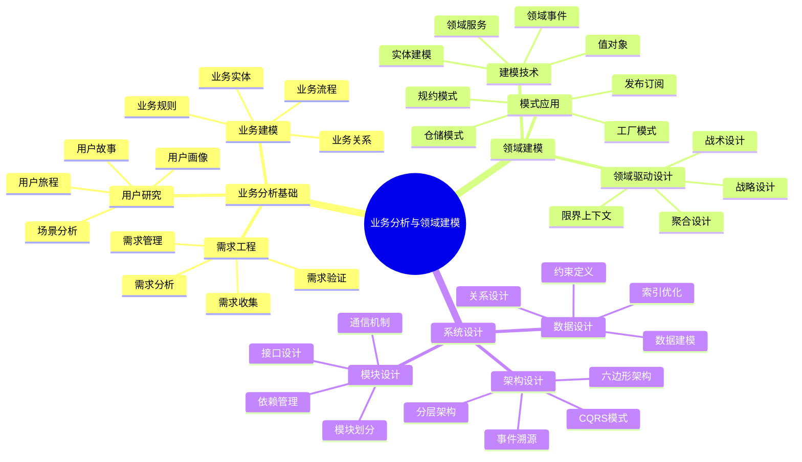

# 📚 第8章前置知识：业务分析与领域建模

> **学习目标**：掌握业务分析方法和领域建模技术，为业务模块设计奠定基础

## 🎯 学习目标

通过本章学习，你将能够：

- 🎯 **掌握业务分析方法**：学会分析和理解复杂业务需求
- 🧩 **理解领域建模概念**：掌握领域驱动设计的核心思想
- 📊 **学会需求分析技术**：掌握需求收集、分析和建模方法
- 🔄 **理解业务流程设计**：学会设计清晰的业务处理流程
- 📈 **掌握数据流设计**：理解数据在系统中的流转机制

## 📖 知识体系概览



## 🎯 业务分析基础

### 📋 需求工程概述

#### 🏠 生活类比：建房子的需求分析

想象业务分析就像为客户建造房子：

```
🏠 建房需求分析（业务需求分析）
├── 👥 客户访谈（需求收集）
├── 📐 设计图纸（需求建模）
├── 📋 功能清单（功能需求）
├── 🔧 质量标准（非功能需求）
├── 💰 预算约束（资源约束）
└── ⏰ 工期安排（时间约束）

🎯 分析要素对比
├── 🏠 房屋用途 → 业务目标
├── 👨‍👩‍👧‍👦 家庭成员 → 用户角色
├── 🛏️ 房间布局 → 功能模块
├── 🚿 基础设施 → 系统架构
├── 🎨 装修风格 → 用户体验
└── 🔒 安全防护 → 系统安全
```

#### 🔍 需求收集技术

```typescript
// 需求收集方法框架
interface RequirementGatheringMethods {
  // 访谈技术
  interviews: {
    structuredInterview: {
      description: '结构化访谈';
      advantages: ['信息全面', '标准化', '可比较'];
      disadvantages: ['缺乏灵活性', '可能遗漏重要信息'];
      applicableScenarios: ['初期需求收集', '标准化流程分析'];
    };
    
    unstructuredInterview: {
      description: '非结构化访谈';
      advantages: ['灵活性高', '深入探索', '发现隐性需求'];
      disadvantages: ['信息分散', '难以标准化', '时间成本高'];
      applicableScenarios: ['探索性研究', '创新需求发现'];
    };
    
    semiStructuredInterview: {
      description: '半结构化访谈';
      advantages: ['平衡灵活性和标准化', '适应性强'];
      disadvantages: ['需要经验丰富的分析师'];
      applicableScenarios: ['大多数业务分析场景'];
    };
  };
  
  // 观察技术
  observation: {
    directObservation: {
      description: '直接观察';
      purpose: '观察用户实际工作流程';
      benefits: ['获得真实信息', '发现流程问题'];
    };
    
    shadowingMethod: {
      description: '跟随观察法';
      purpose: '全程跟随用户工作';
      benefits: ['深度理解业务', '发现隐性需求'];
    };
  };
  
  // 文档分析
  documentAnalysis: {
    existingDocuments: '现有文档分析';
    processDocuments: '流程文档分析';
    systemDocuments: '系统文档分析';
    regulatoryDocuments: '法规文档分析';
  };
  
  // 工作坊技术
  workshops: {
    brainstorming: '头脑风暴';
    focusGroups: '焦点小组';
    prototyping: '原型制作';
    storyMapping: '故事地图';
  };
}
```

#### 📊 需求分析框架

```typescript
// 需求分析的SMART原则
interface SMARTRequirements {
  // Specific - 具体的
  specific: {
    principle: '需求描述要具体明确';
    badExample: '系统要快';
    goodExample: '系统响应时间不超过2秒';
    techniques: ['5W1H分析法', '用例描述', '场景分析'];
  };
  
  // Measurable - 可衡量的
  measurable: {
    principle: '需求要有可衡量的标准';
    badExample: '用户体验要好';
    goodExample: '用户满意度评分不低于4.5分（5分制）';
    techniques: ['KPI定义', '验收标准', '测试用例'];
  };
  
  // Achievable - 可实现的
  achievable: {
    principle: '需求在技术和资源约束下可实现';
    considerations: ['技术可行性', '资源可用性', '时间约束'];
    techniques: ['技术调研', '原型验证', '风险评估'];
  };
  
  // Relevant - 相关的
  relevant: {
    principle: '需求与业务目标相关';
    considerations: ['业务价值', '用户价值', '战略一致性'];
    techniques: ['价值分析', '优先级排序', '影响分析'];
  };
  
  // Time-bound - 有时限的
  timeBound: {
    principle: '需求有明确的时间约束';
    considerations: ['交付时间', '里程碑', '依赖关系'];
    techniques: ['项目计划', '时间估算', '关键路径分析'];
  };
}
```

### 🎨 业务建模技术

#### 🔄 业务流程建模

```typescript
// 业务流程建模方法
class BusinessProcessModeling {
  // BPMN建模元素
  static bpmnElements = {
    events: {
      startEvent: '开始事件';
      endEvent: '结束事件';
      intermediateEvent: '中间事件';
      boundaryEvent: '边界事件';
    };
    
    activities: {
      task: '任务';
      subprocess: '子流程';
      callActivity: '调用活动';
    };
    
    gateways: {
      exclusiveGateway: '排他网关';
      parallelGateway: '并行网关';
      inclusiveGateway: '包容网关';
      eventBasedGateway: '事件网关';
    };
    
    flows: {
      sequenceFlow: '顺序流';
      messageFlow: '消息流';
      association: '关联';
    };
  };
  
  // 流程分析维度
  static analysisFramework = {
    // 流程效率分析
    efficiency: {
      cycleTime: '周期时间';
      waitTime: '等待时间';
      processingTime: '处理时间';
      throughput: '吞吐量';
    };
    
    // 流程质量分析
    quality: {
      errorRate: '错误率';
      reworkRate: '返工率';
      customerSatisfaction: '客户满意度';
      complianceRate: '合规率';
    };
    
    // 流程成本分析
    cost: {
      laborCost: '人工成本';
      systemCost: '系统成本';
      opportunityCost: '机会成本';
      qualityCost: '质量成本';
    };
  };
  
  // 流程优化方法
  static optimizationMethods = {
    elimination: '消除不必要的步骤';
    combination: '合并相似的活动';
    rearrangement: '重新安排活动顺序';
    simplification: '简化复杂的活动';
    automation: '自动化重复性工作';
    parallelization: '并行化独立活动';
  };
}
```

#### 👥 用户故事与用例分析

```typescript
// 用户故事框架
interface UserStoryFramework {
  // 用户故事模板
  template: {
    format: 'As a [用户角色], I want [功能描述], so that [业务价值]';
    example: 'As a 博客作者, I want 发布文章, so that 分享我的想法给读者';
  };
  
  // INVEST原则
  investPrinciples: {
    independent: {
      principle: '独立的';
      description: '用户故事应该相互独立，可以独立开发和测试';
      techniques: ['依赖分析', '故事拆分', '接口定义'];
    };
    
    negotiable: {
      principle: '可协商的';
      description: '用户故事的细节可以在开发过程中协商';
      techniques: ['需求澄清', '原型验证', '迭代细化'];
    };
    
    valuable: {
      principle: '有价值的';
      description: '每个用户故事都应该为用户提供价值';
      techniques: ['价值分析', '用户反馈', 'ROI计算'];
    };
    
    estimable: {
      principle: '可估算的';
      description: '开发团队能够估算用户故事的工作量';
      techniques: ['故事点估算', '计划扑克', '历史数据'];
    };
    
    small: {
      principle: '小的';
      description: '用户故事应该足够小，能在一个迭代内完成';
      techniques: ['故事拆分', '任务分解', '时间盒'];
    };
    
    testable: {
      principle: '可测试的';
      description: '用户故事应该有明确的验收标准';
      techniques: ['验收标准', '测试用例', 'BDD方法'];
    };
  };
  
  // 验收标准模板
  acceptanceCriteria: {
    givenWhenThen: {
      format: 'Given [前置条件], When [操作行为], Then [预期结果]';
      example: 'Given 用户已登录, When 用户点击发布按钮, Then 文章成功发布并显示成功消息';
    };
    
    scenarioOutline: {
      format: '场景大纲，支持多组测试数据';
      usage: '数据驱动测试，边界值测试';
    };
  };
}

// 用例分析方法
class UseCaseAnalysis {
  // 用例识别技术
  static identificationTechniques = {
    actorAnalysis: {
      description: '参与者分析法';
      steps: [
        '识别系统的所有参与者',
        '分析每个参与者的目标',
        '识别实现目标的用例',
        '验证用例的完整性'
      ];
    };
    
    eventAnalysis: {
      description: '事件分析法';
      steps: [
        '识别业务事件',
        '分析事件触发条件',
        '识别事件处理用例',
        '分析事件间的关系'
      ];
    };
    
    goalAnalysis: {
      description: '目标分析法';
      steps: [
        '识别业务目标',
        '分解高层目标',
        '识别实现目标的用例',
        '验证目标覆盖度'
      ];
    };
  };
  
  // 用例描述模板
  static useCaseTemplate = {
    basicInformation: {
      name: '用例名称';
      id: '用例编号';
      actors: '参与者';
      description: '用例描述';
      preconditions: '前置条件';
      postconditions: '后置条件';
    };
    
    mainFlow: {
      description: '主成功场景';
      format: '步骤化描述';
      example: [
        '1. 用户输入登录信息',
        '2. 系统验证用户信息',
        '3. 系统生成访问令牌',
        '4. 系统返回登录成功信息'
      ];
    };
    
    alternativeFlows: {
      description: '替代流程';
      purpose: '处理异常情况和变化';
      example: [
        '2a. 用户信息验证失败',
        '2a1. 系统显示错误信息',
        '2a2. 返回步骤1'
      ];
    };
    
    exceptionFlows: {
      description: '异常流程';
      purpose: '处理系统错误';
      example: [
        '2b. 系统连接数据库失败',
        '2b1. 系统显示系统错误信息',
        '2b2. 用例结束'
      ];
    };
  };
}
```

## 🏗️ 领域驱动设计基础

### 🎯 DDD核心概念

#### 🏠 生活类比：城市规划与管理

想象领域驱动设计就像规划和管理一座城市：

```
🏙️ 城市规划（领域驱动设计）
├── 🗺️ 城市分区（限界上下文）
├── 🏢 功能区域（聚合）
├── 🏠 建筑物（实体）
├── 📍 地址编号（值对象）
├── 🚇 交通系统（领域服务）
└── 📢 信息发布（领域事件）

🎯 设计要素对比
├── 🗺️ 行政区划 → 限界上下文
├── 🏢 商业中心 → 聚合根
├── 🏠 具体建筑 → 实体对象
├── 📍 门牌号码 → 值对象
├── 🚇 公共服务 → 领域服务
└── 📢 城市广播 → 领域事件
```

#### 🧩 战略设计概念

```typescript
// 限界上下文设计
interface BoundedContextDesign {
  // 上下文识别方法
  identificationMethods: {
    domainExpertise: {
      description: '领域专家知识边界';
      technique: '通过领域专家访谈识别知识边界';
      example: '用户管理专家 vs 订单管理专家';
    };
    
    linguisticBoundaries: {
      description: '语言边界';
      technique: '识别术语使用的不同含义';
      example: '用户在用户管理中指账户，在订单管理中指客户';
    };
    
    organizationalBoundaries: {
      description: '组织边界';
      technique: '基于团队和部门结构划分';
      example: '用户服务团队 vs 订单服务团队';
    };
    
    technicalBoundaries: {
      description: '技术边界';
      technique: '基于技术架构和数据模型划分';
      example: '用户数据库 vs 订单数据库';
    };
  };
  
  // 上下文映射模式
  contextMappingPatterns: {
    sharedKernel: {
      description: '共享内核';
      usage: '两个团队共享部分领域模型';
      pros: ['减少重复', '保持一致性'];
      cons: ['增加耦合', '协调成本'];
    };
    
    customerSupplier: {
      description: '客户-供应商';
      usage: '下游团队依赖上游团队';
      pros: ['明确依赖关系', '责任清晰'];
      cons: ['可能产生瓶颈'];
    };
    
    conformist: {
      description: '遵奉者';
      usage: '下游团队完全遵循上游模型';
      pros: ['简化集成', '减少转换'];
      cons: ['失去建模自由度'];
    };
    
    anticorruptionLayer: {
      description: '防腐层';
      usage: '保护本地模型不受外部影响';
      pros: ['模型独立性', '隔离变化'];
      cons: ['增加复杂性', '转换成本'];
    };
  };
}

// 聚合设计原则
class AggregateDesignPrinciples {
  // 聚合识别方法
  static identificationMethods = {
    invariantAnalysis: {
      description: '不变量分析';
      technique: '识别必须一起保持一致的业务规则';
      example: '订单总金额 = 所有订单项金额之和';
    };
    
    transactionBoundary: {
      description: '事务边界分析';
      technique: '识别必须在同一事务中处理的操作';
      example: '创建订单时必须同时检查库存和创建订单项';
    };
    
    lifecycleAnalysis: {
      description: '生命周期分析';
      technique: '识别具有相同生命周期的对象';
      example: '订单和订单项具有相同的生命周期';
    };
  };
  
  // 聚合设计规则
  static designRules = {
    singleAggregateRoot: {
      rule: '每个聚合只有一个聚合根';
      reason: '确保一致性和封装性';
      implementation: '通过聚合根访问聚合内的所有对象';
    };
    
    referenceByIdentity: {
      rule: '聚合间通过标识符引用';
      reason: '减少耦合，提高性能';
      implementation: '使用ID而不是对象引用';
    };
    
    transactionPerAggregate: {
      rule: '一个事务只修改一个聚合';
      reason: '避免分布式事务的复杂性';
      implementation: '使用最终一致性处理跨聚合操作';
    };
    
    smallAggregates: {
      rule: '保持聚合尽可能小';
      reason: '提高性能和并发性';
      implementation: '只包含必须一起变化的对象';
    };
  };
}
```

#### 🔧 战术设计模式

```typescript
// 实体设计模式
interface EntityDesignPatterns {
  // 实体识别特征
  identityCharacteristics: {
    uniqueIdentity: {
      description: '具有唯一标识';
      example: '用户ID、订单号、产品编码';
      implementation: 'UUID、自增ID、业务编码';
    };
    
    mutableState: {
      description: '状态可变';
      example: '用户信息可以修改，订单状态可以变化';
      implementation: '提供修改方法，维护状态一致性';
    };
    
    continuity: {
      description: '具有连续性';
      example: '用户在系统中的整个生命周期';
      implementation: '通过标识符跟踪对象变化';
    };
  };
  
  // 实体设计原则
  designPrinciples: {
    identityEquality: {
      principle: '基于标识符判断相等性';
      implementation: '重写equals和hashCode方法';
      example: '两个用户对象，只要ID相同就认为是同一个用户';
    };
    
    encapsulation: {
      principle: '封装业务逻辑';
      implementation: '将业务规则封装在实体内部';
      example: '用户实体包含密码修改、状态变更等业务逻辑';
    };
    
    richDomain: {
      principle: '富领域模型';
      implementation: '实体不仅包含数据，还包含行为';
      example: '订单实体包含计算总价、添加订单项等方法';
    };
  };
}

// 值对象设计模式
interface ValueObjectDesignPatterns {
  // 值对象特征
  characteristics: {
    immutability: {
      description: '不可变性';
      reason: '避免意外修改，提高线程安全性';
      implementation: '所有字段为final，不提供setter方法';
    };
    
    valueEquality: {
      description: '基于值的相等性';
      reason: '两个值对象值相同就认为相等';
      implementation: '重写equals和hashCode，比较所有字段';
    };
    
    sideEffectFree: {
      description: '无副作用';
      reason: '方法调用不会改变对象状态';
      implementation: '所有方法都是纯函数';
    };
  };
  
  // 常见值对象类型
  commonTypes: {
    basicValues: {
      description: '基础值类型';
      examples: ['Money', 'Email', 'PhoneNumber', 'Address'];
      benefits: ['类型安全', '业务语义', '验证逻辑'];
    };
    
    compositeValues: {
      description: '复合值类型';
      examples: ['DateRange', 'Coordinate', 'Dimension'];
      benefits: ['封装复杂逻辑', '提高可读性'];
    };
    
    enumerations: {
      description: '枚举类型';
      examples: ['OrderStatus', 'UserRole', 'PaymentMethod'];
      benefits: ['类型安全', '有限状态', '业务语义'];
    };
  };
}

// 领域服务设计模式
class DomainServicePatterns {
  // 服务识别标准
  static identificationCriteria = {
    crossAggregateOperations: {
      description: '跨聚合操作';
      example: '转账操作涉及两个账户聚合';
      solution: '创建转账领域服务';
    };
    
    complexBusinessLogic: {
      description: '复杂业务逻辑';
      example: '价格计算涉及多种规则和策略';
      solution: '创建价格计算领域服务';
    };
    
    externalSystemIntegration: {
      description: '外部系统集成';
      example: '调用第三方支付接口';
      solution: '创建支付领域服务';
    };
    
    policyImplementation: {
      description: '策略实现';
      example: '不同用户类型的折扣策略';
      solution: '创建折扣策略领域服务';
    };
  };
  
  // 服务设计原则
  static designPrinciples = {
    stateless: {
      principle: '无状态设计';
      reason: '提高可测试性和并发性';
      implementation: '不保存实例状态，通过参数传递数据';
    };
    
    domainFocused: {
      principle: '专注领域逻辑';
      reason: '保持领域模型的纯净性';
      implementation: '只包含业务逻辑，不包含技术细节';
    };
    
    interfaceBased: {
      principle: '基于接口设计';
      reason: '提高可测试性和可扩展性';
      implementation: '定义接口，支持多种实现';
    };
  };
}
```

## 📊 系统设计基础

### 🏗️ 架构模式选择

#### 🔄 分层架构模式

```typescript
// 分层架构设计
interface LayeredArchitectureDesign {
  // 经典四层架构
  fourLayerArchitecture: {
    presentationLayer: {
      name: '表现层';
      responsibilities: ['用户界面', '输入验证', '格式转换', '会话管理'];
      components: ['Controllers', 'DTOs', 'Validators', 'Formatters'];
      dependencies: ['应用层'];
    };
    
    applicationLayer: {
      name: '应用层';
      responsibilities: ['用例协调', '事务管理', '权限控制', '流程编排'];
      components: ['Application Services', 'Command Handlers', 'Query Handlers'];
      dependencies: ['领域层', '基础设施层'];
    };
    
    domainLayer: {
      name: '领域层';
      responsibilities: ['业务逻辑', '业务规则', '领域模型', '领域服务'];
      components: ['Entities', 'Value Objects', 'Domain Services', 'Repositories'];
      dependencies: ['无外部依赖'];
    };
    
    infrastructureLayer: {
      name: '基础设施层';
      responsibilities: ['数据持久化', '外部服务', '技术实现', '框架集成'];
      components: ['Repository Implementations', 'External Services', 'Frameworks'];
      dependencies: ['领域层'];
    };
  };
  
  // 依赖规则
  dependencyRules: {
    dependencyDirection: {
      rule: '依赖方向只能向内';
      explanation: '外层可以依赖内层，内层不能依赖外层';
      benefits: ['降低耦合', '提高可测试性', '支持变化'];
    };
    
    domainIndependence: {
      rule: '领域层独立于技术实现';
      explanation: '领域层不依赖任何外部框架或技术';
      benefits: ['业务逻辑纯净', '易于测试', '技术无关'];
    };
    
    interfaceSegregation: {
      rule: '通过接口隔离依赖';
      explanation: '使用接口定义层间契约';
      benefits: ['降低耦合', '支持替换', '便于测试'];
    };
  };
}

// 六边形架构（端口适配器）
interface HexagonalArchitectureDesign {
  // 核心概念
  coreComponents: {
    applicationCore: {
      description: '应用核心';
      contents: ['领域模型', '业务逻辑', '用例'];
      characteristics: ['技术无关', '业务聚焦', '高内聚'];
    };
    
    ports: {
      description: '端口';
      purpose: '定义应用核心与外部世界的接口';
      types: ['输入端口（用例接口）', '输出端口（仓储接口）'];
    };
    
    adapters: {
      description: '适配器';
      purpose: '实现端口接口，连接外部系统';
      types: ['主适配器（驱动适配器）', '从适配器（被驱动适配器）'];
    };
  };
  
  // 设计原则
  designPrinciples: {
    dependencyInversion: {
      principle: '依赖倒置';
      implementation: '应用核心定义接口，适配器实现接口';
      benefits: ['核心独立', '易于测试', '支持替换'];
    };
    
    portAndAdapter: {
      principle: '端口适配器分离';
      implementation: '端口定义契约，适配器提供实现';
      benefits: ['关注点分离', '技术无关', '可插拔'];
    };
    
    outsideIn: {
      principle: '由外向内设计';
      implementation: '从用户需求出发，设计应用核心';
      benefits: ['用户导向', '业务聚焦', '价值驱动'];
    };
  };
}
```

#### 📊 CQRS模式

```typescript
// CQRS设计模式
interface CQRSDesignPattern {
  // 核心概念
  coreComponents: {
    commandSide: {
      description: '命令端';
      purpose: '处理写操作，修改系统状态';
      components: ['Commands', 'Command Handlers', 'Write Models'];
      characteristics: ['事务一致性', '业务规则', '状态变更'];
    };
    
    querySide: {
      description: '查询端';
      purpose: '处理读操作，返回数据';
      components: ['Queries', 'Query Handlers', 'Read Models'];
      characteristics: ['最终一致性', '性能优化', '数据展示'];
    };
    
    synchronization: {
      description: '同步机制';
      purpose: '保持读写模型的数据一致性';
      methods: ['领域事件', '消息队列', '数据同步'];
    };
  };
  
  // 适用场景
  applicableScenarios: {
    complexDomain: {
      description: '复杂领域模型';
      reason: '读写需求差异很大';
      example: '电商系统的商品管理和商品展示';
    };
    
    performanceRequirements: {
      description: '性能要求';
      reason: '读写性能需求不同';
      example: '高并发查询和低频率写入';
    };
    
    scalabilityNeeds: {
      description: '可扩展性需求';
      reason: '读写负载不均衡';
      example: '读多写少的系统';
    };
  };
  
  // 实现策略
  implementationStrategies: {
    sharedDatabase: {
      description: '共享数据库';
      approach: '使用不同的模型访问同一数据库';
      pros: ['简单实现', '数据一致性'];
      cons: ['性能限制', '模型耦合'];
    };
    
    separateDatabase: {
      description: '分离数据库';
      approach: '使用不同的数据库存储读写模型';
      pros: ['性能优化', '技术选择自由'];
      cons: ['数据同步复杂', '最终一致性'];
    };
    
    eventSourcing: {
      description: '事件溯源';
      approach: '存储事件流，重建状态';
      pros: ['完整历史', '审计跟踪', '时间旅行'];
      cons: ['复杂性高', '查询困难'];
    };
  };
}
```

### 🔄 数据流设计

#### 📊 数据流分析方法

```typescript
// 数据流分析框架
class DataFlowAnalysisFramework {
  // 数据流图层次
  static dfdLevels = {
    contextDiagram: {
      level: '上下文图（0层）';
      purpose: '显示系统与外部实体的交互';
      components: ['系统', '外部实体', '数据流'];
      example: '用户 -> 登录信息 -> 博客系统 -> 用户信息 -> 用户';
    };
    
    level1Diagram: {
      level: '1层数据流图';
      purpose: '显示系统内主要处理过程';
      components: ['主要处理', '数据存储', '数据流'];
      example: '用户认证、文章管理、评论处理';
    };
    
    level2Diagram: {
      level: '2层数据流图';
      purpose: '详细描述每个主要处理';
      components: ['详细处理', '子数据存储', '详细数据流'];
      example: '用户认证分解为：验证用户名、检查密码、生成令牌';
    };
  };
  
  // 数据流设计原则
  static designPrinciples = {
    dataConservation: {
      principle: '数据守恒';
      description: '输入数据流必须能够产生输出数据流';
      validation: '检查每个处理的输入输出是否匹配';
    };
    
    processNaming: {
      principle: '处理命名规范';
      description: '使用动词短语描述处理功能';
      examples: ['验证用户', '计算总价', '发送邮件'];
    };
    
    dataStoreNaming: {
      principle: '数据存储命名规范';
      description: '使用名词描述存储的数据';
      examples: ['用户信息', '订单数据', '产品目录'];
    };
    
    balancing: {
      principle: '平衡性';
      description: '父图和子图的数据流必须平衡';
      validation: '子图的输入输出必须与父图一致';
    };
  };
  
  // 数据字典设计
  static dataDictionary = {
    dataElements: {
      definition: '数据元素定义';
      format: 'name = description + type + length + range';
      example: 'user_id = 用户唯一标识 + string + 36 + UUID格式';
    };
    
    dataStructures: {
      definition: '数据结构定义';
      format: 'structure = element1 + element2 + ... + elementN';
      example: 'user_info = user_id + username + email + created_at';
    };
    
    dataFlows: {
      definition: '数据流定义';
      format: 'flow = structure + volume + frequency';
      example: 'login_request = user_credentials + 1000/hour + continuous';
    };
  };
}
```

## 🧪 实践练习

### 📝 练习1：业务需求分析

```typescript
// 博客系统需求分析练习
interface BlogSystemRequirementAnalysis {
  // 业务目标分析
  businessGoals: {
    primary: string[];
    secondary: string[];
    constraints: string[];
  };
  
  // 干系人分析
  stakeholderAnalysis: {
    users: Array<{
      role: string;
      goals: string[];
      painPoints: string[];
      requirements: string[];
    }>;
  };
  
  // 功能需求分析
  functionalRequirements: {
    userStories: Array<{
      role: string;
      goal: string;
      benefit: string;
      acceptanceCriteria: string[];
      priority: 'high' | 'medium' | 'low';
    }>;
  };
  
  // 非功能需求分析
  nonFunctionalRequirements: {
    performance: string[];
    security: string[];
    usability: string[];
    reliability: string[];
  };
}

// TODO: 学生实现需求分析
class BlogRequirementAnalyzer {
  analyzeBusinessGoals(): string[] {
    // 实现业务目标分析
    throw new Error('请实现业务目标分析方法');
  }
  
  identifyStakeholders(): Array<any> {
    // 实现干系人识别
    throw new Error('请实现干系人识别方法');
  }
  
  createUserStories(): Array<any> {
    // 实现用户故事创建
    throw new Error('请实现用户故事创建方法');
  }
  
  defineAcceptanceCriteria(userStory: any): string[] {
    // 实现验收标准定义
    throw new Error('请实现验收标准定义方法');
  }
}
```

### 📝 练习2：领域建模实践

```typescript
// 博客系统领域建模练习
class BlogDomainModeling {
  // 限界上下文识别
  identifyBoundedContexts(): Array<{
    name: string;
    responsibilities: string[];
    entities: string[];
    services: string[];
  }> {
    // TODO: 学生实现
    throw new Error('请实现限界上下文识别方法');
  }
  
  // 聚合设计
  designAggregates(): Array<{
    name: string;
    aggregateRoot: string;
    entities: string[];
    valueObjects: string[];
    invariants: string[];
  }> {
    // TODO: 学生实现
    throw new Error('请实现聚合设计方法');
  }
  
  // 实体设计
  designEntities(): Array<{
    name: string;
    identity: string;
    attributes: Array<{
      name: string;
      type: string;
      required: boolean;
    }>;
    behaviors: Array<{
      name: string;
      parameters: string[];
      returnType: string;
      businessRule: string;
    }>;
  }> {
    // TODO: 学生实现
    throw new Error('请实现实体设计方法');
  }
  
  // 值对象设计
  designValueObjects(): Array<{
    name: string;
    attributes: string[];
    validationRules: string[];
    behaviors: string[];
  }> {
    // TODO: 学生实现
    throw new Error('请实现值对象设计方法');
  }
  
  // 领域服务设计
  designDomainServices(): Array<{
    name: string;
    purpose: string;
    operations: Array<{
      name: string;
      parameters: string[];
      returnType: string;
      businessLogic: string;
    }>;
  }> {
    // TODO: 学生实现
    throw new Error('请实现领域服务设计方法');
  }
}
```

## 🔍 自我检测

### 📋 知识点检查清单

- [ ] 我理解业务分析的基本方法和技术
- [ ] 我掌握需求收集和分析的技巧
- [ ] 我了解用户故事和用例分析方法
- [ ] 我理解领域驱动设计的核心概念
- [ ] 我掌握限界上下文的识别方法
- [ ] 我了解聚合设计的原则和方法
- [ ] 我理解实体和值对象的区别
- [ ] 我掌握领域服务的设计原则
- [ ] 我了解不同架构模式的适用场景
- [ ] 我理解数据流设计的基本方法

### 🎯 理解程度测试

**初级水平**（能回答60%以上）：
1. 什么是业务分析？它的主要目的是什么？
2. 用户故事的基本格式是什么？
3. 什么是限界上下文？
4. 实体和值对象有什么区别？
5. 什么是聚合？

**中级水平**（能回答70%以上）：
1. 如何识别和定义限界上下文？
2. 聚合设计的基本原则有哪些？
3. 如何设计领域服务？
4. CQRS模式的核心思想是什么？
5. 如何进行数据流分析？

**高级水平**（能回答80%以上）：
1. 如何在复杂业务场景中应用DDD？
2. 如何处理跨聚合的业务操作？
3. 如何选择合适的架构模式？
4. 如何设计事件驱动的系统？
5. 如何平衡一致性和性能？

## 📚 扩展阅读

### 📖 推荐资源

1. **经典书籍**
   - 《领域驱动设计》- Eric Evans
   - 《实现领域驱动设计》- Vaughn Vernon
   - 《业务分析实践指南》- PMI
   - 《用户故事与敏捷方法》- Mike Cohn

2. **在线资源**
   - [DDD Community](https://dddcommunity.org/)
   - [Martin Fowler's DDD Articles](https://martinfowler.com/tags/domain%20driven%20design.html)
   - [Business Analysis Body of Knowledge](https://www.iiba.org/babok-guide/)

3. **实践工具**
   - [Event Storming](https://www.eventstorming.com/)
   - [Domain Storytelling](https://domainstorytelling.org/)
   - [Context Mapper](https://contextmapper.org/)

### 🎯 下一步学习

完成本章学习后，你已经具备了：
- ✅ 业务分析的基础方法
- ✅ 领域建模的核心技能
- ✅ 系统设计的基本思路
- ✅ 架构模式的选择能力

**准备好进入第8章：业务模块设计了吗？** 🚀

在下一章中，我们将：
- 🧩 学习模块划分的方法和原则
- 🔄 掌握业务流程的设计技巧
- 📊 建立高效的数据流转机制
- 🎯 实现完整的业务模块

让我们继续这个精彩的学习之旅！ 