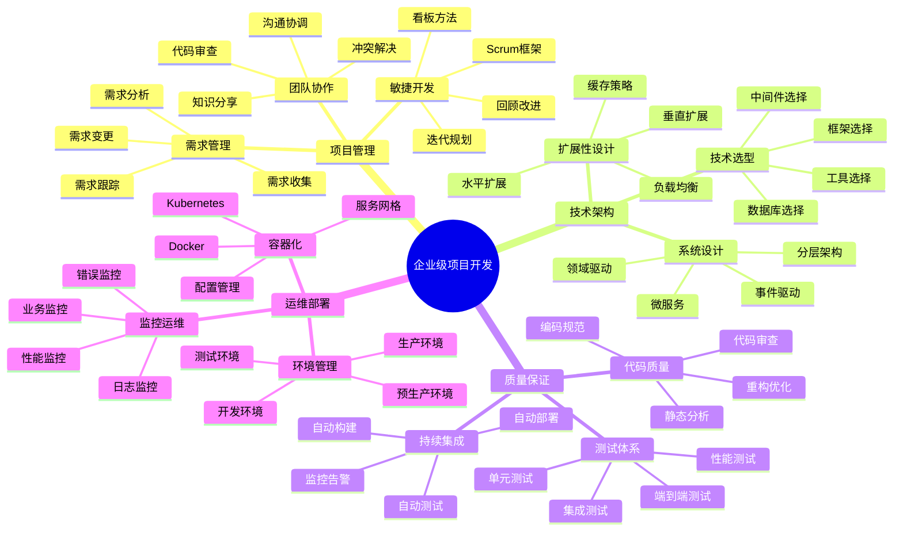

# 📚 第9章前置知识：企业级项目开发

> **学习目标**：掌握企业级项目开发的基础知识和最佳实践

## 🎯 学习目标

通过本章学习，你将能够：

- 🏗️ **理解企业级项目特点**：掌握企业级项目的复杂性和要求
- 📋 **掌握项目管理方法**：学会敏捷开发和项目管理技能
- 🔧 **了解开发工具链**：熟悉企业级开发的工具和流程
- 🧪 **理解质量保证体系**：掌握代码质量和测试的重要性
- 🚀 **学会部署和运维**：了解生产环境的部署和维护

## 📖 知识体系概览



## 🏗️ 企业级项目特点

### 📊 复杂性维度分析

#### 🏠 生活类比：建造摩天大楼

想象企业级项目开发就像建造一座摩天大楼：

```
🏢 摩天大楼建设（企业级项目）
├── 📐 建筑设计（系统架构）
├── 🏗️ 施工管理（项目管理）
├── 👷 施工团队（开发团队）
├── 🔧 施工工具（开发工具）
├── 🧪 质量检测（测试体系）
└── 🏠 物业管理（运维监控）

🎯 复杂性对比
├── 📐 结构复杂 → 架构复杂
├── 🏗️ 工期长 → 开发周期长
├── 👷 人员多 → 团队规模大
├── 🔧 工具多 → 技术栈复杂
├── 🧪 标准高 → 质量要求高
└── 🏠 维护难 → 运维复杂
```

#### 📈 企业级项目特征

```typescript
// 企业级项目特征分析
interface EnterpriseProjectCharacteristics {
  // 规模特征
  scaleCharacteristics: {
    codebase: {
      description: '代码库规模';
      metrics: ['代码行数', '文件数量', '模块数量'];
      typical: '10万+ 行代码，1000+ 文件';
    };
    
    team: {
      description: '团队规模';
      roles: ['产品经理', '架构师', '开发工程师', '测试工程师', '运维工程师'];
      typical: '10-50人团队';
    };
    
    timeline: {
      description: '开发周期';
      phases: ['需求分析', '架构设计', '开发实现', '测试验证', '部署上线'];
      typical: '6个月-2年';
    };
  };
  
  // 质量要求
  qualityRequirements: {
    reliability: {
      description: '可靠性要求';
      metrics: ['可用性', '故障恢复时间', '数据一致性'];
      standards: ['99.9%可用性', '< 5分钟恢复', '零数据丢失'];
    };
    
    performance: {
      description: '性能要求';
      metrics: ['响应时间', '吞吐量', '并发用户数'];
      standards: ['< 200ms响应', '1000+ QPS', '10000+ 并发'];
    };
    
    security: {
      description: '安全要求';
      aspects: ['身份认证', '权限控制', '数据加密', '审计日志'];
      standards: ['多因子认证', 'RBAC权限', 'TLS加密', '完整审计'];
    };
    
    maintainability: {
      description: '可维护性';
      aspects: ['代码质量', '文档完整性', '测试覆盖率', '监控体系'];
      standards: ['80%+ 测试覆盖', '完整API文档', '实时监控'];
    };
  };
  
  // 业务复杂性
  businessComplexity: {
    domainComplexity: {
      description: '领域复杂性';
      aspects: ['业务规则复杂', '流程复杂', '数据关系复杂'];
      examples: ['多角色权限', '复杂工作流', '复杂数据模型'];
    };
    
    integrationComplexity: {
      description: '集成复杂性';
      aspects: ['外部系统集成', '第三方服务', '遗留系统'];
      examples: ['支付系统', '短信服务', '老系统迁移'];
    };
    
    complianceRequirements: {
      description: '合规要求';
      aspects: ['法律法规', '行业标准', '企业政策'];
      examples: ['GDPR', 'SOX', '内部安全政策'];
    };
  };
}
```

### 🔄 开发生命周期

```typescript
// 企业级项目开发生命周期
class EnterpriseProjectLifecycle {
  // 项目启动阶段
  static initiationPhase = {
    activities: [
      '项目立项和可行性分析',
      '项目团队组建',
      '初步需求收集',
      '技术调研和选型',
      '项目计划制定'
    ],
    deliverables: [
      '项目章程',
      '可行性报告',
      '团队组织架构',
      '技术选型报告',
      '项目计划'
    ],
    duration: '2-4周',
    keyRoles: ['项目经理', '产品经理', '技术负责人']
  };
  
  // 需求分析阶段
  static requirementPhase = {
    activities: [
      '详细需求收集',
      '业务流程分析',
      '用户体验设计',
      '需求优先级排序',
      '需求文档编写'
    ],
    deliverables: [
      '需求规格说明书',
      '业务流程图',
      'UI/UX设计稿',
      '需求优先级矩阵',
      '验收标准'
    ],
    duration: '3-6周',
    keyRoles: ['产品经理', 'UX设计师', '业务分析师']
  };
  
  // 架构设计阶段
  static designPhase = {
    activities: [
      '系统架构设计',
      '数据库设计',
      '接口设计',
      '技术方案设计',
      '安全方案设计'
    ],
    deliverables: [
      '系统架构文档',
      '数据库设计文档',
      'API设计文档',
      '技术方案文档',
      '安全设计文档'
    ],
    duration: '2-4周',
    keyRoles: ['架构师', '技术负责人', '安全专家']
  };
  
  // 开发实现阶段
  static developmentPhase = {
    activities: [
      '环境搭建',
      '代码开发',
      '单元测试',
      '代码审查',
      '集成测试'
    ],
    deliverables: [
      '开发环境',
      '源代码',
      '单元测试用例',
      '代码审查报告',
      '集成测试报告'
    ],
    duration: '8-20周',
    keyRoles: ['开发工程师', '测试工程师', 'DevOps工程师']
  };
  
  // 测试验证阶段
  static testingPhase = {
    activities: [
      '系统测试',
      '性能测试',
      '安全测试',
      '用户验收测试',
      '缺陷修复'
    ],
    deliverables: [
      '测试计划',
      '测试用例',
      '测试报告',
      '性能测试报告',
      '安全测试报告'
    ],
    duration: '3-6周',
    keyRoles: ['测试工程师', '性能测试专家', '安全测试专家']
  };
  
  // 部署上线阶段
  static deploymentPhase = {
    activities: [
      '生产环境准备',
      '数据迁移',
      '系统部署',
      '上线验证',
      '用户培训'
    ],
    deliverables: [
      '部署文档',
      '运维手册',
      '监控配置',
      '备份方案',
      '培训材料'
    ],
    duration: '1-3周',
    keyRoles: ['DevOps工程师', '运维工程师', '项目经理']
  };
  
  // 维护运营阶段
  static maintenancePhase = {
    activities: [
      '系统监控',
      '问题处理',
      '性能优化',
      '功能迭代',
      '安全维护'
    ],
    deliverables: [
      '监控报告',
      '问题处理记录',
      '优化方案',
      '迭代计划',
      '安全更新'
    ],
    duration: '持续进行',
    keyRoles: ['运维工程师', '开发工程师', '产品经理']
  };
}
```

## 📋 敏捷开发方法

### 🔄 Scrum框架

```typescript
// Scrum框架实践
interface ScrumFramework {
  // Scrum角色
  roles: {
    productOwner: {
      responsibilities: [
        '定义产品愿景和目标',
        '管理产品待办列表',
        '确定需求优先级',
        '参与Sprint评审',
        '与利益相关者沟通'
      ];
      skills: ['业务理解', '沟通能力', '决策能力', '优先级管理'];
    };
    
    scrumMaster: {
      responsibilities: [
        '促进Scrum流程执行',
        '移除团队障碍',
        '指导团队实践',
        '保护团队免受干扰',
        '持续改进流程'
      ];
      skills: ['流程管理', '团队协调', '问题解决', '教练技能'];
    };
    
    developmentTeam: {
      responsibilities: [
        '估算工作量',
        '承诺Sprint目标',
        '开发产品功能',
        '确保代码质量',
        '参与团队协作'
      ];
      skills: ['技术能力', '自组织', '跨功能协作', '持续学习'];
    };
  };
  
  // Scrum事件
  events: {
    sprintPlanning: {
      purpose: '规划Sprint工作内容';
      duration: '最多8小时（4周Sprint）';
      participants: ['Product Owner', 'Scrum Master', 'Development Team'];
      outputs: ['Sprint目标', 'Sprint待办列表', '工作计划'];
    };
    
    dailyScrum: {
      purpose: '同步进度和计划';
      duration: '15分钟';
      participants: ['Development Team'];
      format: ['昨天完成了什么', '今天计划做什么', '遇到什么障碍'];
    };
    
    sprintReview: {
      purpose: '展示Sprint成果';
      duration: '最多4小时（4周Sprint）';
      participants: ['所有Scrum团队成员', '利益相关者'];
      outputs: ['产品增量演示', '反馈收集', '产品待办列表更新'];
    };
    
    sprintRetrospective: {
      purpose: '团队流程改进';
      duration: '最多3小时（4周Sprint）';
      participants: ['Scrum团队'];
      outputs: ['改进行动项', '流程优化建议'];
    };
  };
  
  // Scrum工件
  artifacts: {
    productBacklog: {
      description: '产品功能需求列表';
      characteristics: ['优先级排序', '动态更新', '详细程度递减'];
      management: ['Product Owner负责', '团队共同维护'];
    };
    
    sprintBacklog: {
      description: 'Sprint期间的工作项';
      characteristics: ['Sprint目标导向', '团队承诺', '每日更新'];
      management: ['Development Team负责'];
    };
    
    increment: {
      description: '可工作的产品增量';
      characteristics: ['满足完成定义', '可潜在发布', '累积性'];
      quality: ['符合完成标准', '通过验收测试'];
    };
  };
}
```

### 📊 看板方法

```typescript
// 看板方法实践
class KanbanMethod {
  // 看板原则
  static principles = {
    visualizeWork: {
      principle: '可视化工作流';
      implementation: '使用看板展示所有工作项';
      benefits: ['提高透明度', '识别瓶颈', '促进协作'];
    };
    
    limitWIP: {
      principle: '限制在制品数量';
      implementation: '为每个工作阶段设置WIP限制';
      benefits: ['提高流动效率', '减少多任务切换', '暴露问题'];
    };
    
    manageFlow: {
      principle: '管理工作流';
      implementation: '监控和优化工作流动';
      benefits: ['缩短交付时间', '提高预测性', '持续改进'];
    };
    
    makeProcessPoliciesExplicit: {
      principle: '明确流程政策';
      implementation: '清晰定义工作流程和规则';
      benefits: ['减少误解', '提高一致性', '便于改进'];
    };
    
    implementFeedbackLoops: {
      principle: '实施反馈循环';
      implementation: '建立定期回顾和改进机制';
      benefits: ['快速响应变化', '持续学习', '适应性改进'];
    };
    
    improveCollaboratively: {
      principle: '协作改进';
      implementation: '团队共同识别和实施改进';
      benefits: ['团队参与', '知识共享', '可持续改进'];
    };
  };
  
  // 看板设计
  static boardDesign = {
    basicColumns: ['待办', '进行中', '已完成'];
    advancedColumns: ['需求分析', '设计', '开发', '测试', '部署', '完成'];
    swimlanes: ['紧急', '正常', '低优先级'];
    wipLimits: {
      '需求分析': 3,
      '设计': 2,
      '开发': 5,
      '测试': 3,
      '部署': 2
    };
  };
  
  // 度量指标
  static metrics = {
    leadTime: {
      definition: '从需求提出到交付的总时间';
      calculation: '完成时间 - 开始时间';
      purpose: '衡量客户价值交付速度';
    };
    
    cycleTime: {
      definition: '从开始工作到完成的时间';
      calculation: '完成时间 - 开始工作时间';
      purpose: '衡量团队工作效率';
    };
    
    throughput: {
      definition: '单位时间内完成的工作项数量';
      calculation: '完成工作项数 / 时间周期';
      purpose: '衡量团队产能';
    };
    
    wipAge: {
      definition: '在制品的停留时间';
      calculation: '当前时间 - 开始时间';
      purpose: '识别阻塞和瓶颈';
    };
  };
}
```

## 🔧 开发工具链

### 🛠️ 版本控制系统

```typescript
// Git工作流最佳实践
interface GitWorkflow {
  // 分支策略
  branchingStrategy: {
    gitFlow: {
      description: 'Git Flow分支模型';
      branches: {
        master: '生产环境代码';
        develop: '开发环境代码';
        feature: '功能开发分支';
        release: '发布准备分支';
        hotfix: '紧急修复分支';
      };
      workflow: [
        '从develop创建feature分支',
        '完成功能后合并回develop',
        '从develop创建release分支',
        '测试通过后合并到master和develop',
        '紧急修复从master创建hotfix分支'
      ];
    };
    
    githubFlow: {
      description: 'GitHub Flow分支模型';
      branches: {
        main: '主分支，始终可部署';
        feature: '功能分支，从main创建';
      };
      workflow: [
        '从main创建feature分支',
        '开发完成后创建Pull Request',
        '代码审查通过后合并到main',
        '自动部署到生产环境'
      ];
    };
  };
  
  // 提交规范
  commitConventions: {
    format: 'type(scope): subject';
    types: {
      feat: '新功能';
      fix: '错误修复';
      docs: '文档更新';
      style: '代码格式调整';
      refactor: '代码重构';
      test: '测试相关';
      chore: '构建或工具变动';
    };
    examples: [
      'feat(auth): add JWT authentication',
      'fix(api): resolve user creation bug',
      'docs(readme): update installation guide'
    ];
  };
  
  // 代码审查
  codeReview: {
    principles: [
      '关注代码质量而非个人',
      '提供建设性反馈',
      '解释为什么而不只是什么',
      '及时响应审查请求'
    ];
    checklist: [
      '代码是否符合编码规范',
      '逻辑是否正确和清晰',
      '是否有适当的测试',
      '是否有安全问题',
      '性能是否可接受',
      '文档是否完整'
    ];
  };
}
```

### 🏗️ 构建和部署工具

```typescript
// CI/CD流水线设计
interface CICDPipeline {
  // 持续集成
  continuousIntegration: {
    triggers: ['代码提交', 'Pull Request', '定时构建'];
    stages: [
      {
        name: '代码检出';
        actions: ['从版本控制系统获取代码'];
      },
      {
        name: '依赖安装';
        actions: ['安装项目依赖', '缓存依赖包'];
      },
      {
        name: '代码检查';
        actions: ['ESLint检查', 'TypeScript编译', '代码格式检查'];
      },
      {
        name: '单元测试';
        actions: ['运行单元测试', '生成覆盖率报告'];
      },
      {
        name: '构建应用';
        actions: ['编译TypeScript', '打包应用', '生成构建产物'];
      },
      {
        name: '集成测试';
        actions: ['启动测试环境', '运行集成测试', '清理环境'];
      }
    ];
  };
  
  // 持续部署
  continuousDeployment: {
    environments: ['开发环境', '测试环境', '预生产环境', '生产环境'];
    strategies: {
      blueGreen: {
        description: '蓝绿部署';
        process: [
          '在绿色环境部署新版本',
          '验证绿色环境功能',
          '切换流量到绿色环境',
          '保留蓝色环境作为回滚备份'
        ];
      };
      
      canary: {
        description: '金丝雀部署';
        process: [
          '部署新版本到少量服务器',
          '将少量流量导向新版本',
          '监控关键指标',
          '逐步增加新版本流量',
          '完全切换或回滚'
        ];
      };
      
      rollingUpdate: {
        description: '滚动更新';
        process: [
          '逐个更新服务器实例',
          '确保服务可用性',
          '监控更新过程',
          '出现问题时停止更新'
        ];
      };
    };
  };
  
  // 监控和告警
  monitoring: {
    buildMonitoring: {
      metrics: ['构建成功率', '构建时间', '测试覆盖率'];
      alerts: ['构建失败', '测试失败', '覆盖率下降'];
    };
    
    deploymentMonitoring: {
      metrics: ['部署成功率', '部署时间', '回滚次数'];
      alerts: ['部署失败', '部署超时', '频繁回滚'];
    };
    
    applicationMonitoring: {
      metrics: ['响应时间', '错误率', '吞吐量', '资源使用率'];
      alerts: ['响应时间过长', '错误率过高', '资源不足'];
    };
  };
}
```

## 🧪 质量保证体系

### ✅ 测试策略

```typescript
// 测试金字塔
interface TestingPyramid {
  // 单元测试（底层）
  unitTests: {
    characteristics: ['快速执行', '独立运行', '覆盖率高'];
    scope: ['函数级别', '类级别', '模块级别'];
    tools: ['Jest', 'Mocha', 'Jasmine'];
    bestPractices: [
      '测试单一职责',
      '使用描述性测试名称',
      '遵循AAA模式（Arrange, Act, Assert）',
      '避免测试实现细节',
      '保持测试简单'
    ];
    coverage: '70-80%';
  };
  
  // 集成测试（中层）
  integrationTests: {
    characteristics: ['测试模块交互', '涉及外部依赖', '执行较慢'];
    scope: ['API测试', '数据库测试', '服务集成'];
    tools: ['Supertest', 'TestContainers', 'Postman'];
    bestPractices: [
      '使用真实的外部依赖',
      '测试关键集成点',
      '保持测试环境一致性',
      '清理测试数据',
      '并行执行测试'
    ];
    coverage: '15-25%';
  };
  
  // 端到端测试（顶层）
  e2eTests: {
    characteristics: ['完整用户流程', '真实环境', '执行最慢'];
    scope: ['用户界面', '完整业务流程', '跨系统交互'];
    tools: ['Cypress', 'Playwright', 'Selenium'];
    bestPractices: [
      '测试关键用户路径',
      '使用页面对象模式',
      '避免脆弱的选择器',
      '并行执行测试',
      '快速失败策略'
    ];
    coverage: '5-15%';
  };
}
```

### 📊 代码质量管理

```typescript
// 代码质量指标
interface CodeQualityMetrics {
  // 静态代码分析
  staticAnalysis: {
    complexity: {
      cyclomaticComplexity: '圈复杂度，衡量代码复杂程度';
      cognitiveComplexity: '认知复杂度，衡量理解难度';
      thresholds: {
        low: '< 10',
        medium: '10-20',
        high: '> 20'
      };
    };
    
    maintainability: {
      maintainabilityIndex: '可维护性指数';
      technicalDebt: '技术债务';
      codeSmells: '代码异味';
      duplicatedCode: '重复代码';
    };
    
    reliability: {
      bugs: '潜在错误';
      vulnerabilities: '安全漏洞';
      codeReliability: '代码可靠性';
    };
  };
  
  // 测试质量指标
  testQuality: {
    coverage: {
      lineCoverage: '行覆盖率';
      branchCoverage: '分支覆盖率';
      functionCoverage: '函数覆盖率';
      statementCoverage: '语句覆盖率';
    };
    
    testMetrics: {
      testCount: '测试用例数量';
      testExecutionTime: '测试执行时间';
      testStability: '测试稳定性';
      testMaintainability: '测试可维护性';
    };
  };
  
  // 团队协作指标
  teamMetrics: {
    codeReview: {
      reviewCoverage: '代码审查覆盖率';
      reviewTime: '审查响应时间';
      reviewQuality: '审查质量';
    };
    
    delivery: {
      leadTime: '交付周期';
      deploymentFrequency: '部署频率';
      changeFailureRate: '变更失败率';
      meanTimeToRestore: '平均恢复时间';
    };
  };
}
```

## 🚀 部署和运维基础

### 🐳 容器化技术

```typescript
// Docker容器化实践
interface DockerPractices {
  // Dockerfile最佳实践
  dockerfileBestPractices: {
    baseImage: {
      principle: '选择合适的基础镜像';
      recommendations: [
        '使用官方镜像',
        '选择最小化镜像',
        '固定镜像版本',
        '考虑安全性'
      ];
      examples: [
        'node:18-alpine',
        'nginx:1.21-alpine',
        'postgres:14-alpine'
      ];
    };
    
    layerOptimization: {
      principle: '优化镜像层';
      techniques: [
        '合并RUN指令',
        '清理缓存文件',
        '使用.dockerignore',
        '多阶段构建'
      ];
    };
    
    security: {
      principle: '增强安全性';
      practices: [
        '使用非root用户',
        '扫描安全漏洞',
        '最小化权限',
        '定期更新基础镜像'
      ];
    };
  };
  
  // Docker Compose
  dockerCompose: {
    purpose: '定义和运行多容器应用';
    services: [
      'web应用服务',
      '数据库服务',
      '缓存服务',
      '消息队列服务'
    ];
    features: [
      '服务编排',
      '网络管理',
      '数据卷管理',
      '环境变量配置'
    ];
  };
}
```

### 📊 监控和日志

```typescript
// 监控体系设计
interface MonitoringSystem {
  // 监控层次
  monitoringLayers: {
    infrastructure: {
      description: '基础设施监控';
      metrics: ['CPU使用率', '内存使用率', '磁盘空间', '网络流量'];
      tools: ['Prometheus', 'Grafana', 'Node Exporter'];
    };
    
    application: {
      description: '应用程序监控';
      metrics: ['响应时间', '吞吐量', '错误率', '可用性'];
      tools: ['APM工具', '自定义指标', '健康检查'];
    };
    
    business: {
      description: '业务指标监控';
      metrics: ['用户活跃度', '转化率', '业务KPI'];
      tools: ['业务仪表板', '数据分析平台'];
    };
  };
  
  // 日志管理
  logManagement: {
    logLevels: ['ERROR', 'WARN', 'INFO', 'DEBUG'];
    logFormat: {
      structured: 'JSON格式，便于解析';
      fields: ['timestamp', 'level', 'message', 'context', 'traceId'];
    };
    logAggregation: {
      tools: ['ELK Stack', 'Fluentd', 'Loki'];
      pipeline: ['收集', '传输', '存储', '分析', '可视化'];
    };
  };
  
  // 告警机制
  alerting: {
    alertTypes: ['阈值告警', '异常检测', '趋势告警'];
    channels: ['邮件', '短信', 'Slack', '钉钉'];
    escalation: ['一级告警', '二级告警', '紧急告警'];
  };
}
```

## 🔍 自我检测

### 📋 知识点检查清单

- [ ] 我理解企业级项目的特点和复杂性
- [ ] 我掌握敏捷开发的基本方法
- [ ] 我了解Scrum和看板的实践
- [ ] 我熟悉Git工作流和代码审查
- [ ] 我理解CI/CD流水线的设计
- [ ] 我掌握测试金字塔的概念
- [ ] 我了解代码质量管理方法
- [ ] 我理解容器化技术的基础
- [ ] 我掌握监控和日志的重要性
- [ ] 我了解企业级项目的运维要求

### 🎯 理解程度测试

**初级水平**（能回答60%以上）：
1. 什么是企业级项目？它有哪些特点？
2. 敏捷开发的核心价值观是什么？
3. Scrum中有哪些角色和事件？
4. 什么是持续集成？
5. 测试金字塔的三层分别是什么？

**中级水平**（能回答70%以上）：
1. 如何设计有效的CI/CD流水线？
2. 代码质量如何衡量和管理？
3. 如何实施有效的代码审查？
4. 容器化部署有什么优势？
5. 如何设计监控和告警体系？

**高级水平**（能回答80%以上）：
1. 如何在大型团队中实施敏捷开发？
2. 如何平衡开发速度和代码质量？
3. 如何设计可扩展的系统架构？
4. 如何处理企业级项目的技术债务？
5. 如何建立DevOps文化？

## 📚 扩展阅读

### 📖 推荐资源

1. **敏捷开发**
   - 《敏捷软件开发》- Robert C. Martin
   - 《Scrum精髓》- Kenneth S. Rubin
   - 《看板方法》- David J. Anderson

2. **代码质量**
   - 《代码整洁之道》- Robert C. Martin
   - 《重构》- Martin Fowler
   - 《代码大全》- Steve McConnell

3. **DevOps实践**
   - 《DevOps实践指南》- Gene Kim
   - 《持续交付》- Jez Humble
   - 《凤凰项目》- Gene Kim

### 🎯 下一步学习

完成本章学习后，你已经具备了：
- ✅ 企业级项目开发的基础知识
- ✅ 敏捷开发方法的理解
- ✅ 质量保证体系的认知
- ✅ DevOps实践的基础

**准备好进入第9章：企业级博客系统实战了吗？** 🚀

在下一章中，我们将：
- 🏗️ 构建完整的企业级博客系统
- 📋 实践需求分析和架构设计
- 💻 实现核心业务功能
- 🧪 建立完整的测试和部署流程

让我们开始这个激动人心的实战项目！ 