# 🎓 NestJS后端开发完整教学指南

> **从零基础到企业级应用** - 专业教材级别的系统化学习体系

## 📋 课程总体设计

### 🎯 课程定位
- **目标群体**：前端开发者转型后端、计算机专业学生、初级后端工程师
- **学习周期**：12-16周（建议每周8-12小时学习时间）
- **技能目标**：掌握企业级NestJS后端开发能力
- **认证标准**：能够独立设计并实现中等复杂度的后端系统

### 🎓 教学方法论

#### 📚 费曼教学法应用


**具体实施策略：**
1. **概念拆解**：将复杂概念分解为基础组件
2. **生活类比**：用日常生活场景解释技术概念
3. **渐进式学习**：从简单示例到复杂应用
4. **反复强化**：通过练习和项目巩固理解

#### 🧠 认知负荷管理
- **分块学习**：每次学习不超过3个核心概念
- **间隔重复**：利用Anki卡片进行记忆强化
- **多感官学习**：文字+图表+代码+视频
- **主动构建**：通过练习和项目主动应用知识

#### 🎯 目标导向学习
- **明确学习目标**：每章开始前明确要达到的能力
- **检查点设置**：每节都有自我检测环节
- **成果导向**：以能够解决实际问题为学习成果标准

### 🏗️ 知识架构体系


### 📖 学习内容设计原则

#### 🎨 内容呈现策略
1. **SCAMPER创新思维**
   - **S**ubstitute（替换）：用简单概念替换复杂术语
   - **C**ombine（组合）：将相关概念组合学习
   - **A**dapt（适应）：根据学习者背景调整内容
   - **M**odify（修改）：简化复杂的技术细节
   - **P**ut to other uses（其他用途）：展示概念的多种应用
   - **E**liminate（消除）：去除不必要的技术细节
   - **R**everse（逆向）：从结果反推原理

2. **多层次解释模型**
   ```
   第1层：一句话概括（电梯演讲）
   第2层：生活类比解释（形象理解）
   第3层：技术原理阐述（深度理解）
   第4层：代码实现展示（实践应用）
   第5层：最佳实践总结（专家经验）
   ```

3. **认知锚点建立**
   - **已知到未知**：从学习者已掌握的知识出发
   - **具体到抽象**：先展示具体例子，再抽象出原理
   - **简单到复杂**：逐步增加概念的复杂度

#### 🔄 知识关联网络设计


## 📚 课程结构设计

### 🔰 第一阶段：基础理论篇（4周）
**学习目标**：建立后端开发思维，掌握核心概念

#### 第1章 后端架构思维导引
- **学习时长**：1周（8-10小时）
- **难度等级**：⭐⭐☆☆☆
- **前置知识**：JavaScript基础、HTTP协议基础
- **核心概念**：架构设计、设计模式、工程思维
- **学习策略**：
  - 🎯 **概念建立**：通过建筑设计类比理解软件架构
  - 🔍 **原理探索**：深入理解SOLID设计原则
  - 🛠️ **实践应用**：设计简单的博客系统架构
  - 📊 **效果评估**：能够分析架构优缺点

#### 第2章 NestJS模块系统详解
- **学习时长**：1周（8-10小时）
- **难度等级**：⭐⭐⭐☆☆
- **前置知识**：TypeScript基础、装饰器概念
- **核心概念**：模块化设计、组件通信、依赖管理
- **学习策略**：
  - 🧩 **模块思维**：理解模块化的设计理念
  - 🔗 **依赖关系**：掌握模块间的依赖管理
  - 🎛️ **配置管理**：学会模块的配置和组织
  - 🔄 **通信机制**：理解模块间的通信方式

#### 第3章 依赖注入原理深度解析
- **学习时长**：1.5周（12-15小时）
- **难度等级**：⭐⭐⭐⭐☆
- **前置知识**：面向对象编程、设计模式
- **核心概念**：IoC容器、装饰器机制、元数据反射
- **学习策略**：
  - 🔄 **控制反转**：理解IoC的核心思想
  - 💉 **依赖注入**：掌握DI的实现机制
  - 🏭 **容器管理**：学会IoC容器的使用
  - 🔧 **装饰器应用**：理解装饰器的工作原理

#### 第4章 数据持久化策略
- **学习时长**：0.5周（4-6小时）
- **难度等级**：⭐⭐⭐☆☆
- **前置知识**：数据库基础、SQL语言
- **核心概念**：ORM设计、数据建模、查询优化
- **学习策略**：
  - 🗃️ **数据建模**：学会设计数据库模型
  - 🔍 **ORM使用**：掌握TypeORM的基本用法
  - ⚡ **查询优化**：理解查询性能优化方法
  - 🔒 **事务管理**：学会数据一致性保证

### 🚀 第二阶段：进阶应用篇（4周）
**学习目标**：掌握企业级开发技能，理解最佳实践

#### 第5章 API设计哲学与实践
- **学习时长**：1周（8-10小时）
- **难度等级**：⭐⭐⭐☆☆
- **前置知识**：RESTful概念、HTTP协议
- **核心概念**：接口设计、版本控制、错误处理
- **学习策略**：
  - 🎨 **设计哲学**：理解RESTful设计原则
  - 📝 **接口规范**：学会设计清晰的API接口
  - 🔄 **版本管理**：掌握API版本控制策略
  - ⚠️ **错误处理**：建立完善的错误处理机制

#### 第6章 JWT认证机制深度解析
- **学习时长**：1周（8-10小时）
- **难度等级**：⭐⭐⭐⭐☆
- **前置知识**：加密算法基础、Web安全
- **核心概念**：身份认证、授权机制、安全防护
- **学习策略**：
  - 🔐 **认证原理**：理解JWT的工作机制
  - 🛡️ **安全防护**：学会常见安全威胁的防护
  - 👥 **权限控制**：建立基于角色的权限系统
  - 🔄 **会话管理**：掌握用户会话的管理方法

#### 第7章 项目架构与最佳实践
- **学习时长**：1周（8-10小时）
- **难度等级**：⭐⭐⭐⭐☆
- **前置知识**：软件工程、项目管理
- **核心概念**：架构设计、代码规范、工程化
- **学习策略**：
  - 🏗️ **架构设计**：学会设计可扩展的项目架构
  - 📏 **代码规范**：建立团队代码规范标准
  - 🔧 **工程化**：掌握现代前端工程化工具
  - 📊 **质量保证**：建立代码质量保证体系

#### 第8章 业务模块设计
- **学习时长**：1周（8-10小时）
- **难度等级**：⭐⭐⭐⭐☆
- **前置知识**：业务分析、领域建模
- **核心概念**：模块划分、业务逻辑、数据流设计
- **学习策略**：
  - 🎯 **需求分析**：学会分析和理解业务需求
  - 🧩 **模块划分**：掌握合理的模块划分方法
  - 🔄 **业务流程**：设计清晰的业务处理流程
  - 📊 **数据流**：建立高效的数据流转机制

### 🎯 第三阶段：企业实战篇（4-8周）
**学习目标**：完成企业级项目，具备生产环境开发能力

#### 第9章 企业级博客系统实战
- **学习时长**：2-3周（20-30小时）
- **难度等级**：⭐⭐⭐⭐⭐
- **项目规模**：中等复杂度企业项目
- **技术栈**：NestJS + TypeORM + MySql + Redis
- **学习策略**：
  - 📋 **需求分析**：完整的项目需求分析过程
  - 🏗️ **架构设计**：企业级项目架构设计实践
  - 💻 **功能实现**：核心业务功能的完整实现
  - 🧪 **测试部署**：完整的测试和部署流程

#### 第10章 性能优化与监控
- **学习时长**：1周（8-10小时）
- **难度等级**：⭐⭐⭐⭐☆
- **核心概念**：性能分析、缓存策略、监控体系
- **学习策略**：
  - 📊 **性能分析**：学会识别和分析性能瓶颈
  - ⚡ **优化策略**：掌握常见的性能优化方法
  - 🗄️ **缓存设计**：建立高效的缓存策略
  - 📈 **监控体系**：建立完善的系统监控

#### 第11章 部署与运维
- **学习时长**：1周（8-10小时）
- **难度等级**：⭐⭐⭐☆☆
- **核心概念**：容器化部署、CI/CD、运维监控
- **学习策略**：
  - 🐳 **容器化**：学会使用Docker进行应用容器化
  - 🔄 **CI/CD**：建立自动化的持续集成和部署
  - 🖥️ **服务器管理**：掌握基本的服务器运维技能
  - 📊 **监控告警**：建立生产环境监控告警系统

#### 第12章 测试体系建设
- **学习时长**：1-2周（10-15小时）
- **难度等级**：⭐⭐⭐⭐☆
- **核心概念**：单元测试、集成测试、E2E测试
- **学习策略**：
  - 🧪 **测试理论**：理解不同层次测试的作用
  - ✅ **单元测试**：编写高质量的单元测试
  - 🔗 **集成测试**：验证模块间的集成效果
  - 🎭 **E2E测试**：建立端到端的测试流程

## 🎓 学习路径设计

### 📈 难度递进曲线


### 🔄 知识关联网络

```mermaid
graph TD
    A[架构思维] --> B[模块系统]
    A --> C[设计模式]
    B --> D[依赖注入]
    C --> D
    D --> E[数据持久化]
    D --> F[API设计]
    F --> G[认证授权]
    E --> H[业务模块]
    G --> H
    B --> I[项目架构]
    H --> I
    I --> J[企业实战]
    J --> K[性能优化]
    J --> L[部署运维]
    J --> M[测试体系]
    
    style A fill:#4caf50
    style D fill:#ff9800
    style I fill:#9c27b0
    style J fill:#f44336
```



### 🎯 学习策略指导

#### 📚 主动学习策略
1. **预习策略**
   - 阅读章节概述，建立知识框架
   - 查看思维导图，理解知识结构
   - 预习前置知识，确保基础扎实

2. **学习策略**
   - 采用番茄工作法，保持专注
   - 边学边做笔记，记录重点和疑问
   - 及时练习，巩固理论知识

3. **复习策略**
   - 使用Anki卡片进行间隔重复
   - 定期回顾思维导图
   - 通过项目实践检验学习效果

#### 🧠 记忆强化技巧
1. **联想记忆法**
   - 将抽象概念与具体事物联系
   - 建立概念间的逻辑关系
   - 使用生活化的类比

2. **结构化记忆**
   - 建立知识的层次结构
   - 使用思维导图整理知识
   - 通过分类和归纳加深理解

3. **实践强化**
   - 通过编程练习巩固概念
   - 在项目中应用所学知识
   - 向他人解释学到的内容

## 📊 学习评估体系

### 🎯 技能掌握度雷达图

```mermaid
graph radar
    A[理论基础] --> B[编码能力]
    B --> C[架构设计]
    C --> D[问题解决]
    D --> E[工程实践]
    E --> F[团队协作]
    F --> A
```

### 📋 章节评估标准

| 评估维度 | 初级(1-3分) | 中级(4-6分) | 高级(7-9分) | 专家(10分) |
|---------|------------|------------|------------|-----------|
| **理论理解** | 基本概念模糊 | 理解核心概念 | 深度理解原理 | 融会贯通 |
| **实践能力** | 照搬代码 | 独立实现 | 优化改进 | 创新设计 |
| **问题解决** | 需要指导 | 独立调试 | 预防问题 | 架构级思考 |
| **代码质量** | 功能实现 | 规范编码 | 优雅设计 | 最佳实践 |

### 🏆 学习成果认证

#### 📝 阶段性评估
1. **知识测试**（30%）
   - 概念理解测试
   - 原理分析题目
   - 最佳实践选择

2. **编程作业**（40%）
   - 功能实现作业
   - 代码质量评估
   - 设计思路分析

3. **项目实战**（30%）
   - 完整项目实现
   - 架构设计评估
   - 创新能力展示

#### 🎖️ 技能认证标准
- **初级认证**：完成基础篇学习，能够实现简单的后端功能
- **中级认证**：完成进阶篇学习，能够设计中等复杂度的系统
- **高级认证**：完成实战篇学习，具备企业级项目开发能力
- **专家认证**：能够指导他人学习，具备架构设计和技术决策能力

## 🛠️ 配套学习工具

### 📱 Anki记忆卡片体系

#### 🎯 卡片分类设计
1. **基础概念卡片**
   - 核心术语定义
   - 重要原理解释
   - 关键特性总结

2. **代码模式卡片**
   - 常用代码模板
   - 设计模式实现
   - 最佳实践示例

3. **问题解决卡片**
   - 常见问题场景
   - 解决方案步骤
   - 预防措施建议

4. **实战经验卡片**
   - 项目实践心得
   - 踩坑经验总结
   - 优化技巧分享

#### 📅 复习计划建议
- **每日复习**：20-30张卡片
- **周末总结**：回顾本周新增卡片
- **月度整理**：更新和优化卡片内容
- **阶段测试**：通过卡片进行自我测试

### 🔧 开发环境配置

#### 💻 推荐开发工具
1. **IDE配置**
   - VS Code + NestJS插件
   - WebStorm（付费但功能强大）
   - 必备插件清单和配置指南

2. **调试工具**
   - Postman：API测试
   - Swagger UI：API文档
   - Chrome DevTools：网络调试

3. **数据库工具**
   - pgAdmin：PostgreSQL管理
   - Redis Desktop Manager：Redis可视化
   - DBeaver：通用数据库工具

4. **版本控制**
   - Git：版本控制
   - GitHub：代码托管
   - GitKraken：Git可视化工具

#### 🐳 容器化环境
```yaml
# docker-compose.yml 示例
version: '3.8'
services:
  postgres:
    image: postgres:13
    environment:
      POSTGRES_DB: blog_db
      POSTGRES_USER: admin
      POSTGRES_PASSWORD: password
    ports:
      - "5432:5432"
  
  redis:
    image: redis:6
    ports:
      - "6379:6379"
```

### 📚 扩展资源库

#### 📖 必读书籍
1. **基础理论**
   - 《架构整洁之道》- Robert C. Martin
   - 《设计模式》- GoF
   - 《重构：改善既有代码的设计》- Martin Fowler

2. **实践指南**
   - 《Node.js设计模式》- Mario Casciaro
   - 《TypeScript编程》- Boris Cherny
   - 《数据库系统概念》- Abraham Silberschatz

#### 🌐 在线资源
1. **官方文档**
   - NestJS官方文档：https://nestjs.com/
   - TypeORM文档：https://typeorm.io/
   - Passport.js文档：http://www.passportjs.org/

2. **社区资源**
   - GitHub Awesome Lists
   - Stack Overflow
   - Reddit r/node

3. **技术博客**
   - Martin Fowler's Blog
   - 阮一峰的网络日志
   - 掘金技术社区

#### 🎥 视频教程
1. **YouTube频道**
   - Academind
   - The Net Ninja
   - Traversy Media

2. **中文平台**
   - B站技术UP主
   - 慕课网
   - 极客时间

## 🎯 学习成果验收

### 📝 阶段性考核

#### 🧪 理论考试设计
1. **选择题**（40%）
   - 概念理解
   - 原理分析
   - 最佳实践选择

2. **简答题**（30%）
   - 概念解释
   - 流程描述
   - 优缺点分析

3. **设计题**（30%）
   - 架构设计
   - 方案选择
   - 问题解决

#### 💻 编程作业评估
1. **功能实现**（50%）
   - 需求完成度
   - 功能正确性
   - 边界情况处理

2. **代码质量**（30%）
   - 代码规范
   - 可读性
   - 可维护性

3. **设计思路**（20%）
   - 架构合理性
   - 扩展性考虑
   - 最佳实践应用

### 🏆 最终项目要求

#### 📋 项目评估标准
1. **功能完整性**（25%）
   - 核心功能实现
   - 用户体验
   - 错误处理

2. **技术架构**（25%）
   - 架构设计合理性
   - 技术选型适当性
   - 扩展性和可维护性

3. **代码质量**（25%）
   - 代码规范
   - 注释完整性
   - 测试覆盖率

4. **文档完善**（25%）
   - API文档
   - 部署文档
   - 用户手册

#### 🎖️ 优秀项目标准
- **创新性**：在技术实现或业务逻辑上有创新点
- **完整性**：从需求分析到部署上线的完整流程
- **专业性**：符合企业级开发标准和最佳实践
- **可扩展性**：具备良好的架构设计和扩展能力

## 📅 学习时间规划

### 🗓️ 建议学习计划

#### 📊 时间分配策略
| 学习阶段 | 时间分配 | 重点内容 | 学习方法 |
|---------|---------|---------|---------|
| **基础篇** | 4周 | 概念建立 | 理论学习+简单练习 |
| **进阶篇** | 4周 | 技能提升 | 项目实践+深度理解 |
| **实战篇** | 4-8周 | 综合应用 | 完整项目+团队协作 |

#### ⏰ 每日学习建议
1. **工作日安排**（1-2小时）
   - 理论学习：30-45分钟
   - 代码练习：30-45分钟
   - 复习总结：15-30分钟

2. **周末安排**（4-6小时）
   - 项目实战：2-3小时
   - 深度学习：1-2小时
   - 总结复习：1小时

3. **学习节奏控制**
   - 每学习25分钟休息5分钟（番茄工作法）
   - 每天固定时间学习，养成习惯
   - 每周至少有一天完全休息

### 📈 学习进度跟踪

#### 📊 进度监控工具
1. **学习日志**
   - 每日学习内容记录
   - 学习时间统计
   - 问题和收获总结

2. **技能评估表**
   - 定期自我评估
   - 技能雷达图更新
   - 学习目标调整

3. **项目里程碑**
   - 阶段性成果展示
   - 同行评议反馈
   - 导师指导建议

#### 🎯 学习效果评估
1. **量化指标**
   - 学习时间统计
   - 练习完成率
   - 测试通过率

2. **质化评估**
   - 理解深度评估
   - 应用能力评估
   - 创新能力评估

3. **反馈机制**
   - 同学互评
   - 导师评价
   - 自我反思

---

> **💡 学习成功秘诀**：
> 
> 1. **坚持不懈**：每天进步一点点，积少成多
> 2. **主动学习**：不仅要知道"是什么"，更要理解"为什么"
> 3. **实践导向**：理论联系实际，通过项目巩固知识
> 4. **社区参与**：积极参与技术社区，与同行交流学习
> 5. **持续改进**：定期反思学习方法，不断优化学习策略
> 6. **保持好奇**：对新技术保持敏感，持续学习新知识
> 7. **分享传播**：通过教授他人来检验和巩固自己的理解

**🚀 开始您的NestJS学习之旅吧！记住：最好的学习时间是现在，最好的学习方法是开始行动！** 