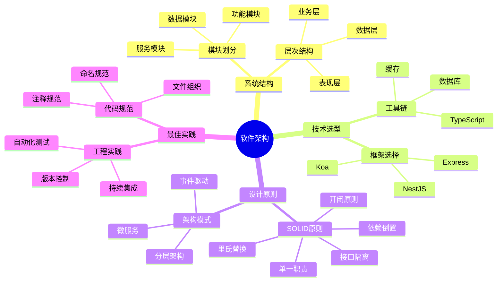
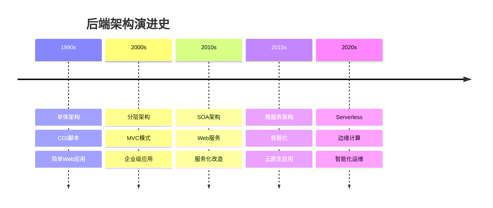
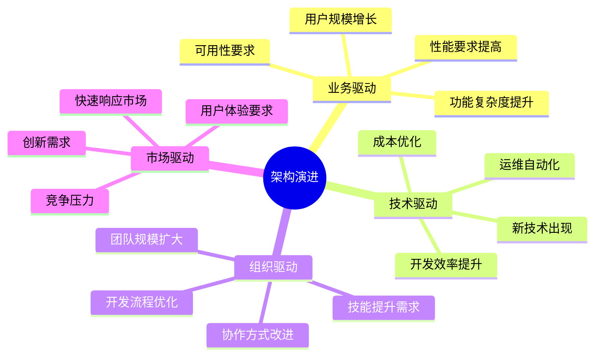
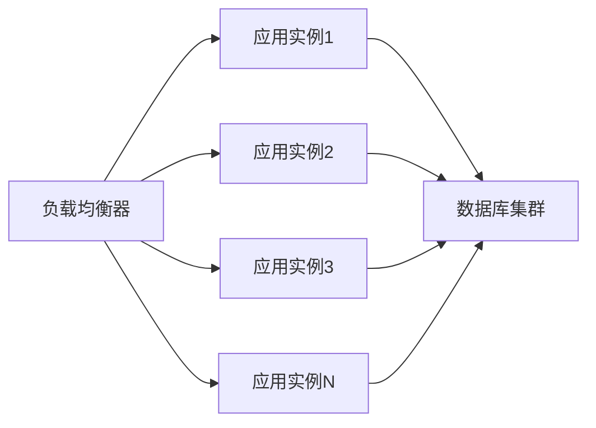
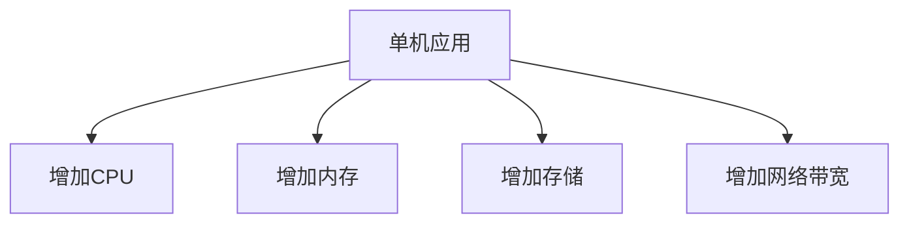
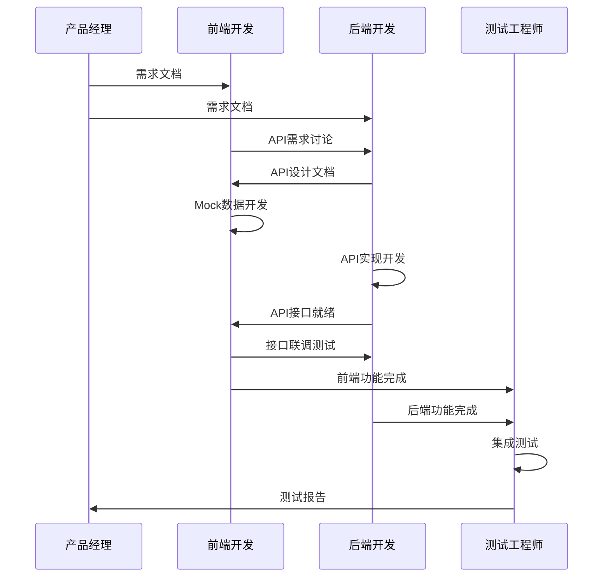
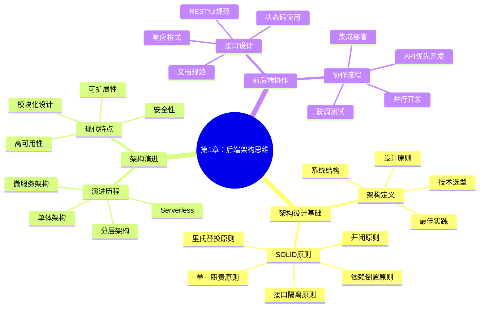
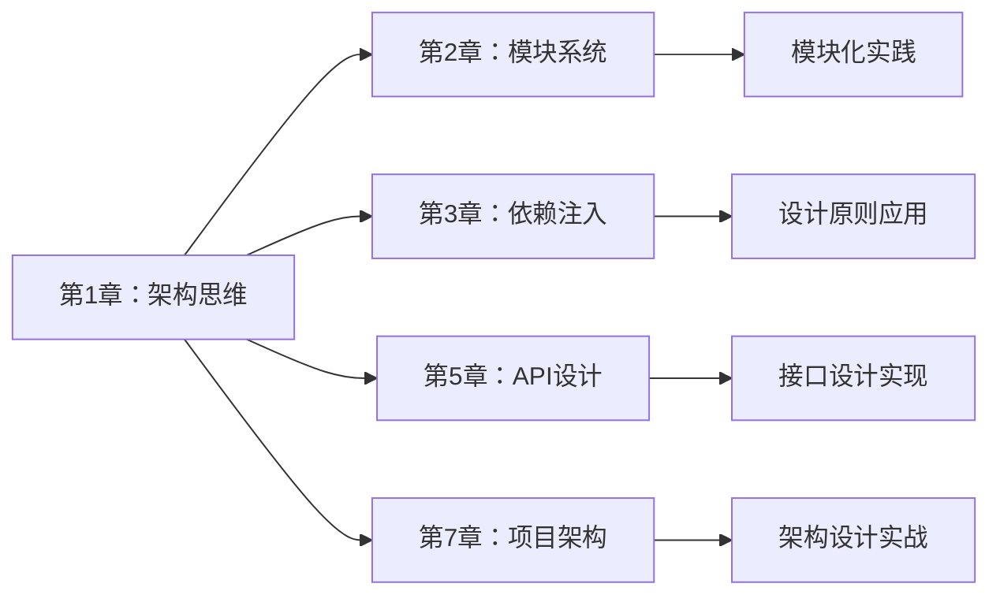
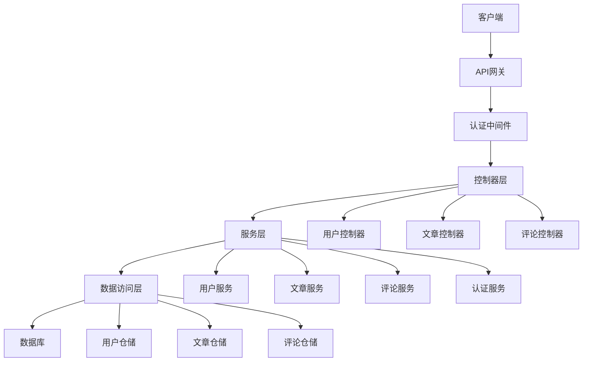

# 第1章 后端架构思维导引

> **从前端视角理解后端架构** - 构建完整的全栈开发思维体系

## 📚 本章学习目标

### 🎯 知识目标
- [ ] **理解架构思维**：能够从整体角度理解后端架构的设计理念和原则
- [ ] **掌握核心概念**：理解后端开发中的关键概念和术语
- [ ] **建立知识体系**：构建完整的后端开发知识体系框架
- [ ] **掌握设计方法**：学会运用架构设计方法解决实际问题
- [ ] **培养工程思维**：建立工程化的后端开发思维方式

### 🛠️ 技能目标
- [ ] 能够分析和评估不同架构模式的优缺点
- [ ] 能够根据业务需求选择合适的架构方案
- [ ] 能够设计简单的后端系统架构
- [ ] 能够理解和应用SOLID设计原则

### ⏰ 学习时长
- **理论学习**：4-5小时
- **实践练习**：3-4小时
- **项目实战**：1-2小时
- **总计时长**：8-11小时

### 📋 前置知识检查
在开始本章学习前，请确保您已掌握以下知识：
- [ ] JavaScript基础语法和ES6+特性
- [ ] HTTP协议基础（请求方法、状态码、头部）
- [ ] 基本的计算机网络概念
- [ ] 面向对象编程基础概念

---

## 1.1 架构设计基础

### 1.1.1 什么是架构？

#### 💡 通俗易懂的定义

**架构就像建筑设计图纸**：
- 🏗️ **建筑师**设计房屋结构 → **架构师**设计软件结构
- 🧱 **砖瓦材料**组成房屋 → **模块组件**组成软件
- 🔧 **施工规范**保证质量 → **设计原则**保证代码质量
- 📐 **图纸指导施工** → **架构指导开发**

#### 🎯 核心概念图解



#### 🌍 现实应用场景举例

**场景1：电商平台后端架构**
```
用户下单流程：
前端页面 → API网关 → 用户服务 → 订单服务 → 库存服务 → 支付服务 → 数据库
```
- **挑战**：高并发、数据一致性、服务可用性
- **架构选择**：微服务架构 + 消息队列 + 分布式数据库

**场景2：内容管理系统（CMS）**
```
内容发布流程：
编辑器 → 内容API → 审核服务 → 存储服务 → CDN分发 → 用户访问
```
- **挑战**：内容管理、权限控制、性能优化
- **架构选择**：分层架构 + 缓存策略 + 权限系统

**场景3：实时聊天应用**
```
消息传递流程：
客户端 → WebSocket网关 → 消息服务 → 推送服务 → 存储服务
```
- **挑战**：实时性、消息可靠性、扩展性
- **架构选择**：事件驱动架构 + 消息队列 + 负载均衡

#### 🔍 深度解析

**架构设计的本质**：
1. **抽象化**：将复杂问题分解为简单问题
2. **模块化**：将大系统拆分为小模块
3. **标准化**：建立统一的接口和规范
4. **可扩展**：支持系统的持续演进

### 1.1.2 架构设计原则

#### 🏛️ SOLID原则详解

##### 1️⃣ 单一职责原则（SRP - Single Responsibility Principle）

**定义**：一个类只应该有一个引起它变化的原因。

**通俗理解**：每个类就像一个专业工人，只做一件事，做好一件事。

**❌ 违反原则的例子**：
```typescript
// 不好的设计：用户类承担了太多职责
class User {
  name: string;
  email: string;
  
  // 用户数据验证
  validateEmail(): boolean { /* ... */ }
  
  // 数据库操作
  save(): void { /* ... */ }
  
  // 邮件发送
  sendWelcomeEmail(): void { /* ... */ }
  
  // 密码加密
  hashPassword(): string { /* ... */ }
}
```

**✅ 遵循原则的例子**：
```typescript
// 好的设计：职责分离
class User {
  constructor(
    public name: string,
    public email: string
  ) {}
}

class UserValidator {
  validateEmail(email: string): boolean { /* ... */ }
  validateName(name: string): boolean { /* ... */ }
}

class UserRepository {
  save(user: User): Promise<void> { /* ... */ }
  findById(id: string): Promise<User> { /* ... */ }
}

class EmailService {
  sendWelcomeEmail(user: User): Promise<void> { /* ... */ }
}

class PasswordService {
  hashPassword(password: string): string { /* ... */ }
}
```

**💡 记忆口诀**：
> "一个类，一件事，变化原因要单一"

##### 2️⃣ 开闭原则（OCP - Open/Closed Principle）

**定义**：软件实体应该对扩展开放，对修改关闭。

**通俗理解**：就像手机的充电接口，可以插入不同品牌的充电器（扩展），但不需要改变手机本身（修改）。

**❌ 违反原则的例子**：
```typescript
// 不好的设计：每次添加新的支付方式都要修改现有代码
class PaymentProcessor {
  processPayment(amount: number, type: string) {
    if (type === 'credit_card') {
      // 信用卡支付逻辑
    } else if (type === 'paypal') {
      // PayPal支付逻辑
    } else if (type === 'alipay') {  // 新增支付方式需要修改这里
      // 支付宝支付逻辑
    }
  }
}
```

**✅ 遵循原则的例子**：
```typescript
// 好的设计：通过接口扩展，无需修改现有代码
interface PaymentMethod {
  process(amount: number): Promise<boolean>;
}

class CreditCardPayment implements PaymentMethod {
  async process(amount: number): Promise<boolean> {
    // 信用卡支付逻辑
    return true;
  }
}

class PayPalPayment implements PaymentMethod {
  async process(amount: number): Promise<boolean> {
    // PayPal支付逻辑
    return true;
  }
}

// 新增支付方式，无需修改现有代码
class AlipayPayment implements PaymentMethod {
  async process(amount: number): Promise<boolean> {
    // 支付宝支付逻辑
    return true;
  }
}

class PaymentProcessor {
  constructor(private paymentMethod: PaymentMethod) {}
  
  async processPayment(amount: number): Promise<boolean> {
    return this.paymentMethod.process(amount);
  }
}
```

**💡 记忆口诀**：
> "扩展开放修改关，接口抽象是关键"

##### 3️⃣ 里氏替换原则（LSP - Liskov Substitution Principle）

**定义**：子类必须能够替换其基类而不影响程序的正确性。

**通俗理解**：就像不同品牌的电池，只要规格相同，都能在同一个设备中正常工作。

**❌ 违反原则的例子**：
```typescript
// 不好的设计：子类改变了基类的行为契约
class Bird {
  fly(): void {
    console.log('鸟儿在飞翔');
  }
}

class Penguin extends Bird {
  fly(): void {
    throw new Error('企鹅不会飞！'); // 违反了基类的契约
  }
}

// 使用时会出现问题
function makeBirdFly(bird: Bird) {
  bird.fly(); // 如果传入企鹅，会抛出异常
}
```

**✅ 遵循原则的例子**：
```typescript
// 好的设计：正确的抽象层次
abstract class Bird {
  abstract move(): void;
}

class FlyingBird extends Bird {
  move(): void {
    this.fly();
  }
  
  private fly(): void {
    console.log('鸟儿在飞翔');
  }
}

class SwimmingBird extends Bird {
  move(): void {
    this.swim();
  }
  
  private swim(): void {
    console.log('鸟儿在游泳');
  }
}

class Eagle extends FlyingBird {}
class Penguin extends SwimmingBird {}

// 使用时不会有问题
function makeBirdMove(bird: Bird) {
  bird.move(); // 所有子类都能正确执行
}
```

**💡 记忆口诀**：
> "子类替换父类用，行为契约不能变"

##### 4️⃣ 接口隔离原则（ISP - Interface Segregation Principle）

**定义**：客户端不应该依赖它不需要的接口。

**通俗理解**：就像遥控器，电视遥控器不需要空调的功能按钮，各自独立更好用。

**❌ 违反原则的例子**：
```typescript
// 不好的设计：胖接口，强迫客户端依赖不需要的方法
interface Worker {
  work(): void;
  eat(): void;
  sleep(): void;
  program(): void;  // 不是所有工人都会编程
  design(): void;   // 不是所有工人都会设计
}

class Programmer implements Worker {
  work(): void { /* 编程工作 */ }
  eat(): void { /* 吃饭 */ }
  sleep(): void { /* 睡觉 */ }
  program(): void { /* 编程 */ }
  design(): void { 
    throw new Error('程序员不一定会设计'); // 被迫实现不需要的方法
  }
}
```

**✅ 遵循原则的例子**：
```typescript
// 好的设计：接口隔离，各司其职
interface Workable {
  work(): void;
}

interface Eatable {
  eat(): void;
}

interface Sleepable {
  sleep(): void;
}

interface Programmable {
  program(): void;
}

interface Designable {
  design(): void;
}

// 程序员只实现需要的接口
class Programmer implements Workable, Eatable, Sleepable, Programmable {
  work(): void { /* 工作 */ }
  eat(): void { /* 吃饭 */ }
  sleep(): void { /* 睡觉 */ }
  program(): void { /* 编程 */ }
}

// 设计师只实现需要的接口
class Designer implements Workable, Eatable, Sleepable, Designable {
  work(): void { /* 工作 */ }
  eat(): void { /* 吃饭 */ }
  sleep(): void { /* 睡觉 */ }
  design(): void { /* 设计 */ }
}
```

**💡 记忆口诀**：
> "接口要小不要大，客户需要啥给啥"

##### 5️⃣ 依赖倒置原则（DIP - Dependency Inversion Principle）

**定义**：高层模块不应该依赖低层模块，两者都应该依赖抽象。

**通俗理解**：就像插座和电器，电器不直接连接电线，而是通过标准插座接口。

**❌ 违反原则的例子**：
```typescript
// 不好的设计：高层模块直接依赖低层模块
class MySQLDatabase {
  save(data: any): void {
    console.log('保存到MySQL数据库');
  }
}

class UserService {
  private database = new MySQLDatabase(); // 直接依赖具体实现
  
  createUser(userData: any): void {
    // 业务逻辑
    this.database.save(userData);
  }
}
```

**✅ 遵循原则的例子**：
```typescript
// 好的设计：依赖抽象而不是具体实现
interface Database {
  save(data: any): Promise<void>;
}

class MySQLDatabase implements Database {
  async save(data: any): Promise<void> {
    console.log('保存到MySQL数据库');
  }
}

class MongoDatabase implements Database {
  async save(data: any): Promise<void> {
    console.log('保存到MongoDB数据库');
  }
}

class UserService {
  constructor(private database: Database) {} // 依赖抽象接口
  
  async createUser(userData: any): Promise<void> {
    // 业务逻辑
    await this.database.save(userData);
  }
}

// 使用时注入具体实现
const mysqlDb = new MySQLDatabase();
const userService = new UserService(mysqlDb);
```

**💡 记忆口诀**：
> "高层低层都依赖，抽象接口做中介"

#### 🧠 SOLID原则记忆法

**整体记忆口诀**：
> **S**ingle - 单一职责要记牢  
> **O**pen - 扩展开放修改少  
> **L**iskov - 子类替换无烦恼  
> **I**nterface - 接口隔离真正好  
> **D**ependency - 依赖倒置是法宝

#### ⚠️ 常见错误预警

1. **过度设计**：不要为了遵循原则而过度抽象
2. **原则冲突**：有时原则之间会有冲突，需要权衡
3. **生搬硬套**：要根据实际情况灵活应用
4. **忽略性能**：设计模式可能影响性能，需要考虑

---

## 1.2 后端架构演进

### 1.2.1 架构演进历程

#### 📈 演进时间轴



#### 🏗️ 架构模式对比

| 架构类型 | 优点 | 缺点 | 适用场景 | 技术栈示例 |
|---------|------|------|---------|-----------|
| **单体架构** | 开发简单<br>部署方便<br>测试容易 | 扩展困难<br>技术栈固定<br>团队协作难 | 小型项目<br>快速原型<br>初创团队 | Spring Boot<br>Django<br>Rails |
| **分层架构** | 职责清晰<br>易于维护<br>技术成熟 | 层间耦合<br>性能开销<br>扩展受限 | 企业应用<br>管理系统<br>传统项目 | .NET<br>Java EE<br>PHP框架 |
| **微服务架构** | 独立部署<br>技术多样<br>团队自治 | 复杂度高<br>运维困难<br>数据一致性 | 大型系统<br>高并发<br>快速迭代 | Spring Cloud<br>Kubernetes<br>Docker |
| **Serverless** | 无服务器<br>自动扩展<br>按需付费 | 冷启动<br>厂商锁定<br>调试困难 | 事件驱动<br>轻量应用<br>快速开发 | AWS Lambda<br>Azure Functions<br>Vercel |

#### 🔄 架构演进驱动因素



### 1.2.2 现代后端架构特点

#### 🎯 核心特性详解

##### 1️⃣ 模块化设计

**定义**：将系统分解为独立的、可重用的模块。

**实现方式**：
```typescript
// 用户模块
@Module({
  imports: [TypeOrmModule.forFeature([User])],
  controllers: [UserController],
  providers: [UserService, UserRepository],
  exports: [UserService]
})
export class UserModule {}

// 文章模块
@Module({
  imports: [
    TypeOrmModule.forFeature([Article]),
    UserModule  // 导入用户模块
  ],
  controllers: [ArticleController],
  providers: [ArticleService, ArticleRepository],
  exports: [ArticleService]
})
export class ArticleModule {}
```

**优势**：
- 🔧 **易于维护**：模块独立，修改影响范围小
- 🔄 **可重用性**：模块可在不同项目中复用
- 👥 **团队协作**：不同团队可并行开发不同模块
- 🧪 **易于测试**：可单独测试每个模块

##### 2️⃣ 可扩展性设计

**水平扩展（Scale Out）**：


**垂直扩展（Scale Up）**：


**扩展策略**：
- 📊 **数据分片**：将数据分布到多个数据库
- 🔄 **缓存策略**：使用Redis、Memcached等缓存
- 📡 **CDN加速**：静态资源分发网络
- 🔀 **负载均衡**：请求分发到多个服务器

##### 3️⃣ 高可用性保障

**可用性等级**：
- 🥉 **99%**：年停机时间 3.65天（基础级别）
- 🥈 **99.9%**：年停机时间 8.76小时（生产级别）
- 🥇 **99.99%**：年停机时间 52.56分钟（企业级别）
- 💎 **99.999%**：年停机时间 5.26分钟（电信级别）

**实现策略**：
```typescript
// 健康检查
@Controller('health')
export class HealthController {
  @Get()
  check() {
    return {
      status: 'ok',
      timestamp: new Date().toISOString(),
      uptime: process.uptime(),
      memory: process.memoryUsage()
    };
  }
}

// 熔断器模式
@Injectable()
export class CircuitBreakerService {
  private failureCount = 0;
  private lastFailureTime = 0;
  private state = 'CLOSED'; // CLOSED, OPEN, HALF_OPEN
  
  async callService(serviceCall: () => Promise<any>) {
    if (this.state === 'OPEN') {
      if (Date.now() - this.lastFailureTime > 60000) {
        this.state = 'HALF_OPEN';
      } else {
        throw new Error('Circuit breaker is OPEN');
      }
    }
    
    try {
      const result = await serviceCall();
      this.onSuccess();
      return result;
    } catch (error) {
      this.onFailure();
      throw error;
    }
  }
  
  private onSuccess() {
    this.failureCount = 0;
    this.state = 'CLOSED';
  }
  
  private onFailure() {
    this.failureCount++;
    this.lastFailureTime = Date.now();
    if (this.failureCount >= 5) {
      this.state = 'OPEN';
    }
  }
}
```

##### 4️⃣ 安全性设计

**安全层次模型**：
```mermaid
pyramid
    title 安全防护金字塔
    
    "应用安全" : "输入验证、权限控制、业务逻辑安全"
    "传输安全" : "HTTPS、证书管理、加密传输"
    "网络安全" : "防火墙、DDoS防护、入侵检测"
    "基础设施安全" : "服务器安全、操作系统加固、物理安全"
```

**安全实现**：
```typescript
// JWT认证
@Injectable()
export class AuthGuard implements CanActivate {
  constructor(private jwtService: JwtService) {}
  
  canActivate(context: ExecutionContext): boolean {
    const request = context.switchToHttp().getRequest();
    const token = this.extractTokenFromHeader(request);
    
    if (!token) {
      throw new UnauthorizedException();
    }
    
    try {
      const payload = this.jwtService.verify(token);
      request['user'] = payload;
    } catch {
      throw new UnauthorizedException();
    }
    
    return true;
  }
  
  private extractTokenFromHeader(request: Request): string | undefined {
    const [type, token] = request.headers.authorization?.split(' ') ?? [];
    return type === 'Bearer' ? token : undefined;
  }
}

// 输入验证
export class CreateUserDto {
  @IsEmail()
  @IsNotEmpty()
  email: string;
  
  @IsString()
  @MinLength(8)
  @Matches(/^(?=.*[a-z])(?=.*[A-Z])(?=.*\d)/, {
    message: '密码必须包含大小写字母和数字'
  })
  password: string;
  
  @IsString()
  @Length(2, 50)
  name: string;
}

// 权限控制
@Injectable()
export class RolesGuard implements CanActivate {
  constructor(private reflector: Reflector) {}
  
  canActivate(context: ExecutionContext): boolean {
    const requiredRoles = this.reflector.getAllAndOverride<Role[]>(
      ROLES_KEY,
      [context.getHandler(), context.getClass()]
    );
    
    if (!requiredRoles) {
      return true;
    }
    
    const { user } = context.switchToHttp().getRequest();
    return requiredRoles.some((role) => user.roles?.includes(role));
  }
}
```

---

## 1.3 前后端协作模式

### 1.3.1 接口设计规范

#### 🔗 RESTful API设计

**资源命名规范**：
```typescript
// ✅ 好的设计
GET    /api/users          // 获取用户列表
GET    /api/users/123      // 获取特定用户
POST   /api/users          // 创建用户
PUT    /api/users/123      // 更新用户
DELETE /api/users/123      // 删除用户

GET    /api/users/123/articles     // 获取用户的文章
POST   /api/users/123/articles     // 为用户创建文章

// ❌ 不好的设计
GET    /api/getUserList
POST   /api/createUser
GET    /api/user_detail?id=123
```

**HTTP状态码使用**：
```typescript
@Controller('users')
export class UserController {
  @Get()
  async findAll(): Promise<User[]> {
    // 200 OK - 成功返回数据
    return this.userService.findAll();
  }
  
  @Post()
  @HttpCode(201)  // 201 Created - 成功创建资源
  async create(@Body() createUserDto: CreateUserDto): Promise<User> {
    return this.userService.create(createUserDto);
  }
  
  @Get(':id')
  async findOne(@Param('id') id: string): Promise<User> {
    const user = await this.userService.findOne(id);
    if (!user) {
      throw new NotFoundException('用户不存在'); // 404 Not Found
    }
    return user;
  }
  
  @Put(':id')
  async update(
    @Param('id') id: string,
    @Body() updateUserDto: UpdateUserDto
  ): Promise<User> {
    try {
      return await this.userService.update(id, updateUserDto);
    } catch (error) {
      if (error.code === 'USER_NOT_FOUND') {
        throw new NotFoundException('用户不存在'); // 404
      }
      if (error.code === 'VALIDATION_ERROR') {
        throw new BadRequestException('数据验证失败'); // 400
      }
      throw new InternalServerErrorException('服务器内部错误'); // 500
    }
  }
  
  @Delete(':id')
  @HttpCode(204)  // 204 No Content - 成功删除，无返回内容
  async remove(@Param('id') id: string): Promise<void> {
    await this.userService.remove(id);
  }
}
```

#### 📋 统一响应格式

```typescript
// 统一响应格式定义
export interface ApiResponse<T = any> {
  success: boolean;
  data?: T;
  message: string;
  code: number;
  timestamp: string;
  path: string;
}

// 响应拦截器
@Injectable()
export class ResponseInterceptor<T> implements NestInterceptor<T, ApiResponse<T>> {
  intercept(
    context: ExecutionContext,
    next: CallHandler
  ): Observable<ApiResponse<T>> {
    const request = context.switchToHttp().getRequest();
    
    return next.handle().pipe(
      map(data => ({
        success: true,
        data,
        message: '操作成功',
        code: 200,
        timestamp: new Date().toISOString(),
        path: request.url
      }))
    );
  }
}

// 全局异常过滤器
@Catch()
export class AllExceptionsFilter implements ExceptionFilter {
  catch(exception: unknown, host: ArgumentsHost) {
    const ctx = host.switchToHttp();
    const response = ctx.getResponse<Response>();
    const request = ctx.getRequest<Request>();
    
    let status = 500;
    let message = '服务器内部错误';
    
    if (exception instanceof HttpException) {
      status = exception.getStatus();
      message = exception.message;
    }
    
    const errorResponse: ApiResponse = {
      success: false,
      message,
      code: status,
      timestamp: new Date().toISOString(),
      path: request.url
    };
    
    response.status(status).json(errorResponse);
  }
}
```

### 1.3.2 开发协作流程

#### 🔄 API优先开发流程



#### 📝 API文档规范

**使用Swagger自动生成文档**：
```typescript
// main.ts - Swagger配置
async function bootstrap() {
  const app = await NestFactory.create(AppModule);
  
  const config = new DocumentBuilder()
    .setTitle('博客系统API')
    .setDescription('博客系统后端接口文档')
    .setVersion('1.0')
    .addBearerAuth()
    .build();
    
  const document = SwaggerModule.createDocument(app, config);
  SwaggerModule.setup('api-docs', app, document);
  
  await app.listen(3000);
}

// 控制器文档注解
@ApiTags('用户管理')
@Controller('users')
export class UserController {
  @ApiOperation({ summary: '获取用户列表' })
  @ApiResponse({ 
    status: 200, 
    description: '成功获取用户列表',
    type: [User]
  })
  @ApiQuery({ 
    name: 'page', 
    required: false, 
    description: '页码',
    example: 1
  })
  @ApiQuery({ 
    name: 'limit', 
    required: false, 
    description: '每页数量',
    example: 10
  })
  @Get()
  async findAll(
    @Query('page') page = 1,
    @Query('limit') limit = 10
  ): Promise<User[]> {
    return this.userService.findAll({ page, limit });
  }
  
  @ApiOperation({ summary: '创建用户' })
  @ApiResponse({ 
    status: 201, 
    description: '用户创建成功',
    type: User
  })
  @ApiResponse({ 
    status: 400, 
    description: '请求参数错误'
  })
  @Post()
  async create(@Body() createUserDto: CreateUserDto): Promise<User> {
    return this.userService.create(createUserDto);
  }
}

// DTO文档注解
export class CreateUserDto {
  @ApiProperty({ 
    description: '用户邮箱',
    example: 'user@example.com'
  })
  @IsEmail()
  email: string;
  
  @ApiProperty({ 
    description: '用户密码',
    minLength: 8,
    example: 'Password123'
  })
  @IsString()
  @MinLength(8)
  password: string;
  
  @ApiProperty({ 
    description: '用户姓名',
    minLength: 2,
    maxLength: 50,
    example: '张三'
  })
  @IsString()
  @Length(2, 50)
  name: string;
}
```

---

## 📝 本章知识总结

### 🧠 核心概念思维导图



### 📊 知识点掌握检查表

#### 🎯 基础概念（必须掌握）
- [ ] 理解什么是软件架构
- [ ] 掌握SOLID五大设计原则
- [ ] 了解架构演进的历史和趋势
- [ ] 理解模块化设计的重要性

#### 🚀 进阶理解（建议掌握）
- [ ] 能够分析不同架构模式的优缺点
- [ ] 理解高可用性和可扩展性的实现方式
- [ ] 掌握RESTful API设计规范
- [ ] 了解前后端协作的最佳实践

#### 💎 专家级别（深度理解）
- [ ] 能够根据业务需求选择合适的架构
- [ ] 理解架构决策的权衡考虑
- [ ] 掌握架构重构的策略和方法
- [ ] 能够设计可演进的架构体系

### 🔗 与后续章节的关联



---

## 🎯 章节练习与实战

### 📝 情景模拟练习题

#### 练习1：架构选择题
**场景**：你正在为一个初创公司设计一个在线教育平台，预期用户量在1万以内，团队只有3个开发人员，需要快速上线。

**问题**：应该选择哪种架构模式？请说明理由。

**选项**：
A. 微服务架构
B. 单体架构  
C. 分层架构
D. Serverless架构

<details>
<summary>点击查看答案解析</summary>

**正确答案**：B. 单体架构

**解析**：
- **用户规模小**：1万用户量不需要复杂的分布式架构
- **团队规模小**：3人团队无法承担微服务的复杂度
- **快速上线**：单体架构开发和部署最简单
- **成本考虑**：初创公司需要控制基础设施成本

**架构建议**：
- 使用NestJS单体应用
- 采用分层架构组织代码
- 预留模块化接口，便于后续拆分
- 使用Docker容器化部署

</details>

#### 练习2：SOLID原则应用题
**场景**：设计一个通知系统，需要支持邮件、短信、微信推送等多种通知方式。

**问题**：请使用SOLID原则设计这个通知系统的类结构。

<details>
<summary>点击查看答案解析</summary>

**设计方案**：

```typescript
// 1. 单一职责原则 - 每个类只负责一种通知方式
interface NotificationChannel {
  send(message: string, recipient: string): Promise<boolean>;
}

class EmailNotification implements NotificationChannel {
  async send(message: string, recipient: string): Promise<boolean> {
    // 邮件发送逻辑
    console.log(`发送邮件到 ${recipient}: ${message}`);
    return true;
  }
}

class SmsNotification implements NotificationChannel {
  async send(message: string, recipient: string): Promise<boolean> {
    // 短信发送逻辑
    console.log(`发送短信到 ${recipient}: ${message}`);
    return true;
  }
}

// 2. 开闭原则 - 可扩展新的通知方式，无需修改现有代码
class WechatNotification implements NotificationChannel {
  async send(message: string, recipient: string): Promise<boolean> {
    // 微信推送逻辑
    console.log(`发送微信消息到 ${recipient}: ${message}`);
    return true;
  }
}

// 3. 依赖倒置原则 - 依赖抽象而不是具体实现
class NotificationService {
  constructor(private channels: NotificationChannel[]) {}
  
  async sendNotification(
    message: string, 
    recipient: string, 
    channelType: string
  ): Promise<boolean> {
    const channel = this.getChannel(channelType);
    return channel.send(message, recipient);
  }
  
  private getChannel(type: string): NotificationChannel {
    // 根据类型返回对应的通知渠道
    // 这里可以使用工厂模式或依赖注入
  }
}
```

**设计亮点**：
- 遵循单一职责：每个通知类只负责一种通知方式
- 遵循开闭原则：新增通知方式无需修改现有代码
- 遵循依赖倒置：服务类依赖抽象接口而不是具体实现

</details>

#### 练习3：API设计题
**场景**：为博客系统设计用户管理相关的RESTful API。

**要求**：
1. 设计完整的用户CRUD操作API
2. 包含用户文章管理功能
3. 遵循RESTful设计规范
4. 定义合适的HTTP状态码

<details>
<summary>点击查看答案解析</summary>

**API设计方案**：

```typescript
// 用户基础操作
GET    /api/users              // 获取用户列表
GET    /api/users/:id          // 获取特定用户信息
POST   /api/users              // 创建新用户
PUT    /api/users/:id          // 更新用户信息
DELETE /api/users/:id          // 删除用户

// 用户文章管理
GET    /api/users/:id/articles         // 获取用户的文章列表
POST   /api/users/:id/articles         // 为用户创建文章
GET    /api/users/:id/articles/:aid    // 获取用户的特定文章
PUT    /api/users/:id/articles/:aid    // 更新用户的文章
DELETE /api/users/:id/articles/:aid    // 删除用户的文章

// 用户关注关系
GET    /api/users/:id/following        // 获取用户关注列表
POST   /api/users/:id/following        // 关注其他用户
DELETE /api/users/:id/following/:fid   // 取消关注

GET    /api/users/:id/followers        // 获取用户粉丝列表

// 状态码使用
200 OK          - 成功获取数据
201 Created     - 成功创建资源
204 No Content  - 成功删除资源
400 Bad Request - 请求参数错误
401 Unauthorized - 未授权访问
403 Forbidden   - 权限不足
404 Not Found   - 资源不存在
409 Conflict    - 资源冲突（如邮箱已存在）
500 Internal Server Error - 服务器内部错误
```

**设计原则**：
- 使用名词表示资源，动词表示操作
- 嵌套资源表示层级关系
- 使用合适的HTTP方法和状态码
- 保持URL简洁和语义化

</details>

#### 练习4：架构重构题
**场景**：一个电商系统最初采用单体架构，现在面临以下问题：
- 用户量增长到100万，系统响应变慢
- 团队扩大到20人，代码冲突频繁
- 促销活动时系统经常崩溃
- 新功能开发周期越来越长

**问题**：请制定架构重构方案，说明重构步骤和注意事项。

<details>
<summary>点击查看答案解析</summary>

**重构方案**：

**第一阶段：垂直拆分（按业务领域）**
```
单体应用 → 多个业务模块
├── 用户服务 (User Service)
├── 商品服务 (Product Service)  
├── 订单服务 (Order Service)
├── 支付服务 (Payment Service)
└── 库存服务 (Inventory Service)
```

**第二阶段：水平拆分（按技术层次）**
```
每个服务内部分层：
├── API层 (Controller)
├── 业务层 (Service)
├── 数据层 (Repository)
└── 基础设施层 (Infrastructure)
```

**第三阶段：微服务化**
```
独立部署的微服务：
├── 用户微服务 + 用户数据库
├── 商品微服务 + 商品数据库
├── 订单微服务 + 订单数据库
├── 支付微服务 + 支付数据库
└── 库存微服务 + 库存数据库
```

**重构步骤**：
1. **数据库拆分**：先拆分数据库，建立服务边界
2. **接口梳理**：定义服务间的API接口
3. **逐步迁移**：一个服务一个服务地迁移
4. **监控完善**：建立完整的监控和日志系统
5. **灰度发布**：使用灰度发布降低风险

**注意事项**：
- **数据一致性**：使用分布式事务或最终一致性
- **服务通信**：选择合适的通信方式（HTTP/gRPC/消息队列）
- **配置管理**：使用配置中心统一管理配置
- **服务发现**：使用服务注册中心
- **容错处理**：实现熔断、重试、降级机制

</details>

#### 练习5：性能优化题
**场景**：一个新闻网站的API响应时间过长，用户抱怨页面加载慢。经过分析发现：
- 数据库查询平均耗时2秒
- 单个API请求需要查询多个表
- 热门文章被频繁访问
- 图片加载占用大量带宽

**问题**：请提出性能优化方案。

<details>
<summary>点击查看答案解析</summary>

**性能优化方案**：

**1. 数据库优化**
```sql
-- 添加索引
CREATE INDEX idx_article_category_id ON articles(category_id);
CREATE INDEX idx_article_created_at ON articles(created_at);
CREATE INDEX idx_article_status ON articles(status);

-- 查询优化
-- 原始查询（慢）
SELECT a.*, u.name as author_name, c.name as category_name 
FROM articles a 
LEFT JOIN users u ON a.author_id = u.id 
LEFT JOIN categories c ON a.category_id = c.id 
WHERE a.status = 'published' 
ORDER BY a.created_at DESC;

-- 优化后查询（快）
-- 1. 分页查询
SELECT a.*, u.name as author_name, c.name as category_name 
FROM articles a 
LEFT JOIN users u ON a.author_id = u.id 
LEFT JOIN categories c ON a.category_id = c.id 
WHERE a.status = 'published' 
ORDER BY a.created_at DESC 
LIMIT 20 OFFSET 0;

-- 2. 使用子查询优化
SELECT * FROM (
  SELECT id, title, summary, author_id, category_id, created_at 
  FROM articles 
  WHERE status = 'published' 
  ORDER BY created_at DESC 
  LIMIT 20
) a
LEFT JOIN users u ON a.author_id = u.id 
LEFT JOIN categories c ON a.category_id = c.id;
```

**2. 缓存策略**
```typescript
@Injectable()
export class ArticleService {
  constructor(
    private articleRepository: ArticleRepository,
    private cacheManager: Cache
  ) {}
  
  async getHotArticles(): Promise<Article[]> {
    const cacheKey = 'hot_articles';
    
    // 先从缓存获取
    let articles = await this.cacheManager.get<Article[]>(cacheKey);
    
    if (!articles) {
      // 缓存未命中，从数据库查询
      articles = await this.articleRepository.findHotArticles();
      
      // 存入缓存，5分钟过期
      await this.cacheManager.set(cacheKey, articles, 300);
    }
    
    return articles;
  }
  
  async getArticleById(id: string): Promise<Article> {
    const cacheKey = `article_${id}`;
    
    let article = await this.cacheManager.get<Article>(cacheKey);
    
    if (!article) {
      article = await this.articleRepository.findById(id);
      if (article) {
        // 热门文章缓存更长时间
        const ttl = article.isHot ? 3600 : 1800;
        await this.cacheManager.set(cacheKey, article, ttl);
      }
    }
    
    return article;
  }
}
```

**3. API优化**
```typescript
// 使用DTO减少数据传输
export class ArticleListDto {
  @Expose()
  id: string;
  
  @Expose()
  title: string;
  
  @Expose()
  summary: string;
  
  @Expose()
  @Transform(({ obj }) => obj.author.name)
  authorName: string;
  
  @Expose()
  @Transform(({ obj }) => obj.category.name)
  categoryName: string;
  
  @Expose()
  createdAt: Date;
  
  // 不暴露content字段，减少数据量
}

// 分页和过滤
@Controller('articles')
export class ArticleController {
  @Get()
  async findAll(
    @Query('page') page = 1,
    @Query('limit') limit = 20,
    @Query('category') category?: string,
    @Query('author') author?: string
  ): Promise<PaginatedResult<ArticleListDto>> {
    const options = {
      page: Math.max(1, page),
      limit: Math.min(100, Math.max(1, limit)), // 限制最大返回数量
      category,
      author
    };
    
    return this.articleService.findAllPaginated(options);
  }
}
```

**4. 图片优化**
```typescript
// 图片压缩和CDN
@Injectable()
export class ImageService {
  async uploadImage(file: Express.Multer.File): Promise<string> {
    // 1. 图片压缩
    const compressedBuffer = await sharp(file.buffer)
      .resize(800, 600, { fit: 'inside', withoutEnlargement: true })
      .jpeg({ quality: 80 })
      .toBuffer();
    
    // 2. 上传到CDN
    const filename = `${Date.now()}_${file.originalname}`;
    const cdnUrl = await this.cdnService.upload(filename, compressedBuffer);
    
    // 3. 生成不同尺寸的缩略图
    const thumbnailBuffer = await sharp(file.buffer)
      .resize(200, 150, { fit: 'cover' })
      .jpeg({ quality: 70 })
      .toBuffer();
    
    const thumbnailUrl = await this.cdnService.upload(
      `thumb_${filename}`, 
      thumbnailBuffer
    );
    
    return {
      original: cdnUrl,
      thumbnail: thumbnailUrl
    };
  }
}
```

**5. 监控和分析**
```typescript
// 性能监控中间件
@Injectable()
export class PerformanceMiddleware implements NestMiddleware {
  use(req: Request, res: Response, next: NextFunction) {
    const start = Date.now();
    
    res.on('finish', () => {
      const duration = Date.now() - start;
      
      // 记录慢查询
      if (duration > 1000) {
        console.warn(`Slow request: ${req.method} ${req.url} - ${duration}ms`);
      }
      
      // 发送到监控系统
      this.metricsService.recordApiDuration(req.url, duration);
    });
    
    next();
  }
}
```

**优化效果预期**：
- 数据库查询时间：2秒 → 200毫秒
- API响应时间：3秒 → 500毫秒
- 缓存命中率：0% → 80%
- 图片加载速度：提升50%

</details>

### 🚀 实战项目：简单博客系统架构设计

#### 项目概述
设计一个简单的博客系统后端架构，包含用户管理、文章管理、评论系统等核心功能。

#### 项目要求
1. **功能需求**：
   - 用户注册、登录、个人信息管理
   - 文章的创建、编辑、删除、查看
   - 文章分类和标签管理
   - 评论和回复功能
   - 文章搜索功能

2. **技术要求**：
   - 使用NestJS框架
   - 应用SOLID设计原则
   - 设计RESTful API
   - 考虑可扩展性和可维护性

3. **交付物**：
   - 系统架构图
   - 模块设计方案
   - API接口设计
   - 数据库设计
   - 核心代码实现

#### 分阶段实施计划

**第1阶段：架构设计（2小时）**
- [ ] 绘制系统架构图
- [ ] 设计模块结构
- [ ] 定义接口规范
- [ ] 设计数据模型

**第2阶段：核心实现（4小时）**
- [ ] 实现用户模块
- [ ] 实现文章模块
- [ ] 实现认证授权
- [ ] 实现基础API

**第3阶段：功能完善（2小时）**
- [ ] 实现评论功能
- [ ] 添加搜索功能
- [ ] 完善错误处理
- [ ] 编写API文档

#### 项目检查清单

**架构设计检查**：
- [ ] 模块职责清晰，符合单一职责原则
- [ ] 模块间依赖合理，符合依赖倒置原则
- [ ] 接口设计灵活，符合开闭原则
- [ ] 系统可扩展，支持后续功能添加

**代码质量检查**：
- [ ] 代码结构清晰，命名规范
- [ ] 错误处理完善，异常信息明确
- [ ] 输入验证严格，安全性考虑充分
- [ ] 注释完整，文档齐全

**功能完整性检查**：
- [ ] 所有API接口正常工作
- [ ] 数据验证和错误处理正确
- [ ] 认证授权机制有效
- [ ] 数据库操作正确

<details>
<summary>点击查看项目实现示例</summary>

**系统架构图**：


**模块结构设计**：
```
src/
├── modules/
│   ├── auth/           # 认证模块
│   │   ├── auth.controller.ts
│   │   ├── auth.service.ts
│   │   ├── auth.module.ts
│   │   └── guards/
│   ├── users/          # 用户模块
│   │   ├── user.controller.ts
│   │   ├── user.service.ts
│   │   ├── user.module.ts
│   │   ├── entities/
│   │   └── dto/
│   ├── articles/       # 文章模块
│   │   ├── article.controller.ts
│   │   ├── article.service.ts
│   │   ├── article.module.ts
│   │   ├── entities/
│   │   └── dto/
│   └── comments/       # 评论模块
│       ├── comment.controller.ts
│       ├── comment.service.ts
│       ├── comment.module.ts
│       ├── entities/
│       └── dto/
├── common/             # 公共模块
│   ├── filters/        # 异常过滤器
│   ├── interceptors/   # 拦截器
│   ├── guards/         # 守卫
│   └── decorators/     # 装饰器
└── config/             # 配置模块
    ├── database.config.ts
    └── app.config.ts
```

**核心代码实现**：

```typescript
// 用户实体
@Entity('users')
export class User {
  @PrimaryGeneratedColumn('uuid')
  id: string;
  
  @Column({ unique: true })
  email: string;
  
  @Column()
  password: string;
  
  @Column()
  name: string;
  
  @Column({ nullable: true })
  avatar: string;
  
  @OneToMany(() => Article, article => article.author)
  articles: Article[];
  
  @CreateDateColumn()
  createdAt: Date;
  
  @UpdateDateColumn()
  updatedAt: Date;
}

// 文章实体
@Entity('articles')
export class Article {
  @PrimaryGeneratedColumn('uuid')
  id: string;
  
  @Column()
  title: string;
  
  @Column('text')
  content: string;
  
  @Column({ nullable: true })
  summary: string;
  
  @ManyToOne(() => User, user => user.articles)
  author: User;
  
  @OneToMany(() => Comment, comment => comment.article)
  comments: Comment[];
  
  @Column({ default: 'draft' })
  status: 'draft' | 'published' | 'archived';
  
  @CreateDateColumn()
  createdAt: Date;
  
  @UpdateDateColumn()
  updatedAt: Date;
}

// 用户服务
@Injectable()
export class UserService {
  constructor(
    @InjectRepository(User)
    private userRepository: Repository<User>,
  ) {}
  
  async create(createUserDto: CreateUserDto): Promise<User> {
    const hashedPassword = await bcrypt.hash(createUserDto.password, 10);
    
    const user = this.userRepository.create({
      ...createUserDto,
      password: hashedPassword,
    });
    
    return this.userRepository.save(user);
  }
  
  async findByEmail(email: string): Promise<User | undefined> {
    return this.userRepository.findOne({ where: { email } });
  }
  
  async findById(id: string): Promise<User | undefined> {
    return this.userRepository.findOne({ 
      where: { id },
      relations: ['articles']
    });
  }
}

// 文章服务
@Injectable()
export class ArticleService {
  constructor(
    @InjectRepository(Article)
    private articleRepository: Repository<Article>,
  ) {}
  
  async create(createArticleDto: CreateArticleDto, authorId: string): Promise<Article> {
    const article = this.articleRepository.create({
      ...createArticleDto,
      author: { id: authorId },
    });
    
    return this.articleRepository.save(article);
  }
  
  async findAll(page = 1, limit = 10): Promise<[Article[], number]> {
    return this.articleRepository.findAndCount({
      where: { status: 'published' },
      relations: ['author'],
      order: { createdAt: 'DESC' },
      skip: (page - 1) * limit,
      take: limit,
    });
  }
  
  async findById(id: string): Promise<Article | undefined> {
    return this.articleRepository.findOne({
      where: { id },
      relations: ['author', 'comments'],
    });
  }
}

// 文章控制器
@ApiTags('文章管理')
@Controller('articles')
export class ArticleController {
  constructor(private readonly articleService: ArticleService) {}
  
  @ApiOperation({ summary: '获取文章列表' })
  @Get()
  async findAll(
    @Query('page') page = 1,
    @Query('limit') limit = 10,
  ) {
    const [articles, total] = await this.articleService.findAll(page, limit);
    
    return {
      data: articles,
      pagination: {
        page,
        limit,
        total,
        totalPages: Math.ceil(total / limit),
      },
    };
  }
  
  @ApiOperation({ summary: '创建文章' })
  @UseGuards(JwtAuthGuard)
  @Post()
  async create(
    @Body() createArticleDto: CreateArticleDto,
    @Request() req,
  ) {
    return this.articleService.create(createArticleDto, req.user.id);
  }
  
  @ApiOperation({ summary: '获取文章详情' })
  @Get(':id')
  async findOne(@Param('id') id: string) {
    const article = await this.articleService.findById(id);
    
    if (!article) {
      throw new NotFoundException('文章不存在');
    }
    
    return article;
  }
}
```

</details>

### 📊 自我评估量表

请根据您的学习情况，对以下技能进行自我评估（1-10分）：

| 技能项目 | 评分 | 说明 |
|---------|------|------|
| **架构思维理解** | ___/10 | 能够理解架构设计的重要性和基本原则 |
| **SOLID原则掌握** | ___/10 | 能够理解并应用SOLID五大设计原则 |
| **架构模式认知** | ___/10 | 了解不同架构模式的特点和适用场景 |
| **API设计能力** | ___/10 | 能够设计符合RESTful规范的API接口 |
| **问题分析能力** | ___/10 | 能够分析架构问题并提出解决方案 |
| **实践应用能力** | ___/10 | 能够将理论知识应用到实际项目中 |

**总分：___/60**

**评估标准**：
- **50-60分**：优秀，可以进入下一章学习
- **40-49分**：良好，建议复习薄弱环节后继续
- **30-39分**：及格，需要重点复习和练习
- **30分以下**：需要重新学习本章内容

### 📚 扩展阅读推荐

#### 📖 经典书籍
1. **《架构整洁之道》** - Robert C. Martin
   - 深入理解SOLID原则和架构设计
   - 适合有一定基础的开发者

2. **《设计模式：可复用面向对象软件的基础》** - GoF
   - 经典设计模式详解
   - 架构设计的理论基础

3. **《微服务架构设计模式》** - Chris Richardson
   - 微服务架构的权威指南
   - 适合进阶学习

#### 🌐 在线资源
1. **NestJS官方文档**：https://nestjs.com/
   - 最权威的NestJS学习资源
   - 包含完整的API文档和示例

2. **Martin Fowler的博客**：https://martinfowler.com/
   - 软件架构大师的思考
   - 架构模式和最佳实践

3. **阮一峰的网络日志**：https://www.ruanyifeng.com/blog/
   - 技术概念的通俗解释
   - 适合初学者理解

#### 🎥 视频教程
1. **YouTube - NestJS Course for Beginners**
   - 英文教程，内容全面
   - 适合英语基础好的学习者

2. **B站 - NestJS从入门到实战**
   - 中文教程，易于理解
   - 包含实际项目案例

#### 🛠️ 实践工具
1. **Postman**：API测试工具
2. **Swagger UI**：API文档生成工具
3. **Draw.io**：架构图绘制工具
4. **PlantUML**：代码化的图表工具

### 💡 Anki记忆卡片建议

#### 基础概念卡片
**正面**：什么是软件架构？
**背面**：软件架构是系统的整体结构和组织方式，包括系统结构、技术选型、设计原则和最佳实践四个方面。

**正面**：SOLID原则包含哪五个原则？
**背面**：
- S - 单一职责原则（SRP）
- O - 开闭原则（OCP）
- L - 里氏替换原则（LSP）
- I - 接口隔离原则（ISP）
- D - 依赖倒置原则（DIP）

#### 代码模式卡片
**正面**：如何实现依赖注入？
**背面**：
```typescript
// 定义接口
interface UserRepository {
  save(user: User): Promise<void>;
}

// 实现类
class DatabaseUserRepository implements UserRepository {
  async save(user: User): Promise<void> { /* ... */ }
}

// 服务类依赖接口
class UserService {
  constructor(private userRepo: UserRepository) {}
}
```

#### 问题解决卡片
**正面**：如何选择合适的架构模式？
**背面**：考虑因素：
1. 团队规模和技能水平
2. 系统复杂度和用户规模
3. 性能和可用性要求
4. 开发和维护成本
5. 技术栈和基础设施

---

> **🎯 本章学习完成标志**：
> 
> 当您能够：
> 1. 清楚解释什么是软件架构及其重要性
> 2. 熟练应用SOLID五大设计原则
> 3. 分析不同架构模式的优缺点
> 4. 设计符合RESTful规范的API接口
> 5. 完成简单博客系统的架构设计
> 
> 恭喜您已经掌握了后端架构的基础思维，可以继续学习第2章《NestJS模块系统详解》！

---

**下一章预告**：在第2章中，我们将深入学习NestJS的模块系统，了解如何通过模块化设计构建可维护的后端应用。我们会学习模块的定义、配置、依赖关系，以及模块间的通信机制。 