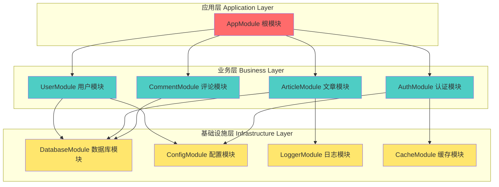
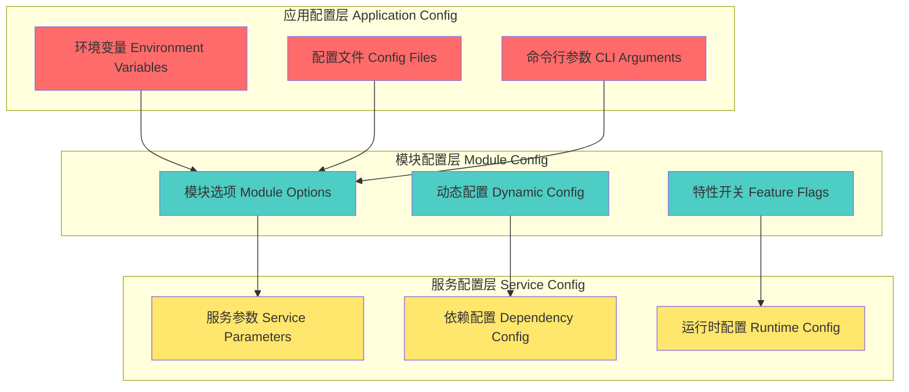

# 第2章 NestJS模块系统详解

> **模块化设计的艺术** - 从组件化思维到企业级模块架构

## 📚 本章学习目标

### 🎯 知识目标
- [ ] **模块化设计理念**：深入理解NestJS模块系统的设计哲学和架构思想
- [ ] **组件通信机制**：掌握模块间、组件间的通信方式和最佳实践
- [ ] **依赖管理策略**：学会管理复杂的模块依赖关系和注入机制
- [ ] **模块配置管理**：掌握模块的配置、组织和生命周期管理

### 🛠️ 技能目标
- [ ] 能够设计合理的模块架构和层次关系
- [ ] 能够实现高效的模块间通信和数据流转
- [ ] 能够处理复杂的依赖关系和循环依赖问题
- [ ] 能够优化模块性能和可维护性

### ⏰ 学习时长
- **模块思维建立**：2-3小时
- **依赖关系掌握**：2-3小时  
- **配置管理实践**：2-3小时
- **通信机制应用**：2-3小时
- **总计时长**：8-12小时

### 📋 前置知识检查
在开始本章学习前，请确保您已掌握以下知识：
- [ ] 第1章：后端架构思维导引（必须完成）
- [ ] TypeScript基础和装饰器概念（前置知识）
- [ ] 面向对象编程的模块化思想
- [ ] 依赖注入的基本概念

---

## 🧩 2.1 模块思维：理解模块化的设计理念

### 💡 核心思想：模块是软件架构的"乐高积木"

> **通俗理解**：如果把软件系统比作一座城市，那么模块就像城市中的不同功能区域（商业区、住宅区、工业区）。每个区域有明确的职责，通过道路（接口）相互连接，既保持独立又协同工作。

### 🌍 现实应用场景

1. **微信生态系统**：朋友圈、支付、小程序等模块
   - 每个功能模块独立开发和维护
   - 模块间通过统一的接口通信
   - 用户数据在模块间安全共享

2. **淘宝电商平台**：用户、商品、订单、支付模块
   - 模块化支撑海量用户和交易
   - 不同团队负责不同模块
   - 模块可以独立升级和扩展

3. **企业ERP系统**：财务、人事、库存、销售模块
   - 业务模块对应组织架构
   - 数据在模块间有序流转
   - 权限控制精确到模块级别

### 2.1.1 NestJS模块系统架构图解



### 2.1.2 模块化设计的核心原则

#### 🎯 单一职责原则（SRP）在模块中的应用

> **生活类比**：就像厨房里的不同工具，刀用来切菜，锅用来炒菜，每个工具都有明确的职责。模块也应该有明确的业务边界。

```typescript
// 🎯 思想解读：模块职责划分的艺术
// 问题：如何确定模块的边界和职责？
// 解决：按业务领域和数据聚合根划分模块

// ✅ 正确的模块职责划分
@Module({
  // 用户模块：只负责用户相关的业务逻辑
  providers: [
    UserService,        // 用户业务逻辑
    UserRepository,     // 用户数据访问
    UserValidator,      // 用户数据验证
    UserTransformer,    // 用户数据转换
  ],
  controllers: [UserController],
  exports: [UserService], // 只导出核心服务
})
export class UserModule {}

@Module({
  // 文章模块：只负责文章相关的业务逻辑
  providers: [
    ArticleService,
    ArticleRepository,
    ArticleSearchService,
    ArticleStatisticsService,
  ],
  controllers: [ArticleController],
  exports: [ArticleService],
})
export class ArticleModule {}

// ❌ 错误的模块设计：职责混乱
@Module({
  providers: [
    UserService,
    ArticleService,     // 不应该在用户模块中
    EmailService,       // 应该在通信模块中
    PaymentService,     // 应该在支付模块中
  ],
})
export class BadUserModule {} // 违反单一职责原则
```

#### 🔗 模块间的依赖关系设计

> **建筑类比**：模块间的依赖就像建筑的地基和楼层关系。地基模块（基础设施）支撑业务模块，业务模块之间保持松耦合。

```typescript
// 🌟 现实应用场景：博客系统的模块依赖设计

// 基础设施模块：为其他模块提供基础服务
@Module({
  imports: [
    TypeOrmModule.forRoot({
      type: 'postgres',
      host: 'localhost',
      port: 5432,
      database: 'blog',
    }),
  ],
  exports: [TypeOrmModule], // 导出数据库连接
})
export class DatabaseModule {}

@Module({
  imports: [
    ConfigModule.forRoot({
      isGlobal: true, // 全局配置模块
    }),
  ],
  exports: [ConfigModule],
})
export class CoreConfigModule {}

// 业务模块：实现具体的业务逻辑
@Module({
  imports: [
    DatabaseModule,           // 依赖数据库模块
    TypeOrmModule.forFeature([User]), // 注册用户实体
  ],
  providers: [UserService, UserRepository],
  controllers: [UserController],
  exports: [UserService],     // 导出服务供其他模块使用
})
export class UserModule {}

@Module({
  imports: [
    DatabaseModule,           // 依赖数据库模块
    UserModule,              // 依赖用户模块（获取作者信息）
    TypeOrmModule.forFeature([Article]),
  ],
  providers: [ArticleService, ArticleRepository],
  controllers: [ArticleController],
  exports: [ArticleService],
})
export class ArticleModule {}

@Module({
  imports: [
    UserModule,              // 需要验证用户身份
    ArticleModule,           // 需要关联文章
    TypeOrmModule.forFeature([Comment]),
  ],
  providers: [CommentService],
  controllers: [CommentController],
  exports: [CommentService],
})
export class CommentModule {}

// 应用根模块：组装所有模块
@Module({
  imports: [
    CoreConfigModule,        // 全局配置
    DatabaseModule,          // 数据库连接
    UserModule,              // 用户功能
    ArticleModule,           // 文章功能
    CommentModule,           // 评论功能
  ],
})
export class AppModule {}
```

#### 🧠 记忆技巧和最佳实践

**模块设计的"SOLID"原则**：
- **S**ingle Responsibility：一个模块只负责一个业务领域
- **O**pen/Closed：模块对扩展开放，对修改关闭
- **L**iskov Substitution：模块可以被其实现替换
- **I**nterface Segregation：模块接口应该精简和专一
- **D**ependency Inversion：模块应该依赖抽象而非具体实现

**记忆口诀**：
> "模块职责要单一，依赖关系要清晰，接口设计要简洁，扩展修改要容易"

### 2.1.3 模块的生命周期和作用域

#### 🔄 模块生命周期管理

```typescript
// 🎯 思想解读：模块生命周期的重要性
// 问题：如何管理模块的初始化、运行和销毁？
// 解决：通过生命周期钩子和作用域控制

@Module({
  providers: [
    {
      provide: 'DATABASE_CONNECTION',
      useFactory: async (configService: ConfigService) => {
        // 模块初始化时建立数据库连接
        const connection = await createConnection({
          type: 'postgres',
          host: configService.get('DB_HOST'),
          port: configService.get('DB_PORT'),
          database: configService.get('DB_NAME'),
        });
        
        console.log('📊 数据库连接已建立');
        return connection;
      },
      inject: [ConfigService],
    },
    {
      provide: UserService,
      useClass: UserService,
      scope: Scope.REQUEST, // 请求作用域：每个请求创建新实例
    },
    {
      provide: CacheService,
      useClass: CacheService,
      scope: Scope.DEFAULT, // 默认作用域：单例模式
    },
  ],
})
export class UserModule implements OnModuleInit, OnModuleDestroy {
  
  // 模块初始化钩子
  async onModuleInit() {
    console.log('🚀 UserModule 初始化完成');
    // 执行模块初始化逻辑
    await this.initializeUserData();
  }
  
  // 模块销毁钩子
  async onModuleDestroy() {
    console.log('🔚 UserModule 正在销毁');
    // 执行清理逻辑
    await this.cleanupResources();
  }
  
  private async initializeUserData() {
    // 初始化用户数据，如创建默认管理员账户
  }
  
  private async cleanupResources() {
    // 清理资源，如关闭数据库连接
  }
}
```

#### 📊 模块作用域对比

| 作用域类型 | 生命周期 | 使用场景 | 性能影响 | 内存占用 |
|------------|----------|----------|----------|----------|
| **DEFAULT** | 应用启动到结束 | 无状态服务、工具类 | 最佳 | 低 |
| **REQUEST** | 单个请求期间 | 需要请求上下文的服务 | 中等 | 中等 |
| **TRANSIENT** | 每次注入时创建 | 有状态的临时对象 | 较差 | 高 |

```typescript
// 🌟 现实应用场景：不同作用域的使用示例

// 默认作用域：配置服务（全局单例）
@Injectable({ scope: Scope.DEFAULT })
export class ConfigService {
  private readonly config: Record<string, any>;
  
  constructor() {
    this.config = this.loadConfig();
  }
  
  get(key: string): any {
    return this.config[key];
  }
}

// 请求作用域：用户上下文服务（每个请求独立）
@Injectable({ scope: Scope.REQUEST })
export class UserContextService {
  private currentUser: User;
  
  setCurrentUser(user: User) {
    this.currentUser = user;
  }
  
  getCurrentUser(): User {
    return this.currentUser;
  }
}

// 瞬态作用域：文件处理服务（每次使用都创建新实例）
@Injectable({ scope: Scope.TRANSIENT })
export class FileProcessorService {
  private processingState: ProcessingState;
  
  processFile(file: File): Promise<ProcessedFile> {
    this.processingState = new ProcessingState();
    // 处理文件逻辑
    return this.doProcess(file);
  }
}
```

---

## 🎛️ 2.3 配置管理：学会模块的配置和组织

### 💡 核心思想：配置是模块的"说明书"

> **通俗理解**：模块配置就像家电的说明书，告诉你如何正确安装、连接和使用这个"设备"。好的配置设计让模块既灵活又易用。

### 🌍 现实应用场景

1. **云服务配置**：阿里云、腾讯云的服务配置
   - 不同环境（开发、测试、生产）使用不同配置
   - 配置热更新，无需重启服务
   - 配置版本管理和回滚机制

2. **微服务配置中心**：Spring Cloud Config、Nacos
   - 集中管理所有服务的配置
   - 配置变更实时推送到各个服务
   - 配置权限控制和审计日志

### 2.3.1 模块配置的层次结构

#### 🏗️ 配置的三层架构



#### 🌟 现实应用场景：多环境配置管理

```typescript
// 🎯 思想解读：如何设计灵活的模块配置系统
// 问题：不同环境需要不同配置，如何统一管理？
// 解决：分层配置 + 环境隔离 + 动态加载

// 配置接口定义
interface DatabaseConfig {
  type: 'postgres' | 'mysql' | 'sqlite';
  host: string;
  port: number;
  database: string;
  username: string;
  password: string;
  ssl?: boolean;
  poolSize?: number;
  timeout?: number;
}

interface RedisConfig {
  host: string;
  port: number;
  password?: string;
  db?: number;
  keyPrefix?: string;
}

interface AppConfig {
  port: number;
  environment: 'development' | 'testing' | 'production';
  database: DatabaseConfig;
  redis: RedisConfig;
  jwt: {
    secret: string;
    expiresIn: string;
  };
  upload: {
    maxFileSize: number;
    allowedTypes: string[];
    destination: string;
  };
}

// 配置加载器
@Injectable()
export class ConfigLoader {
  private config: AppConfig;
  
  constructor() {
    this.config = this.loadConfig();
  }
  
  private loadConfig(): AppConfig {
    const env = process.env.NODE_ENV || 'development';
    
    // 基础配置
    const baseConfig: Partial<AppConfig> = {
      port: parseInt(process.env.PORT) || 3000,
      environment: env as any,
    };
    
    // 环境特定配置
    const envConfig = this.loadEnvironmentConfig(env);
    
    // 合并配置
    return {
      ...baseConfig,
      ...envConfig,
    } as AppConfig;
  }
  
  private loadEnvironmentConfig(env: string): Partial<AppConfig> {
    switch (env) {
      case 'development':
        return {
          database: {
            type: 'sqlite',
            host: 'localhost',
            port: 0,
            database: 'blog_dev.db',
            username: '',
            password: '',
          },
          redis: {
            host: 'localhost',
            port: 6379,
            db: 0,
          },
          jwt: {
            secret: 'dev-secret-key',
            expiresIn: '7d',
          },
          upload: {
            maxFileSize: 5 * 1024 * 1024, // 5MB
            allowedTypes: ['image/jpeg', 'image/png', 'image/gif'],
            destination: './uploads/dev',
          },
        };
        
      case 'testing':
        return {
          database: {
            type: 'sqlite',
            host: 'localhost',
            port: 0,
            database: ':memory:', // 内存数据库
            username: '',
            password: '',
          },
          redis: {
            host: 'localhost',
            port: 6379,
            db: 1, // 使用不同的数据库
          },
          jwt: {
            secret: 'test-secret-key',
            expiresIn: '1h',
          },
          upload: {
            maxFileSize: 1 * 1024 * 1024, // 1MB
            allowedTypes: ['image/jpeg'],
            destination: './uploads/test',
          },
        };
        
      case 'production':
        return {
          database: {
            type: 'postgres',
            host: process.env.DB_HOST,
            port: parseInt(process.env.DB_PORT),
            database: process.env.DB_NAME,
            username: process.env.DB_USERNAME,
            password: process.env.DB_PASSWORD,
            ssl: true,
            poolSize: 20,
            timeout: 30000,
          },
          redis: {
            host: process.env.REDIS_HOST,
            port: parseInt(process.env.REDIS_PORT),
            password: process.env.REDIS_PASSWORD,
            db: 0,
            keyPrefix: 'blog:',
          },
          jwt: {
            secret: process.env.JWT_SECRET,
            expiresIn: '24h',
          },
          upload: {
            maxFileSize: 10 * 1024 * 1024, // 10MB
            allowedTypes: ['image/jpeg', 'image/png', 'image/gif', 'image/webp'],
            destination: process.env.UPLOAD_PATH || './uploads/prod',
          },
        };
        
      default:
        throw new Error(`未知的环境: ${env}`);
    }
  }
  
  getConfig(): AppConfig {
    return this.config;
  }
  
  get<T extends keyof AppConfig>(key: T): AppConfig[T] {
    return this.config[key];
  }
}

// 配置模块
@Module({
  providers: [
    ConfigLoader,
    {
      provide: 'APP_CONFIG',
      useFactory: (configLoader: ConfigLoader) => configLoader.getConfig(),
      inject: [ConfigLoader],
    },
  ],
  exports: [ConfigLoader, 'APP_CONFIG'],
  global: true, // 全局模块，所有模块都可以使用
})
export class ConfigModule {}
```

#### 🔧 动态模块配置

```typescript
// 🌟 高级特性：动态模块配置和特性开关

// 特性开关配置
interface FeatureFlags {
  enableUserRegistration: boolean;
  enableEmailNotification: boolean;
  enableFileUpload: boolean;
  enableSocialLogin: boolean;
  enableAdvancedSearch: boolean;
}

// 动态配置模块
@Module({})
export class DynamicConfigModule {
  static forRoot(options: {
    configPath?: string;
    enableHotReload?: boolean;
    features?: Partial<FeatureFlags>;
  }): DynamicModule {
    
    const providers = [
      {
        provide: 'CONFIG_OPTIONS',
        useValue: options,
      },
      {
        provide: 'FEATURE_FLAGS',
        useValue: {
          enableUserRegistration: true,
          enableEmailNotification: true,
          enableFileUpload: true,
          enableSocialLogin: false,
          enableAdvancedSearch: false,
          ...options.features,
        } as FeatureFlags,
      },
      ConfigService,
    ];
    
    // 如果启用热重载，添加配置监听器
    if (options.enableHotReload) {
      providers.push({
        provide: 'CONFIG_WATCHER',
        useFactory: (configService: ConfigService) => {
          return new ConfigWatcher(configService, options.configPath);
        },
        inject: [ConfigService],
      });
    }
    
    return {
      module: DynamicConfigModule,
      providers,
      exports: providers,
      global: true,
    };
  }
}

// 配置服务
@Injectable()
export class ConfigService {
  constructor(
    @Inject('APP_CONFIG') private readonly appConfig: AppConfig,
    @Inject('FEATURE_FLAGS') private readonly featureFlags: FeatureFlags,
  ) {}
  
  // 获取应用配置
  getAppConfig(): AppConfig {
    return this.appConfig;
  }
  
  // 获取数据库配置
  getDatabaseConfig(): DatabaseConfig {
    return this.appConfig.database;
  }
  
  // 获取Redis配置
  getRedisConfig(): RedisConfig {
    return this.appConfig.redis;
  }
  
  // 检查特性是否启用
  isFeatureEnabled(feature: keyof FeatureFlags): boolean {
    return this.featureFlags[feature];
  }
  
  // 获取所有特性开关
  getFeatureFlags(): FeatureFlags {
    return this.featureFlags;
  }
  
  // 动态更新特性开关
  updateFeatureFlag(feature: keyof FeatureFlags, enabled: boolean): void {
    this.featureFlags[feature] = enabled;
    console.log(`🔧 特性 ${feature} 已${enabled ? '启用' : '禁用'}`);
  }
}

// 配置监听器（热重载）
export class ConfigWatcher {
  private watcher: FSWatcher;
  
  constructor(
    private readonly configService: ConfigService,
    private readonly configPath: string,
  ) {
    this.startWatching();
  }
  
  private startWatching(): void {
    if (!this.configPath) return;
    
    this.watcher = watch(this.configPath, (eventType, filename) => {
      if (eventType === 'change') {
        console.log(`📝 配置文件 ${filename} 已更改，重新加载配置...`);
        this.reloadConfig();
      }
    });
    
    console.log(`👀 开始监听配置文件: ${this.configPath}`);
  }
  
  private reloadConfig(): void {
    try {
      // 重新加载配置文件
      const newConfig = JSON.parse(readFileSync(this.configPath, 'utf8'));
      
      // 更新特性开关
      if (newConfig.features) {
        Object.keys(newConfig.features).forEach(feature => {
          this.configService.updateFeatureFlag(
            feature as keyof FeatureFlags,
            newConfig.features[feature]
          );
        });
      }
      
      console.log('✅ 配置重新加载成功');
    } catch (error) {
      console.error('❌ 配置重新加载失败:', error.message);
    }
  }
  
  destroy(): void {
    if (this.watcher) {
      this.watcher.close();
      console.log('🔚 配置监听器已关闭');
    }
  }
}
```

### 2.3.2 模块组织策略

#### 📁 模块目录结构设计

```typescript
// 🎯 思想解读：如何组织模块的文件结构
// 问题：模块文件越来越多，如何保持清晰的结构？
// 解决：按功能分层 + 统一命名规范 + 清晰的依赖关系

/*
博客系统模块组织结构：

src/
├── app.module.ts                 # 应用根模块
├── main.ts                       # 应用入口
├── common/                       # 公共模块
│   ├── config/                   # 配置模块
│   │   ├── config.module.ts
│   │   ├── config.service.ts
│   │   └── config.interface.ts
│   ├── database/                 # 数据库模块
│   │   ├── database.module.ts
│   │   ├── database.service.ts
│   │   └── database.config.ts
│   ├── cache/                    # 缓存模块
│   │   ├── cache.module.ts
│   │   ├── cache.service.ts
│   │   └── cache.interface.ts
│   └── logger/                   # 日志模块
│       ├── logger.module.ts
│       ├── logger.service.ts
│       └── logger.config.ts
├── modules/                      # 业务模块
│   ├── auth/                     # 认证模块
│   │   ├── auth.module.ts
│   │   ├── auth.controller.ts
│   │   ├── auth.service.ts
│   │   ├── strategies/           # 认证策略
│   │   │   ├── jwt.strategy.ts
│   │   │   └── local.strategy.ts
│   │   ├── guards/               # 守卫
│   │   │   ├── jwt-auth.guard.ts
│   │   │   └── roles.guard.ts
│   │   ├── decorators/           # 装饰器
│   │   │   ├── roles.decorator.ts
│   │   │   └── current-user.decorator.ts
│   │   └── dto/                  # 数据传输对象
│   │       ├── login.dto.ts
│   │       └── register.dto.ts
│   ├── user/                     # 用户模块
│   │   ├── user.module.ts
│   │   ├── user.controller.ts
│   │   ├── user.service.ts
│   │   ├── user.repository.ts
│   │   ├── entities/
│   │   │   ├── user.entity.ts
│   │   │   └── user-profile.entity.ts
│   │   ├── dto/
│   │   │   ├── create-user.dto.ts
│   │   │   ├── update-user.dto.ts
│   │   │   └── user-response.dto.ts
│   │   └── interfaces/
│   │       └── user.interface.ts
│   ├── article/                  # 文章模块
│   │   ├── article.module.ts
│   │   ├── article.controller.ts
│   │   ├── article.service.ts
│   │   ├── article.repository.ts
│   │   ├── entities/
│   │   │   └── article.entity.ts
│   │   ├── dto/
│   │   │   ├── create-article.dto.ts
│   │   │   ├── update-article.dto.ts
│   │   │   └── article-query.dto.ts
│   │   └── interfaces/
│   │       └── article.interface.ts
│   └── comment/                  # 评论模块
│       ├── comment.module.ts
│       ├── comment.controller.ts
│       ├── comment.service.ts
│       ├── comment.repository.ts
│       ├── entities/
│       │   └── comment.entity.ts
│       └── dto/
│           ├── create-comment.dto.ts
│           └── update-comment.dto.ts
└── shared/                       # 共享模块
    ├── interfaces/               # 共享接口
    ├── enums/                    # 枚举定义
    ├── constants/                # 常量定义
    ├── utils/                    # 工具函数
    └── types/                    # 类型定义
*/

// 模块组织的最佳实践
@Module({
  imports: [
    // 1. 首先导入基础设施模块
    ConfigModule,
    DatabaseModule,
    CacheModule,
    LoggerModule,
    
    // 2. 然后导入业务模块（按依赖顺序）
    AuthModule,
    UserModule,
    ArticleModule,
    CommentModule,
  ],
})
export class AppModule {}
```

#### 🔄 模块懒加载和按需加载

```typescript
// 🌟 高级特性：模块懒加载优化性能

// 懒加载模块接口
interface LazyModule {
  module: Type<any>;
  condition?: () => boolean;
  priority?: number;
}

// 模块加载器
@Injectable()
export class ModuleLoader {
  private loadedModules = new Set<string>();
  
  constructor(
    private readonly moduleRef: ModuleRef,
    @Inject('FEATURE_FLAGS') private readonly featureFlags: FeatureFlags,
  ) {}
  
  // 按需加载模块
  async loadModuleIfNeeded(moduleName: string, moduleClass: Type<any>): Promise<void> {
    if (this.loadedModules.has(moduleName)) {
      return; // 模块已加载
    }
    
    // 检查是否满足加载条件
    if (!this.shouldLoadModule(moduleName)) {
      console.log(`⏭️ 跳过模块加载: ${moduleName}`);
      return;
    }
    
    try {
      console.log(`🔄 开始加载模块: ${moduleName}`);
      
      // 动态导入模块
      const moduleRef = await this.moduleRef.create(moduleClass);
      
      this.loadedModules.add(moduleName);
      console.log(`✅ 模块加载成功: ${moduleName}`);
      
    } catch (error) {
      console.error(`❌ 模块加载失败: ${moduleName}`, error);
      throw error;
    }
  }
  
  private shouldLoadModule(moduleName: string): boolean {
    switch (moduleName) {
      case 'EmailModule':
        return this.featureFlags.enableEmailNotification;
      case 'UploadModule':
        return this.featureFlags.enableFileUpload;
      case 'SocialLoginModule':
        return this.featureFlags.enableSocialLogin;
      case 'SearchModule':
        return this.featureFlags.enableAdvancedSearch;
      default:
        return true; // 默认加载
    }
  }
  
  // 获取已加载的模块列表
  getLoadedModules(): string[] {
    return Array.from(this.loadedModules);
  }
  
  // 卸载模块
  async unloadModule(moduleName: string): Promise<void> {
    if (!this.loadedModules.has(moduleName)) {
      return;
    }
    
    // 执行模块清理逻辑
    console.log(`🗑️ 卸载模块: ${moduleName}`);
    this.loadedModules.delete(moduleName);
  }
}

// 条件模块装饰器
export function ConditionalModule(condition: () => boolean) {
  return function <T extends Type<any>>(target: T): T {
    const originalModule = target;
    
    // 创建包装模块
    @Module({})
    class ConditionalWrapper {
      static forRoot(): DynamicModule {
        if (condition()) {
          return {
            module: ConditionalWrapper,
            imports: [originalModule],
            exports: [originalModule],
          };
        } else {
          return {
            module: ConditionalWrapper,
            providers: [],
            exports: [],
          };
        }
      }
    }
    
    return ConditionalWrapper as any;
  };
}

// 使用条件模块
@ConditionalModule(() => process.env.ENABLE_EMAIL === 'true')
@Module({
  providers: [EmailService],
  exports: [EmailService],
})
export class EmailModule {}

@ConditionalModule(() => process.env.ENABLE_UPLOAD === 'true')
@Module({
  providers: [UploadService],
  controllers: [UploadController],
  exports: [UploadService],
})
export class UploadModule {}
```

---

## 🔄 2.4 通信机制：理解模块间的通信方式

### 💡 核心思想：通信机制是模块协作的"语言"

> **通俗理解**：模块间的通信就像不同部门之间的协作。有的通过邮件（异步消息），有的通过电话（同步调用），有的通过会议（事件广播），选择合适的通信方式能让协作更高效。

### 🌍 现实应用场景

1. **电商订单流程**：
   - 订单模块 → 库存模块：同步检查库存
   - 订单模块 → 支付模块：异步处理支付
   - 支付成功 → 发货模块：事件驱动发货

2. **社交媒体系统**：
   - 用户发布动态 → 推送给关注者（事件广播）
   - 点赞评论 → 实时通知（消息队列）
   - 内容审核 → 自动处理（异步任务）

### 2.4.1 同步通信：直接服务调用

#### 🔗 服务间的直接依赖注入

```typescript
// 🎯 思想解读：同步通信的适用场景
// 问题：什么时候使用同步通信？
// 解决：需要立即获得结果、数据一致性要求高的场景

// 🌟 现实应用场景：电商下单流程的同步通信

// 用户服务：提供用户验证
@Injectable()
export class UserService {
  constructor(
    private readonly userRepository: UserRepository,
  ) {}
  
  async validateUser(userId: number): Promise<User> {
    const user = await this.userRepository.findById(userId);
    if (!user) {
      throw new NotFoundException('用户不存在');
    }
    if (!user.isActive) {
      throw new ForbiddenException('用户账户已被禁用');
    }
    return user;
  }
  
  async getUserBalance(userId: number): Promise<number> {
    const user = await this.validateUser(userId);
    return user.balance;
  }
}

// 商品服务：提供商品信息
@Injectable()
export class ProductService {
  constructor(
    private readonly productRepository: ProductRepository,
  ) {}
  
  async validateProduct(productId: number, quantity: number): Promise<Product> {
    const product = await this.productRepository.findById(productId);
    if (!product) {
      throw new NotFoundException('商品不存在');
    }
    if (!product.isAvailable) {
      throw new BadRequestException('商品已下架');
    }
    if (product.stock < quantity) {
      throw new BadRequestException(`库存不足，当前库存：${product.stock}`);
    }
    return product;
  }
  
  async calculatePrice(productId: number, quantity: number): Promise<number> {
    const product = await this.validateProduct(productId, quantity);
    return product.price * quantity;
  }
}

// 库存服务：管理商品库存
@Injectable()
export class InventoryService {
  constructor(
    private readonly inventoryRepository: InventoryRepository,
  ) {}
  
  async checkStock(productId: number, quantity: number): Promise<boolean> {
    const inventory = await this.inventoryRepository.findByProductId(productId);
    return inventory && inventory.quantity >= quantity;
  }
  
  async reserveStock(productId: number, quantity: number): Promise<string> {
    const hasStock = await this.checkStock(productId, quantity);
    if (!hasStock) {
      throw new BadRequestException('库存不足');
    }
    
    // 预留库存
    const reservationId = `reserve_${Date.now()}_${Math.random()}`;
    await this.inventoryRepository.reserve(productId, quantity, reservationId);
    
    console.log(`📦 库存预留成功: 商品${productId}, 数量${quantity}, 预留ID${reservationId}`);
    return reservationId;
  }
  
  async confirmReservation(reservationId: string): Promise<void> {
    await this.inventoryRepository.confirmReservation(reservationId);
    console.log(`✅ 库存预留确认: ${reservationId}`);
  }
  
  async cancelReservation(reservationId: string): Promise<void> {
    await this.inventoryRepository.cancelReservation(reservationId);
    console.log(`❌ 库存预留取消: ${reservationId}`);
  }
}

// 订单服务：协调多个服务完成下单
@Injectable()
export class OrderService {
  constructor(
    private readonly userService: UserService,           // 注入用户服务
    private readonly productService: ProductService,     // 注入商品服务
    private readonly inventoryService: InventoryService, // 注入库存服务
    private readonly orderRepository: OrderRepository,
  ) {}
  
  async createOrder(createOrderDto: CreateOrderDto): Promise<Order> {
    const { userId, items } = createOrderDto;
    
    // 1. 同步验证用户（必须立即知道结果）
    console.log('👤 验证用户身份...');
    const user = await this.userService.validateUser(userId);
    
    // 2. 同步验证商品和计算价格
    console.log('🛍️ 验证商品信息...');
    const orderItems = [];
    let totalAmount = 0;
    
    for (const item of items) {
      const product = await this.productService.validateProduct(
        item.productId, 
        item.quantity
      );
      const itemTotal = await this.productService.calculatePrice(
        item.productId, 
        item.quantity
      );
      
      orderItems.push({
        product,
        quantity: item.quantity,
        price: product.price,
        total: itemTotal,
      });
      
      totalAmount += itemTotal;
    }
    
    // 3. 同步检查用户余额
    console.log('💰 检查用户余额...');
    const userBalance = await this.userService.getUserBalance(userId);
    if (userBalance < totalAmount) {
      throw new BadRequestException('余额不足');
    }
    
    // 4. 同步预留库存（关键步骤，必须立即执行）
    console.log('📦 预留商品库存...');
    const reservations = [];
    try {
      for (const item of orderItems) {
        const reservationId = await this.inventoryService.reserveStock(
          item.product.id,
          item.quantity
        );
        reservations.push(reservationId);
      }
      
      // 5. 创建订单
      console.log('📝 创建订单记录...');
      const order = await this.orderRepository.create({
        user,
        items: orderItems,
        totalAmount,
        status: OrderStatus.PENDING,
        reservations,
      });
      
      console.log(`✅ 订单创建成功: ${order.id}`);
      return order;
      
    } catch (error) {
      // 如果出错，回滚所有预留的库存
      console.log('❌ 订单创建失败，回滚库存预留...');
      for (const reservationId of reservations) {
        await this.inventoryService.cancelReservation(reservationId);
      }
      throw error;
    }
  }
  
  async confirmOrder(orderId: number): Promise<void> {
    const order = await this.orderRepository.findById(orderId);
    if (!order) {
      throw new NotFoundException('订单不存在');
    }
    
    // 确认所有库存预留
    for (const reservationId of order.reservations) {
      await this.inventoryService.confirmReservation(reservationId);
    }
    
    // 更新订单状态
    await this.orderRepository.updateStatus(orderId, OrderStatus.CONFIRMED);
    console.log(`✅ 订单确认成功: ${orderId}`);
  }
}
```

#### 🔄 接口适配器模式

```typescript
// 🌟 高级特性：使用适配器模式解耦服务通信

// 定义统一的服务接口
interface PaymentProvider {
  processPayment(amount: number, paymentMethod: string): Promise<PaymentResult>;
  refund(transactionId: string, amount: number): Promise<RefundResult>;
  queryStatus(transactionId: string): Promise<PaymentStatus>;
}

// 支付宝适配器
@Injectable()
export class AlipayAdapter implements PaymentProvider {
  async processPayment(amount: number, paymentMethod: string): Promise<PaymentResult> {
    // 调用支付宝API
    console.log(`💰 支付宝支付: ¥${amount}`);
    return {
      success: true,
      transactionId: `alipay_${Date.now()}`,
      amount,
    };
  }
  
  async refund(transactionId: string, amount: number): Promise<RefundResult> {
    console.log(`↩️ 支付宝退款: ${transactionId}, ¥${amount}`);
    return { success: true, refundId: `refund_${Date.now()}` };
  }
  
  async queryStatus(transactionId: string): Promise<PaymentStatus> {
    return { status: 'completed', transactionId };
  }
}

// 微信支付适配器
@Injectable()
export class WechatPayAdapter implements PaymentProvider {
  async processPayment(amount: number, paymentMethod: string): Promise<PaymentResult> {
    console.log(`💰 微信支付: ¥${amount}`);
    return {
      success: true,
      transactionId: `wechat_${Date.now()}`,
      amount,
    };
  }
  
  async refund(transactionId: string, amount: number): Promise<RefundResult> {
    console.log(`↩️ 微信退款: ${transactionId}, ¥${amount}`);
    return { success: true, refundId: `wechat_refund_${Date.now()}` };
  }
  
  async queryStatus(transactionId: string): Promise<PaymentStatus> {
    return { status: 'completed', transactionId };
  }
}

// 支付服务：使用适配器模式统一接口
@Injectable()
export class PaymentService {
  private providers = new Map<string, PaymentProvider>();
  
  constructor(
    private readonly alipayAdapter: AlipayAdapter,
    private readonly wechatPayAdapter: WechatPayAdapter,
  ) {
    this.providers.set('alipay', this.alipayAdapter);
    this.providers.set('wechat', this.wechatPayAdapter);
  }
  
  async processPayment(
    provider: string, 
    amount: number, 
    paymentMethod: string
  ): Promise<PaymentResult> {
    const paymentProvider = this.providers.get(provider);
    if (!paymentProvider) {
      throw new BadRequestException(`不支持的支付方式: ${provider}`);
    }
    
    return await paymentProvider.processPayment(amount, paymentMethod);
  }
  
  async refund(
    provider: string, 
    transactionId: string, 
    amount: number
  ): Promise<RefundResult> {
    const paymentProvider = this.providers.get(provider);
    if (!paymentProvider) {
      throw new BadRequestException(`不支持的支付方式: ${provider}`);
    }
    
    return await paymentProvider.refund(transactionId, amount);
  }
}
```

### 2.4.2 异步通信：事件驱动架构

#### 📡 事件发布订阅模式

```typescript
// 🎯 思想解读：异步通信的优势
// 问题：同步通信会阻塞主流程，如何解耦？
// 解决：事件驱动架构，发布者和订阅者解耦

// 定义事件类型
export class UserRegisteredEvent {
  constructor(
    public readonly userId: number,
    public readonly email: string,
    public readonly username: string,
    public readonly registeredAt: Date,
  ) {}
}

export class OrderCreatedEvent {
  constructor(
    public readonly orderId: number,
    public readonly userId: number,
    public readonly totalAmount: number,
    public readonly items: OrderItem[],
    public readonly createdAt: Date,
  ) {}
}

export class PaymentCompletedEvent {
  constructor(
    public readonly orderId: number,
    public readonly paymentId: string,
    public readonly amount: number,
    public readonly paymentMethod: string,
    public readonly completedAt: Date,
  ) {}
}

// 事件发布者：用户服务
@Injectable()
export class UserService {
  constructor(
    private readonly userRepository: UserRepository,
    private readonly eventEmitter: EventEmitter2, // 注入事件发射器
  ) {}
  
  async registerUser(registerDto: RegisterUserDto): Promise<User> {
    // 1. 创建用户
    const user = await this.userRepository.create({
      email: registerDto.email,
      username: registerDto.username,
      password: await this.hashPassword(registerDto.password),
    });
    
    console.log(`👤 用户注册成功: ${user.username}`);
    
    // 2. 发布用户注册事件（异步）
    const event = new UserRegisteredEvent(
      user.id,
      user.email,
      user.username,
      new Date(),
    );
    
    this.eventEmitter.emit('user.registered', event);
    console.log(`📡 发布事件: user.registered`);
    
    return user;
  }
  
  private async hashPassword(password: string): Promise<string> {
    // 密码哈希逻辑
    return `hashed_${password}`;
  }
}

// 事件订阅者：邮件服务
@Injectable()
export class EmailService {
  constructor(
    private readonly configService: ConfigService,
  ) {}
  
  @OnEvent('user.registered')
  async handleUserRegistered(event: UserRegisteredEvent) {
    console.log(`📧 处理用户注册事件: ${event.username}`);
    
    try {
      // 发送欢迎邮件
      await this.sendWelcomeEmail(event.email, event.username);
      console.log(`✅ 欢迎邮件发送成功: ${event.email}`);
    } catch (error) {
      console.error(`❌ 欢迎邮件发送失败: ${event.email}`, error);
      // 可以选择重试或记录到失败队列
    }
  }
  
  @OnEvent('order.created')
  async handleOrderCreated(event: OrderCreatedEvent) {
    console.log(`📧 处理订单创建事件: ${event.orderId}`);
    
    try {
      await this.sendOrderConfirmationEmail(event);
      console.log(`✅ 订单确认邮件发送成功: ${event.orderId}`);
    } catch (error) {
      console.error(`❌ 订单确认邮件发送失败: ${event.orderId}`, error);
    }
  }
  
  private async sendWelcomeEmail(email: string, username: string): Promise<void> {
    // 模拟发送邮件
    await new Promise(resolve => setTimeout(resolve, 1000));
    console.log(`📬 欢迎邮件已发送到: ${email}`);
  }
  
  private async sendOrderConfirmationEmail(event: OrderCreatedEvent): Promise<void> {
    await new Promise(resolve => setTimeout(resolve, 500));
    console.log(`📬 订单确认邮件已发送: 订单${event.orderId}`);
  }
}

// 事件订阅者：通知服务
@Injectable()
export class NotificationService {
  @OnEvent('user.registered')
  async handleUserRegistered(event: UserRegisteredEvent) {
    console.log(`🔔 处理用户注册通知: ${event.username}`);
    
    // 发送系统通知
    await this.sendSystemNotification(
      event.userId,
      '欢迎加入我们！',
      '感谢您的注册，开始探索我们的服务吧！'
    );
  }
  
  @OnEvent('payment.completed')
  async handlePaymentCompleted(event: PaymentCompletedEvent) {
    console.log(`🔔 处理支付完成通知: 订单${event.orderId}`);
    
    // 发送支付成功通知
    await this.sendPaymentNotification(event);
  }
  
  private async sendSystemNotification(
    userId: number, 
    title: string, 
    content: string
  ): Promise<void> {
    console.log(`🔔 系统通知 -> 用户${userId}: ${title}`);
  }
  
  private async sendPaymentNotification(event: PaymentCompletedEvent): Promise<void> {
    console.log(`💰 支付通知: 订单${event.orderId}支付成功，金额¥${event.amount}`);
  }
}

// 事件订阅者：数据统计服务
@Injectable()
export class AnalyticsService {
  @OnEvent('user.registered')
  async handleUserRegistered(event: UserRegisteredEvent) {
    console.log(`📊 记录用户注册统计: ${event.username}`);
    
    // 更新用户注册统计
    await this.updateUserRegistrationStats(event.registeredAt);
  }
  
  @OnEvent('order.created')
  async handleOrderCreated(event: OrderCreatedEvent) {
    console.log(`📊 记录订单统计: ${event.orderId}`);
    
    // 更新订单统计
    await this.updateOrderStats(event);
  }
  
  @OnEvent('payment.completed')
  async handlePaymentCompleted(event: PaymentCompletedEvent) {
    console.log(`📊 记录支付统计: ${event.paymentId}`);
    
    // 更新支付统计
    await this.updatePaymentStats(event);
  }
  
  private async updateUserRegistrationStats(registeredAt: Date): Promise<void> {
    // 更新用户注册统计数据
    console.log(`📈 用户注册统计已更新`);
  }
  
  private async updateOrderStats(event: OrderCreatedEvent): Promise<void> {
    console.log(`📈 订单统计已更新: 金额¥${event.totalAmount}`);
  }
  
  private async updatePaymentStats(event: PaymentCompletedEvent): Promise<void> {
    console.log(`📈 支付统计已更新: ${event.paymentMethod}, ¥${event.amount}`);
  }
}
```

#### 🔄 消息队列集成

```typescript
// 🌟 高级特性：集成消息队列实现可靠的异步通信

// 消息队列配置
interface QueueConfig {
  name: string;
  options: {
    durable: boolean;
    maxRetries: number;
    retryDelay: number;
  };
}

// 队列服务
@Injectable()
export class QueueService {
  private queues = new Map<string, any>();
  
  constructor() {
    this.initializeQueues();
  }
  
  private initializeQueues(): void {
    const queueConfigs: QueueConfig[] = [
      {
        name: 'email-queue',
        options: { durable: true, maxRetries: 3, retryDelay: 5000 }
      },
      {
        name: 'notification-queue',
        options: { durable: true, maxRetries: 2, retryDelay: 3000 }
      },
      {
        name: 'analytics-queue',
        options: { durable: false, maxRetries: 1, retryDelay: 1000 }
      },
    ];
    
    queueConfigs.forEach(config => {
      this.queues.set(config.name, this.createQueue(config));
    });
  }
  
  private createQueue(config: QueueConfig): any {
    console.log(`🔧 创建队列: ${config.name}`);
    return {
      name: config.name,
      options: config.options,
      messages: [],
    };
  }
  
  async addJob(queueName: string, jobData: any, options?: any): Promise<void> {
    const queue = this.queues.get(queueName);
    if (!queue) {
      throw new Error(`队列不存在: ${queueName}`);
    }
    
    const job = {
      id: `job_${Date.now()}_${Math.random()}`,
      data: jobData,
      attempts: 0,
      maxRetries: queue.options.maxRetries,
      createdAt: new Date(),
      ...options,
    };
    
    queue.messages.push(job);
    console.log(`📤 任务已添加到队列 ${queueName}: ${job.id}`);
    
    // 立即处理任务（在实际应用中，这会由队列处理器异步处理）
    setTimeout(() => this.processJob(queueName, job), 100);
  }
  
  private async processJob(queueName: string, job: any): Promise<void> {
    try {
      console.log(`⚙️ 处理任务: ${job.id} (队列: ${queueName})`);
      
      // 根据队列类型处理不同的任务
      switch (queueName) {
        case 'email-queue':
          await this.processEmailJob(job);
          break;
        case 'notification-queue':
          await this.processNotificationJob(job);
          break;
        case 'analytics-queue':
          await this.processAnalyticsJob(job);
          break;
        default:
          throw new Error(`未知的队列类型: ${queueName}`);
      }
      
      console.log(`✅ 任务处理成功: ${job.id}`);
      
    } catch (error) {
      console.error(`❌ 任务处理失败: ${job.id}`, error);
      
      // 重试逻辑
      job.attempts++;
      if (job.attempts < job.maxRetries) {
        console.log(`🔄 任务重试 (${job.attempts}/${job.maxRetries}): ${job.id}`);
        setTimeout(() => this.processJob(queueName, job), 5000);
      } else {
        console.error(`💀 任务最终失败: ${job.id}`);
        // 可以将失败的任务移到死信队列
      }
    }
  }
  
  private async processEmailJob(job: any): Promise<void> {
    const { type, data } = job.data;
    console.log(`📧 处理邮件任务: ${type}`);
    
    // 模拟邮件发送
    await new Promise(resolve => setTimeout(resolve, 1000));
    
    if (Math.random() > 0.8) {
      throw new Error('邮件发送失败'); // 模拟失败
    }
  }
  
  private async processNotificationJob(job: any): Promise<void> {
    const { type, data } = job.data;
    console.log(`🔔 处理通知任务: ${type}`);
    
    // 模拟通知发送
    await new Promise(resolve => setTimeout(resolve, 500));
  }
  
  private async processAnalyticsJob(job: any): Promise<void> {
    const { type, data } = job.data;
    console.log(`📊 处理分析任务: ${type}`);
    
    // 模拟数据分析
    await new Promise(resolve => setTimeout(resolve, 200));
  }
}

// 使用队列的事件处理器
@Injectable()
export class QueuedEmailService {
  constructor(private readonly queueService: QueueService) {}
  
  @OnEvent('user.registered')
  async handleUserRegistered(event: UserRegisteredEvent) {
    // 将邮件任务添加到队列，而不是立即发送
    await this.queueService.addJob('email-queue', {
      type: 'welcome-email',
      data: {
        email: event.email,
        username: event.username,
        userId: event.userId,
      },
    });
    
    console.log(`📤 欢迎邮件任务已加入队列: ${event.email}`);
  }
  
  @OnEvent('order.created')
  async handleOrderCreated(event: OrderCreatedEvent) {
    await this.queueService.addJob('email-queue', {
      type: 'order-confirmation',
      data: {
        orderId: event.orderId,
        userId: event.userId,
        totalAmount: event.totalAmount,
        items: event.items,
      },
    });
    
    console.log(`📤 订单确认邮件任务已加入队列: ${event.orderId}`);
  }
}
```

#### 🧠 通信机制选择指南

| 通信方式 | 适用场景 | 优点 | 缺点 | 示例 |
|----------|----------|------|------|------|
| **同步调用** | 需要立即结果、数据一致性要求高 | 简单直接、结果可靠 | 阻塞主流程、耦合度高 | 用户验证、库存检查 |
| **异步事件** | 解耦业务流程、非关键路径 | 解耦、高性能 | 复杂度高、最终一致性 | 邮件通知、数据统计 |
| **消息队列** | 可靠性要求高、需要重试机制 | 可靠、可重试 | 基础设施复杂 | 支付处理、文件处理 |

**记忆口诀**：
> "同步调用要结果，异步事件解耦合，消息队列保可靠，选择方式看场景"