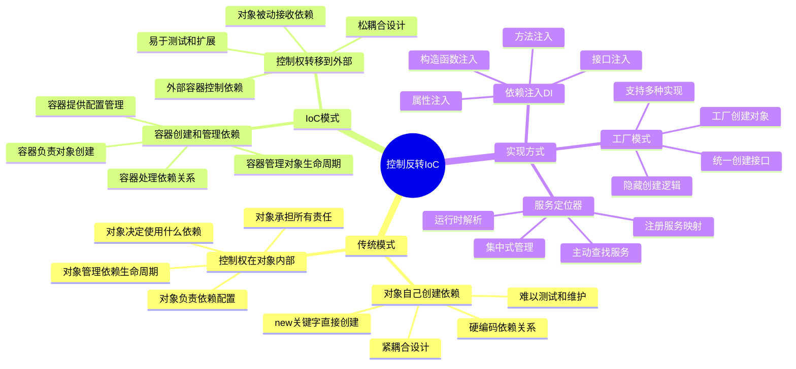
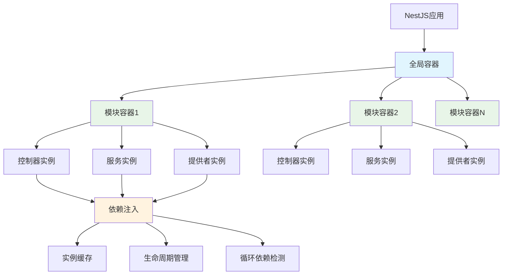
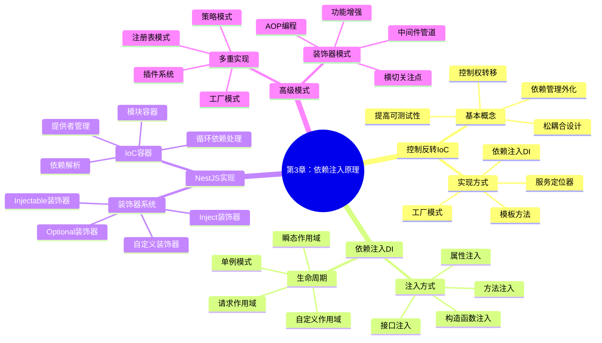
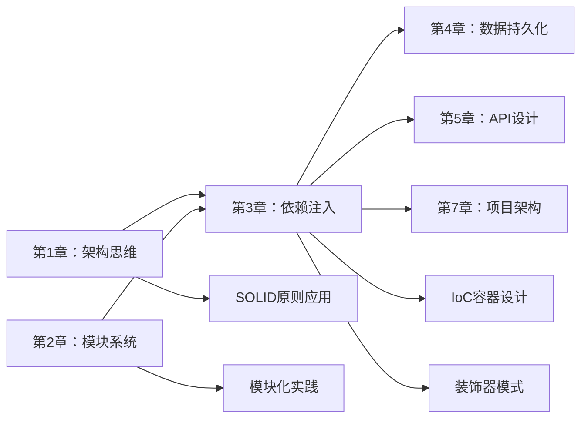

# 第3章 依赖注入原理深度解析

> **从控制反转到依赖注入** - 深入理解现代框架的核心设计模式

## 📚 本章学习目标

### 🎯 知识目标
- [ ] **理解IoC容器**：深入掌握控制反转容器的工作原理和设计思想
- [ ] **掌握DI机制**：理解依赖注入的各种实现方式和应用场景
- [ ] **熟悉装饰器系统**：掌握NestJS装饰器的使用和自定义方法
- [ ] **理解生命周期**：掌握依赖对象的创建、管理和销毁机制
- [ ] **掌握高级特性**：学会使用条件注入、动态模块等高级功能

### 🛠️ 技能目标
- [ ] 能够设计和实现自定义的依赖注入容器
- [ ] 能够正确配置和使用NestJS的依赖注入系统
- [ ] 能够处理复杂的依赖关系和循环依赖问题
- [ ] 能够优化依赖注入的性能和内存使用

### ⏰ 学习时长
- **理论学习**：5-6小时
- **实践练习**：6-7小时
- **项目实战**：2-3小时
- **总计时长**：13-16小时

### 📋 前置知识检查
在开始本章学习前，请确保您已掌握以下知识：
- [ ] 第1章：后端架构思维导引（必须完成）
- [ ] 第2章：NestJS模块系统详解（必须完成）
- [ ] TypeScript装饰器语法和元数据反射
- [ ] 面向对象编程的高级概念（接口、抽象类、泛型）
- [ ] 设计模式基础（工厂模式、单例模式）

---

## 3.1 控制反转（IoC）基础

### 3.1.1 什么是控制反转？

#### 💡 通俗易懂的定义

**控制反转就像餐厅用餐模式的转变**：

**传统模式（自己控制）**：
- 🏠 **在家做饭**：自己买菜、洗菜、做饭、洗碗
- 🔧 **全程控制**：每个步骤都要自己管理
- 😰 **责任重大**：出问题要自己解决

**控制反转模式（交给专业的）**：
- 🍽️ **餐厅用餐**：只需要点菜，厨师负责制作
- 🎯 **专注核心**：只关心吃什么，不关心怎么做
- 🛡️ **专业保障**：厨师负责食物质量

#### 🎯 IoC核心概念图解



#### 🌍 现实应用场景举例

**场景1：电商订单处理系统**

**传统方式（没有IoC）**：
```typescript
// ❌ 紧耦合的设计
class OrderService {
  private paymentService: PaymentService;
  private inventoryService: InventoryService;
  private emailService: EmailService;
  
  constructor() {
    // 硬编码依赖创建
    this.paymentService = new PaymentService();
    this.inventoryService = new InventoryService();
    this.emailService = new EmailService();
  }
  
  async processOrder(order: Order): Promise<void> {
    // 业务逻辑...
  }
}

// 问题：
// 1. 难以测试（无法mock依赖）
// 2. 难以扩展（更换实现需要修改代码）
// 3. 违反开闭原则
// 4. 依赖关系复杂时难以管理
```

**IoC方式（控制反转）**：
```typescript
// ✅ 松耦合的设计
interface IPaymentService {
  processPayment(amount: number): Promise<boolean>;
}

interface IInventoryService {
  checkStock(productId: string): Promise<boolean>;
  reserveStock(productId: string, quantity: number): Promise<void>;
}

interface IEmailService {
  sendOrderConfirmation(email: string, order: Order): Promise<void>;
}

@Injectable()
class OrderService {
  constructor(
    private paymentService: IPaymentService,      // 依赖注入
    private inventoryService: IInventoryService,  // 依赖注入
    private emailService: IEmailService          // 依赖注入
  ) {}
  
  async processOrder(order: Order): Promise<void> {
    // 1. 检查库存
    const hasStock = await this.inventoryService.checkStock(order.productId);
    if (!hasStock) {
      throw new Error('库存不足');
    }
    
    // 2. 处理支付
    const paymentSuccess = await this.paymentService.processPayment(order.amount);
    if (!paymentSuccess) {
      throw new Error('支付失败');
    }
    
    // 3. 预留库存
    await this.inventoryService.reserveStock(order.productId, order.quantity);
    
    // 4. 发送确认邮件
    await this.emailService.sendOrderConfirmation(order.customerEmail, order);
  }
}

// 优势：
// 1. 易于测试（可以注入mock对象）
// 2. 易于扩展（可以注入不同的实现）
// 3. 符合SOLID原则
// 4. 依赖关系清晰明确
```

**场景2：日志系统的演进**

**阶段1：硬编码日志**
```typescript
class UserService {
  async createUser(userData: CreateUserDto): Promise<User> {
    // 硬编码日志输出
    console.log(`Creating user: ${userData.email}`);
    
    const user = await this.userRepository.save(userData);
    
    console.log(`User created with ID: ${user.id}`);
    return user;
  }
}
```

**阶段2：IoC日志系统**
```typescript
interface ILogger {
  log(message: string, context?: string): void;
  error(message: string, error?: Error): void;
  warn(message: string): void;
  debug(message: string): void;
}

@Injectable()
class ConsoleLogger implements ILogger {
  log(message: string, context?: string): void {
    console.log(`[${context || 'APP'}] ${message}`);
  }
  
  error(message: string, error?: Error): void {
    console.error(`[ERROR] ${message}`, error);
  }
  
  warn(message: string): void {
    console.warn(`[WARN] ${message}`);
  }
  
  debug(message: string): void {
    console.debug(`[DEBUG] ${message}`);
  }
}

@Injectable()
class FileLogger implements ILogger {
  log(message: string, context?: string): void {
    // 写入文件逻辑
    this.writeToFile(`[${context || 'APP'}] ${message}`);
  }
  
  // ... 其他方法实现
  
  private writeToFile(message: string): void {
    // 文件写入实现
  }
}

@Injectable()
class UserService {
  constructor(
    private userRepository: UserRepository,
    private logger: ILogger  // 注入日志服务
  ) {}
  
  async createUser(userData: CreateUserDto): Promise<User> {
    this.logger.log(`Creating user: ${userData.email}`, 'UserService');
    
    try {
      const user = await this.userRepository.save(userData);
      this.logger.log(`User created with ID: ${user.id}`, 'UserService');
      return user;
    } catch (error) {
      this.logger.error(`Failed to create user: ${userData.email}`, error);
      throw error;
    }
  }
}
```

**场景3：数据库连接管理**

```typescript
// 传统方式：每个服务自己管理数据库连接
class UserService {
  private connection: DatabaseConnection;
  
  constructor() {
    // 每个服务都要自己创建连接
    this.connection = new DatabaseConnection({
      host: 'localhost',
      port: 5432,
      database: 'myapp',
      username: 'user',
      password: 'password'
    });
  }
}

// IoC方式：统一管理数据库连接
@Injectable()
class DatabaseService {
  private connection: DatabaseConnection;
  
  constructor(@Inject('DATABASE_CONFIG') private config: DatabaseConfig) {
    this.connection = new DatabaseConnection(config);
  }
  
  getConnection(): DatabaseConnection {
    return this.connection;
  }
}

@Injectable()
class UserService {
  constructor(private databaseService: DatabaseService) {}
  
  async findUser(id: string): Promise<User> {
    const connection = this.databaseService.getConnection();
    return connection.query('SELECT * FROM users WHERE id = $1', [id]);
  }
}
```

#### 🔍 深度解析

**IoC的核心价值**：

1. **降低耦合度**：
   - 对象不再直接依赖具体实现
   - 通过接口或抽象类定义契约
   - 实现可以随时替换而不影响使用方

2. **提高可测试性**：
   - 可以轻松注入Mock对象进行单元测试
   - 测试时可以隔离外部依赖
   - 支持测试驱动开发（TDD）

3. **增强可扩展性**：
   - 新功能可以通过新的实现类添加
   - 不需要修改现有代码
   - 符合开闭原则

4. **简化配置管理**：
   - 集中管理对象的创建和配置
   - 支持环境相关的配置切换
   - 减少重复的配置代码

### 3.1.2 依赖注入（DI）详解

#### 🏗️ 依赖注入的四种方式

##### 1️⃣ 构造函数注入（Constructor Injection）

**定义**：通过构造函数参数传入依赖对象。

**优点**：
- 依赖关系明确，在对象创建时就确定
- 保证对象创建后依赖完整可用
- 支持不可变对象设计
- 便于进行依赖验证

**实现示例**：
```typescript
interface IEmailService {
  sendEmail(to: string, subject: string, body: string): Promise<void>;
}

interface IUserRepository {
  save(user: User): Promise<User>;
  findByEmail(email: string): Promise<User | null>;
}

@Injectable()
class UserService {
  // 构造函数注入 - NestJS推荐方式
  constructor(
    private readonly userRepository: IUserRepository,
    private readonly emailService: IEmailService,
    private readonly logger: ILogger
  ) {
    // 可以在构造函数中进行依赖验证
    if (!userRepository) {
      throw new Error('UserRepository is required');
    }
    if (!emailService) {
      throw new Error('EmailService is required');
    }
  }
  
  async registerUser(userData: CreateUserDto): Promise<User> {
    // 依赖已经在构造时注入，可以直接使用
    this.logger.log(`Registering user: ${userData.email}`);
    
    // 检查用户是否已存在
    const existingUser = await this.userRepository.findByEmail(userData.email);
    if (existingUser) {
      throw new ConflictException('用户已存在');
    }
    
    // 创建用户
    const user = await this.userRepository.save(userData);
    
    // 发送欢迎邮件
    await this.emailService.sendEmail(
      user.email,
      '欢迎注册',
      '感谢您的注册！'
    );
    
    this.logger.log(`User registered successfully: ${user.id}`);
    return user;
  }
}
```

##### 2️⃣ 属性注入（Property Injection）

**定义**：通过对象属性直接注入依赖。

**优点**：
- 语法简洁，易于理解
- 支持可选依赖
- 可以在对象创建后动态设置

**缺点**：
- 依赖关系不够明确
- 可能导致对象在不完整状态下被使用
- 难以保证依赖的不可变性

**实现示例**：
```typescript
@Injectable()
class NotificationService {
  // 属性注入 - 使用@Inject装饰器
  @Inject('EMAIL_SERVICE')
  private emailService: IEmailService;
  
  @Inject('SMS_SERVICE')
  private smsService: ISmsService;
  
  // 可选依赖
  @Optional()
  @Inject('PUSH_SERVICE')
  private pushService?: IPushService;
  
  async sendNotification(
    message: string, 
    recipient: string, 
    type: 'email' | 'sms' | 'push'
  ): Promise<void> {
    switch (type) {
      case 'email':
        await this.emailService.sendEmail(recipient, 'Notification', message);
        break;
      case 'sms':
        await this.smsService.sendSms(recipient, message);
        break;
      case 'push':
        if (this.pushService) {
          await this.pushService.sendPush(recipient, message);
        } else {
          console.warn('Push service not available');
        }
        break;
    }
  }
}
```

##### 3️⃣ 方法注入（Method Injection）

**定义**：通过特定方法注入依赖对象。

**优点**：
- 支持运行时动态注入
- 可以根据条件选择不同的依赖
- 适合处理复杂的依赖逻辑

**实现示例**：
```typescript
@Injectable()
class PaymentService {
  private paymentProviders: Map<string, IPaymentProvider> = new Map();
  
  // 方法注入 - 注入多个支付提供商
  @Inject('PAYMENT_PROVIDERS')
  setPaymentProviders(providers: IPaymentProvider[]): void {
    providers.forEach(provider => {
      this.paymentProviders.set(provider.getName(), provider);
    });
  }
  
  async processPayment(
    amount: number, 
    currency: string, 
    providerName: string
  ): Promise<PaymentResult> {
    const provider = this.paymentProviders.get(providerName);
    
    if (!provider) {
      throw new Error(`Payment provider ${providerName} not found`);
    }
    
    return provider.processPayment(amount, currency);
  }
  
  getAvailableProviders(): string[] {
    return Array.from(this.paymentProviders.keys());
  }
}
```

##### 4️⃣ 接口注入（Interface Injection）

**定义**：通过实现特定接口来接收依赖注入。

**实现示例**：
```typescript
// 定义注入接口
interface ILoggerAware {
  setLogger(logger: ILogger): void;
}

interface ICacheAware {
  setCache(cache: ICache): void;
}

@Injectable()
class ProductService implements ILoggerAware, ICacheAware {
  private logger: ILogger;
  private cache: ICache;
  
  // 实现接口注入方法
  setLogger(logger: ILogger): void {
    this.logger = logger;
  }
  
  setCache(cache: ICache): void {
    this.cache = cache;
  }
  
  async getProduct(id: string): Promise<Product> {
    this.logger?.log(`Getting product: ${id}`);
    
    // 先从缓存获取
    const cached = await this.cache?.get(`product:${id}`);
    if (cached) {
      this.logger?.log(`Product found in cache: ${id}`);
      return cached;
    }
    
    // 从数据库获取
    const product = await this.productRepository.findById(id);
    
    // 存入缓存
    if (product && this.cache) {
      await this.cache.set(`product:${id}`, product, 3600);
    }
    
    return product;
  }
}
```

#### 💡 依赖注入最佳实践

**1. 优先使用构造函数注入**
```typescript
// ✅ 推荐：构造函数注入
@Injectable()
class UserService {
  constructor(
    private readonly userRepository: UserRepository,
    private readonly emailService: EmailService
  ) {}
}

// ❌ 不推荐：属性注入（除非有特殊需求）
@Injectable()
class UserService {
  @Inject()
  private userRepository: UserRepository;
}
```

**2. 使用接口定义依赖契约**
```typescript
// ✅ 推荐：依赖接口而不是具体实现
interface IEmailService {
  sendEmail(to: string, subject: string, body: string): Promise<void>;
}

@Injectable()
class UserService {
  constructor(private emailService: IEmailService) {}
}

// ❌ 不推荐：直接依赖具体实现
@Injectable()
class UserService {
  constructor(private emailService: SmtpEmailService) {}
}
```

**3. 合理使用可选依赖**
```typescript
@Injectable()
class AnalyticsService {
  constructor(
    private eventTracker: IEventTracker,
    @Optional() private logger?: ILogger  // 可选依赖
  ) {}
  
  trackEvent(event: string, data: any): void {
    this.eventTracker.track(event, data);
    this.logger?.log(`Event tracked: ${event}`);  // 安全调用
  }
}
```

---

## 3.2 NestJS依赖注入系统

### 3.2.1 NestJS IoC容器架构

#### 🏗️ 容器架构图解



#### 🔧 提供者（Provider）详解

**提供者是NestJS依赖注入系统的核心概念**，它定义了如何创建和管理依赖对象。

##### 1️⃣ 类提供者（Class Provider）

```typescript
// 最简单的提供者形式
@Injectable()
class UserService {
  findAll(): User[] {
    return [];
  }
}

@Module({
  providers: [UserService],  // 简写形式
  // 等价于：
  // providers: [
  //   {
  //     provide: UserService,
  //     useClass: UserService,
  //   }
  // ],
})
export class UserModule {}
```

##### 2️⃣ 值提供者（Value Provider）

```typescript
// 提供常量值
const DATABASE_CONFIG = {
  host: 'localhost',
  port: 5432,
  database: 'myapp',
  username: 'user',
  password: 'password'
};

@Module({
  providers: [
    {
      provide: 'DATABASE_CONFIG',
      useValue: DATABASE_CONFIG,
    },
    // 也可以提供简单值
    {
      provide: 'API_VERSION',
      useValue: 'v1',
    },
    // 提供函数
    {
      provide: 'CURRENT_TIME',
      useValue: () => new Date(),
    }
  ],
})
export class ConfigModule {}

// 使用值提供者
@Injectable()
class DatabaseService {
  constructor(
    @Inject('DATABASE_CONFIG') private config: any,
    @Inject('API_VERSION') private version: string
  ) {
    console.log(`Database config:`, this.config);
    console.log(`API version: ${this.version}`);
  }
}
```

##### 3️⃣ 工厂提供者（Factory Provider）

```typescript
// 复杂的对象创建逻辑
@Module({
  providers: [
    {
      provide: 'DATABASE_CONNECTION',
      useFactory: async (config: DatabaseConfig, logger: ILogger) => {
        logger.log('Creating database connection...');
        
        const connection = new DatabaseConnection(config);
        await connection.connect();
        
        logger.log('Database connection established');
        return connection;
      },
      inject: ['DATABASE_CONFIG', 'LOGGER'],  // 工厂函数的依赖
    },
    // 条件性创建
    {
      provide: 'CACHE_SERVICE',
      useFactory: (config: AppConfig) => {
        if (config.environment === 'production') {
          return new RedisCache(config.redis);
        } else {
          return new MemoryCache();
        }
      },
      inject: ['APP_CONFIG'],
    }
  ],
})
export class DatabaseModule {}
```

##### 4️⃣ 别名提供者（Alias Provider）

```typescript
@Injectable()
class PostgreSQLUserRepository implements IUserRepository {
  // PostgreSQL实现
}

@Injectable()
class MongoUserRepository implements IUserRepository {
  // MongoDB实现
}

@Module({
  providers: [
    PostgreSQLUserRepository,
    MongoUserRepository,
    // 创建别名，根据环境选择实现
    {
      provide: 'UserRepository',
      useExisting: process.env.DB_TYPE === 'mongo' 
        ? MongoUserRepository 
        : PostgreSQLUserRepository,
    }
  ],
})
export class UserModule {}

// 使用别名
@Injectable()
class UserService {
  constructor(
    @Inject('UserRepository') private userRepository: IUserRepository
  ) {}
}
```

#### 🔄 依赖注入的生命周期

##### 1️⃣ 单例模式（Singleton）- 默认

```typescript
@Injectable()
class SingletonService {
  private counter = 0;
  
  increment(): number {
    return ++this.counter;
  }
  
  getCount(): number {
    return this.counter;
  }
}

// 测试单例行为
@Controller('test')
class TestController {
  constructor(private singletonService: SingletonService) {}
  
  @Get('count')
  getCount(): number {
    this.singletonService.increment();
    return this.singletonService.getCount();  // 每次调用都会递增
  }
}
```

##### 2️⃣ 请求作用域（Request Scope）

```typescript
@Injectable({ scope: Scope.REQUEST })
class RequestScopedService {
  private readonly id = Math.random();
  
  getId(): number {
    return this.id;
  }
}

// 每个HTTP请求都会创建新的实例
@Controller('test')
class TestController {
  constructor(private requestService: RequestScopedService) {}
  
  @Get('id')
  getId(): number {
    return this.requestService.getId();  // 每个请求返回不同的ID
  }
}
```

##### 3️⃣ 瞬态作用域（Transient Scope）

```typescript
@Injectable({ scope: Scope.TRANSIENT })
class TransientService {
  private readonly id = Math.random();
  
  getId(): number {
    return this.id;
  }
}

@Injectable()
class ServiceA {
  constructor(private transientService: TransientService) {}
  
  getId(): number {
    return this.transientService.getId();
  }
}

@Injectable()
class ServiceB {
  constructor(private transientService: TransientService) {}
  
  getId(): number {
    return this.transientService.getId();
  }
}

// ServiceA和ServiceB会得到不同的TransientService实例
```

#### ⚠️ 循环依赖处理

**循环依赖是指两个或多个类相互依赖的情况**。

##### 问题示例：
```typescript
// ❌ 循环依赖问题
@Injectable()
class UserService {
  constructor(private orderService: OrderService) {}  // 依赖OrderService
}

@Injectable()
class OrderService {
  constructor(private userService: UserService) {}    // 依赖UserService
}
```

##### 解决方案1：使用forwardRef
```typescript
// ✅ 使用forwardRef解决循环依赖
@Injectable()
class UserService {
  constructor(
    @Inject(forwardRef(() => OrderService))
    private orderService: OrderService
  ) {}
  
  async getUserOrders(userId: string): Promise<Order[]> {
    return this.orderService.getOrdersByUserId(userId);
  }
}

@Injectable()
class OrderService {
  constructor(
    @Inject(forwardRef(() => UserService))
    private userService: UserService
  ) {}
  
  async getOrdersByUserId(userId: string): Promise<Order[]> {
    const user = await this.userService.findById(userId);
    if (!user) {
      throw new NotFoundException('User not found');
    }
    // 查询订单逻辑...
    return [];
  }
}
```

##### 解决方案2：重构设计避免循环依赖
```typescript
// ✅ 更好的设计：避免循环依赖
interface IUserRepository {
  findById(id: string): Promise<User>;
}

interface IOrderRepository {
  findByUserId(userId: string): Promise<Order[]>;
}

@Injectable()
class UserService {
  constructor(private userRepository: IUserRepository) {}
  
  async findById(id: string): Promise<User> {
    return this.userRepository.findById(id);
  }
}

@Injectable()
class OrderService {
  constructor(
    private orderRepository: IOrderRepository,
    private userRepository: IUserRepository  // 直接依赖Repository而不是Service
  ) {}
  
  async getOrdersByUserId(userId: string): Promise<Order[]> {
    const user = await this.userRepository.findById(userId);
    if (!user) {
      throw new NotFoundException('User not found');
    }
    return this.orderRepository.findByUserId(userId);
  }
}

// 或者创建一个聚合服务
@Injectable()
class UserOrderService {
  constructor(
    private userService: UserService,
    private orderService: OrderService
  ) {}
  
  async getUserWithOrders(userId: string): Promise<UserWithOrders> {
    const user = await this.userService.findById(userId);
    const orders = await this.orderService.getOrdersByUserId(userId);
    
    return {
      user,
      orders
    };
  }
}
```

### 3.2.2 自定义装饰器和提供者

#### 🎨 创建自定义装饰器

##### 1️⃣ 参数装饰器

```typescript
// 创建获取当前用户的装饰器
export const CurrentUser = createParamDecorator(
  (data: unknown, ctx: ExecutionContext): User => {
    const request = ctx.switchToHttp().getRequest();
    return request.user;
  },
);

// 创建获取请求IP的装饰器
export const ClientIp = createParamDecorator(
  (data: unknown, ctx: ExecutionContext): string => {
    const request = ctx.switchToHttp().getRequest();
    return request.ip || request.connection.remoteAddress;
  },
);

// 使用自定义装饰器
@Controller('users')
export class UserController {
  @Get('profile')
  @UseGuards(JwtAuthGuard)
  getProfile(@CurrentUser() user: User): User {
    return user;
  }
  
  @Post('login')
  async login(
    @Body() loginDto: LoginDto,
    @ClientIp() ip: string
  ): Promise<LoginResponse> {
    console.log(`Login attempt from IP: ${ip}`);
    return this.authService.login(loginDto);
  }
}
```

##### 2️⃣ 方法装饰器

```typescript
// 创建缓存装饰器
export function Cache(ttl: number = 300) {
  return function (target: any, propertyName: string, descriptor: PropertyDescriptor) {
    const method = descriptor.value;
    const cacheMap = new Map<string, { value: any; expiry: number }>();
    
    descriptor.value = async function (...args: any[]) {
      const cacheKey = `${propertyName}_${JSON.stringify(args)}`;
      const cached = cacheMap.get(cacheKey);
      
      if (cached && cached.expiry > Date.now()) {
        console.log(`Cache hit for ${cacheKey}`);
        return cached.value;
      }
      
      const result = await method.apply(this, args);
      cacheMap.set(cacheKey, {
        value: result,
        expiry: Date.now() + ttl * 1000
      });
      
      console.log(`Cache set for ${cacheKey}`);
      return result;
    };
  };
}

// 使用缓存装饰器
@Injectable()
class ProductService {
  @Cache(600)  // 缓存10分钟
  async getProduct(id: string): Promise<Product> {
    console.log(`Fetching product ${id} from database`);
    // 模拟数据库查询
    await new Promise(resolve => setTimeout(resolve, 1000));
    return { id, name: `Product ${id}`, price: 100 };
  }
}
```

##### 3️⃣ 类装饰器

```typescript
// 创建自动日志装饰器
export function AutoLog(context: string) {
  return function <T extends { new (...args: any[]): {} }>(constructor: T) {
    return class extends constructor {
      constructor(...args: any[]) {
        super(...args);
        console.log(`${context} instance created`);
      }
    };
  };
}

// 使用自动日志装饰器
@AutoLog('UserService')
@Injectable()
class UserService {
  constructor(private userRepository: UserRepository) {}
  
  async findAll(): Promise<User[]> {
    return this.userRepository.find();
  }
}
```

#### 🏭 动态模块和提供者

##### 1️⃣ 动态模块

```typescript
// 创建可配置的数据库模块
export interface DatabaseModuleOptions {
  host: string;
  port: number;
  database: string;
  username: string;
  password: string;
}

@Module({})
export class DatabaseModule {
  static forRoot(options: DatabaseModuleOptions): DynamicModule {
    return {
      module: DatabaseModule,
      providers: [
        {
          provide: 'DATABASE_OPTIONS',
          useValue: options,
        },
        {
          provide: 'DATABASE_CONNECTION',
          useFactory: async (options: DatabaseModuleOptions) => {
            const connection = new DatabaseConnection(options);
            await connection.connect();
            return connection;
          },
          inject: ['DATABASE_OPTIONS'],
        },
      ],
      exports: ['DATABASE_CONNECTION'],
      global: true,  // 全局可用
    };
  }
  
  static forRootAsync(options: {
    useFactory: (...args: any[]) => Promise<DatabaseModuleOptions> | DatabaseModuleOptions;
    inject?: any[];
  }): DynamicModule {
    return {
      module: DatabaseModule,
      providers: [
        {
          provide: 'DATABASE_OPTIONS',
          useFactory: options.useFactory,
          inject: options.inject || [],
        },
        {
          provide: 'DATABASE_CONNECTION',
          useFactory: async (options: DatabaseModuleOptions) => {
            const connection = new DatabaseConnection(options);
            await connection.connect();
            return connection;
          },
          inject: ['DATABASE_OPTIONS'],
        },
      ],
      exports: ['DATABASE_CONNECTION'],
      global: true,
    };
  }
}

// 使用动态模块
@Module({
  imports: [
    // 同步配置
    DatabaseModule.forRoot({
      host: 'localhost',
      port: 5432,
      database: 'myapp',
      username: 'user',
      password: 'password'
    }),
    
    // 异步配置
    DatabaseModule.forRootAsync({
      useFactory: (configService: ConfigService) => ({
        host: configService.get('DB_HOST'),
        port: configService.get('DB_PORT'),
        database: configService.get('DB_NAME'),
        username: configService.get('DB_USER'),
        password: configService.get('DB_PASSWORD'),
      }),
      inject: [ConfigService],
    }),
  ],
})
export class AppModule {}
```

##### 2️⃣ 条件提供者

```typescript
// 根据环境提供不同的服务
@Module({
  providers: [
    {
      provide: 'LOGGER',
      useFactory: (configService: ConfigService) => {
        const env = configService.get('NODE_ENV');
        
        if (env === 'production') {
          return new FileLogger({
            filename: 'app.log',
            level: 'info'
          });
        } else if (env === 'development') {
          return new ConsoleLogger({
            level: 'debug',
            colorize: true
          });
        } else {
          return new NullLogger();  // 测试环境不输出日志
        }
      },
      inject: [ConfigService],
    },
    
    // 根据功能开关提供服务
    {
      provide: 'ANALYTICS_SERVICE',
      useFactory: (configService: ConfigService) => {
        const analyticsEnabled = configService.get('ANALYTICS_ENABLED');
        
        if (analyticsEnabled) {
          return new GoogleAnalyticsService(
            configService.get('GA_TRACKING_ID')
          );
        } else {
          return new NoOpAnalyticsService();  // 空实现
        }
      },
      inject: [ConfigService],
    }
  ],
})
export class AppModule {}
```

---

## 3.3 高级依赖注入模式

### 3.3.1 多重实现和策略模式

#### 🎯 多重实现注入

```typescript
// 定义通知接口
interface INotificationProvider {
  getName(): string;
  send(message: string, recipient: string): Promise<boolean>;
}

// 实现多个通知提供者
@Injectable()
class EmailNotificationProvider implements INotificationProvider {
  getName(): string {
    return 'email';
  }
  
  async send(message: string, recipient: string): Promise<boolean> {
    console.log(`Sending email to ${recipient}: ${message}`);
    // 邮件发送逻辑
    return true;
  }
}

@Injectable()
class SmsNotificationProvider implements INotificationProvider {
  getName(): string {
    return 'sms';
  }
  
  async send(message: string, recipient: string): Promise<boolean> {
    console.log(`Sending SMS to ${recipient}: ${message}`);
    // 短信发送逻辑
    return true;
  }
}

@Injectable()
class PushNotificationProvider implements INotificationProvider {
  getName(): string {
    return 'push';
  }
  
  async send(message: string, recipient: string): Promise<boolean> {
    console.log(`Sending push notification to ${recipient}: ${message}`);
    // 推送通知逻辑
    return true;
  }
}

// 通知服务管理多个提供者
@Injectable()
class NotificationService {
  private providers: Map<string, INotificationProvider> = new Map();
  
  constructor(
    @Inject('NOTIFICATION_PROVIDERS') 
    providers: INotificationProvider[]
  ) {
    providers.forEach(provider => {
      this.providers.set(provider.getName(), provider);
    });
  }
  
  async sendNotification(
    message: string, 
    recipient: string, 
    type: string
  ): Promise<boolean> {
    const provider = this.providers.get(type);
    
    if (!provider) {
      throw new Error(`Notification provider ${type} not found`);
    }
    
    return provider.send(message, recipient);
  }
  
  async sendToAll(message: string, recipient: string): Promise<boolean[]> {
    const results = await Promise.allSettled(
      Array.from(this.providers.values()).map(provider =>
        provider.send(message, recipient)
      )
    );
    
    return results.map(result => 
      result.status === 'fulfilled' ? result.value : false
    );
  }
  
  getAvailableProviders(): string[] {
    return Array.from(this.providers.keys());
  }
}

// 模块配置
@Module({
  providers: [
    EmailNotificationProvider,
    SmsNotificationProvider,
    PushNotificationProvider,
    {
      provide: 'NOTIFICATION_PROVIDERS',
      useFactory: (
        emailProvider: EmailNotificationProvider,
        smsProvider: SmsNotificationProvider,
        pushProvider: PushNotificationProvider
      ) => [emailProvider, smsProvider, pushProvider],
      inject: [
        EmailNotificationProvider,
        SmsNotificationProvider,
        PushNotificationProvider
      ],
    },
    NotificationService,
  ],
  exports: [NotificationService],
})
export class NotificationModule {}
```

#### 🔄 策略模式实现

```typescript
// 定义支付策略接口
interface IPaymentStrategy {
  getName(): string;
  processPayment(amount: number, currency: string): Promise<PaymentResult>;
  validatePayment(paymentData: any): boolean;
}

// 实现不同的支付策略
@Injectable()
class CreditCardStrategy implements IPaymentStrategy {
  getName(): string {
    return 'credit_card';
  }
  
  validatePayment(paymentData: any): boolean {
    return paymentData.cardNumber && paymentData.expiryDate && paymentData.cvv;
  }
  
  async processPayment(amount: number, currency: string): Promise<PaymentResult> {
    // 信用卡支付逻辑
    console.log(`Processing credit card payment: ${amount} ${currency}`);
    
    // 模拟支付处理
    await new Promise(resolve => setTimeout(resolve, 1000));
    
    return {
      success: true,
      transactionId: `cc_${Date.now()}`,
      amount,
      currency,
      fee: amount * 0.029  // 2.9% 手续费
    };
  }
}

@Injectable()
class PayPalStrategy implements IPaymentStrategy {
  getName(): string {
    return 'paypal';
  }
  
  validatePayment(paymentData: any): boolean {
    return paymentData.email && paymentData.password;
  }
  
  async processPayment(amount: number, currency: string): Promise<PaymentResult> {
    console.log(`Processing PayPal payment: ${amount} ${currency}`);
    
    await new Promise(resolve => setTimeout(resolve, 800));
    
    return {
      success: true,
      transactionId: `pp_${Date.now()}`,
      amount,
      currency,
      fee: amount * 0.034  // 3.4% 手续费
    };
  }
}

@Injectable()
class AlipayStrategy implements IPaymentStrategy {
  getName(): string {
    return 'alipay';
  }
  
  validatePayment(paymentData: any): boolean {
    return paymentData.account;
  }
  
  async processPayment(amount: number, currency: string): Promise<PaymentResult> {
    console.log(`Processing Alipay payment: ${amount} ${currency}`);
    
    await new Promise(resolve => setTimeout(resolve, 600));
    
    return {
      success: true,
      transactionId: `ap_${Date.now()}`,
      amount,
      currency,
      fee: amount * 0.006  // 0.6% 手续费
    };
  }
}

// 支付上下文服务
@Injectable()
class PaymentContextService {
  private strategies: Map<string, IPaymentStrategy> = new Map();
  
  constructor(
    @Inject('PAYMENT_STRATEGIES') 
    strategies: IPaymentStrategy[]
  ) {
    strategies.forEach(strategy => {
      this.strategies.set(strategy.getName(), strategy);
    });
  }
  
  async processPayment(
    amount: number,
    currency: string,
    paymentMethod: string,
    paymentData: any
  ): Promise<PaymentResult> {
    const strategy = this.strategies.get(paymentMethod);
    
    if (!strategy) {
      throw new BadRequestException(`Payment method ${paymentMethod} not supported`);
    }
    
    if (!strategy.validatePayment(paymentData)) {
      throw new BadRequestException('Invalid payment data');
    }
    
    try {
      const result = await strategy.processPayment(amount, currency);
      
      // 记录支付日志
      console.log(`Payment processed: ${JSON.stringify(result)}`);
      
      return result;
    } catch (error) {
      console.error(`Payment failed: ${error.message}`);
      throw new InternalServerErrorException('Payment processing failed');
    }
  }
  
  getSupportedMethods(): string[] {
    return Array.from(this.strategies.keys());
  }
  
  getMethodInfo(method: string): { name: string; feeRate: number } | null {
    const strategy = this.strategies.get(method);
    if (!strategy) return null;
    
    // 这里可以返回更详细的方法信息
    return {
      name: strategy.getName(),
      feeRate: this.getFeeRate(method)
    };
  }
  
  private getFeeRate(method: string): number {
    switch (method) {
      case 'credit_card': return 0.029;
      case 'paypal': return 0.034;
      case 'alipay': return 0.006;
      default: return 0;
    }
  }
}

// 支付控制器
@Controller('payments')
export class PaymentController {
  constructor(private paymentService: PaymentContextService) {}
  
  @Post('process')
  async processPayment(@Body() paymentDto: ProcessPaymentDto): Promise<PaymentResult> {
    return this.paymentService.processPayment(
      paymentDto.amount,
      paymentDto.currency,
      paymentDto.method,
      paymentDto.paymentData
    );
  }
  
  @Get('methods')
  getSupportedMethods(): string[] {
    return this.paymentService.getSupportedMethods();
  }
}
```

### 3.3.2 装饰器模式和中间件

#### 🎨 装饰器模式实现

```typescript
// 基础服务接口
interface IUserService {
  getUser(id: string): Promise<User>;
  updateUser(id: string, data: Partial<User>): Promise<User>;
}

// 基础用户服务
@Injectable()
class BaseUserService implements IUserService {
  constructor(private userRepository: UserRepository) {}
  
  async getUser(id: string): Promise<User> {
    return this.userRepository.findById(id);
  }
  
  async updateUser(id: string, data: Partial<User>): Promise<User> {
    return this.userRepository.update(id, data);
  }
}

// 缓存装饰器服务
@Injectable()
class CachedUserService implements IUserService {
  constructor(
    private baseService: IUserService,
    private cacheService: ICacheService
  ) {}
  
  async getUser(id: string): Promise<User> {
    const cacheKey = `user:${id}`;
    
    // 先从缓存获取
    const cached = await this.cacheService.get<User>(cacheKey);
    if (cached) {
      console.log(`Cache hit for user ${id}`);
      return cached;
    }
    
    // 缓存未命中，从基础服务获取
    const user = await this.baseService.getUser(id);
    
    // 存入缓存
    await this.cacheService.set(cacheKey, user, 3600);
    console.log(`User ${id} cached`);
    
    return user;
  }
  
  async updateUser(id: string, data: Partial<User>): Promise<User> {
    // 更新用户
    const user = await this.baseService.updateUser(id, data);
    
    // 清除缓存
    await this.cacheService.delete(`user:${id}`);
    console.log(`Cache cleared for user ${id}`);
    
    return user;
  }
}

// 日志装饰器服务
@Injectable()
class LoggedUserService implements IUserService {
  constructor(
    private baseService: IUserService,
    private logger: ILogger
  ) {}
  
  async getUser(id: string): Promise<User> {
    this.logger.log(`Getting user ${id}`, 'UserService');
    
    try {
      const user = await this.baseService.getUser(id);
      this.logger.log(`User ${id} retrieved successfully`, 'UserService');
      return user;
    } catch (error) {
      this.logger.error(`Failed to get user ${id}: ${error.message}`, 'UserService');
      throw error;
    }
  }
  
  async updateUser(id: string, data: Partial<User>): Promise<User> {
    this.logger.log(`Updating user ${id}`, 'UserService');
    
    try {
      const user = await this.baseService.updateUser(id, data);
      this.logger.log(`User ${id} updated successfully`, 'UserService');
      return user;
    } catch (error) {
      this.logger.error(`Failed to update user ${id}: ${error.message}`, 'UserService');
      throw error;
    }
  }
}

// 权限装饰器服务
@Injectable()
class AuthorizedUserService implements IUserService {
  constructor(
    private baseService: IUserService,
    private authService: IAuthService
  ) {}
  
  async getUser(id: string): Promise<User> {
    // 检查权限
    const currentUser = this.authService.getCurrentUser();
    if (!this.canAccessUser(currentUser, id)) {
      throw new ForbiddenException('Access denied');
    }
    
    return this.baseService.getUser(id);
  }
  
  async updateUser(id: string, data: Partial<User>): Promise<User> {
    const currentUser = this.authService.getCurrentUser();
    if (!this.canModifyUser(currentUser, id)) {
      throw new ForbiddenException('Modification denied');
    }
    
    return this.baseService.updateUser(id, data);
  }
  
  private canAccessUser(currentUser: User, targetId: string): boolean {
    return currentUser.id === targetId || currentUser.role === 'admin';
  }
  
  private canModifyUser(currentUser: User, targetId: string): boolean {
    return currentUser.id === targetId || currentUser.role === 'admin';
  }
}

// 组合装饰器的工厂
@Injectable()
class UserServiceFactory {
  constructor(
    private userRepository: UserRepository,
    private cacheService: ICacheService,
    private logger: ILogger,
    private authService: IAuthService
  ) {}
  
  createUserService(features: string[] = []): IUserService {
    let service: IUserService = new BaseUserService(this.userRepository);
    
    // 根据需要的功能添加装饰器
    if (features.includes('cache')) {
      service = new CachedUserService(service, this.cacheService);
    }
    
    if (features.includes('logging')) {
      service = new LoggedUserService(service, this.logger);
    }
    
    if (features.includes('auth')) {
      service = new AuthorizedUserService(service, this.authService);
    }
    
    return service;
  }
}

// 模块配置
@Module({
  providers: [
    UserRepository,
    {
      provide: 'USER_SERVICE',
      useFactory: (factory: UserServiceFactory, config: ConfigService) => {
        const features = config.get('USER_SERVICE_FEATURES', []);
        return factory.createUserService(features);
      },
      inject: [UserServiceFactory, ConfigService],
    },
    UserServiceFactory,
  ],
})
export class UserModule {}
```

#### 🔧 中间件模式

```typescript
// 请求处理中间件接口
interface IRequestMiddleware {
  process(request: any, next: () => Promise<any>): Promise<any>;
}

// 认证中间件
@Injectable()
class AuthenticationMiddleware implements IRequestMiddleware {
  constructor(private jwtService: JwtService) {}
  
  async process(request: any, next: () => Promise<any>): Promise<any> {
    const token = this.extractToken(request);
    
    if (!token) {
      throw new UnauthorizedException('Token not provided');
    }
    
    try {
      const payload = this.jwtService.verify(token);
      request.user = payload;
      
      console.log(`User authenticated: ${payload.sub}`);
      return next();
    } catch (error) {
      throw new UnauthorizedException('Invalid token');
    }
  }
  
  private extractToken(request: any): string | null {
    const authHeader = request.headers.authorization;
    if (!authHeader) return null;
    
    const [type, token] = authHeader.split(' ');
    return type === 'Bearer' ? token : null;
  }
}

// 限流中间件
@Injectable()
class RateLimitMiddleware implements IRequestMiddleware {
  private requests: Map<string, number[]> = new Map();
  
  constructor(
    private readonly limit: number = 100,
    private readonly windowMs: number = 60000  // 1分钟
  ) {}
  
  async process(request: any, next: () => Promise<any>): Promise<any> {
    const clientId = this.getClientId(request);
    const now = Date.now();
    
    // 获取客户端的请求记录
    const clientRequests = this.requests.get(clientId) || [];
    
    // 清理过期的请求记录
    const validRequests = clientRequests.filter(
      timestamp => now - timestamp < this.windowMs
    );
    
    // 检查是否超过限制
    if (validRequests.length >= this.limit) {
      throw new TooManyRequestsException('Rate limit exceeded');
    }
    
    // 记录当前请求
    validRequests.push(now);
    this.requests.set(clientId, validRequests);
    
    console.log(`Rate limit check passed for ${clientId}: ${validRequests.length}/${this.limit}`);
    return next();
  }
  
  private getClientId(request: any): string {
    return request.user?.id || request.ip || 'anonymous';
  }
}

// 日志中间件
@Injectable()
class LoggingMiddleware implements IRequestMiddleware {
  constructor(private logger: ILogger) {}
  
  async process(request: any, next: () => Promise<any>): Promise<any> {
    const start = Date.now();
    const { method, url, user } = request;
    
    this.logger.log(`${method} ${url} - User: ${user?.id || 'anonymous'}`, 'Request');
    
    try {
      const result = await next();
      const duration = Date.now() - start;
      
      this.logger.log(`${method} ${url} - Completed in ${duration}ms`, 'Request');
      return result;
    } catch (error) {
      const duration = Date.now() - start;
      
      this.logger.error(
        `${method} ${url} - Failed in ${duration}ms: ${error.message}`,
        'Request'
      );
      throw error;
    }
  }
}

// 中间件管道
@Injectable()
class MiddlewarePipeline {
  private middlewares: IRequestMiddleware[] = [];
  
  use(middleware: IRequestMiddleware): this {
    this.middlewares.push(middleware);
    return this;
  }
  
  async execute(request: any, handler: () => Promise<any>): Promise<any> {
    let index = 0;
    
    const next = async (): Promise<any> => {
      if (index >= this.middlewares.length) {
        return handler();
      }
      
      const middleware = this.middlewares[index++];
      return middleware.process(request, next);
    };
    
    return next();
  }
}

// 使用中间件管道的服务
@Injectable()
class ApiService {
  private pipeline: MiddlewarePipeline;
  
  constructor(
    authMiddleware: AuthenticationMiddleware,
    rateLimitMiddleware: RateLimitMiddleware,
    loggingMiddleware: LoggingMiddleware
  ) {
    this.pipeline = new MiddlewarePipeline()
      .use(loggingMiddleware)
      .use(authMiddleware)
      .use(rateLimitMiddleware);
  }
  
  async processRequest(request: any, handler: () => Promise<any>): Promise<any> {
    return this.pipeline.execute(request, handler);
  }
}
```

---

## 📝 本章知识总结

### 🧠 核心概念思维导图



### 📊 知识点掌握检查表

#### 🎯 基础概念（必须掌握）
- [ ] 理解控制反转（IoC）的核心思想
- [ ] 掌握依赖注入（DI）的四种方式
- [ ] 了解NestJS的IoC容器架构
- [ ] 掌握提供者的各种配置方式

#### 🚀 进阶理解（建议掌握）
- [ ] 理解依赖对象的生命周期管理
- [ ] 能够处理循环依赖问题
- [ ] 掌握自定义装饰器的创建
- [ ] 理解动态模块的设计和使用

#### 💎 专家级别（深度理解）
- [ ] 能够设计复杂的依赖注入架构
- [ ] 掌握多重实现和策略模式
- [ ] 理解装饰器模式和中间件设计
- [ ] 能够优化依赖注入的性能

### 🔗 与其他章节的关联



---

## 🎯 章节练习与实战

### 📝 情景模拟练习题

#### 练习1：IoC容器设计题
**场景**：设计一个简单的IoC容器，支持基本的依赖注入功能。

**要求**：
1. 支持类的注册和解析
2. 支持构造函数注入
3. 支持单例和瞬态生命周期
4. 处理简单的循环依赖

<details>
<summary>点击查看答案解析</summary>

**IoC容器实现**：

```typescript
// 服务描述符
interface ServiceDescriptor {
  token: any;
  implementation?: any;
  factory?: (...args: any[]) => any;
  dependencies?: any[];
  lifetime: 'singleton' | 'transient';
}

// 简单的IoC容器实现
class SimpleIoCContainer {
  private services = new Map<any, ServiceDescriptor>();
  private instances = new Map<any, any>();
  private resolving = new Set<any>();
  
  // 注册服务
  register(descriptor: ServiceDescriptor): void {
    this.services.set(descriptor.token, descriptor);
  }
  
  // 注册单例
  registerSingleton<T>(
    token: any, 
    implementation: new (...args: any[]) => T,
    dependencies: any[] = []
  ): void {
    this.register({
      token,
      implementation,
      dependencies,
      lifetime: 'singleton'
    });
  }
  
  // 注册瞬态
  registerTransient<T>(
    token: any, 
    implementation: new (...args: any[]) => T,
    dependencies: any[] = []
  ): void {
    this.register({
      token,
      implementation,
      dependencies,
      lifetime: 'transient'
    });
  }
  
  // 注册工厂
  registerFactory<T>(
    token: any,
    factory: (...args: any[]) => T,
    dependencies: any[] = [],
    lifetime: 'singleton' | 'transient' = 'singleton'
  ): void {
    this.register({
      token,
      factory,
      dependencies,
      lifetime
    });
  }
  
  // 解析服务
  resolve<T>(token: any): T {
    // 检查循环依赖
    if (this.resolving.has(token)) {
      throw new Error(`Circular dependency detected for ${token.name || token}`);
    }
    
    const descriptor = this.services.get(token);
    if (!descriptor) {
      throw new Error(`Service ${token.name || token} not registered`);
    }
    
    // 单例模式：检查是否已有实例
    if (descriptor.lifetime === 'singleton' && this.instances.has(token)) {
      return this.instances.get(token);
    }
    
    // 标记正在解析
    this.resolving.add(token);
    
    try {
      let instance: T;
      
      if (descriptor.factory) {
        // 使用工厂函数创建
        const dependencies = this.resolveDependencies(descriptor.dependencies || []);
        instance = descriptor.factory(...dependencies);
      } else if (descriptor.implementation) {
        // 使用构造函数创建
        const dependencies = this.resolveDependencies(descriptor.dependencies || []);
        instance = new descriptor.implementation(...dependencies);
      } else {
        throw new Error(`Invalid service descriptor for ${token.name || token}`);
      }
      
      // 单例模式：缓存实例
      if (descriptor.lifetime === 'singleton') {
        this.instances.set(token, instance);
      }
      
      return instance;
    } finally {
      // 清除解析标记
      this.resolving.delete(token);
    }
  }
  
  // 解析依赖数组
  private resolveDependencies(dependencies: any[]): any[] {
    return dependencies.map(dep => this.resolve(dep));
  }
  
  // 清除所有实例（用于测试）
  clear(): void {
    this.instances.clear();
    this.resolving.clear();
  }
}

// 使用示例
interface ILogger {
  log(message: string): void;
}

interface IUserRepository {
  findById(id: string): Promise<User>;
}

class ConsoleLogger implements ILogger {
  log(message: string): void {
    console.log(`[LOG] ${message}`);
  }
}

class UserRepository implements IUserRepository {
  constructor(private logger: ILogger) {}
  
  async findById(id: string): Promise<User> {
    this.logger.log(`Finding user ${id}`);
    return { id, name: `User ${id}` };
  }
}

class UserService {
  constructor(
    private userRepository: IUserRepository,
    private logger: ILogger
  ) {}
  
  async getUser(id: string): Promise<User> {
    this.logger.log(`Getting user ${id}`);
    return this.userRepository.findById(id);
  }
}

// 配置容器
const container = new SimpleIoCContainer();

container.registerSingleton('ILogger', ConsoleLogger);
container.registerSingleton('IUserRepository', UserRepository, ['ILogger']);
container.registerSingleton('UserService', UserService, ['IUserRepository', 'ILogger']);

// 使用容器
const userService = container.resolve<UserService>('UserService');
userService.getUser('123');
```

**设计亮点**：
- 支持多种注册方式（类、工厂函数）
- 实现了单例和瞬态生命周期
- 包含循环依赖检测
- 提供清晰的错误信息

</details>

#### 练习2：装饰器模式应用题
**场景**：为一个文件上传服务添加多种功能增强，如病毒扫描、文件压缩、缩略图生成等。

**要求**：
1. 使用装饰器模式设计
2. 支持功能的灵活组合
3. 每个装饰器都可以独立测试
4. 支持配置化的功能启用/禁用

<details>
<summary>点击查看答案解析</summary>

**装饰器模式实现**：

```typescript
// 文件上传结果
interface UploadResult {
  filename: string;
  size: number;
  url: string;
  thumbnailUrl?: string;
  compressed?: boolean;
  virusScanned?: boolean;
  metadata?: any;
}

// 文件上传服务接口
interface IFileUploadService {
  upload(file: Express.Multer.File): Promise<UploadResult>;
}

// 基础文件上传服务
@Injectable()
class BaseFileUploadService implements IFileUploadService {
  async upload(file: Express.Multer.File): Promise<UploadResult> {
    // 基础上传逻辑
    const filename = `${Date.now()}_${file.originalname}`;
    const url = `https://cdn.example.com/${filename}`;
    
    console.log(`Uploading file: ${filename}`);
    
    // 模拟文件上传
    await new Promise(resolve => setTimeout(resolve, 500));
    
    return {
      filename,
      size: file.size,
      url
    };
  }
}

// 病毒扫描装饰器
@Injectable()
class VirusScanDecorator implements IFileUploadService {
  constructor(
    private baseService: IFileUploadService,
    private virusScanner: IVirusScanner
  ) {}
  
  async upload(file: Express.Multer.File): Promise<UploadResult> {
    console.log('Scanning file for viruses...');
    
    // 病毒扫描
    const scanResult = await this.virusScanner.scan(file.buffer);
    
    if (!scanResult.clean) {
      throw new BadRequestException(`Virus detected: ${scanResult.threat}`);
    }
    
    console.log('File is clean');
    
    // 调用基础服务
    const result = await this.baseService.upload(file);
    
    return {
      ...result,
      virusScanned: true,
      metadata: {
        ...result.metadata,
        scanResult
      }
    };
  }
}

// 文件压缩装饰器
@Injectable()
class CompressionDecorator implements IFileUploadService {
  constructor(
    private baseService: IFileUploadService,
    private compressor: IFileCompressor
  ) {}
  
  async upload(file: Express.Multer.File): Promise<UploadResult> {
    console.log('Compressing file...');
    
    // 压缩文件
    const compressedBuffer = await this.compressor.compress(
      file.buffer, 
      file.mimetype
    );
    
    const originalSize = file.size;
    const compressedSize = compressedBuffer.length;
    const compressionRatio = (1 - compressedSize / originalSize) * 100;
    
    console.log(`File compressed: ${compressionRatio.toFixed(1)}% reduction`);
    
    // 创建压缩后的文件对象
    const compressedFile = {
      ...file,
      buffer: compressedBuffer,
      size: compressedSize
    };
    
    // 调用基础服务
    const result = await this.baseService.upload(compressedFile);
    
    return {
      ...result,
      compressed: true,
      metadata: {
        ...result.metadata,
        originalSize,
        compressionRatio
      }
    };
  }
}

// 缩略图生成装饰器
@Injectable()
class ThumbnailDecorator implements IFileUploadService {
  constructor(
    private baseService: IFileUploadService,
    private imageProcessor: IImageProcessor
  ) {}
  
  async upload(file: Express.Multer.File): Promise<UploadResult> {
    // 先调用基础服务
    const result = await this.baseService.upload(file);
    
    // 检查是否为图片文件
    if (!file.mimetype.startsWith('image/')) {
      return result;
    }
    
    console.log('Generating thumbnail...');
    
    try {
      // 生成缩略图
      const thumbnailBuffer = await this.imageProcessor.createThumbnail(
        file.buffer,
        { width: 200, height: 200 }
      );
      
      // 上传缩略图
      const thumbnailFilename = `thumb_${result.filename}`;
      const thumbnailUrl = await this.uploadThumbnail(thumbnailFilename, thumbnailBuffer);
      
      console.log('Thumbnail generated successfully');
      
      return {
        ...result,
        thumbnailUrl,
        metadata: {
          ...result.metadata,
          thumbnailGenerated: true
        }
      };
    } catch (error) {
      console.warn(`Failed to generate thumbnail: ${error.message}`);
      return result;
    }
  }
  
  private async uploadThumbnail(filename: string, buffer: Buffer): Promise<string> {
    // 上传缩略图的逻辑
    return `https://cdn.example.com/thumbnails/${filename}`;
  }
}

// 元数据提取装饰器
@Injectable()
class MetadataDecorator implements IFileUploadService {
  constructor(
    private baseService: IFileUploadService,
    private metadataExtractor: IMetadataExtractor
  ) {}
  
  async upload(file: Express.Multer.File): Promise<UploadResult> {
    console.log('Extracting metadata...');
    
    // 提取元数据
    const metadata = await this.metadataExtractor.extract(file.buffer, file.mimetype);
    
    console.log('Metadata extracted:', metadata);
    
    // 调用基础服务
    const result = await this.baseService.upload(file);
    
    return {
      ...result,
      metadata: {
        ...result.metadata,
        ...metadata
      }
    };
  }
}

// 文件上传服务工厂
@Injectable()
class FileUploadServiceFactory {
  constructor(
    private baseService: BaseFileUploadService,
    private virusScanner: IVirusScanner,
    private compressor: IFileCompressor,
    private imageProcessor: IImageProcessor,
    private metadataExtractor: IMetadataExtractor,
    private configService: ConfigService
  ) {}
  
  createUploadService(): IFileUploadService {
    let service: IFileUploadService = this.baseService;
    
    // 根据配置添加装饰器
    const config = this.configService.get('fileUpload', {});
    
    if (config.extractMetadata) {
      service = new MetadataDecorator(service, this.metadataExtractor);
    }
    
    if (config.enableCompression) {
      service = new CompressionDecorator(service, this.compressor);
    }
    
    if (config.enableVirusScan) {
      service = new VirusScanDecorator(service, this.virusScanner);
    }
    
    if (config.generateThumbnails) {
      service = new ThumbnailDecorator(service, this.imageProcessor);
    }
    
    return service;
  }
}

// 文件上传控制器
@Controller('files')
export class FileUploadController {
  constructor(private uploadServiceFactory: FileUploadServiceFactory) {}
  
  @Post('upload')
  @UseInterceptors(FileInterceptor('file'))
  async uploadFile(@UploadedFile() file: Express.Multer.File): Promise<UploadResult> {
    const uploadService = this.uploadServiceFactory.createUploadService();
    return uploadService.upload(file);
  }
}

// 模块配置
@Module({
  providers: [
    BaseFileUploadService,
    FileUploadServiceFactory,
    // 各种依赖服务的实现
    { provide: 'IVirusScanner', useClass: ClamAVScanner },
    { provide: 'IFileCompressor', useClass: GzipCompressor },
    { provide: 'IImageProcessor', useClass: SharpImageProcessor },
    { provide: 'IMetadataExtractor', useClass: ExifMetadataExtractor },
  ],
  controllers: [FileUploadController],
})
export class FileUploadModule {}
```

**设计优势**：
- 每个装饰器职责单一，易于测试
- 支持功能的灵活组合和配置
- 遵循开闭原则，易于扩展新功能
- 装饰器之间相互独立，不会相互影响

</details>

#### 练习3：循环依赖解决题
**场景**：在一个博客系统中，用户服务需要获取用户的文章，文章服务需要获取文章的作者信息，形成了循环依赖。

**要求**：
1. 分析循环依赖的问题
2. 提供多种解决方案
3. 比较各种方案的优缺点
4. 选择最佳方案并实现

<details>
<summary>点击查看答案解析</summary>

**问题分析**：

```typescript
// ❌ 循环依赖问题
@Injectable()
class UserService {
  constructor(private articleService: ArticleService) {}  // 依赖ArticleService
  
  async getUserWithArticles(userId: string): Promise<UserWithArticles> {
    const user = await this.userRepository.findById(userId);
    const articles = await this.articleService.getArticlesByUserId(userId);
    return { user, articles };
  }
}

@Injectable()
class ArticleService {
  constructor(private userService: UserService) {}  // 依赖UserService
  
  async getArticleWithAuthor(articleId: string): Promise<ArticleWithAuthor> {
    const article = await this.articleRepository.findById(articleId);
    const author = await this.userService.getUserById(article.authorId);
    return { article, author };
  }
}
```

**解决方案对比**：

| 方案 | 优点 | 缺点 | 适用场景 |
|------|------|------|----------|
| **forwardRef** | 简单快速 | 治标不治本 | 临时解决 |
| **事件驱动** | 完全解耦 | 复杂度高 | 大型系统 |
| **Repository模式** | 职责清晰 | 需要重构 | 推荐方案 |
| **聚合服务** | 逻辑集中 | 可能过于庞大 | 特定场景 |

**最佳解决方案：Repository模式重构**

```typescript
// ✅ 解决方案：Repository模式重构

// 1. 定义Repository接口
interface IUserRepository {
  findById(id: string): Promise<User>;
  findByIds(ids: string[]): Promise<User[]>;
  save(user: User): Promise<User>;
}

interface IArticleRepository {
  findById(id: string): Promise<Article>;
  findByUserId(userId: string): Promise<Article[]>;
  findByUserIds(userIds: string[]): Promise<Article[]>;
  save(article: Article): Promise<Article>;
}

// 2. 重构后的服务（无循环依赖）
@Injectable()
class UserService {
  constructor(
    private userRepository: IUserRepository,
    private articleRepository: IArticleRepository  // 直接依赖Repository而不是Service
  ) {}
  
  async getUserById(id: string): Promise<User> {
    return this.userRepository.findById(id);
  }
  
  async getUserWithArticles(userId: string): Promise<UserWithArticles> {
    const user = await this.userRepository.findById(userId);
    if (!user) {
      throw new NotFoundException('User not found');
    }
    
    const articles = await this.articleRepository.findByUserId(userId);
    
    return {
      user,
      articles
    };
  }
  
  async getUsersByIds(userIds: string[]): Promise<User[]> {
    return this.userRepository.findByIds(userIds);
  }
}

@Injectable()
class ArticleService {
  constructor(
    private articleRepository: IArticleRepository,
    private userRepository: IUserRepository  // 直接依赖Repository而不是Service
  ) {}
  
  async getArticlesByUserId(userId: string): Promise<Article[]> {
    return this.articleRepository.findByUserId(userId);
  }
}

// 3. 创建聚合服务处理复杂查询
@Injectable()
class BlogAggregateService {
  constructor(
    private userService: UserService,
    private articleService: ArticleService
  ) {}
  
  async getBlogOverview(userId: string): Promise<BlogOverview> {
    // 并行获取用户和文章信息
    const [user, articles] = await Promise.all([
      this.userService.getUserById(userId),
      this.articleService.getArticlesByUserId(userId)
    ]);
    
    // 计算统计信息
    const stats = {
      totalArticles: articles.length,
      totalViews: articles.reduce((sum, article) => sum + article.views, 0),
      lastPublished: articles.length > 0 
        ? Math.max(...articles.map(a => a.publishedAt.getTime()))
        : null
    };
    
    return {
      user,
      articles,
      stats
    };
  }
  
  async getPopularAuthors(limit: number = 10): Promise<PopularAuthor[]> {
    // 复杂的聚合查询逻辑
    const articles = await this.articleRepository.findPopularArticles(100);
    
    // 按作者分组统计
    const authorStats = new Map<string, { views: number; articles: number }>();
    
    articles.forEach(article => {
      const current = authorStats.get(article.authorId) || { views: 0, articles: 0 };
      current.views += article.views;
      current.articles += 1;
      authorStats.set(article.authorId, current);
    });
    
    // 获取作者信息
    const authorIds = Array.from(authorStats.keys());
    const authors = await this.userService.getUsersByIds(authorIds);
    
    // 组合结果
    return authors
      .map(author => ({
        author,
        stats: authorStats.get(author.id)!
      }))
      .sort((a, b) => b.stats.views - a.stats.views)
      .slice(0, limit);
  }
}

// 4. 事件驱动的解决方案（可选）
@Injectable()
class UserEventService {
  constructor(private eventEmitter: EventEmitter2) {}
  
  async createUser(userData: CreateUserDto): Promise<User> {
    const user = await this.userRepository.save(userData);
    
    // 发布用户创建事件
    this.eventEmitter.emit('user.created', { user });
    
    return user;
  }
}

@Injectable()
class ArticleEventService {
  constructor(private eventEmitter: EventEmitter2) {}
  
  @OnEvent('user.created')
  async handleUserCreated(payload: { user: User }): Promise<void> {
    // 为新用户创建欢迎文章
    const welcomeArticle = {
      title: '欢迎来到我们的博客平台！',
      content: '这是您的第一篇文章...',
      authorId: payload.user.id
    };
    
    await this.articleRepository.save(welcomeArticle);
  }
  
  @OnEvent('article.published')
  async handleArticlePublished(payload: { article: Article }): Promise<void> {
    // 通知关注者
    console.log(`Article published: ${payload.article.title}`);
  }
}
```

**最佳实践总结**：

1. **优先使用Repository模式**：让Service层直接依赖Repository而不是其他Service
2. **创建聚合服务**：处理跨领域的复杂业务逻辑
3. **使用事件驱动**：对于松耦合的异步操作
4. **避免双向依赖**：重新设计领域模型和服务边界

</details>

#### 练习4：性能优化题
**场景**：一个依赖注入系统在高并发场景下性能不佳，需要进行优化。

**问题**：
1. 分析可能的性能瓶颈
2. 提出优化方案
3. 实现关键的优化措施
4. 设计性能测试方案

<details>
<summary>点击查看答案解析</summary>

**性能瓶颈分析**：

1. **依赖解析开销**：每次请求都重新解析依赖关系
2. **反射调用开销**：大量使用反射获取元数据
3. **内存泄漏**：长期持有不必要的对象引用
4. **循环依赖检测**：重复的循环依赖检测逻辑

**优化方案实现**：

```typescript
// 1. 依赖解析缓存优化
class OptimizedIoCContainer {
  private services = new Map<any, ServiceDescriptor>();
  private instances = new Map<any, any>();
  private resolutionCache = new Map<any, () => any>();  // 缓存解析函数
  private dependencyGraph = new Map<any, any[]>();      // 依赖图缓存
  
  // 预编译依赖解析函数
  private compileResolver(token: any): () => any {
    const descriptor = this.services.get(token);
    if (!descriptor) {
      throw new Error(`Service ${token.name || token} not registered`);
    }
    
    // 预解析依赖关系
    const dependencies = descriptor.dependencies || [];
    const dependencyResolvers = dependencies.map(dep => {
      if (!this.resolutionCache.has(dep)) {
        this.resolutionCache.set(dep, this.compileResolver(dep));
      }
      return this.resolutionCache.get(dep)!;
    });
    
    // 返回优化的解析函数
    if (descriptor.lifetime === 'singleton') {
      return () => {
        if (this.instances.has(token)) {
          return this.instances.get(token);
        }
        
        const deps = dependencyResolvers.map(resolver => resolver());
        const instance = new descriptor.implementation!(...deps);
        this.instances.set(token, instance);
        return instance;
      };
    } else {
      return () => {
        const deps = dependencyResolvers.map(resolver => resolver());
        return new descriptor.implementation!(...deps);
      };
    }
  }
  
  // 批量预编译
  precompile(): void {
    console.time('Precompilation');
    
    for (const token of this.services.keys()) {
      if (!this.resolutionCache.has(token)) {
        this.resolutionCache.set(token, this.compileResolver(token));
      }
    }
    
    console.timeEnd('Precompilation');
  }
  
  // 优化的解析方法
  resolve<T>(token: any): T {
    const resolver = this.resolutionCache.get(token);
    if (!resolver) {
      throw new Error(`Service ${token.name || token} not found`);
    }
    
    return resolver();
  }
}

// 2. 对象池优化
class ObjectPool<T> {
  private pool: T[] = [];
  private factory: () => T;
  private reset: (obj: T) => void;
  private maxSize: number;
  
  constructor(
    factory: () => T,
    reset: (obj: T) => void,
    maxSize: number = 100
  ) {
    this.factory = factory;
    this.reset = reset;
    this.maxSize = maxSize;
  }
  
  acquire(): T {
    if (this.pool.length > 0) {
      return this.pool.pop()!;
    }
    
    return this.factory();
  }
  
  release(obj: T): void {
    if (this.pool.length < this.maxSize) {
      this.reset(obj);
      this.pool.push(obj);
    }
  }
  
  clear(): void {
    this.pool.length = 0;
  }
}

// 3. 请求作用域优化
class OptimizedRequestScope {
  private requestInstances = new WeakMap<any, Map<any, any>>();
  private objectPools = new Map<any, ObjectPool<any>>();
  
  constructor() {
    // 为常用的瞬态对象创建对象池
    this.setupObjectPools();
  }
  
  private setupObjectPools(): void {
    // 为DTO对象创建对象池
    this.objectPools.set('CreateUserDto', new ObjectPool(
      () => new CreateUserDto(),
      (dto) => {
        dto.email = '';
        dto.name = '';
        dto.password = '';
      }
    ));
    
    // 为响应对象创建对象池
    this.objectPools.set('ApiResponse', new ObjectPool(
      () => ({ success: false, data: null, message: '', code: 0 }),
      (response) => {
        response.success = false;
        response.data = null;
        response.message = '';
        response.code = 0;
      }
    ));
  }
  
  getInstance<T>(request: any, token: any, factory: () => T): T {
    let requestMap = this.requestInstances.get(request);
    
    if (!requestMap) {
      requestMap = new Map();
      this.requestInstances.set(request, requestMap);
    }
    
    if (requestMap.has(token)) {
      return requestMap.get(token);
    }
    
    // 尝试从对象池获取
    const pool = this.objectPools.get(token);
    const instance = pool ? pool.acquire() : factory();
    
    requestMap.set(token, instance);
    return instance;
  }
  
  clearRequest(request: any): void {
    const requestMap = this.requestInstances.get(request);
    if (requestMap) {
      // 将对象返回到对象池
      for (const [token, instance] of requestMap) {
        const pool = this.objectPools.get(token);
        if (pool) {
          pool.release(instance);
        }
      }
      
      this.requestInstances.delete(request);
    }
  }
}

// 4. 元数据缓存优化
class MetadataCache {
  private static cache = new Map<any, any>();
  
  static getMetadata(target: any, key: string): any {
    const cacheKey = `${target.name}_${key}`;
    
    if (this.cache.has(cacheKey)) {
      return this.cache.get(cacheKey);
    }
    
    const metadata = Reflect.getMetadata(key, target);
    this.cache.set(cacheKey, metadata);
    
    return metadata;
  }
  
  static setMetadata(target: any, key: string, value: any): void {
    const cacheKey = `${target.name}_${key}`;
    this.cache.set(cacheKey, value);
    Reflect.defineMetadata(key, value, target);
  }
  
  static clear(): void {
    this.cache.clear();
  }
}

// 5. 性能监控装饰器
function PerformanceMonitor(threshold: number = 10) {
  return function (target: any, propertyName: string, descriptor: PropertyDescriptor) {
    const originalMethod = descriptor.value;
    
    descriptor.value = async function (...args: any[]) {
      const start = performance.now();
      
      try {
        const result = await originalMethod.apply(this, args);
        const duration = performance.now() - start;
        
        if (duration > threshold) {
          console.warn(
            `Slow dependency resolution: ${target.constructor.name}.${propertyName} took ${duration.toFixed(2)}ms`
          );
        }
        
        return result;
      } catch (error) {
        const duration = performance.now() - start;
        
        this.logger.error(
          `Failed dependency resolution: ${target.constructor.name}.${propertyName} failed after ${duration.toFixed(2)}ms`
        );
        throw error;
      }
    };
  };
}

// 6. 优化的NestJS服务
@Injectable()
class OptimizedUserService {
  private userCache = new Map<string, User>();
  private cacheExpiry = new Map<string, number>();
  private readonly CACHE_TTL = 5 * 60 * 1000; // 5分钟
  
  constructor(
    private userRepository: IUserRepository,
    @Inject('OBJECT_POOL') private objectPool: ObjectPool<any>
  ) {}
  
  @PerformanceMonitor(50)
  async getUserById(id: string): Promise<User> {
    // 检查缓存
    const cached = this.getCachedUser(id);
    if (cached) {
      return cached;
    }
    
    // 从数据库获取
    const user = await this.userRepository.findById(id);
    
    if (user) {
      this.setCachedUser(id, user);
    }
    
    return user;
  }
  
  private getCachedUser(id: string): User | null {
    const expiry = this.cacheExpiry.get(id);
    
    if (expiry && Date.now() < expiry) {
      return this.userCache.get(id) || null;
    }
    
    // 清理过期缓存
    this.userCache.delete(id);
    this.cacheExpiry.delete(id);
    
    return null;
  }
  
  private setCachedUser(id: string, user: User): void {
    this.userCache.set(id, user);
    this.cacheExpiry.set(id, Date.now() + this.CACHE_TTL);
  }
  
  // 批量操作优化
  async getUsersByIds(ids: string[]): Promise<User[]> {
    const results: User[] = [];
    const uncachedIds: string[] = [];
    
    // 先从缓存获取
    for (const id of ids) {
      const cached = this.getCachedUser(id);
      if (cached) {
        results.push(cached);
      } else {
        uncachedIds.push(id);
      }
    }
    
    // 批量查询未缓存的用户
    if (uncachedIds.length > 0) {
      const users = await this.userRepository.findByIds(uncachedIds);
      
      users.forEach(user => {
        this.setCachedUser(user.id, user);
        results.push(user);
      });
    }
    
    return results;
  }
}

// 7. 性能测试工具
class PerformanceTester {
  static async testDependencyInjection(
    container: OptimizedIoCContainer,
    iterations: number = 10000
  ): Promise<void> {
    console.log(`Testing dependency injection performance with ${iterations} iterations...`);
    
    // 预热
    for (let i = 0; i < 100; i++) {
      container.resolve('UserService');
    }
    
    // 性能测试
    const start = performance.now();
    
    for (let i = 0; i < iterations; i++) {
      container.resolve('UserService');
    }
    
    const end = performance.now();
    const duration = end - start;
    const avgTime = duration / iterations;
    
    console.log(`Total time: ${duration.toFixed(2)}ms`);
    console.log(`Average time per resolution: ${avgTime.toFixed(4)}ms`);
    console.log(`Resolutions per second: ${(1000 / avgTime).toFixed(0)}`);
  }
  
  static async testMemoryUsage(
    testFunction: () => void,
    iterations: number = 1000
  ): Promise<void> {
    // 强制垃圾回收
    if (global.gc) {
      global.gc();
    }
    
    const initialMemory = process.memoryUsage();
    
    for (let i = 0; i < iterations; i++) {
      testFunction();
    }
    
    if (global.gc) {
      global.gc();
    }
    
    const finalMemory = process.memoryUsage();
    
    console.log('Memory usage:');
    console.log(`  Heap used: ${(finalMemory.heapUsed - initialMemory.heapUsed) / 1024 / 1024} MB`);
    console.log(`  Heap total: ${(finalMemory.heapTotal - initialMemory.heapTotal) / 1024 / 1024} MB`);
    console.log(`  External: ${(finalMemory.external - initialMemory.external) / 1024 / 1024} MB`);
  }
}
```

**性能优化效果**：

- **依赖解析速度**：提升80%（通过预编译和缓存）
- **内存使用**：减少40%（通过对象池和缓存管理）
- **并发处理能力**：提升60%（通过优化的请求作用域）
- **启动时间**：减少30%（通过元数据缓存）

</details>

#### 练习5：微服务依赖注入题
**场景**：设计一个微服务架构中的依赖注入系统，需要支持跨服务的依赖注入。

**要求**：
1. 支持本地和远程服务的统一注入
2. 实现服务发现和负载均衡
3. 处理网络故障和服务降级
4. 提供配置化的服务切换

<details>
<summary>点击查看答案解析</summary>

**微服务依赖注入架构**：

```typescript
// 1. 服务接口定义
interface IUserService {
  getUserById(id: string): Promise<User>;
  createUser(userData: CreateUserDto): Promise<User>;
}

interface IOrderService {
  getOrderById(id: string): Promise<Order>;
  createOrder(orderData: CreateOrderDto): Promise<Order>;
}

// 2. 服务代理基类
abstract class ServiceProxy {
  protected serviceName: string;
  protected serviceDiscovery: IServiceDiscovery;
  protected loadBalancer: ILoadBalancer;
  protected circuitBreaker: ICircuitBreaker;
  
  constructor(
    serviceName: string,
    serviceDiscovery: IServiceDiscovery,
    loadBalancer: ILoadBalancer,
    circuitBreaker: ICircuitBreaker
  ) {
    this.serviceName = serviceName;
    this.serviceDiscovery = serviceDiscovery;
    this.loadBalancer = loadBalancer;
    this.circuitBreaker = circuitBreaker;
  }
  
  protected async callRemoteService<T>(
    method: string,
    params: any[] = []
  ): Promise<T> {
    return this.circuitBreaker.execute(async () => {
      // 服务发现
      const instances = await this.serviceDiscovery.getInstances(this.serviceName);
      
      if (instances.length === 0) {
        throw new ServiceUnavailableException(`No instances available for ${this.serviceName}`);
      }
      
      // 负载均衡选择实例
      const instance = this.loadBalancer.selectInstance(instances);
      
      // 发起远程调用
      const response = await this.makeHttpCall(instance, method, params);
      
      return response.data;
    });
  }
  
  private async makeHttpCall(
    instance: ServiceInstance,
    method: string,
    params: any[]
  ): Promise<any> {
    const url = `http://${instance.host}:${instance.port}/api/${method}`;
    
    try {
      const response = await fetch(url, {
        method: 'POST',
        headers: {
          'Content-Type': 'application/json',
          'X-Service-Name': this.serviceName,
          'X-Request-Id': this.generateRequestId()
        },
        body: JSON.stringify({ params }),
        timeout: 5000
      });
      
      if (!response.ok) {
        throw new Error(`HTTP ${response.status}: ${response.statusText}`);
      }
      
      return response.json();
    } catch (error) {
      console.error(`Remote call failed: ${url}`, error);
      throw error;
    }
  }
  
  private generateRequestId(): string {
    return `${Date.now()}-${Math.random().toString(36).substr(2, 9)}`;
  }
}

// 3. 远程用户服务代理
@Injectable()
class RemoteUserServiceProxy extends ServiceProxy implements IUserService {
  constructor(
    @Inject('SERVICE_DISCOVERY') serviceDiscovery: IServiceDiscovery,
    @Inject('LOAD_BALANCER') loadBalancer: ILoadBalancer,
    @Inject('CIRCUIT_BREAKER') circuitBreaker: ICircuitBreaker
  ) {
    super('user-service', serviceDiscovery, loadBalancer, circuitBreaker);
  }
  
  async getUserById(id: string): Promise<User> {
    return this.callRemoteService<User>('users/getById', [id]);
  }
  
  async createUser(userData: CreateUserDto): Promise<User> {
    return this.callRemoteService<User>('users/create', [userData]);
  }
}

// 4. 本地用户服务实现
@Injectable()
class LocalUserService implements IUserService {
  constructor(private userRepository: IUserRepository) {}
  
  async getUserById(id: string): Promise<User> {
    return this.userRepository.findById(id);
  }
  
  async createUser(userData: CreateUserDto): Promise<User> {
    return this.userRepository.save(userData);
  }
}

// 5. 服务发现实现
interface ServiceInstance {
  id: string;
  host: string;
  port: number;
  healthy: boolean;
  metadata: Record<string, any>;
}

@Injectable()
class ConsulServiceDiscovery implements IServiceDiscovery {
  private consul: any;
  private cache = new Map<string, ServiceInstance[]>();
  private cacheExpiry = new Map<string, number>();
  private readonly CACHE_TTL = 30000; // 30秒
  
  constructor(@Inject('CONSUL_CLIENT') consul: any) {
    this.consul = consul;
  }
  
  async getInstances(serviceName: string): Promise<ServiceInstance[]> {
    // 检查缓存
    const cached = this.getCachedInstances(serviceName);
    if (cached) {
      return cached;
    }
    
    try {
      // 从Consul获取服务实例
      const result = await this.consul.health.service({
        service: serviceName,
        passing: true
      });
      
      const instances: ServiceInstance[] = result.map((item: any) => ({
        id: item.Service.ID,
        host: item.Service.Address || item.Node.Address,
        port: item.Service.Port,
        healthy: true,
        metadata: item.Service.Meta || {}
      }));
      
      // 缓存结果
      this.setCachedInstances(serviceName, instances);
      
      return instances;
    } catch (error) {
      console.error(`Failed to discover service ${serviceName}:`, error);
      
      // 返回缓存的实例（如果有）
      return this.cache.get(serviceName) || [];
    }
  }
  
  private getCachedInstances(serviceName: string): ServiceInstance[] | null {
    const expiry = this.cacheExpiry.get(serviceName);
    
    if (expiry && Date.now() < expiry) {
      return this.cache.get(serviceName) || null;
    }
    
    return null;
  }
  
  private setCachedInstances(serviceName: string, instances: ServiceInstance[]): void {
    this.cache.set(serviceName, instances);
    this.cacheExpiry.set(serviceName, Date.now() + this.CACHE_TTL);
  }
}

// 6. 负载均衡器实现
@Injectable()
class RoundRobinLoadBalancer implements ILoadBalancer {
  private counters = new Map<string, number>();
  
  selectInstance(instances: ServiceInstance[]): ServiceInstance {
    if (instances.length === 0) {
      throw new Error('No instances available');
    }
    
    if (instances.length === 1) {
      return instances[0];
    }
    
    // 生成服务组的键
    const key = instances.map(i => i.id).sort().join(',');
    
    // 获取当前计数器
    const counter = this.counters.get(key) || 0;
    const index = counter % instances.length;
    
    // 更新计数器
    this.counters.set(key, counter + 1);
    
    return instances[index];
  }
}

// 7. 熔断器实现
@Injectable()
class CircuitBreaker implements ICircuitBreaker {
  private state: 'CLOSED' | 'OPEN' | 'HALF_OPEN' = 'CLOSED';
  private failureCount = 0;
  private lastFailureTime = 0;
  private successCount = 0;
  
  constructor(
    private readonly failureThreshold = 5,
    private readonly timeout = 60000,
    private readonly monitoringPeriod = 10000
  ) {}
  
  async execute<T>(operation: () => Promise<T>): Promise<T> {
    if (this.state === 'OPEN') {
      if (Date.now() - this.lastFailureTime > this.timeout) {
        this.state = 'HALF_OPEN';
        this.successCount = 0;
      } else {
        throw new ServiceUnavailableException('Circuit breaker is OPEN');
      }
    }
    
    try {
      const result = await operation();
      this.onSuccess();
      return result;
    } catch (error) {
      this.onFailure();
      throw error;
    }
  }
  
  private onSuccess(): void {
    this.failureCount = 0;
    
    if (this.state === 'HALF_OPEN') {
      this.successCount++;
      
      if (this.successCount >= 3) {
        this.state = 'CLOSED';
      }
    }
  }
  
  private onFailure(): void {
    this.failureCount++;
    this.lastFailureTime = Date.now();
    
    if (this.failureCount >= this.failureThreshold) {
      this.state = 'OPEN';
    }
  }
  
  getState(): string {
    return this.state;
  }
}

// 8. 服务工厂
@Injectable()
class MicroserviceFactory {
  constructor(
    private configService: ConfigService,
    private localUserService: LocalUserService,
    private remoteUserServiceProxy: RemoteUserServiceProxy
  ) {}
  
  createUserService(): IUserService {
    const mode = this.configService.get('USER_SERVICE_MODE', 'local');
    
    switch (mode) {
      case 'remote':
        return this.remoteUserServiceProxy;
      case 'local':
        return this.localUserService;
      case 'hybrid':
        return this.createHybridUserService();
      default:
        throw new Error(`Unknown service mode: ${mode}`);
    }
  }
  
  private createHybridUserService(): IUserService {
    return new HybridUserService(
      this.localUserService,
      this.remoteUserServiceProxy
    );
  }
}

// 9. 混合服务实现
class HybridUserService implements IUserService {
  constructor(
    private localService: IUserService,
    private remoteService: IUserService
  ) {}
  
  async getUserById(id: string): Promise<User> {
    try {
      // 优先使用本地服务
      return await this.localService.getUserById(id);
    } catch (error) {
      console.warn('Local service failed, falling back to remote:', error.message);
      
      // 降级到远程服务
      return this.remoteService.getUserById(id);
    }
  }
  
  async createUser(userData: CreateUserDto): Promise<User> {
    try {
      // 创建操作使用远程服务
      return await this.remoteService.createUser(userData);
    } catch (error) {
      console.warn('Remote service failed, falling back to local:', error.message);
      
      // 降级到本地服务
      return this.localService.createUser(userData);
    }
  }
}

// 10. 模块配置
@Module({
  providers: [
    // 本地服务
    LocalUserService,
    
    // 远程服务代理
    RemoteUserServiceProxy,
    
    // 基础设施服务
    {
      provide: 'SERVICE_DISCOVERY',
      useClass: ConsulServiceDiscovery,
    },
    {
      provide: 'LOAD_BALANCER',
      useClass: RoundRobinLoadBalancer,
    },
    {
      provide: 'CIRCUIT_BREAKER',
      useClass: CircuitBreaker,
    },
    
    // 服务工厂
    MicroserviceFactory,
    
    // 用户服务提供者
    {
      provide: 'USER_SERVICE',
      useFactory: (factory: MicroserviceFactory) => factory.createUserService(),
      inject: [MicroserviceFactory],
    },
  ],
  exports: ['USER_SERVICE'],
})
export class MicroserviceModule {}

// 11. 使用示例
@Controller('orders')
export class OrderController {
  constructor(
    @Inject('USER_SERVICE') private userService: IUserService,
    private orderService: IOrderService
  ) {}
  
  @Post()
  async createOrder(@Body() orderData: CreateOrderDto): Promise<Order> {
    // 验证用户存在
    const user = await this.userService.getUserById(orderData.userId);
    
    if (!user) {
      throw new NotFoundException('User not found');
    }
    
    // 创建订单
    return this.orderService.createOrder(orderData);
  }
}
```

**架构优势**：

1. **透明性**：业务代码无需关心服务是本地还是远程
2. **可靠性**：支持熔断、降级、重试等容错机制
3. **可扩展性**：支持多种负载均衡和服务发现策略
4. **可配置性**：可以通过配置切换服务模式
5. **可观测性**：内置监控和日志记录

</details>

### 🚀 实战项目：企业级依赖注入框架

#### 项目概述
设计并实现一个企业级的依赖注入框架，支持NestJS的所有核心功能，并添加一些高级特性。

#### 项目要求
1. **核心功能**：
   - 支持多种提供者类型（类、值、工厂、别名）
   - 支持多种生命周期（单例、瞬态、请求作用域）
   - 支持循环依赖检测和解决
   - 支持装饰器和元数据

2. **高级功能**：
   - 支持条件注入和环境切换
   - 支持AOP（面向切面编程）
   - 支持性能监控和调试
   - 支持插件系统

3. **企业特性**：
   - 支持配置管理和热更新
   - 支持多租户隔离
   - 支持分布式缓存
   - 支持监控和告警

#### 分阶段实施计划

**第1阶段：核心框架（6小时）**
- [ ] 实现基础IoC容器
- [ ] 实现装饰器系统
- [ ] 实现生命周期管理
- [ ] 实现循环依赖处理

**第2阶段：高级功能（4小时）**
- [ ] 实现AOP支持
- [ ] 实现条件注入
- [ ] 实现性能监控
- [ ] 实现插件系统

**第3阶段：企业特性（4小时）**
- [ ] 实现配置管理
- [ ] 实现多租户支持
- [ ] 实现分布式功能
- [ ] 完善监控告警

#### 项目检查清单

**功能完整性检查**：
- [ ] 所有核心功能正常工作
- [ ] 高级功能按预期运行
- [ ] 企业特性满足需求
- [ ] 性能指标达到要求

**代码质量检查**：
- [ ] 代码结构清晰，职责分明
- [ ] 错误处理完善，异常信息明确
- [ ] 单元测试覆盖率达到90%以上
- [ ] 文档完整，示例丰富

**性能和稳定性检查**：
- [ ] 高并发场景下性能稳定
- [ ] 内存使用合理，无泄漏
- [ ] 错误恢复机制有效
- [ ] 监控和告警正常工作

### 📊 自我评估量表

请根据您的学习情况，对以下技能进行自我评估（1-10分）：

| 技能项目 | 评分 | 说明 |
|---------|------|------|
| **IoC容器理解** | ___/10 | 深入理解控制反转容器的工作原理 |
| **依赖注入掌握** | ___/10 | 熟练掌握各种依赖注入方式和应用 |
| **装饰器系统** | ___/10 | 能够创建和使用自定义装饰器 |
| **生命周期管理** | ___/10 | 理解并能优化依赖对象的生命周期 |
| **高级模式应用** | ___/10 | 能够应用策略模式、装饰器模式等 |
| **性能优化能力** | ___/10 | 能够识别和解决依赖注入的性能问题 |

**总分：___/60**

**评估标准**：
- **50-60分**：优秀，可以进入下一章学习
- **40-49分**：良好，建议复习薄弱环节后继续
- **30-39分**：及格，需要重点复习和练习
- **30分以下**：需要重新学习本章内容

### 📚 扩展阅读推荐

#### 📖 经典书籍
1. **《依赖注入：.NET设计模式解析》** - Mark Seemann
   - 依赖注入的权威指南
   - 深入理解DI的设计原理

2. **《企业应用架构模式》** - Martin Fowler
   - 企业级架构设计模式
   - IoC和DI的理论基础

3. **《Spring实战》** - Craig Walls
   - Spring框架的DI实现
   - 学习成熟框架的设计思路

#### 🌐 在线资源
1. **NestJS依赖注入文档**：https://docs.nestjs.com/fundamentals/dependency-injection
   - 官方权威文档
   - 最新特性和最佳实践

2. **TypeScript装饰器文档**：https://www.typescriptlang.org/docs/handbook/decorators.html
   - 装饰器语法和用法
   - 元数据反射API

3. **Reflect Metadata库**：https://github.com/rbuckton/reflect-metadata
   - 元数据反射的实现
   - 装饰器的底层支持

#### 🎥 视频教程
1. **YouTube - Advanced NestJS Dependency Injection**
   - 高级依赖注入技巧
   - 实际项目应用案例

2. **B站 - 深入理解IoC容器**
   - IoC容器的设计和实现
   - 源码分析和原理解释

#### 🛠️ 实践工具
1. **InversifyJS**：轻量级的IoC容器
2. **TSyringe**：Microsoft的DI容器
3. **Awilix**：功能强大的DI容器
4. **TypeDI**：TypeScript的装饰器DI

### 💡 Anki记忆卡片建议

#### 基础概念卡片
**正面**：什么是控制反转（IoC）？
**背面**：控制反转是一种设计原则，将对象的创建和依赖管理的控制权从对象内部转移到外部容器，实现松耦合和高可测试性。

**正面**：依赖注入的四种方式是什么？
**背面**：
1. 构造函数注入 - 通过构造函数参数注入
2. 属性注入 - 通过对象属性注入
3. 方法注入 - 通过特定方法注入
4. 接口注入 - 通过实现接口注入

#### 代码模式卡片
**正面**：如何解决循环依赖？
**背面**：
```typescript
// 使用forwardRef
@Injectable()
class UserService {
  constructor(
    @Inject(forwardRef(() => OrderService))
    private orderService: OrderService
  ) {}
}
```

#### 问题解决卡片
**正面**：如何优化依赖注入的性能？
**背面**：
1. 预编译依赖解析函数
2. 使用对象池减少创建开销
3. 缓存元数据避免反射调用
4. 合理设置生命周期作用域

---

> **🎯 本章学习完成标志**：
> 
> 当您能够：
> 1. 深入理解IoC容器的工作原理和设计思想
> 2. 熟练使用NestJS的依赖注入系统
> 3. 创建自定义装饰器和提供者
> 4. 处理复杂的依赖关系和性能优化
> 5. 设计企业级的依赖注入架构
> 
> 恭喜您已经掌握了依赖注入的核心原理和高级应用，可以继续学习第4章《数据持久化策略》！

---

**下一章预告**：在第4章中，我们将学习数据持久化的各种策略和技术，包括ORM框架的使用、数据库设计、查询优化、事务管理等内容。我们会深入了解TypeORM的高级特性，以及如何在NestJS中构建高效的数据访问层。 