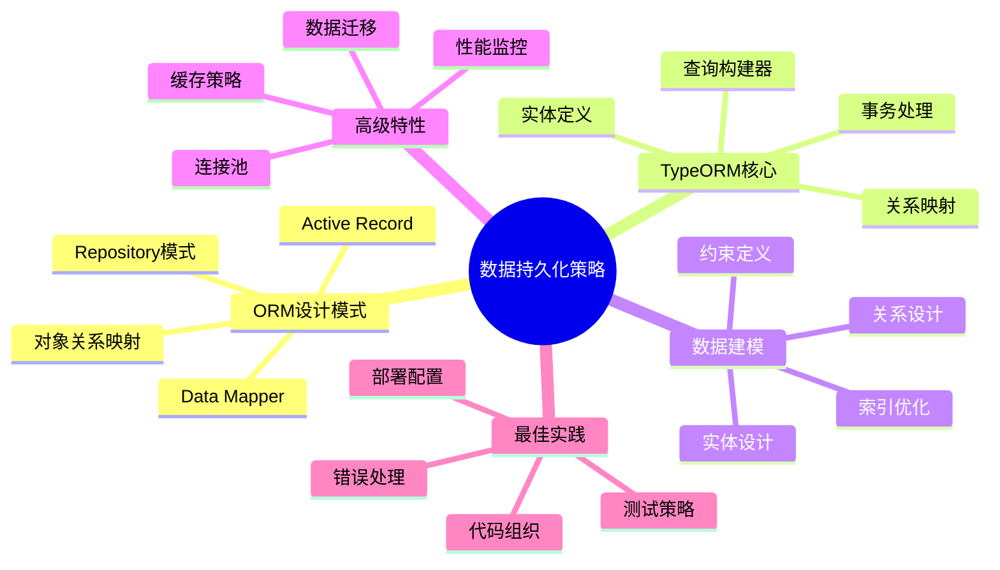
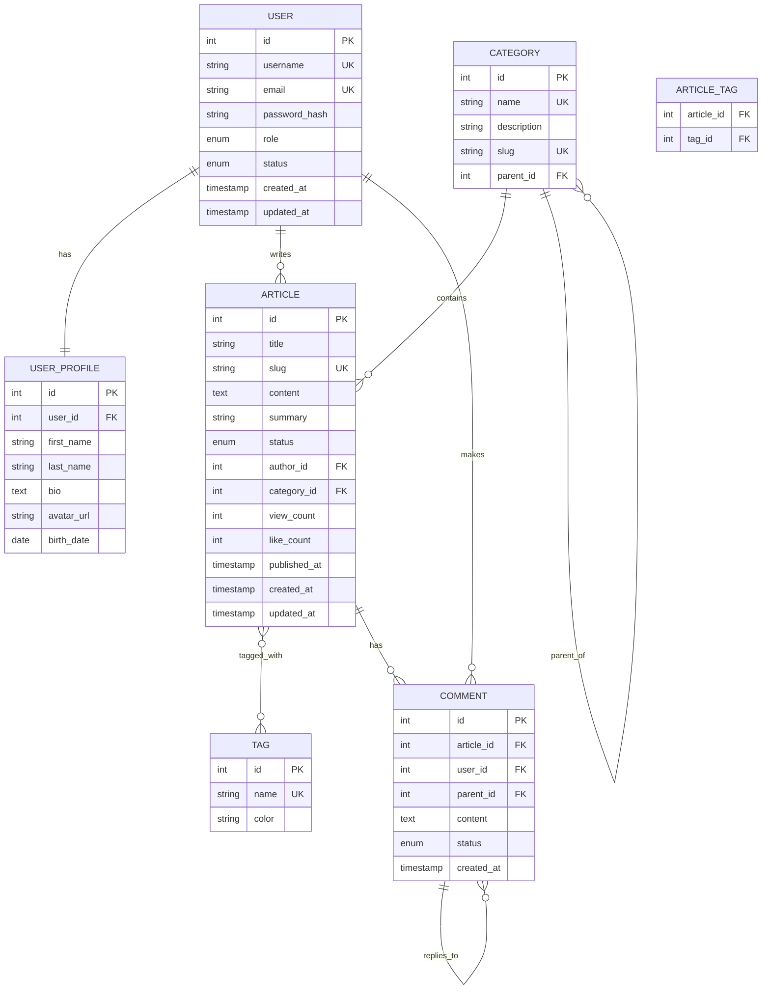

# 🗃️ 第4章：数据持久化策略 - 完整教学版

> **从数据库设计到ORM实践** - 构建高效、可维护的数据层架构

## 📋 章节概述

### 🎯 学习目标
通过本章学习，您将能够：
- 深入理解ORM设计模式的核心思想和实现原理
- 熟练掌握TypeORM的配置、使用和最佳实践
- 设计合理的数据模型和实体关系映射
- 实现高效的数据查询和操作策略
- 掌握数据库迁移和版本控制方法
- 理解并应用数据库性能优化技巧

### ⏰ 学习时间安排
- **总学习时长**：4-6小时
- **理论学习**：2小时
- **实践编程**：2-3小时
- **项目练习**：1小时

### 🎓 难度等级
⭐⭐⭐☆☆ (中等难度)

### 📚 前置知识要求
- ✅ 数据库基础概念和SQL语言
- ✅ TypeScript基础语法
- ✅ NestJS模块系统和依赖注入
- ✅ 装饰器模式的基本理解

### 🏆 学习成果
完成本章学习后，您将具备：
- 企业级数据层架构设计能力
- TypeORM高级特性应用技能
- 数据库性能优化实践经验
- 数据迁移和版本管理能力

## 🎨 知识架构图



## 🎯 第一节：ORM设计模式深度解析

### 📖 1.1 什么是ORM？

#### 🎯 一句话概括
**ORM（Object-Relational Mapping）是连接面向对象编程语言和关系型数据库的桥梁。**

#### 🏗️ 生活类比理解
想象您是一位翻译官：
- **对象世界** = 中文世界（程序员熟悉的语言）
- **关系数据库** = 英文世界（数据库的语言）
- **ORM** = 翻译官（自动在两种语言间转换）

```typescript
// 程序员看到的（对象世界）
const user = new User();
user.name = "张三";
user.email = "zhangsan@example.com";
await user.save();

// 数据库执行的（SQL世界）
// INSERT INTO users (name, email) VALUES ('张三', 'zhangsan@example.com');
```

#### 🔍 ORM解决的核心问题

**1. 阻抗不匹配问题**
```typescript
// 对象模型：继承、封装、多态
class User {
  private id: number;
  private profile: UserProfile;
  
  public getFullName(): string {
    return `${this.profile.firstName} ${this.profile.lastName}`;
  }
}

// 关系模型：表、行、列
// users表: id, first_name, last_name, email
// user_profiles表: user_id, bio, avatar_url
```

**2. 重复性代码问题**
```typescript
// 没有ORM时的重复代码
class UserRepository {
  async findById(id: number): Promise<User> {
    const sql = 'SELECT * FROM users WHERE id = ?';
    const result = await this.db.query(sql, [id]);
    return this.mapRowToUser(result[0]); // 手动映射
  }
  
  async save(user: User): Promise<void> {
    const sql = 'INSERT INTO users (name, email) VALUES (?, ?)';
    await this.db.query(sql, [user.name, user.email]);
  }
  
  // 每个实体都需要类似的CRUD代码...
}

// 使用ORM后
@Entity()
class User {
  @PrimaryGeneratedColumn()
  id: number;
  
  @Column()
  name: string;
  
  @Column()
  email: string;
}

// 自动获得所有CRUD操作
const userRepository = getRepository(User);
const user = await userRepository.findOne(1);
await userRepository.save(user);
```

### 🏛️ 1.2 ORM架构模式对比

#### 🎯 Active Record 模式

**核心思想**：数据和行为合并在一个对象中

```typescript
// Active Record 示例
class User extends ActiveRecord {
  @Column()
  name: string;
  
  @Column()
  email: string;
  
  // 数据操作方法直接在实体上
  async save(): Promise<void> {
    return super.save();
  }
  
  async delete(): Promise<void> {
    return super.delete();
  }
  
  // 业务逻辑也在实体上
  isAdmin(): boolean {
    return this.role === 'admin';
  }
  
  sendWelcomeEmail(): void {
    // 发送邮件逻辑
  }
}

// 使用方式
const user = new User();
user.name = "张三";
await user.save(); // 直接调用实体方法
```

**优点**：
- 简单直观，容易理解
- 代码量少，开发快速
- 适合简单的CRUD操作

**缺点**：
- 违反单一职责原则
- 难以进行单元测试
- 业务逻辑和数据访问耦合

#### 🎯 Data Mapper 模式

**核心思想**：数据和行为分离，通过映射器操作数据

```typescript
// Data Mapper 示例
@Entity()
class User {
  @PrimaryGeneratedColumn()
  id: number;
  
  @Column()
  name: string;
  
  @Column()
  email: string;
  
  @Column()
  role: string;
  
  // 只包含业务逻辑，不包含数据操作
  isAdmin(): boolean {
    return this.role === 'admin';
  }
  
  getDisplayName(): string {
    return this.name.toUpperCase();
  }
}

// 数据访问通过Repository
@Injectable()
class UserRepository {
  constructor(
    @InjectRepository(User)
    private repository: Repository<User>,
  ) {}
  
  async findById(id: number): Promise<User> {
    return this.repository.findOne({ where: { id } });
  }
  
  async save(user: User): Promise<User> {
    return this.repository.save(user);
  }
  
  async findAdmins(): Promise<User[]> {
    return this.repository.find({ where: { role: 'admin' } });
  }
}

// 使用方式
const user = new User();
user.name = "张三";
const savedUser = await userRepository.save(user);
```

**优点**：
- 职责分离，易于测试
- 业务逻辑和数据访问解耦
- 更好的可维护性

**缺点**：
- 代码量相对较多
- 学习曲线较陡峭

#### 🏆 TypeORM的选择：Data Mapper + Repository

TypeORM采用Data Mapper模式，并提供Repository模式来管理数据访问：

```typescript
// TypeORM的最佳实践
@Entity()
export class User {
  @PrimaryGeneratedColumn()
  id: number;
  
  @Column({ unique: true })
  username: string;
  
  @Column({ unique: true })
  email: string;
  
  @Column()
  passwordHash: string;
  
  @CreateDateColumn()
  createdAt: Date;
  
  @UpdateDateColumn()
  updatedAt: Date;
  
  // 只包含业务逻辑
  validatePassword(password: string): boolean {
    return bcrypt.compareSync(password, this.passwordHash);
  }
  
  toJSON() {
    const { passwordHash, ...result } = this;
    return result;
  }
}

@Injectable()
export class UserService {
  constructor(
    @InjectRepository(User)
    private userRepository: Repository<User>,
  ) {}
  
  async createUser(userData: CreateUserDto): Promise<User> {
    const user = this.userRepository.create(userData);
    return this.userRepository.save(user);
  }
  
  async findByEmail(email: string): Promise<User> {
    return this.userRepository.findOne({ where: { email } });
  }
}
```

### 🔧 1.3 TypeORM核心概念

#### 📊 实体 (Entity)
实体是数据库表在代码中的映射：

```typescript
@Entity('users') // 指定表名
export class User {
  @PrimaryGeneratedColumn()
  id: number;
  
  @Column({ 
    type: 'varchar', 
    length: 50, 
    unique: true,
    comment: '用户名'
  })
  username: string;
  
  @Column({
    type: 'varchar',
    length: 100,
    unique: true
  })
  email: string;
  
  @Column({ select: false }) // 查询时默认不选择此字段
  passwordHash: string;
  
  @Column({
    type: 'enum',
    enum: ['admin', 'user', 'moderator'],
    default: 'user'
  })
  role: string;
  
  @Column({ default: true })
  isActive: boolean;
  
  @CreateDateColumn()
  createdAt: Date;
  
  @UpdateDateColumn()
  updatedAt: Date;
  
  @DeleteDateColumn() // 软删除
  deletedAt?: Date;
}
```

#### 🔗 关系映射 (Relations)

**一对一关系**：
```typescript
@Entity()
export class User {
  @PrimaryGeneratedColumn()
  id: number;
  
  @Column()
  username: string;
  
  @OneToOne(() => UserProfile, profile => profile.user, { cascade: true })
  @JoinColumn()
  profile: UserProfile;
}

@Entity()
export class UserProfile {
  @PrimaryGeneratedColumn()
  id: number;
  
  @Column({ nullable: true })
  bio: string;
  
  @Column({ nullable: true })
  avatarUrl: string;
  
  @OneToOne(() => User, user => user.profile)
  user: User;
}
```

**一对多关系**：
```typescript
@Entity()
export class Category {
  @PrimaryGeneratedColumn()
  id: number;
  
  @Column()
  name: string;
  
  @OneToMany(() => Article, article => article.category)
  articles: Article[];
}

@Entity()
export class Article {
  @PrimaryGeneratedColumn()
  id: number;
  
  @Column()
  title: string;
  
  @ManyToOne(() => Category, category => category.articles)
  category: Category;
  
  @ManyToOne(() => User, user => user.articles)
  author: User;
}
```

**多对多关系**：
```typescript
@Entity()
export class Article {
  @PrimaryGeneratedColumn()
  id: number;
  
  @Column()
  title: string;
  
  @ManyToMany(() => Tag, tag => tag.articles, { cascade: true })
  @JoinTable({
    name: 'article_tags',
    joinColumn: { name: 'article_id', referencedColumnName: 'id' },
    inverseJoinColumn: { name: 'tag_id', referencedColumnName: 'id' }
  })
  tags: Tag[];
}

@Entity()
export class Tag {
  @PrimaryGeneratedColumn()
  id: number;
  
  @Column({ unique: true })
  name: string;
  
  @ManyToMany(() => Article, article => article.tags)
  articles: Article[];
}
```

## 🛠️ 第二节：TypeORM实战配置

### ⚙️ 2.1 项目初始化和配置

#### 📦 安装依赖
```bash
# 安装TypeORM和相关依赖
npm install @nestjs/typeorm typeorm

# 安装数据库驱动（选择一个）
npm install pg @types/pg          # PostgreSQL
npm install mysql2                # MySQL
npm install sqlite3               # SQLite
npm install mongodb               # MongoDB
```

#### 🔧 数据库配置

**方式1：直接配置**
```typescript
// app.module.ts
import { Module } from '@nestjs/common';
import { TypeOrmModule } from '@nestjs/typeorm';
import { User } from './entities/user.entity';
import { Article } from './entities/article.entity';

@Module({
  imports: [
    TypeOrmModule.forRoot({
      type: 'postgres',
      host: 'localhost',
      port: 5432,
      username: 'postgres',
      password: 'password',
      database: 'blog_db',
      entities: [User, Article],
      synchronize: true, // 开发环境使用，生产环境禁用
      logging: true,     // 开发环境查看SQL日志
    }),
  ],
})
export class AppModule {}
```

**方式2：配置文件**
```typescript
// config/database.config.ts
import { TypeOrmModuleOptions } from '@nestjs/typeorm';
import { ConfigService } from '@nestjs/config';

export const getDatabaseConfig = (
  configService: ConfigService,
): TypeOrmModuleOptions => ({
  type: 'postgres',
  host: configService.get('DB_HOST', 'localhost'),
  port: configService.get('DB_PORT', 5432),
  username: configService.get('DB_USERNAME', 'postgres'),
  password: configService.get('DB_PASSWORD', 'password'),
  database: configService.get('DB_NAME', 'blog_db'),
  entities: [__dirname + '/../**/*.entity{.ts,.js}'],
  migrations: [__dirname + '/../migrations/*{.ts,.js}'],
  synchronize: configService.get('NODE_ENV') !== 'production',
  logging: configService.get('NODE_ENV') === 'development',
  ssl: configService.get('NODE_ENV') === 'production' ? { rejectUnauthorized: false } : false,
});

// app.module.ts
@Module({
  imports: [
    ConfigModule.forRoot({ isGlobal: true }),
    TypeOrmModule.forRootAsync({
      imports: [ConfigModule],
      useFactory: getDatabaseConfig,
      inject: [ConfigService],
    }),
  ],
})
export class AppModule {}
```

**环境变量配置**：
```bash
# .env
DB_HOST=localhost
DB_PORT=5432
DB_USERNAME=postgres
DB_PASSWORD=password
DB_NAME=blog_db
NODE_ENV=development
```

### 🏗️ 2.2 实体设计最佳实践

#### 📋 基础实体类
```typescript
// entities/base.entity.ts
import {
  PrimaryGeneratedColumn,
  CreateDateColumn,
  UpdateDateColumn,
  DeleteDateColumn,
  VersionColumn,
} from 'typeorm';

export abstract class BaseEntity {
  @PrimaryGeneratedColumn()
  id: number;
  
  @CreateDateColumn({
    type: 'timestamp',
    default: () => 'CURRENT_TIMESTAMP(6)',
  })
  createdAt: Date;
  
  @UpdateDateColumn({
    type: 'timestamp',
    default: () => 'CURRENT_TIMESTAMP(6)',
    onUpdate: 'CURRENT_TIMESTAMP(6)',
  })
  updatedAt: Date;
  
  @DeleteDateColumn()
  deletedAt?: Date;
  
  @VersionColumn()
  version: number;
}
```

#### 👤 用户实体设计
```typescript
// entities/user.entity.ts
import { Entity, Column, OneToMany, OneToOne, Index } from 'typeorm';
import { BaseEntity } from './base.entity';
import { Article } from './article.entity';
import { UserProfile } from './user-profile.entity';
import { Exclude } from 'class-transformer';

export enum UserRole {
  ADMIN = 'admin',
  AUTHOR = 'author',
  READER = 'reader',
}

export enum UserStatus {
  ACTIVE = 'active',
  INACTIVE = 'inactive',
  SUSPENDED = 'suspended',
}

@Entity('users')
@Index(['email']) // 为常用查询字段添加索引
@Index(['username'])
export class User extends BaseEntity {
  @Column({
    type: 'varchar',
    length: 50,
    unique: true,
    comment: '用户名，全局唯一',
  })
  username: string;
  
  @Column({
    type: 'varchar',
    length: 100,
    unique: true,
    comment: '邮箱地址，全局唯一',
  })
  email: string;
  
  @Column({
    type: 'varchar',
    length: 255,
    select: false, // 默认查询时不包含密码
    comment: '密码哈希值',
  })
  @Exclude() // 序列化时排除
  passwordHash: string;
  
  @Column({
    type: 'enum',
    enum: UserRole,
    default: UserRole.READER,
    comment: '用户角色',
  })
  role: UserRole;
  
  @Column({
    type: 'enum',
    enum: UserStatus,
    default: UserStatus.ACTIVE,
    comment: '用户状态',
  })
  status: UserStatus;
  
  @Column({
    type: 'timestamp',
    nullable: true,
    comment: '最后登录时间',
  })
  lastLoginAt?: Date;
  
  @Column({
    type: 'varchar',
    length: 45,
    nullable: true,
    comment: '最后登录IP',
  })
  lastLoginIp?: string;
  
  @Column({
    type: 'boolean',
    default: false,
    comment: '邮箱是否已验证',
  })
  emailVerified: boolean;
  
  @Column({
    type: 'varchar',
    length: 255,
    nullable: true,
    comment: '邮箱验证令牌',
  })
  emailVerificationToken?: string;
  
  // 关系映射
  @OneToOne(() => UserProfile, profile => profile.user, {
    cascade: true,
    eager: false, // 不自动加载关联数据
  })
  profile: UserProfile;
  
  @OneToMany(() => Article, article => article.author)
  articles: Article[];
  
  // 业务方法
  isAdmin(): boolean {
    return this.role === UserRole.ADMIN;
  }
  
  isActive(): boolean {
    return this.status === UserStatus.ACTIVE;
  }
  
  updateLastLogin(ip: string): void {
    this.lastLoginAt = new Date();
    this.lastLoginIp = ip;
  }
  
  // 序列化控制
  toJSON() {
    const { passwordHash, emailVerificationToken, ...result } = this;
    return result;
  }
}
```

#### 📝 文章实体设计
```typescript
// entities/article.entity.ts
import {
  Entity,
  Column,
  ManyToOne,
  ManyToMany,
  JoinTable,
  Index,
  BeforeInsert,
  BeforeUpdate,
} from 'typeorm';
import { BaseEntity } from './base.entity';
import { User } from './user.entity';
import { Category } from './category.entity';
import { Tag } from './tag.entity';

export enum ArticleStatus {
  DRAFT = 'draft',
  PUBLISHED = 'published',
  ARCHIVED = 'archived',
}

@Entity('articles')
@Index(['status', 'publishedAt']) // 复合索引
@Index(['authorId', 'status'])
export class Article extends BaseEntity {
  @Column({
    type: 'varchar',
    length: 200,
    comment: '文章标题',
  })
  title: string;
  
  @Column({
    type: 'varchar',
    length: 500,
    nullable: true,
    comment: '文章摘要',
  })
  summary?: string;
  
  @Column({
    type: 'text',
    comment: '文章内容',
  })
  content: string;
  
  @Column({
    type: 'varchar',
    length: 200,
    unique: true,
    comment: 'URL友好的标识符',
  })
  slug: string;
  
  @Column({
    type: 'varchar',
    length: 500,
    nullable: true,
    comment: '封面图片URL',
  })
  coverImage?: string;
  
  @Column({
    type: 'enum',
    enum: ArticleStatus,
    default: ArticleStatus.DRAFT,
    comment: '文章状态',
  })
  status: ArticleStatus;
  
  @Column({
    type: 'timestamp',
    nullable: true,
    comment: '发布时间',
  })
  publishedAt?: Date;
  
  @Column({
    type: 'int',
    default: 0,
    comment: '阅读次数',
  })
  viewCount: number;
  
  @Column({
    type: 'int',
    default: 0,
    comment: '点赞次数',
  })
  likeCount: number;
  
  @Column({
    type: 'int',
    default: 0,
    comment: '评论次数',
  })
  commentCount: number;
  
  @Column({
    type: 'json',
    nullable: true,
    comment: 'SEO元数据',
  })
  seoMeta?: {
    metaTitle?: string;
    metaDescription?: string;
    keywords?: string[];
  };
  
  // 关系映射
  @ManyToOne(() => User, user => user.articles, {
    nullable: false,
    onDelete: 'CASCADE',
  })
  author: User;
  
  @Column()
  authorId: number; // 外键字段，便于查询
  
  @ManyToOne(() => Category, category => category.articles, {
    nullable: true,
    onDelete: 'SET NULL',
  })
  category?: Category;
  
  @Column({ nullable: true })
  categoryId?: number;
  
  @ManyToMany(() => Tag, tag => tag.articles, {
    cascade: true,
  })
  @JoinTable({
    name: 'article_tags',
    joinColumn: { name: 'article_id', referencedColumnName: 'id' },
    inverseJoinColumn: { name: 'tag_id', referencedColumnName: 'id' },
  })
  tags: Tag[];
  
  // 生命周期钩子
  @BeforeInsert()
  @BeforeUpdate()
  generateSlug() {
    if (!this.slug && this.title) {
      this.slug = this.title
        .toLowerCase()
        .replace(/[^a-z0-9\s-]/g, '')
        .replace(/\s+/g, '-')
        .replace(/-+/g, '-')
        .trim();
    }
  }
  
  @BeforeInsert()
  setPublishedAt() {
    if (this.status === ArticleStatus.PUBLISHED && !this.publishedAt) {
      this.publishedAt = new Date();
    }
  }
  
  // 业务方法
  isPublished(): boolean {
    return this.status === ArticleStatus.PUBLISHED;
  }
  
  incrementViewCount(): void {
    this.viewCount += 1;
  }
  
  publish(): void {
    this.status = ArticleStatus.PUBLISHED;
    this.publishedAt = new Date();
  }
  
  archive(): void {
    this.status = ArticleStatus.ARCHIVED;
  }
}
```

### 🔄 2.3 Repository模式实现

#### 📚 基础Repository服务
```typescript
// services/base-repository.service.ts
import { Repository, FindOptionsWhere, FindManyOptions } from 'typeorm';
import { BaseEntity } from '../entities/base.entity';

export abstract class BaseRepositoryService<T extends BaseEntity> {
  constructor(protected readonly repository: Repository<T>) {}
  
  async findById(id: number): Promise<T | null> {
    return this.repository.findOne({ where: { id } as FindOptionsWhere<T> });
  }
  
  async findAll(options?: FindManyOptions<T>): Promise<T[]> {
    return this.repository.find(options);
  }
  
  async create(entityData: Partial<T>): Promise<T> {
    const entity = this.repository.create(entityData);
    return this.repository.save(entity);
  }
  
  async update(id: number, updateData: Partial<T>): Promise<T | null> {
    await this.repository.update(id, updateData);
    return this.findById(id);
  }
  
  async delete(id: number): Promise<boolean> {
    const result = await this.repository.delete(id);
    return result.affected > 0;
  }
  
  async softDelete(id: number): Promise<boolean> {
    const result = await this.repository.softDelete(id);
    return result.affected > 0;
  }
  
  async count(options?: FindManyOptions<T>): Promise<number> {
    return this.repository.count(options);
  }
  
  async exists(where: FindOptionsWhere<T>): Promise<boolean> {
    const count = await this.repository.count({ where });
    return count > 0;
  }
}
```

#### 👤 用户Repository服务
```typescript
// services/user-repository.service.ts
import { Injectable } from '@nestjs/common';
import { InjectRepository } from '@nestjs/typeorm';
import { Repository } from 'typeorm';
import { User, UserRole, UserStatus } from '../entities/user.entity';
import { BaseRepositoryService } from './base-repository.service';

@Injectable()
export class UserRepositoryService extends BaseRepositoryService<User> {
  constructor(
    @InjectRepository(User)
    repository: Repository<User>,
  ) {
    super(repository);
  }
  
  async findByEmail(email: string): Promise<User | null> {
    return this.repository.findOne({
      where: { email },
      select: ['id', 'username', 'email', 'role', 'status', 'passwordHash'],
    });
  }
  
  async findByUsername(username: string): Promise<User | null> {
    return this.repository.findOne({
      where: { username },
    });
  }
  
  async findByEmailOrUsername(emailOrUsername: string): Promise<User | null> {
    return this.repository.findOne({
      where: [
        { email: emailOrUsername },
        { username: emailOrUsername },
      ],
      select: ['id', 'username', 'email', 'role', 'status', 'passwordHash'],
    });
  }
  
  async findActiveUsers(): Promise<User[]> {
    return this.repository.find({
      where: { status: UserStatus.ACTIVE },
    });
  }
  
  async findUsersByRole(role: UserRole): Promise<User[]> {
    return this.repository.find({
      where: { role },
    });
  }
  
  async updateLastLogin(userId: number, ip: string): Promise<void> {
    await this.repository.update(userId, {
      lastLoginAt: new Date(),
      lastLoginIp: ip,
    });
  }
  
  async verifyEmail(userId: number): Promise<void> {
    await this.repository.update(userId, {
      emailVerified: true,
      emailVerificationToken: null,
    });
  }
  
  async changePassword(userId: number, passwordHash: string): Promise<void> {
    await this.repository.update(userId, { passwordHash });
  }
  
  async getUserStats(): Promise<{
    total: number;
    active: number;
    inactive: number;
    byRole: Record<UserRole, number>;
  }> {
    const [total, active, inactive] = await Promise.all([
      this.repository.count(),
      this.repository.count({ where: { status: UserStatus.ACTIVE } }),
      this.repository.count({ where: { status: UserStatus.INACTIVE } }),
    ]);
    
    const byRole = {} as Record<UserRole, number>;
    for (const role of Object.values(UserRole)) {
      byRole[role] = await this.repository.count({ where: { role } });
    }
    
    return { total, active, inactive, byRole };
  }
}
```

---

> **🎯 第一部分总结**：
> 
> 我们已经学习了：
> 1. ORM设计模式的核心思想和优势
> 2. Active Record vs Data Mapper模式对比
> 3. TypeORM的基础配置和项目初始化
> 4. 实体设计的最佳实践
> 5. Repository模式的实现方法
> 
> **下一部分预告**：我们将深入学习查询构建器、事务处理、数据迁移等高级特性。

**🚀 继续学习第二部分，掌握TypeORM的高级特性和性能优化技巧！**

## 🔍 第三节：高级查询技术

### 🛠️ 3.1 查询构建器 (Query Builder)

#### 🎯 为什么需要查询构建器？

当简单的Repository方法无法满足复杂查询需求时，查询构建器提供了更灵活的解决方案：

```typescript
// 简单查询：Repository方法足够
const users = await userRepository.find({ where: { status: 'active' } });

// 复杂查询：需要查询构建器
const result = await userRepository
  .createQueryBuilder('user')
  .leftJoinAndSelect('user.profile', 'profile')
  .leftJoinAndSelect('user.articles', 'article')
  .where('user.status = :status', { status: 'active' })
  .andWhere('article.publishedAt > :date', { date: new Date('2023-01-01') })
  .groupBy('user.id')
  .having('COUNT(article.id) > :count', { count: 5 })
  .orderBy('user.createdAt', 'DESC')
  .limit(10)
  .getMany();
```

#### 🔧 基础查询构建

```typescript
// services/article-query.service.ts
import { Injectable } from '@nestjs/common';
import { InjectRepository } from '@nestjs/typeorm';
import { Repository, SelectQueryBuilder } from 'typeorm';
import { Article, ArticleStatus } from '../entities/article.entity';

export interface ArticleQueryOptions {
  status?: ArticleStatus;
  authorId?: number;
  categoryId?: number;
  tags?: string[];
  search?: string;
  dateFrom?: Date;
  dateTo?: Date;
  page?: number;
  limit?: number;
  sortBy?: 'createdAt' | 'publishedAt' | 'viewCount' | 'likeCount';
  sortOrder?: 'ASC' | 'DESC';
}

@Injectable()
export class ArticleQueryService {
  constructor(
    @InjectRepository(Article)
    private articleRepository: Repository<Article>,
  ) {}
  
  private createBaseQuery(): SelectQueryBuilder<Article> {
    return this.articleRepository
      .createQueryBuilder('article')
      .leftJoinAndSelect('article.author', 'author')
      .leftJoinAndSelect('article.category', 'category')
      .leftJoinAndSelect('article.tags', 'tags');
  }
  
  async findArticles(options: ArticleQueryOptions = {}) {
    const {
      status,
      authorId,
      categoryId,
      tags,
      search,
      dateFrom,
      dateTo,
      page = 1,
      limit = 10,
      sortBy = 'createdAt',
      sortOrder = 'DESC',
    } = options;
    
    let query = this.createBaseQuery();
    
    // 状态筛选
    if (status) {
      query = query.andWhere('article.status = :status', { status });
    }
    
    // 作者筛选
    if (authorId) {
      query = query.andWhere('article.authorId = :authorId', { authorId });
    }
    
    // 分类筛选
    if (categoryId) {
      query = query.andWhere('article.categoryId = :categoryId', { categoryId });
    }
    
    // 标签筛选
    if (tags && tags.length > 0) {
      query = query.andWhere('tags.name IN (:...tags)', { tags });
    }
    
    // 全文搜索
    if (search) {
      query = query.andWhere(
        '(article.title ILIKE :search OR article.content ILIKE :search OR article.summary ILIKE :search)',
        { search: `%${search}%` }
      );
    }
    
    // 日期范围筛选
    if (dateFrom) {
      query = query.andWhere('article.publishedAt >= :dateFrom', { dateFrom });
    }
    if (dateTo) {
      query = query.andWhere('article.publishedAt <= :dateTo', { dateTo });
    }
    
    // 排序
    const sortField = `article.${sortBy}`;
    query = query.orderBy(sortField, sortOrder);
    
    // 分页
    const offset = (page - 1) * limit;
    query = query.skip(offset).take(limit);
    
    // 执行查询
    const [articles, total] = await query.getManyAndCount();
    
    return {
      articles,
      pagination: {
        page,
        limit,
        total,
        totalPages: Math.ceil(total / limit),
        hasNext: page * limit < total,
        hasPrev: page > 1,
      },
    };
  }
  
  async getPopularArticles(limit: number = 10): Promise<Article[]> {
    return this.createBaseQuery()
      .where('article.status = :status', { status: ArticleStatus.PUBLISHED })
      .orderBy('article.viewCount', 'DESC')
      .addOrderBy('article.likeCount', 'DESC')
      .limit(limit)
      .getMany();
  }
  
  async getArticlesByTag(tagName: string): Promise<Article[]> {
    return this.createBaseQuery()
      .where('article.status = :status', { status: ArticleStatus.PUBLISHED })
      .andWhere('tags.name = :tagName', { tagName })
      .orderBy('article.publishedAt', 'DESC')
      .getMany();
  }
  
  async getArticleStats() {
    const result = await this.articleRepository
      .createQueryBuilder('article')
      .select([
        'COUNT(*) as total',
        'COUNT(CASE WHEN article.status = :published THEN 1 END) as published',
        'COUNT(CASE WHEN article.status = :draft THEN 1 END) as draft',
        'AVG(article.viewCount) as avgViews',
        'SUM(article.viewCount) as totalViews',
      ])
      .setParameters({
        published: ArticleStatus.PUBLISHED,
        draft: ArticleStatus.DRAFT,
      })
      .getRawOne();
    
    return {
      total: parseInt(result.total),
      published: parseInt(result.published),
      draft: parseInt(result.draft),
      avgViews: parseFloat(result.avgviews) || 0,
      totalViews: parseInt(result.totalviews) || 0,
    };
  }
}
```

#### 🔗 复杂关联查询

```typescript
// 查询用户及其文章统计信息
async getUsersWithArticleStats() {
  return this.userRepository
    .createQueryBuilder('user')
    .leftJoin('user.articles', 'article')
    .select([
      'user.id',
      'user.username',
      'user.email',
      'user.role',
      'COUNT(article.id) as articleCount',
      'COUNT(CASE WHEN article.status = :published THEN 1 END) as publishedCount',
      'SUM(article.viewCount) as totalViews',
      'AVG(article.viewCount) as avgViews',
    ])
    .where('user.status = :status', { status: UserStatus.ACTIVE })
    .setParameter('published', ArticleStatus.PUBLISHED)
    .groupBy('user.id')
    .orderBy('publishedCount', 'DESC')
    .getRawMany();
}

// 查询热门标签
async getPopularTags(limit: number = 20) {
  return this.tagRepository
    .createQueryBuilder('tag')
    .leftJoin('tag.articles', 'article')
    .select([
      'tag.id',
      'tag.name',
      'COUNT(article.id) as articleCount',
    ])
    .where('article.status = :status', { status: ArticleStatus.PUBLISHED })
    .groupBy('tag.id')
    .orderBy('articleCount', 'DESC')
    .limit(limit)
    .getRawMany();
}

// 子查询示例
async getAuthorsWithRecentArticles() {
  const subQuery = this.articleRepository
    .createQueryBuilder('article')
    .select('article.authorId')
    .where('article.publishedAt > :date', { date: new Date('2023-01-01') })
    .andWhere('article.status = :status', { status: ArticleStatus.PUBLISHED })
    .getQuery();
  
  return this.userRepository
    .createQueryBuilder('user')
    .where(`user.id IN (${subQuery})`)
    .setParameters({ date: new Date('2023-01-01'), status: ArticleStatus.PUBLISHED })
    .getMany();
}
```

### 💾 3.2 事务处理

#### 🎯 事务的重要性

**生活类比**：事务就像银行转账，要么全部成功，要么全部失败，不能出现钱从A账户扣了但没到B账户的情况。

```typescript
// 没有事务的危险操作
async transferPoints(fromUserId: number, toUserId: number, points: number) {
  // ❌ 如果第二步失败，第一步已经执行，数据不一致
  await this.userRepository.decrement({ id: fromUserId }, 'points', points);
  await this.userRepository.increment({ id: toUserId }, 'points', points);
}

// 使用事务的安全操作
async transferPointsSafely(fromUserId: number, toUserId: number, points: number) {
  return this.dataSource.transaction(async manager => {
    // ✅ 要么全部成功，要么全部回滚
    await manager.decrement(User, { id: fromUserId }, 'points', points);
    await manager.increment(User, { id: toUserId }, 'points', points);
    
    // 记录转账日志
    await manager.save(PointsTransfer, {
      fromUserId,
      toUserId,
      points,
      createdAt: new Date(),
    });
  });
}
```

#### 🔧 事务实现方式

**方式1：使用DataSource事务**
```typescript
import { Injectable } from '@nestjs/common';
import { DataSource } from 'typeorm';
import { User } from '../entities/user.entity';
import { Article } from '../entities/article.entity';

@Injectable()
export class ArticleService {
  constructor(private dataSource: DataSource) {}
  
  async publishArticle(articleId: number, authorId: number) {
    return this.dataSource.transaction(async manager => {
      // 1. 更新文章状态
      const article = await manager.findOne(Article, { 
        where: { id: articleId, authorId } 
      });
      
      if (!article) {
        throw new Error('Article not found');
      }
      
      article.status = ArticleStatus.PUBLISHED;
      article.publishedAt = new Date();
      await manager.save(article);
      
      // 2. 更新用户文章计数
      await manager.increment(User, { id: authorId }, 'publishedArticleCount', 1);
      
      // 3. 如果是用户第一篇文章，升级角色
      const user = await manager.findOne(User, { where: { id: authorId } });
      if (user.publishedArticleCount === 1 && user.role === UserRole.READER) {
        user.role = UserRole.AUTHOR;
        await manager.save(user);
      }
      
      return article;
    });
  }
}
```

**方式2：使用Repository事务**
```typescript
@Injectable()
export class UserService {
  constructor(
    @InjectRepository(User)
    private userRepository: Repository<User>,
    @InjectRepository(UserProfile)
    private profileRepository: Repository<UserProfile>,
  ) {}
  
  async createUserWithProfile(userData: CreateUserDto, profileData: CreateProfileDto) {
    const queryRunner = this.userRepository.manager.connection.createQueryRunner();
    
    await queryRunner.connect();
    await queryRunner.startTransaction();
    
    try {
      // 1. 创建用户
      const user = queryRunner.manager.create(User, userData);
      const savedUser = await queryRunner.manager.save(user);
      
      // 2. 创建用户资料
      const profile = queryRunner.manager.create(UserProfile, {
        ...profileData,
        userId: savedUser.id,
      });
      await queryRunner.manager.save(profile);
      
      // 3. 发送欢迎邮件（如果失败不影响用户创建）
      try {
        await this.emailService.sendWelcomeEmail(savedUser.email);
      } catch (error) {
        console.warn('Failed to send welcome email:', error);
        // 不抛出错误，允许事务继续
      }
      
      await queryRunner.commitTransaction();
      return savedUser;
      
    } catch (error) {
      await queryRunner.rollbackTransaction();
      throw error;
    } finally {
      await queryRunner.release();
    }
  }
}
```

**方式3：使用装饰器事务**
```typescript
import { Injectable } from '@nestjs/common';
import { InjectDataSource } from '@nestjs/typeorm';
import { DataSource } from 'typeorm';
import { Transactional } from 'typeorm-transactional';

@Injectable()
export class OrderService {
  constructor(
    @InjectDataSource()
    private dataSource: DataSource,
  ) {}
  
  @Transactional()
  async createOrder(orderData: CreateOrderDto) {
    // 这个方法会自动包装在事务中
    const order = await this.orderRepository.save(orderData);
    
    // 减少库存
    await this.productService.decreaseStock(orderData.productId, orderData.quantity);
    
    // 创建支付记录
    await this.paymentService.createPayment(order.id, orderData.amount);
    
    return order;
  }
}
```

#### 🔒 事务隔离级别

```typescript
// 设置事务隔离级别
async performCriticalOperation() {
  return this.dataSource.transaction(
    'SERIALIZABLE', // 最高隔离级别
    async manager => {
      // 执行需要高一致性的操作
      const account = await manager.findOne(Account, { where: { id: 1 } });
      
      if (account.balance < 100) {
        throw new Error('Insufficient balance');
      }
      
      account.balance -= 100;
      await manager.save(account);
    }
  );
}

// 不同隔离级别的使用场景
async readCommittedExample() {
  return this.dataSource.transaction(
    'READ COMMITTED', // 适合大多数业务场景
    async manager => {
      // 执行一般的业务操作
    }
  );
}
```

### 🔄 3.3 数据迁移管理

#### 🎯 什么是数据迁移？

**生活类比**：数据迁移就像房屋装修，需要有计划地改变数据库结构，同时保证数据不丢失。

#### 📋 迁移配置

```typescript
// config/migration.config.ts
import { DataSource } from 'typeorm';
import { ConfigService } from '@nestjs/config';

const configService = new ConfigService();

export const AppDataSource = new DataSource({
  type: 'postgres',
  host: configService.get('DB_HOST'),
  port: configService.get('DB_PORT'),
  username: configService.get('DB_USERNAME'),
  password: configService.get('DB_PASSWORD'),
  database: configService.get('DB_NAME'),
  entities: ['src/**/*.entity.ts'],
  migrations: ['src/migrations/*.ts'],
  synchronize: false, // 生产环境必须为false
  logging: true,
});
```

#### 🛠️ 创建迁移文件

```bash
# 生成迁移文件
npm run typeorm migration:generate -- src/migrations/CreateUserTable

# 创建空白迁移文件
npm run typeorm migration:create -- src/migrations/AddUserIndexes

# 运行迁移
npm run typeorm migration:run

# 回滚迁移
npm run typeorm migration:revert
```

#### 📝 迁移文件示例

```typescript
// migrations/1640995200000-CreateUserTable.ts
import { MigrationInterface, QueryRunner, Table, Index } from 'typeorm';

export class CreateUserTable1640995200000 implements MigrationInterface {
  name = 'CreateUserTable1640995200000';
  
  public async up(queryRunner: QueryRunner): Promise<void> {
    // 创建用户表
    await queryRunner.createTable(
      new Table({
        name: 'users',
        columns: [
          {
            name: 'id',
            type: 'int',
            isPrimary: true,
            isGenerated: true,
            generationStrategy: 'increment',
          },
          {
            name: 'username',
            type: 'varchar',
            length: '50',
            isUnique: true,
          },
          {
            name: 'email',
            type: 'varchar',
            length: '100',
            isUnique: true,
          },
          {
            name: 'password_hash',
            type: 'varchar',
            length: '255',
          },
          {
            name: 'role',
            type: 'enum',
            enum: ['admin', 'author', 'reader'],
            default: "'reader'",
          },
          {
            name: 'status',
            type: 'enum',
            enum: ['active', 'inactive', 'suspended'],
            default: "'active'",
          },
          {
            name: 'created_at',
            type: 'timestamp',
            default: 'CURRENT_TIMESTAMP',
          },
          {
            name: 'updated_at',
            type: 'timestamp',
            default: 'CURRENT_TIMESTAMP',
            onUpdate: 'CURRENT_TIMESTAMP',
          },
        ],
      }),
      true,
    );
    
    // 创建索引
    await queryRunner.createIndex(
      'users',
      new Index({
        name: 'IDX_USER_EMAIL',
        columnNames: ['email'],
      }),
    );
    
    await queryRunner.createIndex(
      'users',
      new Index({
        name: 'IDX_USER_USERNAME',
        columnNames: ['username'],
      }),
    );
  }
  
  public async down(queryRunner: QueryRunner): Promise<void> {
    // 删除索引
    await queryRunner.dropIndex('users', 'IDX_USER_EMAIL');
    await queryRunner.dropIndex('users', 'IDX_USER_USERNAME');
    
    // 删除表
    await queryRunner.dropTable('users');
  }
}
```

```typescript
// migrations/1641000000000-AddUserProfileTable.ts
import { MigrationInterface, QueryRunner, Table, ForeignKey } from 'typeorm';

export class AddUserProfileTable1641000000000 implements MigrationInterface {
  name = 'AddUserProfileTable1641000000000';
  
  public async up(queryRunner: QueryRunner): Promise<void> {
    // 创建用户资料表
    await queryRunner.createTable(
      new Table({
        name: 'user_profiles',
        columns: [
          {
            name: 'id',
            type: 'int',
            isPrimary: true,
            isGenerated: true,
            generationStrategy: 'increment',
          },
          {
            name: 'user_id',
            type: 'int',
            isUnique: true,
          },
          {
            name: 'first_name',
            type: 'varchar',
            length: '50',
            isNullable: true,
          },
          {
            name: 'last_name',
            type: 'varchar',
            length: '50',
            isNullable: true,
          },
          {
            name: 'bio',
            type: 'text',
            isNullable: true,
          },
          {
            name: 'avatar_url',
            type: 'varchar',
            length: '255',
            isNullable: true,
          },
          {
            name: 'birth_date',
            type: 'date',
            isNullable: true,
          },
          {
            name: 'created_at',
            type: 'timestamp',
            default: 'CURRENT_TIMESTAMP',
          },
          {
            name: 'updated_at',
            type: 'timestamp',
            default: 'CURRENT_TIMESTAMP',
            onUpdate: 'CURRENT_TIMESTAMP',
          },
        ],
      }),
      true,
    );
    
    // 创建外键约束
    await queryRunner.createForeignKey(
      'user_profiles',
      new ForeignKey({
        columnNames: ['user_id'],
        referencedColumnNames: ['id'],
        referencedTableName: 'users',
        onDelete: 'CASCADE',
      }),
    );
  }
  
  public async down(queryRunner: QueryRunner): Promise<void> {
    const table = await queryRunner.getTable('user_profiles');
    const foreignKey = table.foreignKeys.find(fk => fk.columnNames.indexOf('user_id') !== -1);
    await queryRunner.dropForeignKey('user_profiles', foreignKey);
    await queryRunner.dropTable('user_profiles');
  }
}
```

#### 🔄 数据迁移最佳实践

```typitten
// migrations/1641100000000-MigrateUserData.ts
import { MigrationInterface, QueryRunner } from 'typeorm';

export class MigrateUserData1641100000000 implements MigrationInterface {
  name = 'MigrateUserData1641100000000';
  
  public async up(queryRunner: QueryRunner): Promise<void> {
    // 添加新字段
    await queryRunner.query(`
      ALTER TABLE users 
      ADD COLUMN full_name VARCHAR(100)
    `);
    
    // 迁移现有数据
    await queryRunner.query(`
      UPDATE users 
      SET full_name = CONCAT(first_name, ' ', last_name)
      WHERE first_name IS NOT NULL AND last_name IS NOT NULL
    `);
    
    // 为新用户设置默认值
    await queryRunner.query(`
      UPDATE users 
      SET full_name = username 
      WHERE full_name IS NULL
    `);
    
    // 设置字段为非空
    await queryRunner.query(`
      ALTER TABLE users 
      ALTER COLUMN full_name SET NOT NULL
    `);
  }
  
  public async down(queryRunner: QueryRunner): Promise<void> {
    await queryRunner.query(`
      ALTER TABLE users 
      DROP COLUMN full_name
    `);
  }
}
```

## ⚡ 第四节：性能优化策略

### 🎯 4.1 查询性能优化

#### 📊 N+1查询问题解决

```typescript
// ❌ N+1查询问题
async getBadArticleList() {
  const articles = await this.articleRepository.find(); // 1次查询
  
  for (const article of articles) {
    article.author = await this.userRepository.findOne({ 
      where: { id: article.authorId } 
    }); // N次查询
  }
  
  return articles;
}

// ✅ 使用关联查询解决
async getGoodArticleList() {
  return this.articleRepository.find({
    relations: ['author', 'category', 'tags'], // 1次查询解决所有关联
  });
}

// ✅ 使用查询构建器优化
async getOptimizedArticleList() {
  return this.articleRepository
    .createQueryBuilder('article')
    .leftJoinAndSelect('article.author', 'author')
    .leftJoinAndSelect('article.category', 'category')
    .leftJoinAndSelect('article.tags', 'tags')
    .select([
      'article.id',
      'article.title',
      'article.summary',
      'article.publishedAt',
      'author.id',
      'author.username',
      'category.id',
      'category.name',
      'tags.id',
      'tags.name',
    ])
    .getMany();
}
```

#### 🔍 索引优化策略

```typescript
// 实体中定义索引
@Entity()
@Index(['status', 'publishedAt']) // 复合索引
@Index(['authorId'])
@Index(['categoryId'])
export class Article extends BaseEntity {
  @Column()
  @Index() // 单字段索引
  slug: string;
  
  @Column()
  status: ArticleStatus;
  
  @Column()
  publishedAt: Date;
  
  @Column()
  authorId: number;
  
  @Column()
  categoryId: number;
}

// 查询时利用索引
async findArticlesByStatusAndDate(status: ArticleStatus, fromDate: Date) {
  return this.articleRepository
    .createQueryBuilder('article')
    .where('article.status = :status', { status })
    .andWhere('article.publishedAt >= :fromDate', { fromDate })
    .orderBy('article.publishedAt', 'DESC') // 利用复合索引
    .getMany();
}
```

#### 📈 分页优化

```typescript
// ❌ 深度分页性能问题
async getBadPagination(page: number, limit: number) {
  const offset = (page - 1) * limit;
  return this.articleRepository.find({
    skip: offset, // 当page很大时，性能很差
    take: limit,
  });
}

// ✅ 游标分页优化
async getCursorPagination(cursor?: number, limit: number = 10) {
  const query = this.articleRepository
    .createQueryBuilder('article')
    .orderBy('article.id', 'DESC')
    .limit(limit + 1); // 多查一条判断是否有下一页
  
  if (cursor) {
    query.where('article.id < :cursor', { cursor });
  }
  
  const articles = await query.getMany();
  const hasNext = articles.length > limit;
  
  if (hasNext) {
    articles.pop(); // 移除多查的那一条
  }
  
  return {
    articles,
    hasNext,
    nextCursor: hasNext ? articles[articles.length - 1].id : null,
  };
}
```

### 🗄️ 4.2 缓存策略

#### 💾 查询结果缓存

```typescript
import { Injectable } from '@nestjs/common';
import { Cache } from 'cache-manager';
import { CACHE_MANAGER, Inject } from '@nestjs/common';

@Injectable()
export class CachedArticleService {
  constructor(
    @InjectRepository(Article)
    private articleRepository: Repository<Article>,
    @Inject(CACHE_MANAGER)
    private cacheManager: Cache,
  ) {}
  
  async getPopularArticles(limit: number = 10): Promise<Article[]> {
    const cacheKey = `popular_articles_${limit}`;
    
    // 尝试从缓存获取
    let articles = await this.cacheManager.get<Article[]>(cacheKey);
    
    if (!articles) {
      // 缓存未命中，查询数据库
      articles = await this.articleRepository
        .createQueryBuilder('article')
        .leftJoinAndSelect('article.author', 'author')
        .where('article.status = :status', { status: ArticleStatus.PUBLISHED })
        .orderBy('article.viewCount', 'DESC')
        .limit(limit)
        .getMany();
      
      // 存入缓存，TTL为5分钟
      await this.cacheManager.set(cacheKey, articles, 300);
    }
    
    return articles;
  }
  
  async invalidateArticleCache(articleId: number): Promise<void> {
    // 文章更新时清除相关缓存
    const keys = [
      `article_${articleId}`,
      'popular_articles_*',
      'recent_articles_*',
    ];
    
    for (const key of keys) {
      await this.cacheManager.del(key);
    }
  }
}
```

#### 🔄 二级缓存配置

```typescript
// app.module.ts
import { CacheModule } from '@nestjs/cache-manager';
import * as redisStore from 'cache-manager-redis-store';

@Module({
  imports: [
    CacheModule.register({
      store: redisStore,
      host: 'localhost',
      port: 6379,
      ttl: 600, // 默认TTL 10分钟
    }),
    TypeOrmModule.forRoot({
      // ... 其他配置
      cache: {
        type: 'redis',
        options: {
          host: 'localhost',
          port: 6379,
        },
        duration: 30000, // 30秒
      },
    }),
  ],
})
export class AppModule {}

// 使用查询缓存
async getCachedArticles() {
  return this.articleRepository
    .createQueryBuilder('article')
    .cache(true) // 启用查询缓存
    .getMany();
}

// 自定义缓存键和时间
async getCachedArticlesByCategory(categoryId: number) {
  return this.articleRepository
    .createQueryBuilder('article')
    .where('article.categoryId = :categoryId', { categoryId })
    .cache(`articles_category_${categoryId}`, 60000) // 缓存1分钟
    .getMany();
}
```

### 🔧 4.3 连接池优化

```typescript
// 连接池配置
TypeOrmModule.forRoot({
  type: 'postgres',
  host: 'localhost',
  port: 5432,
  username: 'postgres',
  password: 'password',
  database: 'blog_db',
  
  // 连接池配置
  extra: {
    connectionLimit: 10,        // 最大连接数
    acquireTimeout: 60000,      // 获取连接超时时间
    timeout: 60000,             // 查询超时时间
    reconnect: true,            // 自动重连
    reconnectTries: 3,          // 重连次数
    reconnectInterval: 2000,    // 重连间隔
  },
  
  // 连接池监控
  logging: ['query', 'error', 'schema', 'warn', 'info', 'log'],
  logger: 'advanced-console',
}),
```

### 📊 4.4 性能监控

```typescript
// 查询性能监控装饰器
import { Injectable } from '@nestjs/common';
import { performance } from 'perf_hooks';

export function QueryPerformance(target: any, propertyName: string, descriptor: PropertyDescriptor) {
  const method = descriptor.value;
  
  descriptor.value = async function (...args: any[]) {
    const start = performance.now();
    
    try {
      const result = await method.apply(this, args);
      const end = performance.now();
      const duration = end - start;
      
      if (duration > 1000) { // 超过1秒的查询记录警告
        console.warn(`Slow query detected: ${propertyName} took ${duration.toFixed(2)}ms`);
      }
      
      return result;
    } catch (error) {
      const end = performance.now();
      const duration = end - start;
      console.error(`Query failed: ${propertyName} took ${duration.toFixed(2)}ms`, error);
      throw error;
    }
  };
}

// 使用示例
@Injectable()
export class ArticleService {
  @QueryPerformance
  async findComplexArticles() {
    return this.articleRepository
      .createQueryBuilder('article')
      .leftJoinAndSelect('article.author', 'author')
      .leftJoinAndSelect('article.category', 'category')
      .leftJoinAndSelect('article.tags', 'tags')
      .getMany();
  }
}
```

---

> **🎯 第二部分总结**：
> 
> 我们深入学习了：
> 1. 查询构建器的高级用法和复杂查询技巧
> 2. 事务处理的多种实现方式和最佳实践
> 3. 数据迁移的完整流程和版本控制
> 4. 性能优化的核心策略和监控方法
> 
> **下一部分预告**：我们将通过实战项目整合所有知识点，构建一个完整的博客系统数据层。

**🚀 继续学习第三部分，通过实战项目巩固所学知识！**

## 🎯 第五节：实战项目 - 博客系统数据层

### 📋 5.1 项目需求分析

#### 🎯 功能需求
- **用户管理**：注册、登录、个人资料管理
- **文章管理**：创建、编辑、发布、删除文章
- **分类管理**：文章分类组织
- **标签系统**：文章标签管理
- **评论系统**：文章评论功能
- **搜索功能**：全文搜索和筛选

#### 📊 数据模型设计



### 🏗️ 5.2 完整实体实现

#### 📝 评论实体
```typescript
// entities/comment.entity.ts
import {
  Entity,
  Column,
  ManyToOne,
  OneToMany,
  Tree,
  TreeParent,
  TreeChildren,
  Index,
} from 'typeorm';
import { BaseEntity } from './base.entity';
import { User } from './user.entity';
import { Article } from './article.entity';

export enum CommentStatus {
  PENDING = 'pending',
  APPROVED = 'approved',
  REJECTED = 'rejected',
  SPAM = 'spam',
}

@Entity('comments')
@Tree('materialized-path')
@Index(['articleId', 'status'])
@Index(['userId'])
export class Comment extends BaseEntity {
  @Column({
    type: 'text',
    comment: '评论内容',
  })
  content: string;
  
  @Column({
    type: 'enum',
    enum: CommentStatus,
    default: CommentStatus.PENDING,
    comment: '评论状态',
  })
  status: CommentStatus;
  
  @Column({
    type: 'varchar',
    length: 45,
    nullable: true,
    comment: '评论者IP地址',
  })
  ipAddress?: string;
  
  @Column({
    type: 'varchar',
    length: 500,
    nullable: true,
    comment: 'User Agent',
  })
  userAgent?: string;
  
  // 关系映射
  @ManyToOne(() => Article, article => article.comments, {
    onDelete: 'CASCADE',
  })
  article: Article;
  
  @Column()
  articleId: number;
  
  @ManyToOne(() => User, user => user.comments, {
    onDelete: 'CASCADE',
  })
  user: User;
  
  @Column()
  userId: number;
  
  // 树形结构支持
  @TreeParent()
  parent?: Comment;
  
  @TreeChildren()
  children: Comment[];
  
  // 业务方法
  isApproved(): boolean {
    return this.status === CommentStatus.APPROVED;
  }
  
  approve(): void {
    this.status = CommentStatus.APPROVED;
  }
  
  reject(): void {
    this.status = CommentStatus.REJECTED;
  }
  
  markAsSpam(): void {
    this.status = CommentStatus.SPAM;
  }
}
```

#### 🏷️ 分类实体（支持层级）
```typescript
// entities/category.entity.ts
import {
  Entity,
  Column,
  OneToMany,
  Tree,
  TreeParent,
  TreeChildren,
  Index,
} from 'typeorm';
import { BaseEntity } from './base.entity';
import { Article } from './article.entity';

@Entity('categories')
@Tree('nested-set')
@Index(['slug'])
export class Category extends BaseEntity {
  @Column({
    type: 'varchar',
    length: 100,
    unique: true,
    comment: '分类名称',
  })
  name: string;
  
  @Column({
    type: 'varchar',
    length: 100,
    unique: true,
    comment: 'URL友好标识符',
  })
  slug: string;
  
  @Column({
    type: 'text',
    nullable: true,
    comment: '分类描述',
  })
  description?: string;
  
  @Column({
    type: 'varchar',
    length: 7,
    default: '#007bff',
    comment: '分类颜色',
  })
  color: string;
  
  @Column({
    type: 'varchar',
    length: 255,
    nullable: true,
    comment: '分类图标',
  })
  icon?: string;
  
  @Column({
    type: 'int',
    default: 0,
    comment: '排序权重',
  })
  sortOrder: number;
  
  @Column({
    type: 'boolean',
    default: true,
    comment: '是否启用',
  })
  isActive: boolean;
  
  // 树形结构
  @TreeParent()
  parent?: Category;
  
  @TreeChildren()
  children: Category[];
  
  // 关系映射
  @OneToMany(() => Article, article => article.category)
  articles: Article[];
  
  // 业务方法
  getFullPath(): string {
    const path = [this.name];
    let current = this.parent;
    
    while (current) {
      path.unshift(current.name);
      current = current.parent;
    }
    
    return path.join(' > ');
  }
  
  isRoot(): boolean {
    return !this.parent;
  }
  
  hasChildren(): boolean {
    return this.children && this.children.length > 0;
  }
}
```

### 🔧 5.3 高级服务层实现

#### 📊 文章统计服务
```typescript
// services/article-statistics.service.ts
import { Injectable } from '@nestjs/common';
import { InjectRepository } from '@nestjs/typeorm';
import { Repository } from 'typeorm';
import { Article, ArticleStatus } from '../entities/article.entity';
import { User } from '../entities/user.entity';
import { Category } from '../entities/category.entity';

export interface ArticleStats {
  totalArticles: number;
  publishedArticles: number;
  draftArticles: number;
  totalViews: number;
  averageViews: number;
  topAuthors: Array<{
    userId: number;
    username: string;
    articleCount: number;
    totalViews: number;
  }>;
  topCategories: Array<{
    categoryId: number;
    categoryName: string;
    articleCount: number;
  }>;
  monthlyStats: Array<{
    month: string;
    articleCount: number;
    viewCount: number;
  }>;
}

@Injectable()
export class ArticleStatisticsService {
  constructor(
    @InjectRepository(Article)
    private articleRepository: Repository<Article>,
    @InjectRepository(User)
    private userRepository: Repository<User>,
    @InjectRepository(Category)
    private categoryRepository: Repository<Category>,
  ) {}
  
  async getArticleStatistics(): Promise<ArticleStats> {
    const [
      basicStats,
      topAuthors,
      topCategories,
      monthlyStats,
    ] = await Promise.all([
      this.getBasicStats(),
      this.getTopAuthors(),
      this.getTopCategories(),
      this.getMonthlyStats(),
    ]);
    
    return {
      ...basicStats,
      topAuthors,
      topCategories,
      monthlyStats,
    };
  }
  
  private async getBasicStats() {
    const result = await this.articleRepository
      .createQueryBuilder('article')
      .select([
        'COUNT(*) as total_articles',
        'COUNT(CASE WHEN article.status = :published THEN 1 END) as published_articles',
        'COUNT(CASE WHEN article.status = :draft THEN 1 END) as draft_articles',
        'COALESCE(SUM(article.viewCount), 0) as total_views',
        'COALESCE(AVG(article.viewCount), 0) as average_views',
      ])
      .setParameters({
        published: ArticleStatus.PUBLISHED,
        draft: ArticleStatus.DRAFT,
      })
      .getRawOne();
    
    return {
      totalArticles: parseInt(result.total_articles),
      publishedArticles: parseInt(result.published_articles),
      draftArticles: parseInt(result.draft_articles),
      totalViews: parseInt(result.total_views),
      averageViews: parseFloat(result.average_views),
    };
  }
  
  private async getTopAuthors(limit: number = 10) {
    return this.articleRepository
      .createQueryBuilder('article')
      .innerJoin('article.author', 'user')
      .select([
        'user.id as userId',
        'user.username as username',
        'COUNT(article.id) as articleCount',
        'COALESCE(SUM(article.viewCount), 0) as totalViews',
      ])
      .where('article.status = :status', { status: ArticleStatus.PUBLISHED })
      .groupBy('user.id, user.username')
      .orderBy('articleCount', 'DESC')
      .addOrderBy('totalViews', 'DESC')
      .limit(limit)
      .getRawMany();
  }
  
  private async getTopCategories(limit: number = 10) {
    return this.articleRepository
      .createQueryBuilder('article')
      .innerJoin('article.category', 'category')
      .select([
        'category.id as categoryId',
        'category.name as categoryName',
        'COUNT(article.id) as articleCount',
      ])
      .where('article.status = :status', { status: ArticleStatus.PUBLISHED })
      .groupBy('category.id, category.name')
      .orderBy('articleCount', 'DESC')
      .limit(limit)
      .getRawMany();
  }
  
  private async getMonthlyStats(months: number = 12) {
    return this.articleRepository
      .createQueryBuilder('article')
      .select([
        "TO_CHAR(article.publishedAt, 'YYYY-MM') as month",
        'COUNT(article.id) as articleCount',
        'COALESCE(SUM(article.viewCount), 0) as viewCount',
      ])
      .where('article.status = :status', { status: ArticleStatus.PUBLISHED })
      .andWhere('article.publishedAt >= :startDate', {
        startDate: new Date(Date.now() - months * 30 * 24 * 60 * 60 * 1000),
      })
      .groupBy("TO_CHAR(article.publishedAt, 'YYYY-MM')")
      .orderBy('month', 'DESC')
      .getRawMany();
  }
}
```

#### 🔍 全文搜索服务
```typescript
// services/search.service.ts
import { Injectable } from '@nestjs/common';
import { InjectRepository } from '@nestjs/typeorm';
import { Repository } from 'typeorm';
import { Article, ArticleStatus } from '../entities/article.entity';

export interface SearchOptions {
  query: string;
  categoryId?: number;
  tags?: string[];
  authorId?: number;
  dateFrom?: Date;
  dateTo?: Date;
  page?: number;
  limit?: number;
}

export interface SearchResult {
  articles: Article[];
  total: number;
  page: number;
  totalPages: number;
  suggestions?: string[];
}

@Injectable()
export class SearchService {
  constructor(
    @InjectRepository(Article)
    private articleRepository: Repository<Article>,
  ) {}
  
  async searchArticles(options: SearchOptions): Promise<SearchResult> {
    const {
      query,
      categoryId,
      tags,
      authorId,
      dateFrom,
      dateTo,
      page = 1,
      limit = 10,
    } = options;
    
    let queryBuilder = this.articleRepository
      .createQueryBuilder('article')
      .leftJoinAndSelect('article.author', 'author')
      .leftJoinAndSelect('article.category', 'category')
      .leftJoinAndSelect('article.tags', 'tags')
      .where('article.status = :status', { status: ArticleStatus.PUBLISHED });
    
    // 全文搜索
    if (query) {
      queryBuilder = queryBuilder.andWhere(
        `(
          to_tsvector('english', article.title) @@ plainto_tsquery('english', :query) OR
          to_tsvector('english', article.content) @@ plainto_tsquery('english', :query) OR
          to_tsvector('english', article.summary) @@ plainto_tsquery('english', :query)
        )`,
        { query }
      );
      
      // 添加相关性排序
      queryBuilder = queryBuilder.addSelect(
        `(
          ts_rank(to_tsvector('english', article.title), plainto_tsquery('english', :query)) * 3 +
          ts_rank(to_tsvector('english', article.summary), plainto_tsquery('english', :query)) * 2 +
          ts_rank(to_tsvector('english', article.content), plainto_tsquery('english', :query))
        )`,
        'relevance'
      );
    }
    
    // 其他筛选条件
    if (categoryId) {
      queryBuilder = queryBuilder.andWhere('article.categoryId = :categoryId', { categoryId });
    }
    
    if (tags && tags.length > 0) {
      queryBuilder = queryBuilder.andWhere('tags.name IN (:...tags)', { tags });
    }
    
    if (authorId) {
      queryBuilder = queryBuilder.andWhere('article.authorId = :authorId', { authorId });
    }
    
    if (dateFrom) {
      queryBuilder = queryBuilder.andWhere('article.publishedAt >= :dateFrom', { dateFrom });
    }
    
    if (dateTo) {
      queryBuilder = queryBuilder.andWhere('article.publishedAt <= :dateTo', { dateTo });
    }
    
    // 排序
    if (query) {
      queryBuilder = queryBuilder.orderBy('relevance', 'DESC');
    } else {
      queryBuilder = queryBuilder.orderBy('article.publishedAt', 'DESC');
    }
    
    // 分页
    const offset = (page - 1) * limit;
    queryBuilder = queryBuilder.skip(offset).take(limit);
    
    const [articles, total] = await queryBuilder.getManyAndCount();
    
    return {
      articles,
      total,
      page,
      totalPages: Math.ceil(total / limit),
      suggestions: await this.getSearchSuggestions(query),
    };
  }
  
  private async getSearchSuggestions(query: string): Promise<string[]> {
    if (!query || query.length < 3) {
      return [];
    }
    
    const suggestions = await this.articleRepository
      .createQueryBuilder('article')
      .select('DISTINCT article.title')
      .where('article.status = :status', { status: ArticleStatus.PUBLISHED })
      .andWhere('article.title ILIKE :query', { query: `%${query}%` })
      .limit(5)
      .getRawMany();
    
    return suggestions.map(s => s.title);
  }
}
```

### 🧪 5.4 测试实现

#### 🔬 单元测试示例
```typescript
// tests/services/article.service.spec.ts
import { Test, TestingModule } from '@nestjs/testing';
import { getRepositoryToken } from '@nestjs/typeorm';
import { Repository } from 'typeorm';
import { ArticleService } from '../src/services/article.service';
import { Article, ArticleStatus } from '../src/entities/article.entity';
import { User, UserRole } from '../src/entities/user.entity';

describe('ArticleService', () => {
  let service: ArticleService;
  let articleRepository: Repository<Article>;
  
  const mockArticleRepository = {
    create: jest.fn(),
    save: jest.fn(),
    findOne: jest.fn(),
    find: jest.fn(),
    createQueryBuilder: jest.fn(),
  };
  
  beforeEach(async () => {
    const module: TestingModule = await Test.createTestingModule({
      providers: [
        ArticleService,
        {
          provide: getRepositoryToken(Article),
          useValue: mockArticleRepository,
        },
      ],
    }).compile();
    
    service = module.get<ArticleService>(ArticleService);
    articleRepository = module.get<Repository<Article>>(getRepositoryToken(Article));
  });
  
  describe('createArticle', () => {
    it('should create a new article', async () => {
      const createArticleDto = {
        title: 'Test Article',
        content: 'Test content',
        summary: 'Test summary',
      };
      
      const user = {
        id: 1,
        username: 'testuser',
        role: UserRole.AUTHOR,
      } as User;
      
      const expectedArticle = {
        id: 1,
        ...createArticleDto,
        author: user,
        status: ArticleStatus.DRAFT,
        createdAt: new Date(),
      } as Article;
      
      mockArticleRepository.create.mockReturnValue(expectedArticle);
      mockArticleRepository.save.mockResolvedValue(expectedArticle);
      
      const result = await service.createArticle(createArticleDto, user);
      
      expect(mockArticleRepository.create).toHaveBeenCalledWith({
        ...createArticleDto,
        author: user,
        status: ArticleStatus.DRAFT,
      });
      expect(mockArticleRepository.save).toHaveBeenCalledWith(expectedArticle);
      expect(result).toEqual(expectedArticle);
    });
  });
  
  describe('publishArticle', () => {
    it('should publish a draft article', async () => {
      const articleId = 1;
      const userId = 1;
      
      const article = {
        id: articleId,
        status: ArticleStatus.DRAFT,
        authorId: userId,
        publish: jest.fn(),
      } as any;
      
      mockArticleRepository.findOne.mockResolvedValue(article);
      mockArticleRepository.save.mockResolvedValue({
        ...article,
        status: ArticleStatus.PUBLISHED,
        publishedAt: new Date(),
      });
      
      const result = await service.publishArticle(articleId, userId);
      
      expect(article.publish).toHaveBeenCalled();
      expect(mockArticleRepository.save).toHaveBeenCalledWith(article);
      expect(result.status).toBe(ArticleStatus.PUBLISHED);
    });
    
    it('should throw error if article not found', async () => {
      mockArticleRepository.findOne.mockResolvedValue(null);
      
      await expect(service.publishArticle(1, 1)).rejects.toThrow('Article not found');
    });
  });
});
```

## 📚 第六节：最佳实践总结

### 🎯 6.1 代码组织最佳实践

#### 📁 目录结构建议
```
src/
├── entities/           # 实体定义
│   ├── base.entity.ts
│   ├── user.entity.ts
│   ├── article.entity.ts
│   └── ...
├── repositories/       # 自定义Repository
│   ├── user.repository.ts
│   └── article.repository.ts
├── services/          # 业务逻辑服务
│   ├── user.service.ts
│   ├── article.service.ts
│   └── search.service.ts
├── dto/               # 数据传输对象
│   ├── create-user.dto.ts
│   └── update-article.dto.ts
├── migrations/        # 数据库迁移
│   └── 1640995200000-CreateUserTable.ts
├── seeds/            # 数据种子
│   └── user.seed.ts
└── config/           # 配置文件
    └── database.config.ts
```

#### 🔧 配置管理最佳实践
```typescript
// config/database.config.ts
import { TypeOrmModuleOptions } from '@nestjs/typeorm';
import { ConfigService } from '@nestjs/config';

export const getDatabaseConfig = (configService: ConfigService): TypeOrmModuleOptions => {
  const isProduction = configService.get('NODE_ENV') === 'production';
  
  return {
    type: 'postgres',
    host: configService.get('DB_HOST'),
    port: configService.get('DB_PORT'),
    username: configService.get('DB_USERNAME'),
    password: configService.get('DB_PASSWORD'),
    database: configService.get('DB_NAME'),
    
    // 实体和迁移
    entities: [__dirname + '/../**/*.entity{.ts,.js}'],
    migrations: [__dirname + '/../migrations/*{.ts,.js}'],
    
    // 环境相关配置
    synchronize: !isProduction, // 生产环境禁用
    logging: !isProduction,
    dropSchema: false,
    
    // 连接池配置
    extra: {
      connectionLimit: configService.get('DB_CONNECTION_LIMIT', 10),
      acquireTimeout: 60000,
      timeout: 60000,
    },
    
    // SSL配置（生产环境）
    ssl: isProduction ? { rejectUnauthorized: false } : false,
    
    // 缓存配置
    cache: {
      type: 'redis',
      options: {
        host: configService.get('REDIS_HOST'),
        port: configService.get('REDIS_PORT'),
      },
      duration: 30000,
    },
  };
};
```

### ⚠️ 6.2 常见陷阱和解决方案

#### 🚫 避免的常见错误

**1. N+1查询问题**
```typescript
// ❌ 错误做法
async getBadArticleList() {
  const articles = await this.articleRepository.find();
  for (const article of articles) {
    article.author = await this.userRepository.findOne({ where: { id: article.authorId } });
  }
  return articles;
}

// ✅ 正确做法
async getGoodArticleList() {
  return this.articleRepository.find({
    relations: ['author', 'category'],
  });
}
```

**2. 事务使用不当**
```typescript
// ❌ 错误做法：没有使用事务
async transferPoints(fromUserId: number, toUserId: number, points: number) {
  await this.userRepository.decrement({ id: fromUserId }, 'points', points);
  await this.userRepository.increment({ id: toUserId }, 'points', points);
}

// ✅ 正确做法：使用事务
async transferPoints(fromUserId: number, toUserId: number, points: number) {
  return this.dataSource.transaction(async manager => {
    await manager.decrement(User, { id: fromUserId }, 'points', points);
    await manager.increment(User, { id: toUserId }, 'points', points);
  });
}
```

**3. 缺少索引优化**
```typescript
// ❌ 错误做法：没有索引的查询
@Entity()
export class Article {
  @Column()
  status: string; // 经常查询但没有索引
  
  @Column()
  authorId: number; // 经常查询但没有索引
}

// ✅ 正确做法：添加必要索引
@Entity()
@Index(['status'])
@Index(['authorId'])
@Index(['status', 'publishedAt']) // 复合索引
export class Article {
  @Column()
  status: string;
  
  @Column()
  authorId: number;
}
```

### 🔒 6.3 安全最佳实践

#### 🛡️ 数据验证和清理
```typescript
// dto/create-article.dto.ts
import { IsString, IsOptional, Length, IsEnum } from 'class-validator';
import { Transform } from 'class-transformer';
import { ArticleStatus } from '../entities/article.entity';

export class CreateArticleDto {
  @IsString()
  @Length(1, 200)
  @Transform(({ value }) => value.trim()) // 清理空白字符
  title: string;
  
  @IsString()
  @Length(1, 10000)
  content: string;
  
  @IsOptional()
  @IsString()
  @Length(0, 500)
  summary?: string;
  
  @IsOptional()
  @IsEnum(ArticleStatus)
  status?: ArticleStatus = ArticleStatus.DRAFT;
}
```

#### 🔐 敏感数据处理
```typescript
@Entity()
export class User {
  @Column({ select: false }) // 默认查询时不包含
  @Exclude() // 序列化时排除
  passwordHash: string;
  
  @Column({ select: false })
  @Exclude()
  emailVerificationToken?: string;
  
  // 安全的序列化方法
  toJSON() {
    const { passwordHash, emailVerificationToken, ...result } = this;
    return result;
  }
}
```

### 📊 6.4 性能监控和调优

#### 📈 查询性能监控
```typescript
// interceptors/query-performance.interceptor.ts
import { Injectable, NestInterceptor, ExecutionContext, CallHandler } from '@nestjs/common';
import { Observable } from 'rxjs';
import { tap } from 'rxjs/operators';

@Injectable()
export class QueryPerformanceInterceptor implements NestInterceptor {
  intercept(context: ExecutionContext, next: CallHandler): Observable<any> {
    const start = Date.now();
    
    return next.handle().pipe(
      tap(() => {
        const duration = Date.now() - start;
        if (duration > 1000) { // 超过1秒记录警告
          console.warn(`Slow operation detected: ${duration.toFixed(2)}ms`);
        }
      }),
    );
  }
}
```

## 🎓 章节总结与检验

### ✅ 学习成果检验

#### 📋 知识点检查清单
- [ ] 理解ORM设计模式的核心思想
- [ ] 掌握TypeORM实体定义和关系映射
- [ ] 熟练使用查询构建器进行复杂查询
- [ ] 理解并能正确使用事务处理
- [ ] 掌握数据迁移的创建和管理
- [ ] 了解性能优化的基本策略
- [ ] 能够设计合理的数据库架构

#### 🧪 实践能力测试

**测试1：实体设计**
设计一个电商系统的核心实体（用户、商品、订单、订单项），包含适当的关系映射和约束。

**测试2：复杂查询**
编写查询获取：
- 每个分类下的商品数量和平均价格
- 最近30天的销售统计
- 用户的购买历史和偏好分析

**测试3：事务处理**
实现一个完整的下单流程，包括：
- 创建订单
- 减少库存
- 创建支付记录
- 发送通知

### 🚀 下一步学习建议

1. **深入学习**：
   - 研究TypeORM的高级特性
   - 学习数据库性能调优
   - 了解分布式数据库设计

2. **实践项目**：
   - 完成博客系统的完整实现
   - 尝试构建更复杂的业务系统
   - 参与开源项目贡献

3. **扩展知识**：
   - 学习NoSQL数据库的使用
   - 了解数据库集群和分片
   - 研究缓存策略和实现

---

> **🎯 第4章学习总结**：
> 
> 通过本章学习，您已经掌握了：
> 1. **ORM设计模式**的核心思想和优势
> 2. **TypeORM**的配置、使用和最佳实践
> 3. **实体关系映射**的设计和实现方法
> 4. **查询构建器**的高级用法和优化技巧
> 5. **事务处理**的多种实现方式
> 6. **数据迁移**的管理和版本控制
> 7. **性能优化**的策略和监控方法
> 8. **企业级项目**的数据层架构设计
> 
> **恭喜您！** 现在您已经具备了构建企业级NestJS应用数据层的能力。

**🎉 准备好迎接下一个挑战了吗？让我们继续学习第5章：API设计哲学与实践！** 