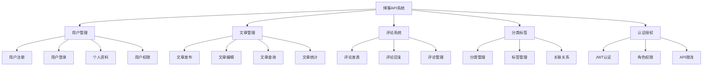

# 📚 第5章：API设计哲学与实践（补充内容）

> 本文档是第5章的补充内容，包含完整的API设计实践指南

## 📋 统一响应格式设计

### 🎨 响应格式标准化

#### 📝 基础响应格式

```typescript
// 基础响应接口
export interface BaseResponse<T = any> {
  success: boolean;
  data?: T;
  message?: string;
  timestamp: string;
  path?: string;
}

// 分页响应接口
export interface PaginatedResponse<T> extends BaseResponse<T[]> {
  pagination: {
    page: number;
    limit: number;
    total: number;
    totalPages: number;
    hasNext: boolean;
    hasPrev: boolean;
  };
}

// 错误响应接口
export interface ErrorResponse extends BaseResponse<null> {
  error: {
    code: string;
    message: string;
    details?: any;
    stack?: string; // 仅开发环境
  };
}
```

#### 🏭 响应工厂类

```typescript
@Injectable()
export class ResponseFactory {
  // 成功响应
  static success<T>(data: T, message?: string): BaseResponse<T> {
    return {
      success: true,
      data,
      message,
      timestamp: new Date().toISOString()
    };
  }
  
  // 分页响应
  static paginated<T>(
    data: T[],
    pagination: {
      page: number;
      limit: number;
      total: number;
    },
    message?: string
  ): PaginatedResponse<T> {
    const totalPages = Math.ceil(pagination.total / pagination.limit);
    
    return {
      success: true,
      data,
      message,
      timestamp: new Date().toISOString(),
      pagination: {
        ...pagination,
        totalPages,
        hasNext: pagination.page < totalPages,
        hasPrev: pagination.page > 1
      }
    };
  }
  
  // 错误响应
  static error(
    code: string,
    message: string,
    details?: any,
    statusCode: number = 400
  ): ErrorResponse {
    return {
      success: false,
      data: null,
      timestamp: new Date().toISOString(),
      error: {
        code,
        message,
        details
      }
    };
  }
}
```

#### 🎯 控制器中的应用

```typescript
@Controller('api/v1/users')
export class UserController {
  constructor(private readonly userService: UserService) {}
  
  @Get()
  async findAll(@Query() query: QueryUserDto): Promise<PaginatedResponse<User>> {
    const { data, total } = await this.userService.findAll(query);
    
    return ResponseFactory.paginated(data, {
      page: query.page,
      limit: query.limit,
      total
    }, '用户列表获取成功');
  }
  
  @Get(':id')
  async findOne(@Param('id') id: string): Promise<BaseResponse<User>> {
    const user = await this.userService.findOne(id);
    
    if (!user) {
      throw new NotFoundException('用户不存在');
    }
    
    return ResponseFactory.success(user, '用户信息获取成功');
  }
  
  @Post()
  async create(@Body() createUserDto: CreateUserDto): Promise<BaseResponse<User>> {
    const user = await this.userService.create(createUserDto);
    
    return ResponseFactory.success(user, '用户创建成功');
  }
}
```

### 🔄 响应转换拦截器

```typescript
@Injectable()
export class ResponseInterceptor implements NestInterceptor {
  intercept(context: ExecutionContext, next: CallHandler): Observable<any> {
    const request = context.switchToHttp().getRequest();
    
    return next.handle().pipe(
      map(data => {
        // 如果已经是标准格式，直接返回
        if (data && typeof data === 'object' && 'success' in data) {
          return {
            ...data,
            path: request.url
          };
        }
        
        // 否则包装成标准格式
        return {
          success: true,
          data,
          timestamp: new Date().toISOString(),
          path: request.url
        };
      })
    );
  }
}

// 在应用中全局使用
@Module({
  providers: [
    {
      provide: APP_INTERCEPTOR,
      useClass: ResponseInterceptor,
    },
  ],
})
export class AppModule {}
```

## ⚠️ 错误处理体系

### 🎯 异常分类体系

```typescript
// 基础业务异常
export abstract class BusinessException extends HttpException {
  abstract readonly code: string;
  
  constructor(message: string, statusCode: number, public readonly details?: any) {
    super({ message, details }, statusCode);
  }
  
  getErrorCode(): string {
    return this.code;
  }
}

// 具体业务异常类
export class UserNotFoundException extends BusinessException {
  readonly code = 'USER_NOT_FOUND';
  
  constructor(userId: string) {
    super(`用户 ${userId} 不存在`, 404, { userId });
  }
}

export class EmailAlreadyExistsException extends BusinessException {
  readonly code = 'EMAIL_ALREADY_EXISTS';
  
  constructor(email: string) {
    super(`邮箱 ${email} 已被注册`, 409, { email });
  }
}

export class InsufficientPermissionException extends BusinessException {
  readonly code = 'INSUFFICIENT_PERMISSION';
  
  constructor(action: string, resource: string) {
    super(`没有权限执行操作：${action} on ${resource}`, 403, { action, resource });
  }
}

export class ValidationFailedException extends BusinessException {
  readonly code = 'VALIDATION_FAILED';
  
  constructor(errors: any[]) {
    super('请求参数验证失败', 400, { errors });
  }
}
```

### 🛡️ 全局异常过滤器

```typescript
@Catch()
export class GlobalExceptionFilter implements ExceptionFilter {
  private readonly logger = new Logger(GlobalExceptionFilter.name);
  
  catch(exception: unknown, host: ArgumentsHost) {
    const ctx = host.switchToHttp();
    const response = ctx.getResponse<Response>();
    const request = ctx.getRequest<Request>();
    
    let status = 500;
    let code = 'INTERNAL_SERVER_ERROR';
    let message = '服务器内部错误';
    let details: any = null;
    
    // 处理不同类型的异常
    if (exception instanceof BusinessException) {
      status = exception.getStatus();
      code = exception.getErrorCode();
      message = exception.message;
      details = exception.details;
    } else if (exception instanceof HttpException) {
      status = exception.getStatus();
      const exceptionResponse = exception.getResponse();
      
      if (typeof exceptionResponse === 'string') {
        message = exceptionResponse;
      } else if (typeof exceptionResponse === 'object') {
        message = (exceptionResponse as any).message || message;
        code = (exceptionResponse as any).error || code;
        details = (exceptionResponse as any).details;
      }
    } else if (exception instanceof Error) {
      message = exception.message;
      details = { stack: exception.stack };
    }
    
    // 记录错误日志
    this.logger.error(
      `${request.method} ${request.url} - ${status} ${code}: ${message}`,
      exception instanceof Error ? exception.stack : exception
    );
    
    // 构建错误响应
    const errorResponse: ErrorResponse = {
      success: false,
      data: null,
      timestamp: new Date().toISOString(),
      path: request.url,
      error: {
        code,
        message,
        details: process.env.NODE_ENV === 'development' ? details : undefined
      }
    };
    
    response.status(status).json(errorResponse);
  }
}
```

## 📖 API文档自动生成

### 🎨 Swagger集成

#### 📦 安装和配置

```bash
npm install @nestjs/swagger swagger-ui-express
```

```typescript
// main.ts
import { DocumentBuilder, SwaggerModule } from '@nestjs/swagger';

async function bootstrap() {
  const app = await NestFactory.create(AppModule);
  
  // Swagger配置
  const config = new DocumentBuilder()
    .setTitle('博客系统API')
    .setDescription('基于NestJS的博客系统API文档')
    .setVersion('1.0')
    .addBearerAuth(
      {
        type: 'http',
        scheme: 'bearer',
        bearerFormat: 'JWT',
        name: 'JWT',
        description: 'Enter JWT token',
        in: 'header',
      },
      'JWT-auth'
    )
    .addTag('users', '用户管理')
    .addTag('articles', '文章管理')
    .addTag('auth', '认证授权')
    .build();
  
  const document = SwaggerModule.createDocument(app, config);
  SwaggerModule.setup('api/docs', app, document, {
    swaggerOptions: {
      persistAuthorization: true,
    },
  });
  
  await app.listen(3000);
}
```

#### 🏷️ API文档注解

```typescript
import { ApiTags, ApiOperation, ApiResponse, ApiParam, ApiQuery, ApiBearerAuth } from '@nestjs/swagger';

@ApiTags('users')
@Controller('api/v1/users')
export class UserController {
  @Get()
  @ApiOperation({ 
    summary: '获取用户列表',
    description: '分页获取用户列表，支持搜索和过滤'
  })
  @ApiQuery({ name: 'page', required: false, description: '页码', example: 1 })
  @ApiQuery({ name: 'limit', required: false, description: '每页数量', example: 20 })
  @ApiQuery({ name: 'search', required: false, description: '搜索关键词' })
  @ApiResponse({
    status: 200,
    description: '获取成功',
    schema: {
      example: {
        success: true,
        data: [
          {
            id: '1',
            name: '张三',
            email: 'zhangsan@example.com',
            createdAt: '2024-01-15T10:30:00Z'
          }
        ],
        pagination: {
          page: 1,
          limit: 20,
          total: 100,
          totalPages: 5,
          hasNext: true,
          hasPrev: false
        },
        timestamp: '2024-01-15T10:30:00Z'
      }
    }
  })
  async findAll(@Query() query: QueryUserDto) {
    return this.userService.findAll(query);
  }
  
  @Get(':id')
  @ApiOperation({ summary: '获取用户详情' })
  @ApiParam({ name: 'id', description: '用户ID' })
  @ApiResponse({ status: 200, description: '获取成功' })
  @ApiResponse({ status: 404, description: '用户不存在' })
  async findOne(@Param('id') id: string) {
    return this.userService.findOne(id);
  }
  
  @Post()
  @ApiOperation({ summary: '创建用户' })
  @ApiResponse({ status: 201, description: '创建成功' })
  @ApiResponse({ status: 400, description: '参数验证失败' })
  @ApiResponse({ status: 409, description: '邮箱已存在' })
  async create(@Body() createUserDto: CreateUserDto) {
    return this.userService.create(createUserDto);
  }
  
  @Put(':id')
  @ApiBearerAuth('JWT-auth')
  @ApiOperation({ summary: '更新用户信息' })
  @ApiParam({ name: 'id', description: '用户ID' })
  @ApiResponse({ status: 200, description: '更新成功' })
  @ApiResponse({ status: 401, description: '未授权' })
  @ApiResponse({ status: 404, description: '用户不存在' })
  async update(@Param('id') id: string, @Body() updateUserDto: UpdateUserDto) {
    return this.userService.update(id, updateUserDto);
  }
}
```

#### 📝 DTO文档注解

```typescript
import { ApiProperty, ApiPropertyOptional } from '@nestjs/swagger';

export class CreateUserDto {
  @ApiProperty({
    description: '用户名',
    example: '张三',
    minLength: 2,
    maxLength: 50
  })
  @IsString()
  readonly name: string;
  
  @ApiProperty({
    description: '邮箱地址',
    example: 'zhangsan@example.com',
    format: 'email'
  })
  @IsEmail()
  readonly email: string;
  
  @ApiProperty({
    description: '年龄',
    example: 25,
    minimum: 18,
    maximum: 120
  })
  @IsInt()
  @Min(18)
  @Max(120)
  readonly age: number;
  
  @ApiPropertyOptional({
    description: '用户状态',
    enum: UserStatus,
    default: UserStatus.ACTIVE
  })
  @IsEnum(UserStatus)
  @IsOptional()
  readonly status?: UserStatus;
}
```

## 🧪 API测试策略

### 🔧 单元测试

```typescript
// user.controller.spec.ts
describe('UserController', () => {
  let controller: UserController;
  let service: UserService;
  
  beforeEach(async () => {
    const module: TestingModule = await Test.createTestingModule({
      controllers: [UserController],
      providers: [
        {
          provide: UserService,
          useValue: {
            findAll: jest.fn(),
            findOne: jest.fn(),
            create: jest.fn(),
            update: jest.fn(),
            remove: jest.fn(),
          },
        },
      ],
    }).compile();
    
    controller = module.get<UserController>(UserController);
    service = module.get<UserService>(UserService);
  });
  
  describe('findAll', () => {
    it('应该返回用户列表', async () => {
      const mockUsers = [
        { id: '1', name: '张三', email: 'zhangsan@example.com' },
        { id: '2', name: '李四', email: 'lisi@example.com' }
      ];
      
      const mockResult = {
        data: mockUsers,
        total: 2
      };
      
      jest.spyOn(service, 'findAll').mockResolvedValue(mockResult);
      
      const query = { page: 1, limit: 20 };
      const result = await controller.findAll(query);
      
      expect(service.findAll).toHaveBeenCalledWith(query);
      expect(result.success).toBe(true);
      expect(result.data).toEqual(mockUsers);
      expect(result.pagination.total).toBe(2);
    });
  });
  
  describe('findOne', () => {
    it('应该返回指定用户', async () => {
      const mockUser = { id: '1', name: '张三', email: 'zhangsan@example.com' };
      
      jest.spyOn(service, 'findOne').mockResolvedValue(mockUser);
      
      const result = await controller.findOne('1');
      
      expect(service.findOne).toHaveBeenCalledWith('1');
      expect(result.success).toBe(true);
      expect(result.data).toEqual(mockUser);
    });
    
    it('用户不存在时应该抛出异常', async () => {
      jest.spyOn(service, 'findOne').mockResolvedValue(null);
      
      await expect(controller.findOne('999')).rejects.toThrow(NotFoundException);
    });
  });
});
```

### 🔗 集成测试

```typescript
// user.e2e-spec.ts
describe('UserController (e2e)', () => {
  let app: INestApplication;
  let userService: UserService;
  
  beforeEach(async () => {
    const moduleFixture: TestingModule = await Test.createTestingModule({
      imports: [AppModule],
    }).compile();
    
    app = moduleFixture.createNestApplication();
    userService = moduleFixture.get<UserService>(UserService);
    
    // 应用全局管道和过滤器
    app.useGlobalPipes(new ValidationPipe());
    app.useGlobalFilters(new GlobalExceptionFilter());
    
    await app.init();
  });
  
  afterEach(async () => {
    await app.close();
  });
  
  describe('/api/v1/users (GET)', () => {
    it('应该返回用户列表', () => {
      return request(app.getHttpServer())
        .get('/api/v1/users')
        .expect(200)
        .expect(res => {
          expect(res.body.success).toBe(true);
          expect(Array.isArray(res.body.data)).toBe(true);
          expect(res.body.pagination).toBeDefined();
        });
    });
    
    it('应该支持分页参数', () => {
      return request(app.getHttpServer())
        .get('/api/v1/users?page=2&limit=5')
        .expect(200)
        .expect(res => {
          expect(res.body.pagination.page).toBe(2);
          expect(res.body.pagination.limit).toBe(5);
        });
    });
  });
  
  describe('/api/v1/users (POST)', () => {
    it('应该创建新用户', () => {
      const createDto = { name: '新用户', email: 'newuser@example.com', age: 28 };
      
      return request(app.getHttpServer())
        .post('/api/v1/users')
        .send(createDto)
        .expect(201)
        .expect(res => {
          expect(res.body.success).toBe(true);
          expect(res.body.data.name).toBe(createDto.name);
          expect(res.body.data.email).toBe(createDto.email);
          expect(res.body.data.id).toBeDefined();
        });
    });
    
    it('参数验证失败时应该返回400', () => {
      const invalidDto = { name: '', email: 'invalid-email' };
      
      return request(app.getHttpServer())
        .post('/api/v1/users')
        .send(invalidDto)
        .expect(400)
        .expect(res => {
          expect(res.body.success).toBe(false);
          expect(res.body.error.code).toBe('VALIDATION_FAILED');
          expect(res.body.error.details.errors).toBeDefined();
        });
    });
  });
});
```

## 🔄 API版本控制实践

### 📝 版本控制策略

#### 🏷️ URL版本控制

```typescript
// v1版本控制器
@Controller('api/v1/users')
export class UserV1Controller {
  constructor(private readonly userService: UserService) {}
  
  @Get()
  async findAll(@Query() query: QueryUserDto) {
    // v1版本的实现
    return this.userService.findAllV1(query);
  }
  
  @Get(':id')
  async findOne(@Param('id') id: string) {
    return this.userService.findOneV1(id);
  }
}

// v2版本控制器
@Controller('api/v2/users')
export class UserV2Controller {
  constructor(private readonly userService: UserService) {}
  
  @Get()
  async findAll(@Query() query: QueryUserV2Dto) {
    // v2版本的增强实现
    return this.userService.findAllV2(query);
  }
  
  @Get(':id')
  async findOne(@Param('id') id: string) {
    // v2版本包含更多字段
    return this.userService.findOneV2(id);
  }
}
```

#### 📋 Header版本控制

```typescript
// 版本控制装饰器
export const ApiVersion = (version: string) => SetMetadata('version', version);

// 版本控制守卫
@Injectable()
export class VersionGuard implements CanActivate {
  constructor(private reflector: Reflector) {}
  
  canActivate(context: ExecutionContext): boolean {
    const requiredVersion = this.reflector.get<string>('version', context.getHandler());
    if (!requiredVersion) return true;
    
    const request = context.switchToHttp().getRequest();
    const clientVersion = request.headers['api-version'] || 'v1';
    
    return clientVersion === requiredVersion;
  }
}

// 使用Header版本控制
@Controller('api/users')
export class UserController {
  @Get()
  @ApiVersion('v1')
  @UseGuards(VersionGuard)
  async findAllV1(@Query() query: QueryUserDto) {
    return this.userService.findAllV1(query);
  }
  
  @Get()
  @ApiVersion('v2')
  @UseGuards(VersionGuard)
  async findAllV2(@Query() query: QueryUserV2Dto) {
    return this.userService.findAllV2(query);
  }
}
```

## ⚡ API性能优化

### 🗄️ 缓存策略

#### 📦 Redis缓存集成

```typescript
// 缓存服务
@Injectable()
export class CacheService {
  constructor(@Inject('REDIS_CLIENT') private readonly redis: Redis) {}
  
  async get<T>(key: string): Promise<T | null> {
    const value = await this.redis.get(key);
    return value ? JSON.parse(value) : null;
  }
  
  async set(key: string, value: any, ttl: number = 300): Promise<void> {
    await this.redis.setex(key, ttl, JSON.stringify(value));
  }
  
  async del(key: string): Promise<void> {
    await this.redis.del(key);
  }
  
  async invalidatePattern(pattern: string): Promise<void> {
    const keys = await this.redis.keys(pattern);
    if (keys.length > 0) {
      await this.redis.del(...keys);
    }
  }
}

// 缓存装饰器
export function Cacheable(ttl: number = 300, keyGenerator?: (args: any[]) => string) {
  return (target: any, propertyKey: string, descriptor: PropertyDescriptor) => {
    const originalMethod = descriptor.value;
    
    descriptor.value = async function (...args: any[]) {
      const cacheService: CacheService = this.cacheService;
      
      const cacheKey = keyGenerator 
        ? keyGenerator(args)
        : `${target.constructor.name}:${propertyKey}:${JSON.stringify(args)}`;
      
      // 尝试从缓存获取
      const cachedResult = await cacheService.get(cacheKey);
      if (cachedResult) {
        return cachedResult;
      }
      
      // 执行原方法
      const result = await originalMethod.apply(this, args);
      
      // 缓存结果
      await cacheService.set(cacheKey, result, ttl);
      
      return result;
    };
    
    return descriptor;
  };
}
```

#### 🎯 智能缓存应用

```typescript
@Injectable()
export class UserService {
  constructor(
    private readonly userRepository: UserRepository,
    private readonly cacheService: CacheService
  ) {}
  
  @Cacheable(600, (args) => `user:${args[0]}`) // 缓存10分钟
  async findOne(id: string): Promise<User> {
    return this.userRepository.findOne(id);
  }
  
  @Cacheable(300, (args) => `users:list:${JSON.stringify(args[0])}`) // 缓存5分钟
  async findAll(query: QueryUserDto): Promise<{ data: User[]; total: number }> {
    return this.userRepository.findAndCount(query);
  }
  
  async update(id: string, updateData: UpdateUserDto): Promise<User> {
    const user = await this.userRepository.update(id, updateData);
    
    // 更新后清除相关缓存
    await this.cacheService.del(`user:${id}`);
    await this.cacheService.invalidatePattern('users:list:*');
    
    return user;
  }
}
```

## 🎯 实战项目：博客API系统

### 📋 项目需求分析

#### 🎨 功能模块设计



#### 📊 API接口设计

```typescript
// 用户相关接口
POST   /api/v1/auth/register     // 用户注册
POST   /api/v1/auth/login        // 用户登录
POST   /api/v1/auth/refresh      // 刷新令牌
POST   /api/v1/auth/logout       // 用户登出

GET    /api/v1/users             // 获取用户列表（管理员）
GET    /api/v1/users/:id         // 获取用户信息
PUT    /api/v1/users/:id         // 更新用户信息
DELETE /api/v1/users/:id         // 删除用户（管理员）
GET    /api/v1/users/profile     // 获取当前用户信息
PUT    /api/v1/users/profile     // 更新当前用户信息

// 文章相关接口
GET    /api/v1/articles          // 获取文章列表
GET    /api/v1/articles/:id      // 获取文章详情
POST   /api/v1/articles          // 创建文章
PUT    /api/v1/articles/:id      // 更新文章
DELETE /api/v1/articles/:id      // 删除文章
POST   /api/v1/articles/:id/like // 点赞文章
GET    /api/v1/articles/search   // 搜索文章

// 评论相关接口
GET    /api/v1/articles/:id/comments    // 获取文章评论
POST   /api/v1/articles/:id/comments    // 发表评论
PUT    /api/v1/comments/:id             // 更新评论
DELETE /api/v1/comments/:id             // 删除评论
POST   /api/v1/comments/:id/reply       // 回复评论

// 分类标签接口
GET    /api/v1/categories        // 获取分类列表
POST   /api/v1/categories        // 创建分类
PUT    /api/v1/categories/:id    // 更新分类
DELETE /api/v1/categories/:id    // 删除分类

GET    /api/v1/tags              // 获取标签列表
POST   /api/v1/tags              // 创建标签
PUT    /api/v1/tags/:id          // 更新标签
DELETE /api/v1/tags/:id          // 删除标签
```

## 🎯 最佳实践总结

### 📋 API设计检查清单

#### ✅ 设计原则检查

- [ ] **一致性**：所有接口遵循相同的命名和结构规范
- [ ] **可预测性**：开发者能够根据经验预测接口行为
- [ ] **简洁性**：接口设计简单易用，避免不必要的复杂性
- [ ] **资源导向**：URL设计围绕资源而不是操作
- [ ] **HTTP语义**：正确使用HTTP方法和状态码
- [ ] **错误处理**：提供清晰有用的错误信息

#### ✅ 技术实现检查

- [ ] **参数验证**：所有输入参数都有适当的验证
- [ ] **响应格式**：统一的响应格式和错误处理
- [ ] **认证授权**：适当的安全控制和权限管理
- [ ] **缓存策略**：合理的缓存设计提升性能
- [ ] **文档完整**：自动生成的API文档完整准确
- [ ] **测试覆盖**：充分的单元测试和集成测试

### 🚀 性能优化建议

#### 📊 数据库层面

1. **查询优化**
   - 使用适当的索引
   - 避免N+1查询问题
   - 合理使用预加载
   - 优化复杂查询

2. **分页策略**
   - 对于大数据集使用游标分页
   - 限制单次查询的数据量
   - 缓存分页结果

#### 🗄️ 缓存层面

1. **缓存策略**
   - 缓存热点数据
   - 设置合理的TTL
   - 及时清除过期缓存
   - 使用缓存预热

2. **缓存模式**
   - Cache-Aside模式
   - Write-Through模式
   - Write-Behind模式

### 🛡️ 安全最佳实践

#### 🔐 认证授权

1. **JWT安全**
   - 使用强密钥
   - 设置合理的过期时间
   - 实现令牌刷新机制
   - 支持令牌撤销

2. **权限控制**
   - 实现基于角色的访问控制
   - 最小权限原则
   - 资源级别的权限检查

#### 🛡️ 输入验证

1. **参数验证**
   - 验证所有输入参数
   - 使用白名单验证
   - 防止SQL注入
   - 防止XSS攻击

2. **速率限制**
   - 实现API限流
   - 防止暴力攻击
   - 监控异常请求

### 📈 监控与维护

#### 📊 性能监控

1. **关键指标**
   - 响应时间
   - 吞吐量
   - 错误率
   - 资源使用率

2. **日志记录**
   - 结构化日志
   - 错误日志
   - 访问日志
   - 性能日志

#### 🔧 维护策略

1. **版本管理**
   - 语义化版本控制
   - 向后兼容性
   - 弃用策略
   - 迁移指南

2. **文档维护**
   - 保持文档更新
   - 提供示例代码
   - 编写迁移指南
   - 收集用户反馈

## 🎯 章节总结

通过本章的学习，我们深入掌握了API设计的核心理念和实践技巧：

### 🎨 核心收获

1. **设计哲学**：理解了优秀API设计的核心原则
2. **技术实现**：掌握了NestJS中API开发的高级技巧
3. **质量保证**：建立了完善的测试和文档体系
4. **性能优化**：学会了API性能优化的各种策略
5. **最佳实践**：总结了企业级API开发的经验

### 🚀 实践能力

- ✅ 能够设计符合RESTful规范的API接口
- ✅ 能够实现统一的响应格式和错误处理
- ✅ 能够集成Swagger自动生成API文档
- ✅ 能够建立完善的API测试体系
- ✅ 能够实现API版本控制和性能优化
- ✅ 能够应用企业级开发的最佳实践

### 🎯 下一步学习

完成本章学习后，你已经具备了：
- ✅ 扎实的API设计理论基础
- ✅ 丰富的NestJS实践经验
- ✅ 完整的开发工具链掌握
- ✅ 企业级项目开发能力

**准备好迎接下一个挑战了吗？让我们继续学习第6章：JWT认证机制深度解析！** 🚀

在下一章中，我们将：
- 🔐 深入学习JWT认证机制的原理和实现
- 🛡️ 掌握企业级的安全防护策略
- 👥 建立完善的用户权限管理体系
- 🔄 实现高可用的会话管理机制

让我们继续这个精彩的学习之旅！ 