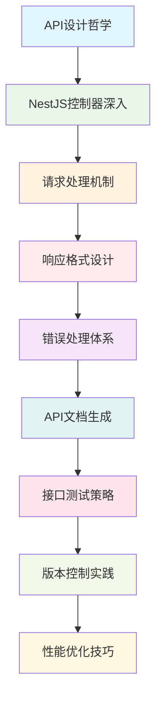
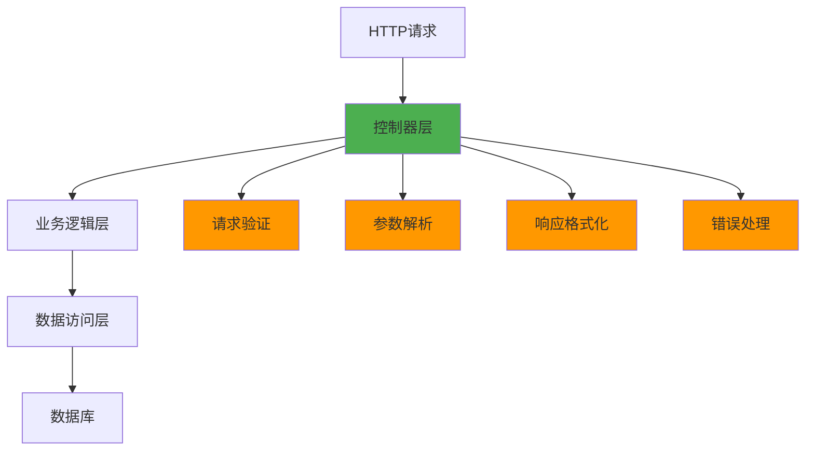

# 📚 第5章：API设计哲学与实践

> **从RESTful理念到企业级API实现** - 掌握现代API设计的核心思想与实践技巧

## 🎯 章节概述

在前面的章节中，我们已经掌握了NestJS的核心概念：架构思维、模块系统、依赖注入和数据持久化。现在，我们将这些知识融合起来，学习如何设计和实现优雅、可维护的API接口。

### 🏗️ 本章学习路径



## 🎯 学习目标

通过本章学习，你将能够：

- 🎨 **掌握API设计哲学**：理解优秀API设计的核心原则和思维方式
- 🔧 **精通NestJS控制器**：深入掌握控制器的高级特性和最佳实践
- 📝 **设计统一响应格式**：建立一致的API响应规范和错误处理机制
- 📖 **自动生成API文档**：使用Swagger等工具自动化API文档生成
- 🧪 **建立测试体系**：构建完善的API测试策略和自动化测试
- 🔄 **实现版本控制**：掌握API版本管理的最佳实践
- ⚡ **优化API性能**：学会识别和解决API性能瓶颈

## 🎨 API设计哲学

### 🌟 优秀API的特征

#### 🎯 一致性（Consistency）

**核心理念**：API的设计应该保持高度一致性，让开发者能够预测和理解接口行为。

```typescript
// ✅ 一致的命名规范
@Controller('api/v1/users')
export class UserController {
  @Get()           // 获取列表
  async findAll() { }
  
  @Get(':id')      // 获取单个
  async findOne() { }
  
  @Post()          // 创建
  async create() { }
  
  @Put(':id')      // 更新
  async update() { }
  
  @Delete(':id')   // 删除
  async remove() { }
}

@Controller('api/v1/articles')
export class ArticleController {
  // 保持相同的方法命名和路由结构
  @Get()
  async findAll() { }
  
  @Get(':id')
  async findOne() { }
  
  @Post()
  async create() { }
  
  @Put(':id')
  async update() { }
  
  @Delete(':id')
  async remove() { }
}
```

#### 🔮 可预测性（Predictability）

**核心理念**：开发者应该能够根据已有的API经验，预测新接口的行为。

```typescript
// ✅ 可预测的响应格式
interface ApiResponse<T> {
  success: boolean;
  data: T;
  message?: string;
  timestamp: string;
}

// 所有成功响应都遵循相同格式
@Get()
async findAll(): Promise<ApiResponse<User[]>> {
  const users = await this.userService.findAll();
  return {
    success: true,
    data: users,
    timestamp: new Date().toISOString()
  };
}

@Get(':id')
async findOne(@Param('id') id: string): Promise<ApiResponse<User>> {
  const user = await this.userService.findOne(id);
  return {
    success: true,
    data: user,
    timestamp: new Date().toISOString()
  };
}
```

#### 🎭 简洁性（Simplicity）

**核心理念**：API应该简单易用，避免不必要的复杂性。

```typescript
// ✅ 简洁的接口设计
@Controller('api/v1/users')
export class UserController {
  // 简单的查询参数
  @Get()
  async findAll(
    @Query('page') page: number = 1,
    @Query('limit') limit: number = 20,
    @Query('search') search?: string
  ) {
    return this.userService.findAll({ page, limit, search });
  }
}

// ❌ 过于复杂的接口设计
@Get()
async findAll(@Query() query: ComplexQueryDto) {
  // 包含20多个查询参数的复杂接口
}
```

### 🏛️ API设计原则

#### 1. 🎯 面向资源设计

**原则**：将API设计围绕资源（名词）而不是操作（动词）。

```typescript
// ✅ 面向资源的设计
GET    /api/v1/users           // 用户资源
POST   /api/v1/users           // 创建用户
GET    /api/v1/users/123       // 特定用户
PUT    /api/v1/users/123       // 更新用户
DELETE /api/v1/users/123       // 删除用户

// ❌ 面向操作的设计
POST   /api/v1/getUsers        // 动词导向
POST   /api/v1/createUser      // 动词导向
POST   /api/v1/updateUser      // 动词导向
```

#### 2. 🔗 利用HTTP语义

**原则**：充分利用HTTP协议的语义，让方法和状态码传达明确的含义。

```typescript
@Controller('api/v1/articles')
export class ArticleController {
  @Get()
  @HttpCode(200)  // 明确指定状态码
  async findAll() {
    // 获取资源，返回200
  }
  
  @Post()
  @HttpCode(201)  // 创建成功返回201
  async create(@Body() createDto: CreateArticleDto) {
    // 创建资源，返回201
  }
  
  @Put(':id')
  @HttpCode(200)  // 更新成功返回200
  async update(@Param('id') id: string, @Body() updateDto: UpdateArticleDto) {
    // 更新资源，返回200
  }
  
  @Delete(':id')
  @HttpCode(204)  // 删除成功返回204（无内容）
  async remove(@Param('id') id: string) {
    // 删除资源，返回204
  }
}
```

#### 3. 🎨 优雅的错误处理

**原则**：提供清晰、有用的错误信息，帮助开发者快速定位问题。

```typescript
// 自定义异常类
export class ApiException extends HttpException {
  constructor(
    public readonly code: string,
    message: string,
    statusCode: number,
    public readonly details?: any
  ) {
    super({ code, message, details }, statusCode);
  }
}

// 业务异常示例
export class UserNotFoundException extends ApiException {
  constructor(userId: string) {
    super(
      'USER_NOT_FOUND',
      `用户 ${userId} 不存在`,
      404,
      { userId }
    );
  }
}

export class EmailAlreadyExistsException extends ApiException {
  constructor(email: string) {
    super(
      'EMAIL_ALREADY_EXISTS',
      `邮箱 ${email} 已被注册`,
      409,
      { email }
    );
  }
}
```

## 🔧 NestJS控制器深入解析

### 📋 控制器基础回顾

#### 🏗️ 控制器的职责

控制器在分层架构中的作用：



#### 🎯 控制器的核心功能

```typescript
@Controller('api/v1/users')
export class UserController {
  constructor(private readonly userService: UserService) {}
  
  // 1. 路由处理
  @Get()
  async findAll() { }
  
  // 2. 参数提取
  @Get(':id')
  async findOne(@Param('id') id: string) { }
  
  // 3. 请求体处理
  @Post()
  async create(@Body() createUserDto: CreateUserDto) { }
  
  // 4. 查询参数处理
  @Get()
  async search(@Query() query: SearchUserDto) { }
  
  // 5. 头部信息处理
  @Get('profile')
  async getProfile(@Headers('authorization') auth: string) { }
}
```

### 🎛️ 高级控制器特性

#### 🔍 参数装饰器详解

```typescript
@Controller('api/v1/users')
export class UserController {
  // 路径参数
  @Get(':id')
  async findOne(@Param('id') id: string) {
    return this.userService.findOne(id);
  }
  
  // 多个路径参数
  @Get(':userId/articles/:articleId')
  async getUserArticle(
    @Param('userId') userId: string,
    @Param('articleId') articleId: string
  ) {
    return this.userService.getUserArticle(userId, articleId);
  }
  
  // 查询参数
  @Get()
  async findAll(
    @Query('page') page: number = 1,
    @Query('limit') limit: number = 20,
    @Query('sort') sort: string = 'createdAt',
    @Query() allQuery: any  // 获取所有查询参数
  ) {
    return this.userService.findAll({ page, limit, sort, ...allQuery });
  }
  
  // 请求体
  @Post()
  async create(@Body() createUserDto: CreateUserDto) {
    return this.userService.create(createUserDto);
  }
  
  // 部分请求体
  @Patch(':id')
  async update(
    @Param('id') id: string,
    @Body('name') name: string,  // 只获取name字段
    @Body() updateData: Partial<UpdateUserDto>
  ) {
    return this.userService.update(id, { name, ...updateData });
  }
  
  // 请求头
  @Get('profile')
  async getProfile(
    @Headers('authorization') auth: string,
    @Headers('user-agent') userAgent: string,
    @Headers() allHeaders: any
  ) {
    const user = this.authService.validateToken(auth);
    return { user, userAgent, headers: allHeaders };
  }
  
  // 完整请求对象
  @Post('upload')
  async upload(@Req() request: Request) {
    // 处理文件上传等复杂场景
    return this.fileService.upload(request);
  }
  
  // 完整响应对象
  @Get('download/:id')
  async download(@Param('id') id: string, @Res() response: Response) {
    const file = await this.fileService.getFile(id);
    response.setHeader('Content-Type', file.mimeType);
    response.setHeader('Content-Disposition', `attachment; filename="${file.name}"`);
    return response.send(file.buffer);
  }
}
```

#### 🎨 响应处理技巧

```typescript
@Controller('api/v1/articles')
export class ArticleController {
  // 自定义状态码
  @Post()
  @HttpCode(201)
  async create(@Body() createDto: CreateArticleDto) {
    return this.articleService.create(createDto);
  }
  
  // 设置响应头
  @Get(':id')
  async findOne(@Param('id') id: string, @Res() res: Response) {
    const article = await this.articleService.findOne(id);
    
    res.set({
      'Cache-Control': 'public, max-age=3600',
      'ETag': `"${article.version}"`,
      'Last-Modified': article.updatedAt.toUTCString()
    });
    
    return res.json(article);
  }
  
  // 重定向
  @Get('redirect/:id')
  @Redirect()
  async redirectToArticle(@Param('id') id: string) {
    const article = await this.articleService.findOne(id);
    return { url: `/articles/${article.slug}`, statusCode: 301 };
  }
  
  // 流式响应
  @Get('export')
  async exportData(@Res() res: Response) {
    res.setHeader('Content-Type', 'application/json');
    res.setHeader('Transfer-Encoding', 'chunked');
    
    const stream = this.articleService.getDataStream();
    stream.pipe(res);
  }
}
```

### 🛡️ 请求验证与转换

#### 📝 DTO（数据传输对象）设计

```typescript
import { IsEmail, IsString, IsOptional, IsInt, Min, Max, IsEnum } from 'class-validator';
import { Transform, Type } from 'class-transformer';

export enum UserStatus {
  ACTIVE = 'active',
  INACTIVE = 'inactive',
  SUSPENDED = 'suspended'
}

export class CreateUserDto {
  @IsString({ message: '用户名必须是字符串' })
  @Transform(({ value }) => value?.trim())  // 自动去除空格
  readonly name: string;
  
  @IsEmail({}, { message: '请提供有效的邮箱地址' })
  @Transform(({ value }) => value?.toLowerCase())  // 自动转小写
  readonly email: string;
  
  @IsInt({ message: '年龄必须是整数' })
  @Min(18, { message: '年龄不能小于18岁' })
  @Max(120, { message: '年龄不能大于120岁' })
  @Type(() => Number)  // 自动类型转换
  readonly age: number;
  
  @IsEnum(UserStatus, { message: '状态值无效' })
  @IsOptional()
  readonly status?: UserStatus = UserStatus.ACTIVE;
}

export class UpdateUserDto {
  @IsString()
  @IsOptional()
  @Transform(({ value }) => value?.trim())
  readonly name?: string;
  
  @IsInt()
  @Min(18)
  @Max(120)
  @IsOptional()
  @Type(() => Number)
  readonly age?: number;
  
  @IsEnum(UserStatus)
  @IsOptional()
  readonly status?: UserStatus;
}

export class QueryUserDto {
  @IsOptional()
  @Type(() => Number)
  @IsInt()
  @Min(1)
  readonly page?: number = 1;
  
  @IsOptional()
  @Type(() => Number)
  @IsInt()
  @Min(1)
  @Max(100)
  readonly limit?: number = 20;
  
  @IsOptional()
  @IsString()
  readonly search?: string;
  
  @IsOptional()
  @IsEnum(UserStatus)
  readonly status?: UserStatus;
  
  @IsOptional()
  @IsString()
  readonly sortBy?: string = 'createdAt';
  
  @IsOptional()
  @IsEnum(['ASC', 'DESC'])
  readonly sortOrder?: 'ASC' | 'DESC' = 'DESC';
}
```

#### 🔧 自定义验证器

```typescript
import { ValidatorConstraint, ValidatorConstraintInterface, ValidationArguments } from 'class-validator';

// 自定义密码强度验证器
@ValidatorConstraint({ name: 'isStrongPassword', async: false })
export class IsStrongPasswordConstraint implements ValidatorConstraintInterface {
  validate(password: string, args: ValidationArguments) {
    if (!password) return false;
    
    // 至少8位，包含大小写字母、数字和特殊字符
    const strongPasswordRegex = /^(?=.*[a-z])(?=.*[A-Z])(?=.*\d)(?=.*[@$!%*?&])[A-Za-z\d@$!%*?&]{8,}$/;
    return strongPasswordRegex.test(password);
  }
  
  defaultMessage(args: ValidationArguments) {
    return '密码必须至少8位，包含大小写字母、数字和特殊字符';
  }
}

// 自定义邮箱唯一性验证器（异步）
@ValidatorConstraint({ name: 'isEmailUnique', async: true })
export class IsEmailUniqueConstraint implements ValidatorConstraintInterface {
  constructor(private userService: UserService) {}
  
  async validate(email: string, args: ValidationArguments) {
    const user = await this.userService.findByEmail(email);
    return !user;
  }
  
  defaultMessage(args: ValidationArguments) {
    return '该邮箱已被注册';
  }
}

// 使用自定义验证器
export class RegisterUserDto {
  @IsString()
  readonly name: string;
  
  @IsEmail()
  @Validate(IsEmailUniqueConstraint)
  readonly email: string;
  
  @Validate(IsStrongPasswordConstraint)
  readonly password: string;
}
```

### 🎭 拦截器与中间件

#### 🔄 响应转换拦截器

```typescript
import { Injectable, NestInterceptor, ExecutionContext, CallHandler } from '@nestjs/common';
import { Observable } from 'rxjs';
import { map } from 'rxjs/operators';

// 统一响应格式拦截器
@Injectable()
export class ResponseTransformInterceptor<T> implements NestInterceptor<T, any> {
  intercept(context: ExecutionContext, next: CallHandler): Observable<any> {
    return next.handle().pipe(
      map(data => ({
        success: true,
        data,
        timestamp: new Date().toISOString(),
        path: context.switchToHttp().getRequest().url
      }))
    );
  }
}

// 日志记录拦截器
@Injectable()
export class LoggingInterceptor implements NestInterceptor {
  intercept(context: ExecutionContext, next: CallHandler): Observable<any> {
    const request = context.switchToHttp().getRequest();
    const method = request.method;
    const url = request.url;
    const now = Date.now();
    
    console.log(`[${method}] ${url} - 开始处理`);
    
    return next.handle().pipe(
      map(data => {
        const duration = Date.now() - now;
        console.log(`[${method}] ${url} - 处理完成 (${duration}ms)`);
        return data;
      })
    );
  }
}

// 缓存拦截器
@Injectable()
export class CacheInterceptor implements NestInterceptor {
  constructor(private cacheService: CacheService) {}
  
  async intercept(context: ExecutionContext, next: CallHandler): Promise<Observable<any>> {
    const request = context.switchToHttp().getRequest();
    const cacheKey = `${request.method}:${request.url}`;
    
    // 只缓存GET请求
    if (request.method !== 'GET') {
      return next.handle();
    }
    
    // 检查缓存
    const cachedData = await this.cacheService.get(cacheKey);
    if (cachedData) {
      return of(cachedData);
    }
    
    // 执行请求并缓存结果
    return next.handle().pipe(
      tap(data => {
        this.cacheService.set(cacheKey, data, 300); // 缓存5分钟
      })
    );
  }
}
```

#### 🛡️ 认证与授权中间件

```typescript
// JWT认证守卫
@Injectable()
export class JwtAuthGuard extends AuthGuard('jwt') {
  canActivate(context: ExecutionContext) {
    return super.canActivate(context);
  }
  
  handleRequest(err: any, user: any, info: any) {
    if (err || !user) {
      throw err || new UnauthorizedException('访问令牌无效');
    }
    return user;
  }
}

// 角色授权守卫
@Injectable()
export class RolesGuard implements CanActivate {
  constructor(private reflector: Reflector) {}
  
  canActivate(context: ExecutionContext): boolean {
    const requiredRoles = this.reflector.getAllAndOverride<string[]>('roles', [
      context.getHandler(),
      context.getClass(),
    ]);
    
    if (!requiredRoles) {
      return true;
    }
    
    const { user } = context.switchToHttp().getRequest();
    return requiredRoles.some(role => user.roles?.includes(role));
  }
}

// 使用守卫
@Controller('api/v1/admin')
@UseGuards(JwtAuthGuard, RolesGuard)
export class AdminController {
  @Get('users')
  @Roles('admin', 'moderator')
  async getUsers() {
    return this.userService.findAll();
  }
  
  @Delete('users/:id')
  @Roles('admin')
  async deleteUser(@Param('id') id: string) {
    return this.userService.remove(id);
  }
}
``` 