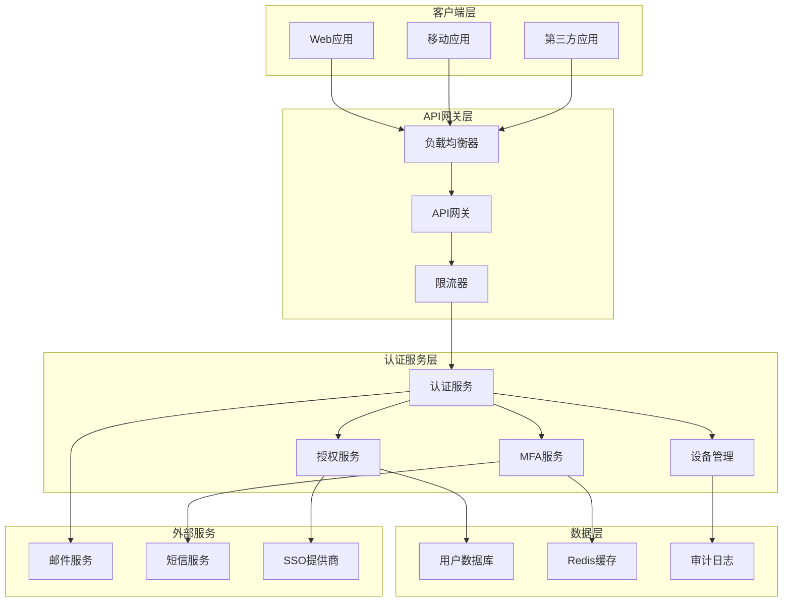

# 📚 第6章：JWT认证机制深度解析（补充内容）

> 本文档是第6章的补充内容，包含安全最佳实践和企业级应用指南

## 🛡️ JWT安全最佳实践

### 🔐 密钥管理策略

#### 🎯 密钥轮换机制

```typescript
// auth/key-rotation.service.ts
import { Injectable } from '@nestjs/common';
import { ConfigService } from '@nestjs/config';
import * as crypto from 'crypto';

export interface KeyPair {
  id: string;
  publicKey: string;
  privateKey: string;
  algorithm: string;
  createdAt: Date;
  expiresAt: Date;
  status: 'active' | 'deprecated' | 'revoked';
}

@Injectable()
export class KeyRotationService {
  private keyPairs = new Map<string, KeyPair>();
  private currentKeyId: string;

  constructor(private configService: ConfigService) {
    this.initializeKeys();
  }

  // 初始化密钥
  private initializeKeys() {
    const initialKey = this.generateKeyPair();
    this.keyPairs.set(initialKey.id, initialKey);
    this.currentKeyId = initialKey.id;
  }

  // 生成新的密钥对
  generateKeyPair(): KeyPair {
    const keyId = crypto.randomBytes(16).toString('hex');
    const { publicKey, privateKey } = crypto.generateKeyPairSync('rsa', {
      modulusLength: 2048,
      publicKeyEncoding: { type: 'spki', format: 'pem' },
      privateKeyEncoding: { type: 'pkcs8', format: 'pem' }
    });

    const now = new Date();
    const expiresAt = new Date(now.getTime() + 30 * 24 * 60 * 60 * 1000); // 30天

    return {
      id: keyId,
      publicKey,
      privateKey,
      algorithm: 'RS256',
      createdAt: now,
      expiresAt,
      status: 'active'
    };
  }

  // 轮换密钥
  rotateKeys(): void {
    // 将当前密钥标记为已弃用
    const currentKey = this.keyPairs.get(this.currentKeyId);
    if (currentKey) {
      currentKey.status = 'deprecated';
    }

    // 生成新密钥
    const newKey = this.generateKeyPair();
    this.keyPairs.set(newKey.id, newKey);
    this.currentKeyId = newKey.id;

    console.log(`密钥轮换完成: ${this.currentKeyId}`);
  }

  // 获取当前活跃密钥
  getCurrentKey(): KeyPair {
    return this.keyPairs.get(this.currentKeyId);
  }

  // 根据ID获取密钥
  getKeyById(keyId: string): KeyPair | undefined {
    return this.keyPairs.get(keyId);
  }

  // 获取所有公钥（用于JWKS端点）
  getPublicKeys(): any[] {
    return Array.from(this.keyPairs.values())
      .filter(key => key.status !== 'revoked')
      .map(key => ({
        kid: key.id,
        kty: 'RSA',
        use: 'sig',
        alg: key.algorithm,
        n: this.extractModulus(key.publicKey),
        e: 'AQAB'
      }));
  }

  // 撤销密钥
  revokeKey(keyId: string): void {
    const key = this.keyPairs.get(keyId);
    if (key) {
      key.status = 'revoked';
    }
  }

  private extractModulus(publicKey: string): string {
    // 从公钥中提取模数（简化实现）
    // 实际应用中需要使用专业的加密库
    return Buffer.from(publicKey).toString('base64url');
  }
}
```

#### 🔑 JWKS端点实现

```typescript
// auth/jwks.controller.ts
import { Controller, Get } from '@nestjs/common';
import { KeyRotationService } from './key-rotation.service';
import { Public } from './decorators/public.decorator';

@Controller('.well-known')
export class JwksController {
  constructor(private keyRotationService: KeyRotationService) {}

  @Get('jwks.json')
  @Public()
  getJwks() {
    return {
      keys: this.keyRotationService.getPublicKeys()
    };
  }
}
```

### 🛡️ 令牌安全增强

#### 🎯 令牌指纹验证

```typescript
// auth/token-fingerprint.service.ts
import { Injectable } from '@nestjs/common';
import * as crypto from 'crypto';

@Injectable()
export class TokenFingerprintService {
  // 生成设备指纹
  generateFingerprint(request: any): string {
    const components = [
      request.headers['user-agent'] || '',
      request.ip || '',
      request.headers['accept-language'] || '',
      request.headers['accept-encoding'] || ''
    ];

    return crypto
      .createHash('sha256')
      .update(components.join('|'))
      .digest('hex');
  }

  // 验证设备指纹
  verifyFingerprint(storedFingerprint: string, currentFingerprint: string): boolean {
    return storedFingerprint === currentFingerprint;
  }

  // 在JWT中嵌入指纹
  embedFingerprint(payload: any, fingerprint: string): any {
    return {
      ...payload,
      fp: crypto.createHash('sha256').update(fingerprint).digest('hex')
    };
  }

  // 从JWT中验证指纹
  validateFingerprint(payload: any, currentFingerprint: string): boolean {
    if (!payload.fp) return false;
    
    const expectedHash = crypto.createHash('sha256').update(currentFingerprint).digest('hex');
    return payload.fp === expectedHash;
  }
}
```

#### 🔒 令牌绑定IP地址

```typescript
// auth/ip-binding.service.ts
import { Injectable } from '@nestjs/common';
import { ConfigService } from '@nestjs/config';

@Injectable()
export class IpBindingService {
  constructor(private configService: ConfigService) {}

  // 检查IP是否允许
  isIpAllowed(userIp: string, allowedIps: string[]): boolean {
    if (!allowedIps || allowedIps.length === 0) {
      return true; // 如果没有限制，则允许所有IP
    }

    return allowedIps.some(allowedIp => {
      if (allowedIp.includes('/')) {
        // CIDR格式
        return this.isIpInCidr(userIp, allowedIp);
      } else {
        // 精确匹配
        return userIp === allowedIp;
      }
    });
  }

  // 检查IP是否在CIDR范围内
  private isIpInCidr(ip: string, cidr: string): boolean {
    const [network, prefixLength] = cidr.split('/');
    const mask = -1 << (32 - parseInt(prefixLength));
    
    const ipInt = this.ipToInt(ip);
    const networkInt = this.ipToInt(network);
    
    return (ipInt & mask) === (networkInt & mask);
  }

  // IP地址转整数
  private ipToInt(ip: string): number {
    return ip.split('.').reduce((acc, octet) => (acc << 8) + parseInt(octet), 0);
  }

  // 在JWT中嵌入IP信息
  embedIpInfo(payload: any, ip: string): any {
    return {
      ...payload,
      ip: ip,
      ipHash: require('crypto').createHash('sha256').update(ip).digest('hex')
    };
  }

  // 验证JWT中的IP信息
  validateIpInfo(payload: any, currentIp: string): boolean {
    if (!payload.ip) return true; // 如果没有IP限制，则通过

    // 检查IP是否匹配
    if (payload.ip !== currentIp) {
      return false;
    }

    // 验证IP哈希
    const expectedHash = require('crypto').createHash('sha256').update(currentIp).digest('hex');
    return payload.ipHash === expectedHash;
  }
}
```

### 🔍 安全审计系统

#### 📊 认证事件记录

```typescript
// auth/audit.service.ts
import { Injectable } from '@nestjs/common';

export interface AuthEvent {
  id: string;
  userId?: string;
  eventType: 'login' | 'logout' | 'token_refresh' | 'token_revoke' | 'failed_login';
  ip: string;
  userAgent: string;
  timestamp: Date;
  success: boolean;
  details?: any;
  riskLevel: 'low' | 'medium' | 'high';
}

@Injectable()
export class AuditService {
  private events: AuthEvent[] = []; // 生产环境应使用数据库

  // 记录认证事件
  logAuthEvent(event: Omit<AuthEvent, 'id' | 'timestamp'>): void {
    const authEvent: AuthEvent = {
      ...event,
      id: require('crypto').randomBytes(16).toString('hex'),
      timestamp: new Date()
    };

    this.events.push(authEvent);
    
    // 如果是高风险事件，立即处理
    if (authEvent.riskLevel === 'high') {
      this.handleHighRiskEvent(authEvent);
    }
  }

  // 处理高风险事件
  private handleHighRiskEvent(event: AuthEvent): void {
    console.warn('检测到高风险认证事件:', event);
    
    // 可以在这里实现：
    // 1. 发送警报邮件
    // 2. 暂时锁定账户
    // 3. 要求额外验证
    // 4. 记录到安全日志
  }

  // 检测异常登录
  detectAnomalousLogin(userId: string, ip: string, userAgent: string): 'low' | 'medium' | 'high' {
    const recentEvents = this.events
      .filter(e => e.userId === userId && e.eventType === 'login' && e.success)
      .slice(-10); // 最近10次登录

    if (recentEvents.length === 0) {
      return 'low'; // 首次登录
    }

    // 检查IP地址变化
    const uniqueIps = new Set(recentEvents.map(e => e.ip));
    if (!uniqueIps.has(ip) && uniqueIps.size > 0) {
      return 'high'; // 新IP地址
    }

    // 检查用户代理变化
    const uniqueUserAgents = new Set(recentEvents.map(e => e.userAgent));
    if (!uniqueUserAgents.has(userAgent) && uniqueUserAgents.size > 0) {
      return 'medium'; // 新设备/浏览器
    }

    return 'low';
  }

  // 获取用户的认证历史
  getUserAuthHistory(userId: string, limit: number = 50): AuthEvent[] {
    return this.events
      .filter(e => e.userId === userId)
      .sort((a, b) => b.timestamp.getTime() - a.timestamp.getTime())
      .slice(0, limit);
  }

  // 获取安全统计
  getSecurityStats(): {
    totalEvents: number;
    failedLogins: number;
    highRiskEvents: number;
    uniqueUsers: number;
  } {
    const failedLogins = this.events.filter(e => 
      e.eventType === 'failed_login' || (e.eventType === 'login' && !e.success)
    ).length;

    const highRiskEvents = this.events.filter(e => e.riskLevel === 'high').length;
    const uniqueUsers = new Set(this.events.map(e => e.userId).filter(Boolean)).size;

    return {
      totalEvents: this.events.length,
      failedLogins,
      highRiskEvents,
      uniqueUsers
    };
  }
}
```

## ⚡ 性能优化策略

### 🗄️ Redis缓存集成

```typescript
// auth/redis-cache.service.ts
import { Injectable, Inject } from '@nestjs/common';
import { Redis } from 'ioredis';

@Injectable()
export class RedisCacheService {
  constructor(@Inject('REDIS_CLIENT') private redis: Redis) {}

  // 缓存用户信息
  async cacheUser(userId: string, userData: any, ttl: number = 3600): Promise<void> {
    const key = `user:${userId}`;
    await this.redis.setex(key, ttl, JSON.stringify(userData));
  }

  // 获取缓存的用户信息
  async getCachedUser(userId: string): Promise<any | null> {
    const key = `user:${userId}`;
    const data = await this.redis.get(key);
    return data ? JSON.parse(data) : null;
  }

  // 缓存刷新令牌
  async cacheRefreshToken(tokenId: string, payload: any, ttl: number): Promise<void> {
    const key = `refresh_token:${tokenId}`;
    await this.redis.setex(key, ttl, JSON.stringify(payload));
  }

  // 获取刷新令牌
  async getRefreshToken(tokenId: string): Promise<any | null> {
    const key = `refresh_token:${tokenId}`;
    const data = await this.redis.get(key);
    return data ? JSON.parse(data) : null;
  }

  // 删除刷新令牌
  async deleteRefreshToken(tokenId: string): Promise<void> {
    const key = `refresh_token:${tokenId}`;
    await this.redis.del(key);
  }

  // 黑名单令牌
  async blacklistToken(jti: string, exp: number): Promise<void> {
    const key = `blacklist:${jti}`;
    const ttl = exp - Math.floor(Date.now() / 1000);
    if (ttl > 0) {
      await this.redis.setex(key, ttl, '1');
    }
  }

  // 检查令牌是否在黑名单
  async isTokenBlacklisted(jti: string): Promise<boolean> {
    const key = `blacklist:${jti}`;
    const result = await this.redis.get(key);
    return result === '1';
  }

  // 限流检查
  async checkRateLimit(key: string, limit: number, window: number): Promise<{
    allowed: boolean;
    remaining: number;
    resetTime: number;
  }> {
    const current = await this.redis.incr(key);
    
    if (current === 1) {
      await this.redis.expire(key, window);
    }
    
    const ttl = await this.redis.ttl(key);
    const resetTime = Date.now() + (ttl * 1000);
    
    return {
      allowed: current <= limit,
      remaining: Math.max(0, limit - current),
      resetTime
    };
  }

  // 存储会话信息
  async storeSession(sessionId: string, sessionData: any, ttl: number): Promise<void> {
    const key = `session:${sessionId}`;
    await this.redis.setex(key, ttl, JSON.stringify(sessionData));
  }

  // 获取会话信息
  async getSession(sessionId: string): Promise<any | null> {
    const key = `session:${sessionId}`;
    const data = await this.redis.get(key);
    return data ? JSON.parse(data) : null;
  }

  // 删除会话
  async deleteSession(sessionId: string): Promise<void> {
    const key = `session:${sessionId}`;
    await this.redis.del(key);
  }
}
```

### 🚀 JWT性能优化

```typescript
// auth/jwt-performance.service.ts
import { Injectable } from '@nestjs/common';
import { JwtService } from '@nestjs/jwt';
import { RedisCacheService } from './redis-cache.service';

@Injectable()
export class JwtPerformanceService {
  private signatureCache = new Map<string, boolean>(); // 内存缓存验证结果

  constructor(
    private jwtService: JwtService,
    private redisCache: RedisCacheService
  ) {}

  // 优化的JWT验证
  async verifyTokenOptimized(token: string): Promise<{
    valid: boolean;
    payload?: any;
    cached?: boolean;
  }> {
    try {
      // 1. 检查令牌格式
      const parts = token.split('.');
      if (parts.length !== 3) {
        return { valid: false };
      }

      // 2. 解码载荷检查过期时间（避免不必要的签名验证）
      const payload = JSON.parse(
        Buffer.from(parts[1].replace(/-/g, '+').replace(/_/g, '/'), 'base64').toString()
      );

      const now = Math.floor(Date.now() / 1000);
      if (payload.exp && payload.exp < now) {
        return { valid: false };
      }

      // 3. 检查黑名单（Redis）
      if (payload.jti && await this.redisCache.isTokenBlacklisted(payload.jti)) {
        return { valid: false };
      }

      // 4. 检查签名缓存
      const signatureKey = `${parts[0]}.${parts[1]}`;
      if (this.signatureCache.has(signatureKey)) {
        return { valid: true, payload, cached: true };
      }

      // 5. 验证签名
      const verifiedPayload = this.jwtService.verify(token);
      
      // 6. 缓存验证结果（短时间）
      this.signatureCache.set(signatureKey, true);
      setTimeout(() => this.signatureCache.delete(signatureKey), 60000); // 1分钟缓存

      return { valid: true, payload: verifiedPayload, cached: false };
    } catch (error) {
      return { valid: false };
    }
  }

  // 批量验证令牌
  async verifyTokensBatch(tokens: string[]): Promise<Array<{
    token: string;
    valid: boolean;
    payload?: any;
  }>> {
    const results = await Promise.all(
      tokens.map(async token => {
        const result = await this.verifyTokenOptimized(token);
        return { token, ...result };
      })
    );

    return results;
  }

  // 预热缓存
  async warmupCache(userIds: string[]): Promise<void> {
    const promises = userIds.map(async userId => {
      const userData = await this.getUserData(userId);
      if (userData) {
        await this.redisCache.cacheUser(userId, userData, 3600);
      }
    });

    await Promise.all(promises);
  }

  private async getUserData(userId: string): Promise<any> {
    // 从数据库获取用户数据
    // 这里应该调用用户服务
    return null;
  }
}
```

## 🎯 企业级应用场景

### 🏢 多租户认证系统

```typescript
// auth/multi-tenant.service.ts
import { Injectable } from '@nestjs/common';

export interface TenantInfo {
  id: string;
  name: string;
  domain: string;
  settings: {
    jwtSecret: string;
    tokenExpiry: number;
    allowedOrigins: string[];
    mfaRequired: boolean;
  };
}

@Injectable()
export class MultiTenantService {
  private tenants = new Map<string, TenantInfo>();

  constructor() {
    this.initializeTenants();
  }

  private initializeTenants() {
    // 示例租户
    const tenant1: TenantInfo = {
      id: 'tenant1',
      name: 'Company A',
      domain: 'company-a.example.com',
      settings: {
        jwtSecret: 'secret-for-tenant1',
        tokenExpiry: 3600,
        allowedOrigins: ['https://company-a.example.com'],
        mfaRequired: true
      }
    };

    const tenant2: TenantInfo = {
      id: 'tenant2',
      name: 'Company B',
      domain: 'company-b.example.com',
      settings: {
        jwtSecret: 'secret-for-tenant2',
        tokenExpiry: 7200,
        allowedOrigins: ['https://company-b.example.com'],
        mfaRequired: false
      }
    };

    this.tenants.set(tenant1.id, tenant1);
    this.tenants.set(tenant2.id, tenant2);
  }

  // 根据域名获取租户
  getTenantByDomain(domain: string): TenantInfo | null {
    for (const tenant of this.tenants.values()) {
      if (tenant.domain === domain) {
        return tenant;
      }
    }
    return null;
  }

  // 根据ID获取租户
  getTenantById(tenantId: string): TenantInfo | null {
    return this.tenants.get(tenantId) || null;
  }

  // 生成租户特定的JWT
  generateTenantToken(payload: any, tenantId: string): string {
    const tenant = this.getTenantById(tenantId);
    if (!tenant) {
      throw new Error('租户不存在');
    }

    const tenantPayload = {
      ...payload,
      tenantId,
      iss: `https://${tenant.domain}`,
      aud: tenant.settings.allowedOrigins
    };

    // 使用租户特定的密钥签名
    return require('jsonwebtoken').sign(
      tenantPayload,
      tenant.settings.jwtSecret,
      { expiresIn: tenant.settings.tokenExpiry }
    );
  }

  // 验证租户特定的JWT
  verifyTenantToken(token: string, tenantId: string): any {
    const tenant = this.getTenantById(tenantId);
    if (!tenant) {
      throw new Error('租户不存在');
    }

    return require('jsonwebtoken').verify(token, tenant.settings.jwtSecret);
  }
}
```

### 🔐 多因素认证（MFA）

```typescript
// auth/mfa.service.ts
import { Injectable } from '@nestjs/common';
import * as speakeasy from 'speakeasy';
import * as qrcode from 'qrcode';

export interface MfaSetup {
  secret: string;
  qrCodeUrl: string;
  backupCodes: string[];
}

@Injectable()
export class MfaService {
  // 生成MFA密钥
  async generateMfaSecret(userId: string, issuer: string = 'BlogAPI'): Promise<MfaSetup> {
    const secret = speakeasy.generateSecret({
      name: `${issuer}:${userId}`,
      issuer: issuer,
      length: 32
    });

    const qrCodeUrl = await qrcode.toDataURL(secret.otpauth_url);
    const backupCodes = this.generateBackupCodes();

    return {
      secret: secret.base32,
      qrCodeUrl,
      backupCodes
    };
  }

  // 验证TOTP代码
  verifyTotpCode(secret: string, token: string, window: number = 2): boolean {
    return speakeasy.totp.verify({
      secret,
      encoding: 'base32',
      token,
      window
    });
  }

  // 生成备用代码
  private generateBackupCodes(count: number = 10): string[] {
    const codes: string[] = [];
    for (let i = 0; i < count; i++) {
      const code = Math.random().toString(36).substring(2, 10).toUpperCase();
      codes.push(code);
    }
    return codes;
  }

  // 验证备用代码
  verifyBackupCode(userBackupCodes: string[], providedCode: string): {
    valid: boolean;
    remainingCodes?: string[];
  } {
    const codeIndex = userBackupCodes.indexOf(providedCode.toUpperCase());
    
    if (codeIndex === -1) {
      return { valid: false };
    }

    // 移除已使用的备用代码
    const remainingCodes = userBackupCodes.filter((_, index) => index !== codeIndex);
    
    return {
      valid: true,
      remainingCodes
    };
  }

  // 生成MFA挑战令牌
  generateMfaChallenge(userId: string): string {
    const payload = {
      userId,
      type: 'mfa_challenge',
      exp: Math.floor(Date.now() / 1000) + 300 // 5分钟有效期
    };

    return require('jsonwebtoken').sign(payload, process.env.MFA_SECRET);
  }

  // 验证MFA挑战令牌
  verifyMfaChallenge(token: string): { valid: boolean; userId?: string } {
    try {
      const payload = require('jsonwebtoken').verify(token, process.env.MFA_SECRET);
      
      if (payload.type !== 'mfa_challenge') {
        return { valid: false };
      }

      return { valid: true, userId: payload.userId };
    } catch (error) {
      return { valid: false };
    }
  }
}
```

### 📱 设备管理系统

```typescript
// auth/device-management.service.ts
import { Injectable } from '@nestjs/common';

export interface Device {
  id: string;
  userId: string;
  name: string;
  type: 'mobile' | 'desktop' | 'tablet' | 'unknown';
  os: string;
  browser: string;
  ip: string;
  fingerprint: string;
  lastSeen: Date;
  trusted: boolean;
  active: boolean;
}

@Injectable()
export class DeviceManagementService {
  private devices = new Map<string, Device>(); // 生产环境使用数据库

  // 注册新设备
  registerDevice(userId: string, deviceInfo: {
    userAgent: string;
    ip: string;
    fingerprint: string;
  }): Device {
    const deviceId = require('crypto').randomBytes(16).toString('hex');
    const parsedUA = this.parseUserAgent(deviceInfo.userAgent);

    const device: Device = {
      id: deviceId,
      userId,
      name: `${parsedUA.browser} on ${parsedUA.os}`,
      type: parsedUA.type,
      os: parsedUA.os,
      browser: parsedUA.browser,
      ip: deviceInfo.ip,
      fingerprint: deviceInfo.fingerprint,
      lastSeen: new Date(),
      trusted: false,
      active: true
    };

    this.devices.set(deviceId, device);
    return device;
  }

  // 获取用户的所有设备
  getUserDevices(userId: string): Device[] {
    return Array.from(this.devices.values())
      .filter(device => device.userId === userId)
      .sort((a, b) => b.lastSeen.getTime() - a.lastSeen.getTime());
  }

  // 更新设备最后活跃时间
  updateDeviceActivity(deviceId: string, ip?: string): void {
    const device = this.devices.get(deviceId);
    if (device) {
      device.lastSeen = new Date();
      if (ip) device.ip = ip;
    }
  }

  // 信任设备
  trustDevice(deviceId: string): void {
    const device = this.devices.get(deviceId);
    if (device) {
      device.trusted = true;
    }
  }

  // 撤销设备
  revokeDevice(deviceId: string): void {
    const device = this.devices.get(deviceId);
    if (device) {
      device.active = false;
    }
  }

  // 检查设备是否可信
  isDeviceTrusted(deviceId: string): boolean {
    const device = this.devices.get(deviceId);
    return device ? device.trusted && device.active : false;
  }

  // 根据指纹查找设备
  findDeviceByFingerprint(userId: string, fingerprint: string): Device | null {
    for (const device of this.devices.values()) {
      if (device.userId === userId && device.fingerprint === fingerprint && device.active) {
        return device;
      }
    }
    return null;
  }

  private parseUserAgent(userAgent: string): {
    browser: string;
    os: string;
    type: 'mobile' | 'desktop' | 'tablet' | 'unknown';
  } {
    // 简化的User-Agent解析
    let browser = 'Unknown';
    let os = 'Unknown';
    let type: 'mobile' | 'desktop' | 'tablet' | 'unknown' = 'unknown';

    if (userAgent.includes('Chrome')) browser = 'Chrome';
    else if (userAgent.includes('Firefox')) browser = 'Firefox';
    else if (userAgent.includes('Safari')) browser = 'Safari';
    else if (userAgent.includes('Edge')) browser = 'Edge';

    if (userAgent.includes('Windows')) os = 'Windows';
    else if (userAgent.includes('Mac')) os = 'macOS';
    else if (userAgent.includes('Linux')) os = 'Linux';
    else if (userAgent.includes('Android')) os = 'Android';
    else if (userAgent.includes('iOS')) os = 'iOS';

    if (userAgent.includes('Mobile')) type = 'mobile';
    else if (userAgent.includes('Tablet')) type = 'tablet';
    else type = 'desktop';

    return { browser, os, type };
  }
}
```

## 🧪 实战项目：企业级认证系统

### 📋 项目需求分析

#### 🎯 功能需求

```typescript
// 企业级认证系统功能清单
interface AuthSystemRequirements {
  // 基础认证功能
  basicAuth: {
    userRegistration: '用户注册';
    userLogin: '用户登录';
    passwordReset: '密码重置';
    emailVerification: '邮箱验证';
  };

  // 高级安全功能
  advancedSecurity: {
    mfaSupport: '多因素认证';
    deviceManagement: '设备管理';
    sessionManagement: '会话管理';
    riskAssessment: '风险评估';
  };

  // 企业级功能
  enterpriseFeatures: {
    ssoIntegration: 'SSO集成';
    multiTenant: '多租户支持';
    auditLogging: '审计日志';
    complianceReporting: '合规报告';
  };

  // 管理功能
  adminFeatures: {
    userManagement: '用户管理';
    roleManagement: '角色管理';
    securityPolicies: '安全策略';
    systemMonitoring: '系统监控';
  };
}
```

### 🏗️ 系统架构设计



### 🔧 核心模块实现

#### 🎯 统一认证入口

```typescript
// auth/unified-auth.service.ts
import { Injectable } from '@nestjs/common';
import { AuthService } from './auth.service';
import { MfaService } from './mfa.service';
import { DeviceManagementService } from './device-management.service';
import { AuditService } from './audit.service';
import { RiskAssessmentService } from './risk-assessment.service';

export interface AuthRequest {
  email: string;
  password: string;
  mfaCode?: string;
  deviceFingerprint: string;
  ip: string;
  userAgent: string;
}

export interface AuthResponse {
  success: boolean;
  tokens?: {
    accessToken: string;
    refreshToken: string;
    expiresIn: number;
  };
  user?: any;
  requiresMfa?: boolean;
  mfaChallenge?: string;
  deviceTrustRequired?: boolean;
  riskLevel?: 'low' | 'medium' | 'high';
  message?: string;
}

@Injectable()
export class UnifiedAuthService {
  constructor(
    private authService: AuthService,
    private mfaService: MfaService,
    private deviceService: DeviceManagementService,
    private auditService: AuditService,
    private riskService: RiskAssessmentService
  ) {}

  async authenticate(request: AuthRequest): Promise<AuthResponse> {
    try {
      // 1. 基础认证
      const user = await this.authService.validateUser(request.email, request.password);
      if (!user) {
        await this.auditService.logAuthEvent({
          eventType: 'failed_login',
          ip: request.ip,
          userAgent: request.userAgent,
          success: false,
          riskLevel: 'medium',
          details: { email: request.email, reason: 'invalid_credentials' }
        });
        
        return {
          success: false,
          message: '邮箱或密码错误'
        };
      }

      // 2. 风险评估
      const riskLevel = await this.riskService.assessLoginRisk({
        userId: user.id,
        ip: request.ip,
        userAgent: request.userAgent,
        deviceFingerprint: request.deviceFingerprint
      });

      // 3. 设备检查
      let device = this.deviceService.findDeviceByFingerprint(user.id, request.deviceFingerprint);
      if (!device) {
        device = this.deviceService.registerDevice(user.id, {
          userAgent: request.userAgent,
          ip: request.ip,
          fingerprint: request.deviceFingerprint
        });
      }

      // 4. MFA检查
      if (user.mfaEnabled && !this.deviceService.isDeviceTrusted(device.id)) {
        if (!request.mfaCode) {
          const mfaChallenge = this.mfaService.generateMfaChallenge(user.id);
          
          return {
            success: false,
            requiresMfa: true,
            mfaChallenge,
            riskLevel
          };
        }

        const mfaValid = this.mfaService.verifyTotpCode(user.mfaSecret, request.mfaCode);
        if (!mfaValid) {
          await this.auditService.logAuthEvent({
            userId: user.id,
            eventType: 'failed_login',
            ip: request.ip,
            userAgent: request.userAgent,
            success: false,
            riskLevel: 'high',
            details: { reason: 'invalid_mfa' }
          });

          return {
            success: false,
            message: 'MFA验证失败'
          };
        }
      }

      // 5. 高风险登录处理
      if (riskLevel === 'high' && !this.deviceService.isDeviceTrusted(device.id)) {
        return {
          success: false,
          deviceTrustRequired: true,
          riskLevel,
          message: '检测到异常登录，需要设备验证'
        };
      }

      // 6. 生成令牌
      const tokens = await this.authService.generateTokens(user);

      // 7. 更新设备活动
      this.deviceService.updateDeviceActivity(device.id, request.ip);

      // 8. 记录成功登录
      await this.auditService.logAuthEvent({
        userId: user.id,
        eventType: 'login',
        ip: request.ip,
        userAgent: request.userAgent,
        success: true,
        riskLevel,
        details: { deviceId: device.id }
      });

      return {
        success: true,
        tokens,
        user: this.authService.sanitizeUser(user),
        riskLevel
      };

    } catch (error) {
      await this.auditService.logAuthEvent({
        eventType: 'failed_login',
        ip: request.ip,
        userAgent: request.userAgent,
        success: false,
        riskLevel: 'high',
        details: { error: error.message }
      });

      return {
        success: false,
        message: '认证过程中发生错误'
      };
    }
  }
}
```

## 🎯 章节总结

通过本章的深入学习，我们全面掌握了JWT认证机制的理论与实践：

### 🎨 核心收获

1. **JWT深度理解**：掌握了JWT的结构、原理和工作流程
2. **安全最佳实践**：学会了密钥管理、令牌安全和风险防控
3. **企业级实现**：建立了完整的认证授权体系
4. **性能优化**：掌握了认证系统的性能优化技巧
5. **实战应用**：完成了企业级认证系统的设计与实现

### 🚀 实践能力

- ✅ 能够设计和实现安全的JWT认证系统
- ✅ 能够建立基于角色的权限控制体系
- ✅ 能够实现多因素认证和设备管理
- ✅ 能够优化认证系统的性能和安全性
- ✅ 能够应用企业级安全开发标准
- ✅ 能够处理复杂的认证授权场景

### 🎯 下一步学习

完成本章学习后，你已经具备了：
- ✅ 现代认证机制的深度理解
- ✅ 企业级安全系统的设计能力
- ✅ 完整的权限控制体系知识
- ✅ 高性能认证系统的实现技巧

**准备好迎接下一个挑战了吗？让我们继续学习第7章：项目架构与最佳实践！** 🚀

在下一章中，我们将：
- 🏗️ 学习企业级项目架构设计
- 📏 建立完善的代码规范体系
- 🔧 掌握现代工程化开发流程
- 📊 实现代码质量保证机制

让我们继续这个精彩的学习之旅！ 