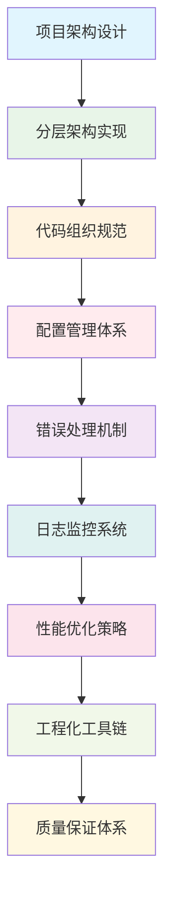
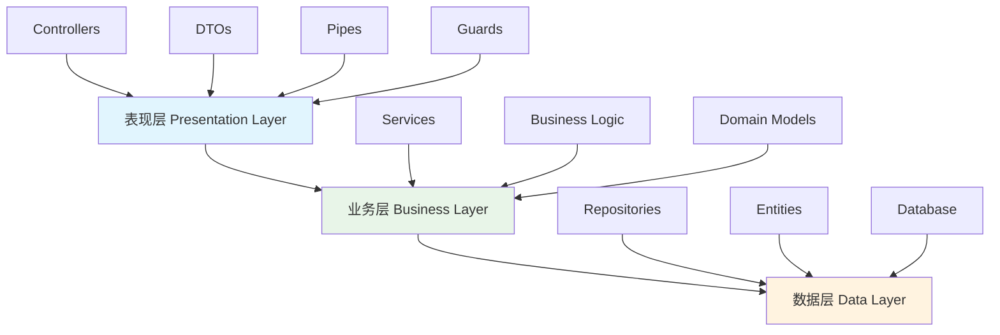

# 📚 第7章：项目架构与最佳实践

> **从理论到实践** - 构建企业级NestJS项目架构与工程化体系

## 🎯 章节概述

在前面的章节中，我们已经掌握了NestJS的核心技术和认证机制。现在，我们将学习如何将这些技术整合到一个完整的企业级项目架构中，建立规范的开发流程和质量保证体系。

### 🏗️ 本章学习路径



## 🎯 学习目标

通过本章学习，你将能够：

- 🏗️ **设计企业级架构**：掌握分层架构和模块化设计原则
- 📏 **建立代码规范**：制定团队代码规范和最佳实践标准
- 🔧 **构建工程化体系**：建立完整的开发、测试、部署流程
- 📊 **实现质量保证**：建立代码质量监控和持续改进机制
- ⚡ **优化项目性能**：掌握性能监控和优化策略
- 🎯 **应用最佳实践**：遵循企业级开发标准和规范

## 🏗️ 企业级项目架构设计

### 🎨 架构设计原则

#### 🏠 生活类比：城市规划

想象项目架构就像规划一座现代化城市：

```
🏙️ 城市规划（项目架构）
├── 🏢 商业区（业务层）
├── 🏠 住宅区（数据层）
├── 🚇 交通网（通信层）
├── 🏥 公共设施（基础设施）
├── 📋 规划法规（代码规范）
└── 🚨 安全系统（监控告警）

🎯 设计原则对比
├── 📐 分区规划 → 分层架构
├── 🛣️ 交通便利 → 模块通信
├── 🏗️ 可扩展性 → 系统扩展
├── 🔧 维护便利 → 代码维护
├── 🛡️ 安全可靠 → 系统安全
└── 📊 监控管理 → 系统监控
```

#### 🎯 SOLID设计原则在架构中的应用

```typescript
// SOLID原则在NestJS架构中的体现
interface SOLIDInArchitecture {
  // S - 单一职责原则
  singleResponsibility: {
    principle: '每个模块只负责一个功能领域';
    implementation: {
      userModule: '只处理用户相关功能';
      authModule: '只处理认证相关功能';
      articleModule: '只处理文章相关功能';
    };
  };
  
  // O - 开闭原则
  openClosed: {
    principle: '对扩展开放，对修改关闭';
    implementation: {
      interfaces: '通过接口定义契约';
      plugins: '通过插件机制扩展功能';
      strategies: '通过策略模式支持多种实现';
    };
  };
  
  // L - 里氏替换原则
  liskovSubstitution: {
    principle: '子类可以替换父类';
    implementation: {
      repositories: '不同数据库实现可以互换';
      services: '不同服务实现可以互换';
      guards: '不同认证守卫可以互换';
    };
  };
  
  // I - 接口隔离原则
  interfaceSegregation: {
    principle: '客户端不应依赖不需要的接口';
    implementation: {
      specificInterfaces: '定义具体的接口';
      roleBasedInterfaces: '基于角色的接口设计';
      minimalDependencies: '最小化依赖关系';
    };
  };
  
  // D - 依赖倒置原则
  dependencyInversion: {
    principle: '依赖抽象而不是具体实现';
    implementation: {
      dependencyInjection: 'NestJS的依赖注入';
      abstractRepositories: '抽象的仓储模式';
      configurationAbstraction: '配置抽象化';
    };
  };
}
```

### 🏗️ 分层架构设计

#### 📊 经典三层架构



**分层架构实现**：

```typescript
// 表现层 - 控制器
@Controller('articles')
@ApiTags('文章管理')
export class ArticleController {
  constructor(private readonly articleService: ArticleService) {}

  @Get()
  @ApiOperation({ summary: '获取文章列表' })
  async findAll(@Query() query: FindArticlesDto): Promise<ArticleListResponseDto> {
    return this.articleService.findAll(query);
  }

  @Post()
  @UseGuards(JwtAuthGuard)
  @ApiOperation({ summary: '创建文章' })
  async create(
    @Body() createArticleDto: CreateArticleDto,
    @CurrentUser() user: UserEntity
  ): Promise<ArticleResponseDto> {
    return this.articleService.create(createArticleDto, user);
  }
}

// 业务层 - 服务
@Injectable()
export class ArticleService {
  constructor(
    private readonly articleRepository: ArticleRepository,
    private readonly userService: UserService,
    private readonly cacheService: CacheService,
    private readonly eventEmitter: EventEmitter2
  ) {}

  async findAll(query: FindArticlesDto): Promise<ArticleListResponseDto> {
    // 业务逻辑处理
    const cacheKey = `articles:${JSON.stringify(query)}`;
    
    // 尝试从缓存获取
    const cached = await this.cacheService.get(cacheKey);
    if (cached) {
      return cached;
    }

    // 从数据库查询
    const [articles, total] = await this.articleRepository.findAndCount({
      where: this.buildWhereCondition(query),
      order: { createdAt: 'DESC' },
      skip: (query.page - 1) * query.limit,
      take: query.limit,
      relations: ['author', 'tags']
    });

    const result = {
      data: articles.map(article => this.transformToDto(article)),
      pagination: {
        page: query.page,
        limit: query.limit,
        total,
        totalPages: Math.ceil(total / query.limit)
      }
    };

    // 缓存结果
    await this.cacheService.set(cacheKey, result, 300); // 5分钟缓存

    return result;
  }

  async create(createArticleDto: CreateArticleDto, author: UserEntity): Promise<ArticleResponseDto> {
    // 业务规则验证
    await this.validateArticleCreation(createArticleDto, author);

    // 创建文章实体
    const article = this.articleRepository.create({
      ...createArticleDto,
      author,
      slug: this.generateSlug(createArticleDto.title),
      readingTime: this.calculateReadingTime(createArticleDto.content)
    });

    // 保存到数据库
    const savedArticle = await this.articleRepository.save(article);

    // 发布事件
    this.eventEmitter.emit('article.created', {
      articleId: savedArticle.id,
      authorId: author.id
    });

    // 清除相关缓存
    await this.cacheService.del('articles:*');

    return this.transformToDto(savedArticle);
  }

  private async validateArticleCreation(dto: CreateArticleDto, author: UserEntity): Promise<void> {
    // 检查用户权限
    if (!author.canCreateArticle()) {
      throw new ForbiddenException('用户没有创建文章的权限');
    }

    // 检查标题重复
    const existingArticle = await this.articleRepository.findOne({
      where: { title: dto.title }
    });

    if (existingArticle) {
      throw new ConflictException('文章标题已存在');
    }

    // 检查内容长度
    if (dto.content.length < 100) {
      throw new BadRequestException('文章内容不能少于100字');
    }
  }

  private generateSlug(title: string): string {
    return title
      .toLowerCase()
      .replace(/[^a-z0-9\u4e00-\u9fa5]+/g, '-')
      .replace(/^-+|-+$/g, '');
  }

  private calculateReadingTime(content: string): number {
    const wordsPerMinute = 200;
    const wordCount = content.split(/\s+/).length;
    return Math.ceil(wordCount / wordsPerMinute);
  }

  private transformToDto(article: ArticleEntity): ArticleResponseDto {
    return {
      id: article.id,
      title: article.title,
      content: article.content,
      summary: article.summary,
      slug: article.slug,
      readingTime: article.readingTime,
      publishedAt: article.publishedAt,
      author: {
        id: article.author.id,
        username: article.author.username,
        avatar: article.author.avatar
      },
      tags: article.tags?.map(tag => ({
        id: tag.id,
        name: tag.name
      })) || [],
      createdAt: article.createdAt,
      updatedAt: article.updatedAt
    };
  }
}

// 数据层 - 仓储
@Injectable()
export class ArticleRepository extends Repository<ArticleEntity> {
  constructor(
    @InjectRepository(ArticleEntity)
    private repository: Repository<ArticleEntity>
  ) {
    super(repository.target, repository.manager, repository.queryRunner);
  }

  async findBySlug(slug: string): Promise<ArticleEntity | null> {
    return this.repository.findOne({
      where: { slug },
      relations: ['author', 'tags']
    });
  }

  async findPublishedArticles(options: FindManyOptions<ArticleEntity>): Promise<[ArticleEntity[], number]> {
    return this.repository.findAndCount({
      ...options,
      where: {
        ...options.where,
        publishedAt: Not(IsNull())
      }
    });
  }

  async incrementViewCount(id: string): Promise<void> {
    await this.repository.increment({ id }, 'viewCount', 1);
  }
}
```

#### 🎯 领域驱动设计（DDD）架构

```typescript
// 领域实体
export class ArticleEntity {
  @PrimaryGeneratedColumn('uuid')
  id: string;

  @Column()
  title: string;

  @Column('text')
  content: string;

  @Column()
  slug: string;

  @Column({ default: 0 })
  viewCount: number;

  @Column({ default: 0 })
  readingTime: number;

  @Column({ nullable: true })
  publishedAt: Date;

  @ManyToOne(() => UserEntity, user => user.articles)
  author: UserEntity;

  @ManyToMany(() => TagEntity, tag => tag.articles)
  @JoinTable()
  tags: TagEntity[];

  @CreateDateColumn()
  createdAt: Date;

  @UpdateDateColumn()
  updatedAt: Date;

  // 领域方法
  publish(): void {
    if (this.publishedAt) {
      throw new Error('文章已经发布');
    }
    this.publishedAt = new Date();
  }

  unpublish(): void {
    if (!this.publishedAt) {
      throw new Error('文章尚未发布');
    }
    this.publishedAt = null;
  }

  isPublished(): boolean {
    return this.publishedAt !== null;
  }

  canBeEditedBy(user: UserEntity): boolean {
    return this.author.id === user.id || user.hasRole('admin');
  }

  updateContent(title: string, content: string): void {
    if (this.isPublished()) {
      throw new Error('已发布的文章不能修改内容');
    }
    
    this.title = title;
    this.content = content;
    this.slug = this.generateSlug(title);
    this.readingTime = this.calculateReadingTime(content);
  }

  private generateSlug(title: string): string {
    return title
      .toLowerCase()
      .replace(/[^a-z0-9\u4e00-\u9fa5]+/g, '-')
      .replace(/^-+|-+$/g, '');
  }

  private calculateReadingTime(content: string): number {
    const wordsPerMinute = 200;
    const wordCount = content.split(/\s+/).length;
    return Math.ceil(wordCount / wordsPerMinute);
  }
}

// 领域服务
@Injectable()
export class ArticleDomainService {
  constructor(
    private readonly articleRepository: ArticleRepository,
    private readonly eventBus: EventBus
  ) {}

  async publishArticle(articleId: string, publisherId: string): Promise<void> {
    const article = await this.articleRepository.findById(articleId);
    if (!article) {
      throw new NotFoundException('文章不存在');
    }

    const publisher = await this.userRepository.findById(publisherId);
    if (!article.canBeEditedBy(publisher)) {
      throw new ForbiddenException('没有权限发布此文章');
    }

    // 领域逻辑
    article.publish();
    
    await this.articleRepository.save(article);

    // 发布领域事件
    await this.eventBus.publish(new ArticlePublishedEvent(article.id, publisher.id));
  }
}

// 领域事件
export class ArticlePublishedEvent {
  constructor(
    public readonly articleId: string,
    public readonly publisherId: string,
    public readonly publishedAt: Date = new Date()
  ) {}
}

// 事件处理器
@EventsHandler(ArticlePublishedEvent)
export class ArticlePublishedHandler implements IEventHandler<ArticlePublishedEvent> {
  constructor(
    private readonly notificationService: NotificationService,
    private readonly searchService: SearchService,
    private readonly cacheService: CacheService
  ) {}

  async handle(event: ArticlePublishedEvent): Promise<void> {
    // 发送通知
    await this.notificationService.notifyFollowers(event.publisherId, {
      type: 'article_published',
      articleId: event.articleId
    });

    // 更新搜索索引
    await this.searchService.indexArticle(event.articleId);

    // 清除缓存
    await this.cacheService.del('articles:*');
    await this.cacheService.del(`user:${event.publisherId}:articles`);
  }
}
``` 

## 📁 代码组织规范

### 🗂️ 项目目录结构

```
src/
├── common/                 # 公共模块
│   ├── decorators/         # 自定义装饰器
│   ├── filters/           # 异常过滤器
│   ├── guards/            # 守卫
│   ├── interceptors/      # 拦截器
│   ├── pipes/             # 管道
│   ├── interfaces/        # 公共接口
│   ├── constants/         # 常量定义
│   ├── utils/             # 工具函数
│   └── types/             # 类型定义
├── config/                # 配置模块
│   ├── database.config.ts
│   ├── redis.config.ts
│   ├── jwt.config.ts
│   └── app.config.ts
├── modules/               # 业务模块
│   ├── auth/              # 认证模块
│   ├── user/              # 用户模块
│   └── article/           # 文章模块
├── database/              # 数据库相关
│   ├── migrations/        # 数据库迁移
│   ├── seeds/             # 数据种子
│   └── factories/         # 数据工厂
├── shared/                # 共享模块
│   ├── cache/             # 缓存模块
│   ├── logger/            # 日志模块
│   ├── email/             # 邮件模块
│   └── upload/            # 文件上传模块
├── app.module.ts          # 根模块
└── main.ts                # 应用入口
```

### 📝 命名规范

```typescript
// 文件命名规范
interface NamingConventions {
  files: {
    controllers: 'user.controller.ts';
    services: 'user.service.ts';
    repositories: 'user.repository.ts';
    entities: 'user.entity.ts';
    dto: 'create-user.dto.ts';
    interfaces: 'user.interface.ts';
    guards: 'jwt-auth.guard.ts';
    pipes: 'validation.pipe.ts';
    filters: 'http-exception.filter.ts';
    interceptors: 'logging.interceptor.ts';
    modules: 'user.module.ts';
  };
  
  classes: {
    controllers: 'UserController';
    services: 'UserService';
    repositories: 'UserRepository';
    entities: 'UserEntity';
    dto: 'CreateUserDto';
    interfaces: 'IUserService';
    guards: 'JwtAuthGuard';
    pipes: 'ValidationPipe';
    filters: 'HttpExceptionFilter';
    interceptors: 'LoggingInterceptor';
    modules: 'UserModule';
  };
}
```

## ⚙️ 配置管理体系

### 🔧 环境配置管理

```typescript
// config/app.config.ts
export interface AppConfig {
  port: number;
  environment: string;
  apiPrefix: string;
  corsOrigins: string[];
  rateLimit: {
    ttl: number;
    limit: number;
  };
}

export default (): { app: AppConfig } => ({
  app: {
    port: parseInt(process.env.PORT, 10) || 3000,
    environment: process.env.NODE_ENV || 'development',
    apiPrefix: process.env.API_PREFIX || 'api/v1',
    corsOrigins: process.env.CORS_ORIGINS?.split(',') || ['http://localhost:3000'],
    rateLimit: {
      ttl: parseInt(process.env.RATE_LIMIT_TTL, 10) || 60,
      limit: parseInt(process.env.RATE_LIMIT_MAX, 10) || 100
    }
  }
});

// 配置验证
import { IsString, IsNumber, IsBoolean, IsOptional, IsIn } from 'class-validator';
import { Transform } from 'class-transformer';

export class EnvironmentVariables {
  @IsString()
  NODE_ENV: string;

  @IsNumber()
  @Transform(({ value }) => parseInt(value, 10))
  PORT: number;

  @IsString()
  DB_HOST: string;

  @IsNumber()
  @Transform(({ value }) => parseInt(value, 10))
  DB_PORT: number;

  @IsString()
  DB_USERNAME: string;

  @IsString()
  DB_PASSWORD: string;

  @IsString()
  DB_DATABASE: string;

  @IsIn(['postgres', 'mysql', 'sqlite'])
  DB_TYPE: string;

  @IsString()
  JWT_SECRET: string;

  @IsString()
  JWT_EXPIRES_IN: string;
}
```

## ⚠️ 错误处理机制

### 🎯 统一异常处理

```typescript
// 自定义异常类
export class BusinessException extends Error {
  constructor(
    public readonly code: string,
    public readonly message: string,
    public readonly statusCode: number = 400,
    public readonly details?: any
  ) {
    super(message);
    this.name = 'BusinessException';
  }
}

export class ValidationException extends BusinessException {
  constructor(message: string, details?: any) {
    super('VALIDATION_ERROR', message, 400, details);
    this.name = 'ValidationException';
  }
}

export class ResourceNotFoundException extends BusinessException {
  constructor(resource: string, id: string) {
    super('RESOURCE_NOT_FOUND', `${resource} with id ${id} not found`, 404);
    this.name = 'ResourceNotFoundException';
  }
}

// 全局异常过滤器
@Catch()
export class GlobalExceptionFilter implements ExceptionFilter {
  constructor(private readonly logger: Logger) {}

  catch(exception: unknown, host: ArgumentsHost): void {
    const ctx = host.switchToHttp();
    const response = ctx.getResponse<Response>();
    const request = ctx.getRequest<Request>();

    const errorResponse = this.buildErrorResponse(exception, request);
    
    // 记录错误日志
    this.logError(exception, request, errorResponse);

    response.status(errorResponse.statusCode).json(errorResponse);
  }

  private buildErrorResponse(exception: unknown, request: Request): ErrorResponseDto {
    let statusCode = 500;
    let message = 'Internal server error';
    let code = 'INTERNAL_ERROR';
    let details: any = null;

    if (exception instanceof BusinessException) {
      statusCode = exception.statusCode;
      message = exception.message;
      code = exception.code;
      details = exception.details;
    } else if (exception instanceof HttpException) {
      statusCode = exception.getStatus();
      const response = exception.getResponse();
      
      if (typeof response === 'object' && response !== null) {
        message = (response as any).message || message;
        code = (response as any).error || 'HTTP_ERROR';
        details = (response as any).details;
      } else {
        message = response as string;
      }
    }

    return {
      statusCode,
      message,
      code,
      details,
      timestamp: new Date().toISOString(),
      path: request.url,
      method: request.method,
      requestId: request.headers['x-request-id'] as string
    };
  }

  private logError(exception: unknown, request: Request, errorResponse: ErrorResponseDto): void {
    const { statusCode, message, code } = errorResponse;
    const { method, url, headers, body } = request;

    const logData = {
      statusCode,
      message,
      code,
      method,
      url,
      userAgent: headers['user-agent'],
      ip: request.ip,
      requestId: headers['x-request-id'],
      body: this.sanitizeBody(body),
      stack: exception instanceof Error ? exception.stack : undefined
    };

    if (statusCode >= 500) {
      this.logger.error('服务器内部错误', logData, 'GlobalExceptionFilter');
    } else if (statusCode >= 400) {
      this.logger.warn('客户端错误', logData, 'GlobalExceptionFilter');
    }
  }

  private sanitizeBody(body: any): any {
    if (!body) return body;

    const sanitized = { ...body };
    const sensitiveFields = ['password', 'token', 'secret', 'key'];
    
    sensitiveFields.forEach(field => {
      if (sanitized[field]) {
        sanitized[field] = '***';
      }
    });

    return sanitized;
  }
}

// 错误响应DTO
export class ErrorResponseDto {
  @ApiProperty({ description: 'HTTP状态码' })
  statusCode: number;

  @ApiProperty({ description: '错误消息' })
  message: string;

  @ApiProperty({ description: '错误代码' })
  code: string;

  @ApiProperty({ description: '错误详情', required: false })
  details?: any;

  @ApiProperty({ description: '时间戳' })
  timestamp: string;

  @ApiProperty({ description: '请求路径' })
  path: string;

  @ApiProperty({ description: '请求方法' })
  method: string;

  @ApiProperty({ description: '请求ID' })
  requestId: string;
} 