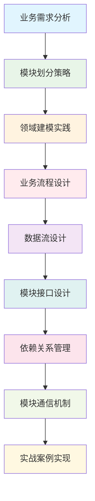

# 📚 第8章：业务模块设计

> **从需求到实现** - 掌握企业级业务模块设计的方法与实践

## 🎯 章节概述

在前面的章节中，我们已经掌握了NestJS的核心技术、项目架构设计和最佳实践。现在，我们将学习如何将业务需求转化为清晰的模块设计，建立高效的业务处理流程和数据流转机制。

### 🏗️ 本章学习路径



## 🎯 学习目标

通过本章学习，你将能够：

- 🎯 **掌握需求分析方法**：学会分析和理解复杂业务需求
- 🧩 **掌握模块划分技巧**：学会合理的模块划分方法和原则
- 🔄 **设计业务流程**：建立清晰高效的业务处理流程
- 📊 **设计数据流转**：建立高效的数据流转机制
- 🔗 **管理模块依赖**：掌握模块间的依赖关系管理
- 💬 **设计通信机制**：建立模块间的通信和协作机制

## 🎯 业务需求分析

### 📋 需求分析方法论

#### 🏠 生活类比：餐厅运营分析

想象业务模块设计就像设计一个餐厅的运营体系：

```
🍽️ 餐厅运营（业务模块设计）
├── 👥 客户服务（用户模块）
├── 📋 点餐系统（订单模块）
├── 👨‍🍳 厨房管理（生产模块）
├── 💰 收银结算（支付模块）
├── 📦 库存管理（库存模块）
└── 📊 经营分析（报表模块）

🎯 设计要素对比
├── 👥 服务流程 → 业务流程
├── 📋 点餐规则 → 业务规则
├── 👨‍🍳 厨房协作 → 模块协作
├── 💰 结算流程 → 数据流转
├── 📦 库存同步 → 状态同步
└── 📊 数据分析 → 业务洞察
```

#### 🔍 需求收集与分析

```typescript
// 需求分析框架
interface RequirementAnalysisFramework {
  // 业务目标分析
  businessGoalAnalysis: {
    primaryGoals: {
      description: '主要业务目标';
      examples: ['提高用户体验', '增加收入', '降低成本'];
      analysisMethod: 'SMART目标分析法';
    };
    
    secondaryGoals: {
      description: '次要业务目标';
      examples: ['提升品牌形象', '扩大市场份额', '优化流程'];
      analysisMethod: '价值链分析法';
    };
    
    constraints: {
      description: '业务约束条件';
      types: ['时间约束', '资源约束', '技术约束', '法规约束'];
      analysisMethod: '约束理论分析';
    };
  };
  
  // 干系人分析
  stakeholderAnalysis: {
    identification: {
      method: '干系人识别矩阵';
      dimensions: ['影响力', '利益相关度'];
      categories: ['核心用户', '次要用户', '管理员', '外部系统'];
    };
    
    needsAnalysis: {
      method: '用户旅程映射';
      components: ['触点分析', '痛点识别', '机会点发现'];
      tools: ['用户访谈', '问卷调查', '行为观察'];
    };
    
    prioritization: {
      method: 'MoSCoW优先级分析';
      categories: ['Must have', 'Should have', 'Could have', "Won't have"];
    };
  };
  
  // 功能需求分析
  functionalRequirementAnalysis: {
    userStoryMapping: {
      structure: 'Epic -> Feature -> User Story -> Task';
      template: 'As a [角色], I want [功能], so that [价值]';
      criteria: 'INVEST原则验证';
    };
    
    useCaseModeling: {
      components: ['参与者', '用例', '关系', '边界'];
      detailLevel: ['概要级', '用户目标级', '子功能级'];
      documentation: ['用例图', '用例描述', '活动图'];
    };
    
    businessRuleAnalysis: {
      types: ['约束规则', '推导规则', '存在规则', '触发规则'];
      documentation: ['规则表', '决策表', '决策树'];
      validation: ['一致性检查', '完整性检查', '冲突检查'];
    };
  };
}

// 博客系统需求分析示例
class BlogSystemRequirementAnalysis {
  // 业务目标分析
  analyzeBusinessGoals(): BusinessGoals {
    return {
      primary: [
        '为用户提供优质的内容发布和阅读体验',
        '建立活跃的内容创作者社区',
        '实现可持续的商业模式'
      ],
      secondary: [
        '提升平台品牌影响力',
        '积累用户数据资产',
        '建立技术竞争优势'
      ],
      constraints: [
        '6个月内完成MVP版本',
        '初期团队规模5人',
        '符合数据保护法规要求'
      ]
    };
  }
  
  // 干系人分析
  analyzeStakeholders(): StakeholderAnalysis {
    return {
      primaryUsers: [
        {
          role: '内容创作者',
          goals: ['发布高质量内容', '获得读者反馈', '建立个人品牌'],
          painPoints: ['编辑器功能限制', '内容推广困难', '数据分析不足'],
          requirements: ['富文本编辑', 'SEO优化', '数据统计']
        },
        {
          role: '内容消费者',
          goals: ['发现优质内容', '便捷阅读体验', '参与互动讨论'],
          painPoints: ['内容发现困难', '阅读体验差', '评论系统混乱'],
          requirements: ['智能推荐', '响应式设计', '评论管理']
        }
      ],
      secondaryUsers: [
        {
          role: '平台管理员',
          goals: ['维护平台秩序', '监控系统状态', '分析运营数据'],
          painPoints: ['内容审核工作量大', '系统监控不足', '数据分析复杂'],
          requirements: ['内容审核工具', '监控面板', '数据报表']
        }
      ]
    };
  }
  
  // 功能需求分析
  analyzeFunctionalRequirements(): FunctionalRequirements {
    return {
      epics: [
        {
          name: '用户管理',
          features: [
            {
              name: '用户注册登录',
              userStories: [
                {
                  role: '新用户',
                  goal: '注册账户',
                  benefit: '开始使用平台功能',
                  acceptanceCriteria: [
                    '支持邮箱注册',
                    '密码强度验证',
                    '邮箱验证激活',
                    '注册成功后自动登录'
                  ]
                }
              ]
            }
          ]
        },
        {
          name: '内容管理',
          features: [
            {
              name: '文章发布',
              userStories: [
                {
                  role: '内容创作者',
                  goal: '发布文章',
                  benefit: '分享知识和想法',
                  acceptanceCriteria: [
                    '支持Markdown编辑',
                    '支持图片上传',
                    '支持标签分类',
                    '支持草稿保存',
                    '支持定时发布'
                  ]
                }
              ]
            }
          ]
        }
      ]
    };
  }
}

interface BusinessGoals {
  primary: string[];
  secondary: string[];
  constraints: string[];
}

interface StakeholderAnalysis {
  primaryUsers: UserProfile[];
  secondaryUsers: UserProfile[];
}

interface UserProfile {
  role: string;
  goals: string[];
  painPoints: string[];
  requirements: string[];
}

interface FunctionalRequirements {
  epics: Epic[];
}

interface Epic {
  name: string;
  features: Feature[];
}

interface Feature {
  name: string;
  userStories: UserStory[];
}

interface UserStory {
  role: string;
  goal: string;
  benefit: string;
  acceptanceCriteria: string[];
}
```

## 🧩 模块划分策略

### 🎯 模块划分原则

#### 📊 模块划分方法论

```typescript
// 模块划分策略框架
interface ModulePartitioningStrategy {
  // 按业务领域划分
  domainBasedPartitioning: {
    principle: '基于业务领域的自然边界';
    advantages: ['业务内聚性高', '团队职责清晰', '独立演进'];
    disadvantages: ['可能存在重复', '跨域协调复杂'];
    applicableScenarios: ['大型企业应用', '微服务架构'];
    
    identificationMethods: {
      domainExpertInterview: '领域专家访谈';
      eventStorming: '事件风暴工作坊';
      linguisticAnalysis: '语言边界分析';
      organizationalStructure: '组织结构映射';
    };
  };
  
  // 按功能特性划分
  featureBasedPartitioning: {
    principle: '基于功能特性的垂直切分';
    advantages: ['功能完整性', '开发效率高', '测试便利'];
    disadvantages: ['可能产生重复代码', '横切关注点处理复杂'];
    applicableScenarios: ['中小型应用', '敏捷开发'];
    
    identificationMethods: {
      userStoryMapping: '用户故事地图';
      featureTree: '功能树分解';
      useCaseAnalysis: '用例分析';
      mvpDefinition: 'MVP功能定义';
    };
  };
  
  // 按技术层次划分
  layerBasedPartitioning: {
    principle: '基于技术架构的水平分层';
    advantages: ['技术职责清晰', '复用性好', '维护便利'];
    disadvantages: ['业务逻辑分散', '跨层依赖复杂'];
    applicableScenarios: ['传统企业应用', '分层架构'];
    
    identificationMethods: {
      architecturalPattern: '架构模式分析';
      technicalConcern: '技术关注点分离';
      reuseAnalysis: '复用性分析';
      performanceRequirement: '性能需求分析';
    };
  };
  
  // 按数据流划分
  dataFlowBasedPartitioning: {
    principle: '基于数据流向的模块划分';
    advantages: ['数据一致性', '流程清晰', '性能优化'];
    disadvantages: ['模块耦合度高', '扩展性受限'];
    applicableScenarios: ['数据密集型应用', '流程驱动系统'];
    
    identificationMethods: {
      dataFlowDiagram: '数据流图分析';
      entityRelationship: '实体关系分析';
      transactionBoundary: '事务边界分析';
      consistencyRequirement: '一致性需求分析';
    };
  };
}

// 博客系统模块划分示例
class BlogSystemModulePartitioning {
  // 基于领域的模块划分
  partitionByDomain(): DomainModules {
    return {
      userManagement: {
        name: '用户管理域';
        responsibilities: [
          '用户注册登录',
          '用户资料管理',
          '用户权限控制',
          '用户行为跟踪'
        ];
        entities: ['User', 'UserProfile', 'UserRole', 'UserSession'];
        services: ['UserService', 'AuthService', 'ProfileService'];
        boundaries: {
          input: ['用户注册请求', '登录请求', '资料更新请求'],
          output: ['用户信息', '认证令牌', '权限信息']
        };
      },
      
      contentManagement: {
        name: '内容管理域';
        responsibilities: [
          '文章创建编辑',
          '内容分类管理',
          '内容审核发布',
          '内容搜索索引'
        ];
        entities: ['Article', 'Category', 'Tag', 'Draft'];
        services: ['ArticleService', 'CategoryService', 'SearchService'];
        boundaries: {
          input: ['文章创建请求', '分类管理请求', '搜索请求'],
          output: ['文章内容', '分类信息', '搜索结果']
        };
      },
      
      interactionManagement: {
        name: '互动管理域';
        responsibilities: [
          '评论管理',
          '点赞收藏',
          '关注订阅',
          '消息通知'
        ];
        entities: ['Comment', 'Like', 'Follow', 'Notification'];
        services: ['CommentService', 'InteractionService', 'NotificationService'];
        boundaries: {
          input: ['评论请求', '点赞请求', '关注请求'],
          output: ['评论信息', '互动统计', '通知消息']
        };
      }
    };
  }
  
  // 基于功能的模块划分
  partitionByFeature(): FeatureModules {
    return {
      authModule: {
        name: '认证模块';
        features: ['用户注册', '用户登录', '密码重置', '第三方登录'];
        components: ['AuthController', 'AuthService', 'JwtStrategy', 'AuthGuard'];
        dependencies: ['UserModule', 'EmailModule'];
      },
      
      articleModule: {
        name: '文章模块';
        features: ['文章创建', '文章编辑', '文章发布', '文章搜索'];
        components: ['ArticleController', 'ArticleService', 'ArticleRepository'];
        dependencies: ['UserModule', 'CategoryModule', 'SearchModule'];
      },
      
      commentModule: {
        name: '评论模块';
        features: ['评论发布', '评论回复', '评论管理', '评论审核'];
        components: ['CommentController', 'CommentService', 'CommentRepository'];
        dependencies: ['UserModule', 'ArticleModule', 'NotificationModule'];
      }
    };
  }
}

interface DomainModules {
  [key: string]: {
    name: string;
    responsibilities: string[];
    entities: string[];
    services: string[];
    boundaries: {
      input: string[];
      output: string[];
    };
  };
}

interface FeatureModules {
  [key: string]: {
    name: string;
    features: string[];
    components: string[];
    dependencies: string[];
  };
}
```

### 🔄 模块边界定义

```typescript
// 模块边界设计
interface ModuleBoundaryDesign {
  // 边界识别方法
  boundaryIdentification: {
    dataOwnership: {
      principle: '数据所有权边界';
      method: '识别每个数据实体的主要负责模块';
      example: 'User实体由UserModule拥有和管理';
    };
    
    businessCapability: {
      principle: '业务能力边界';
      method: '基于业务能力的自然分组';
      example: '用户认证能力属于AuthModule';
    };
    
    changeFrequency: {
      principle: '变化频率边界';
      method: '将变化频率相似的功能组合';
      example: '核心业务逻辑和配置管理分离';
    };
    
    teamStructure: {
      principle: '团队结构边界';
      method: '基于团队职责和专业领域';
      example: '前端团队负责UI模块，后端团队负责API模块';
    };
  };
  
  // 边界接口设计
  boundaryInterfaceDesign: {
    publicInterface: {
      definition: '模块对外提供的公共接口';
      principles: ['最小化暴露', '稳定性优先', '向后兼容'];
      components: ['Service接口', 'DTO定义', '事件定义'];
    };
    
    internalInterface: {
      definition: '模块内部的私有接口';
      principles: ['高内聚', '实现隐藏', '灵活变更'];
      components: ['内部Service', '私有DTO', '内部事件'];
    };
    
    contractDefinition: {
      definition: '模块间的契约定义';
      components: ['接口规范', '数据格式', '错误处理', '性能要求'];
      validation: ['契约测试', '兼容性测试', '性能测试'];
    };
  };
}

// 模块边界实现示例
@Module({
  imports: [
    TypeOrmModule.forFeature([User, UserProfile, UserRole]),
    JwtModule.registerAsync({
      imports: [ConfigModule],
      useFactory: async (configService: ConfigService) => ({
        secret: configService.get<string>('JWT_SECRET'),
        signOptions: { expiresIn: '1h' },
      }),
      inject: [ConfigService],
    }),
  ],
  controllers: [UserController, AuthController],
  providers: [
    UserService,
    AuthService,
    UserRepository,
    JwtStrategy,
    LocalStrategy,
  ],
  exports: [
    UserService, // 对外提供用户查询服务
    AuthService, // 对外提供认证服务
  ],
})
export class UserModule {
  // 模块配置
  static forRoot(options: UserModuleOptions): DynamicModule {
    return {
      module: UserModule,
      providers: [
        {
          provide: USER_MODULE_OPTIONS,
          useValue: options,
        },
      ],
    };
  }
}

// 模块公共接口定义
export interface IUserService {
  findById(id: string): Promise<UserResponseDto>;
  findByEmail(email: string): Promise<UserResponseDto>;
  create(createUserDto: CreateUserDto): Promise<UserResponseDto>;
  update(id: string, updateUserDto: UpdateUserDto): Promise<UserResponseDto>;
}

export interface IAuthService {
  login(loginDto: LoginDto): Promise<AuthResponseDto>;
  register(registerDto: RegisterDto): Promise<AuthResponseDto>;
  validateUser(email: string, password: string): Promise<UserEntity>;
  generateToken(user: UserEntity): Promise<string>;
}

// 模块间通信DTO
export class UserCreatedEvent {
  constructor(
    public readonly userId: string,
    public readonly email: string,
    public readonly createdAt: Date,
  ) {}
}

export class UserUpdatedEvent {
  constructor(
    public readonly userId: string,
    public readonly changes: Partial<UserEntity>,
    public readonly updatedAt: Date,
  ) {}
}
```

## 🔄 业务流程设计

### 📊 流程建模方法

```typescript
// 业务流程设计框架
interface BusinessProcessDesign {
  // 流程识别方法
  processIdentification: {
    valueStreamMapping: {
      description: '价值流映射';
      purpose: '识别端到端的价值创造流程';
      steps: ['识别价值流', '映射当前状态', '设计未来状态', '制定改进计划'];
    };
    
    customerJourneyMapping: {
      description: '客户旅程映射';
      purpose: '从客户视角识别关键流程';
      components: ['触点识别', '情感曲线', '痛点分析', '机会点发现'];
    };
    
    processHierarchy: {
      description: '流程层次分解';
      levels: ['核心流程', '支撑流程', '管理流程'];
      decomposition: ['L0流程图', 'L1流程图', 'L2流程图', 'L3流程图'];
    };
  };
  
  // 流程设计原则
  processDesignPrinciples: {
    customerCentric: {
      principle: '以客户为中心';
      implementation: '从客户需求出发设计流程';
      metrics: ['客户满意度', '响应时间', '一次性解决率'];
    };
    
    endToEndOptimization: {
      principle: '端到端优化';
      implementation: '优化整体流程而非局部环节';
      metrics: ['总周期时间', '总成本', '总质量'];
    };
    
    exceptionHandling: {
      principle: '异常处理设计';
      implementation: '预设异常场景和处理机制';
      components: ['异常识别', '异常分类', '处理策略', '恢复机制'];
    };
    
    continuousImprovement: {
      principle: '持续改进';
      implementation: '建立流程监控和改进机制';
      components: ['KPI监控', '问题识别', '改进建议', '效果评估'];
    };
  };
}

// 文章发布流程设计示例
class ArticlePublishingProcess {
  // 流程定义
  defineProcess(): ProcessDefinition {
    return {
      name: '文章发布流程',
      description: '从文章创建到正式发布的完整流程',
      participants: ['作者', '编辑', '审核员', '系统'],
      
      mainFlow: [
        {
          step: 1,
          name: '创建草稿',
          actor: '作者',
          action: '创建文章草稿',
          input: ['文章标题', '文章内容', '分类标签'],
          output: ['草稿ID', '草稿状态'],
          businessRules: ['标题不能为空', '内容长度至少100字'],
        },
        {
          step: 2,
          name: '编辑完善',
          actor: '作者',
          action: '编辑完善文章内容',
          input: ['草稿ID', '更新内容'],
          output: ['更新后的草稿'],
          businessRules: ['支持多次编辑', '自动保存草稿'],
        },
        {
          step: 3,
          name: '提交审核',
          actor: '作者',
          action: '提交文章审核',
          input: ['草稿ID'],
          output: ['审核请求'],
          businessRules: ['内容完整性检查', '格式规范检查'],
        },
        {
          step: 4,
          name: '内容审核',
          actor: '审核员',
          action: '审核文章内容',
          input: ['审核请求'],
          output: ['审核结果'],
          businessRules: ['内容合规性检查', '质量标准检查'],
        },
        {
          step: 5,
          name: '发布文章',
          actor: '系统',
          action: '正式发布文章',
          input: ['审核通过的文章'],
          output: ['已发布文章'],
          businessRules: ['生成SEO信息', '更新搜索索引'],
        },
      ],
      
      alternativeFlows: [
        {
          condition: '审核不通过',
          steps: [
            {
              step: '4a',
              name: '审核驳回',
              actor: '审核员',
              action: '驳回文章并提供修改建议',
              nextStep: 2, // 返回编辑步骤
            },
          ],
        },
        {
          condition: '作者取消发布',
          steps: [
            {
              step: '3b',
              name: '取消发布',
              actor: '作者',
              action: '取消文章发布申请',
              nextStep: 'end',
            },
          ],
        },
      ],
      
      exceptionFlows: [
        {
          exception: '系统故障',
          handling: '保存当前状态，通知用户稍后重试',
        },
        {
          exception: '审核超时',
          handling: '自动提醒审核员，升级处理',
        },
      ],
    };
  }
  
  // 流程实现
  @Injectable()
  class ArticlePublishingService {
    constructor(
      private readonly articleService: ArticleService,
      private readonly auditService: AuditService,
      private readonly notificationService: NotificationService,
      private readonly eventBus: EventBus,
    ) {}
    
    // 创建草稿
    async createDraft(
      authorId: string,
      createDraftDto: CreateDraftDto,
    ): Promise<DraftResponseDto> {
      // 业务规则验证
      this.validateDraftCreation(createDraftDto);
      
      // 创建草稿
      const draft = await this.articleService.createDraft({
        ...createDraftDto,
        authorId,
        status: ArticleStatus.DRAFT,
      });
      
      // 发布事件
      await this.eventBus.publish(
        new DraftCreatedEvent(draft.id, authorId),
      );
      
      return this.transformToDraftResponse(draft);
    }
    
    // 提交审核
    async submitForReview(
      draftId: string,
      authorId: string,
    ): Promise<ReviewRequestResponseDto> {
      // 验证草稿状态
      const draft = await this.articleService.findDraftById(draftId);
      this.validateDraftForReview(draft, authorId);
      
      // 创建审核请求
      const reviewRequest = await this.auditService.createReviewRequest({
        articleId: draftId,
        authorId,
        submittedAt: new Date(),
      });
      
      // 更新文章状态
      await this.articleService.updateDraftStatus(
        draftId,
        ArticleStatus.PENDING_REVIEW,
      );
      
      // 通知审核员
      await this.notificationService.notifyReviewers(reviewRequest);
      
      // 发布事件
      await this.eventBus.publish(
        new ReviewSubmittedEvent(draftId, authorId),
      );
      
      return this.transformToReviewRequestResponse(reviewRequest);
    }
    
    // 审核文章
    async reviewArticle(
      reviewId: string,
      reviewerId: string,
      reviewDto: ReviewArticleDto,
    ): Promise<ReviewResultResponseDto> {
      // 验证审核权限
      await this.validateReviewPermission(reviewerId);
      
      // 执行审核
      const reviewResult = await this.auditService.completeReview({
        reviewId,
        reviewerId,
        decision: reviewDto.decision,
        comments: reviewDto.comments,
        reviewedAt: new Date(),
      });
      
      // 根据审核结果处理
      if (reviewResult.decision === ReviewDecision.APPROVED) {
        await this.publishArticle(reviewResult.articleId);
      } else {
        await this.rejectArticle(reviewResult.articleId, reviewResult.comments);
      }
      
      return this.transformToReviewResultResponse(reviewResult);
    }
    
    // 发布文章
    private async publishArticle(articleId: string): Promise<void> {
      // 更新文章状态
      await this.articleService.updateDraftStatus(
        articleId,
        ArticleStatus.PUBLISHED,
      );
      
      // 生成SEO信息
      await this.articleService.generateSEOInfo(articleId);
      
      // 更新搜索索引
      await this.articleService.updateSearchIndex(articleId);
      
      // 发布事件
      await this.eventBus.publish(
        new ArticlePublishedEvent(articleId),
      );
    }
    
    // 驳回文章
    private async rejectArticle(
      articleId: string,
      comments: string,
    ): Promise<void> {
      // 更新文章状态
      await this.articleService.updateDraftStatus(
        articleId,
        ArticleStatus.REJECTED,
      );
      
      // 通知作者
      const article = await this.articleService.findById(articleId);
      await this.notificationService.notifyAuthor(
        article.authorId,
        `您的文章《${article.title}》审核未通过：${comments}`,
      );
      
      // 发布事件
      await this.eventBus.publish(
        new ArticleRejectedEvent(articleId, comments),
      );
    }
    
    // 验证方法
    private validateDraftCreation(dto: CreateDraftDto): void {
      if (!dto.title || dto.title.trim().length === 0) {
        throw new BadRequestException('文章标题不能为空');
      }
      
      if (!dto.content || dto.content.length < 100) {
        throw new BadRequestException('文章内容不能少于100字');
      }
    }
    
    private validateDraftForReview(
      draft: ArticleEntity,
      authorId: string,
    ): void {
      if (draft.authorId !== authorId) {
        throw new ForbiddenException('只能提交自己的文章');
      }
      
      if (draft.status !== ArticleStatus.DRAFT) {
        throw new BadRequestException('只能提交草稿状态的文章');
      }
    }
    
    private async validateReviewPermission(reviewerId: string): Promise<void> {
      const reviewer = await this.userService.findById(reviewerId);
      if (!reviewer.hasRole('reviewer')) {
        throw new ForbiddenException('没有审核权限');
      }
    }
  }
}

interface ProcessDefinition {
  name: string;
  description: string;
  participants: string[];
  mainFlow: ProcessStep[];
  alternativeFlows: AlternativeFlow[];
  exceptionFlows: ExceptionFlow[];
}

interface ProcessStep {
  step: number;
  name: string;
  actor: string;
  action: string;
  input: string[];
  output: string[];
  businessRules: string[];
}

interface AlternativeFlow {
  condition: string;
  steps: ProcessStep[];
}

interface ExceptionFlow {
  exception: string;
  handling: string;
}
``` 