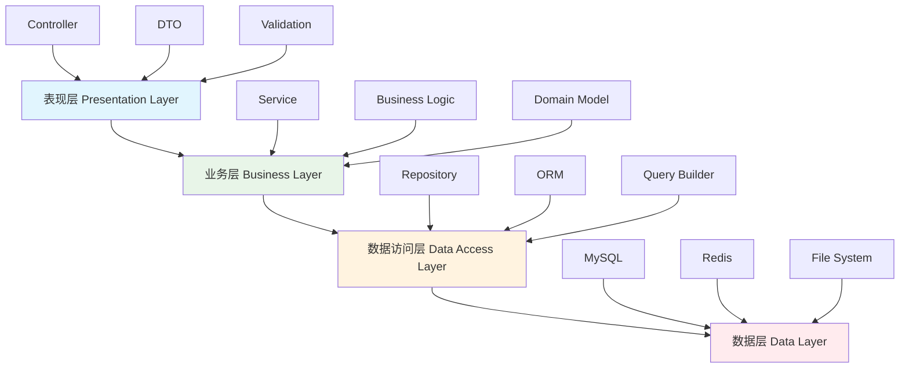
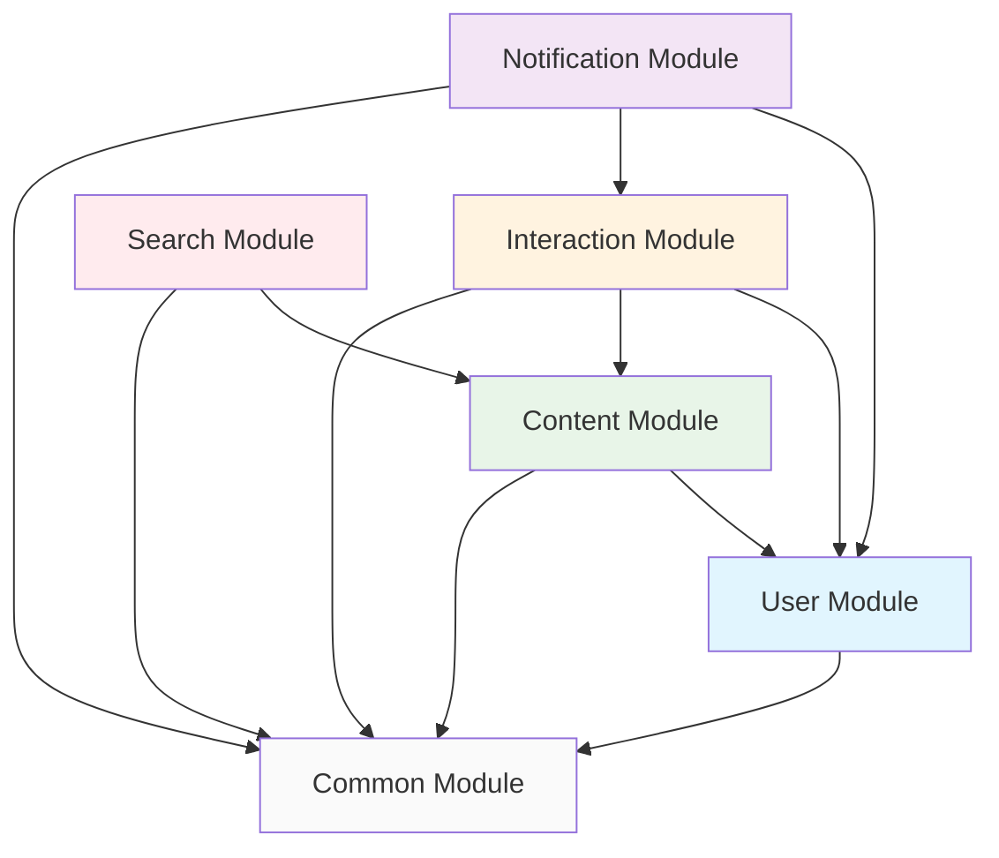

# 第9.2节 系统架构设计

> **从需求到架构** - 企业级博客系统的架构设计实践

## 📚 本节学习目标

### 🎯 知识目标
- [ ] **理解系统架构设计原则**：掌握企业级系统的整体架构设计方法
- [ ] **掌握分层架构模式**：学会设计清晰的分层架构
- [ ] **理解模块化设计**：掌握模块划分和依赖管理
- [ ] **学会接口设计规范**：建立RESTful API的设计标准

### 🛠️ 技能目标
- [ ] 能够设计完整的系统架构图
- [ ] 能够进行合理的模块划分
- [ ] 能够设计标准的API接口
- [ ] 能够制定技术架构文档

### ⏰ 学习时长
- **理论学习**：2-3小时
- **实践练习**：2-3小时
- **总计时长**：4-6小时

### 📋 前置知识检查
- [ ] 掌握第9.1节的需求分析内容
- [ ] 理解分层架构的基本概念
- [ ] 了解RESTful API设计原则
- [ ] 熟悉NestJS的模块系统

---

## 9.2.1 系统整体架构设计

### 🏗️ 架构设计原则

#### 💡 什么是系统架构？

**系统架构就像城市规划**：
- 🏙️ **城市规划师**设计城市布局 → **架构师**设计系统结构
- 🏢 **功能区划分**（商业区、住宅区） → **模块划分**（用户模块、内容模块）
- 🛣️ **交通网络**连接各区域 → **接口**连接各模块
- 🚰 **基础设施**（水电网络） → **基础服务**（数据库、缓存）

#### 🎯 架构设计原则

**1. 单一职责原则**
- 每个模块只负责一个业务领域
- 避免模块功能过于复杂
- 便于维护和扩展

**2. 松耦合原则**
- 模块间依赖关系最小化
- 通过接口进行通信
- 便于独立开发和测试

**3. 高内聚原则**
- 模块内部功能紧密相关
- 数据和操作在同一模块内
- 提高代码的可读性

**4. 可扩展原则**
- 支持功能的增加和修改
- 支持性能的水平扩展
- 支持技术的升级换代

### 🏗️ 分层架构设计

#### 📊 四层架构模式



**表现层（Presentation Layer）**
- **职责**：处理HTTP请求和响应
- **组件**：Controller、DTO、验证器
- **技术**：NestJS Controller、class-validator

**业务层（Business Layer）**
- **职责**：实现业务逻辑和规则
- **组件**：Service、业务实体、领域模型
- **技术**：NestJS Service、业务逻辑类

**数据访问层（Data Access Layer）**
- **职责**：数据持久化和查询
- **组件**：Repository、ORM映射
- **技术**：TypeORM、Repository模式

**数据层（Data Layer）**
- **职责**：数据存储和管理
- **组件**：数据库、缓存、文件系统
- **技术**：MySQL、Redis、本地存储

#### 🔄 数据流向设计

**请求处理流程**：
```
用户请求 → Controller → Service → Repository → Database
         ↓
响应数据 ← Controller ← Service ← Repository ← Database
```

**具体示例：获取文章列表**
1. **Controller层**：接收HTTP GET请求，验证参数
2. **Service层**：实现分页逻辑，调用Repository
3. **Repository层**：构建SQL查询，执行数据库操作
4. **Database层**：返回查询结果
5. **逆向返回**：数据层层返回，最终响应给用户

### 🧩 模块化设计

#### 📋 核心模块划分

**用户模块（User Module）**
- **功能范围**：用户注册、登录、资料管理、权限控制
- **核心实体**：User、UserProfile、Role、Permission
- **主要服务**：AuthService、UserService、RoleService
- **对外接口**：用户认证API、用户管理API

**内容模块（Content Module）**
- **功能范围**：文章管理、分类标签、内容发布
- **核心实体**：Article、Category、Tag、Comment
- **主要服务**：ArticleService、CategoryService、TagService
- **对外接口**：内容管理API、内容浏览API

**互动模块（Interaction Module）**
- **功能范围**：评论回复、点赞收藏、用户关注
- **核心实体**：Comment、Like、Follow、Bookmark
- **主要服务**：CommentService、LikeService、FollowService
- **对外接口**：互动功能API

**搜索模块（Search Module）**
- **功能范围**：全文搜索、内容推荐、热门统计
- **核心实体**：SearchIndex、Recommendation
- **主要服务**：SearchService、RecommendationService
- **对外接口**：搜索API、推荐API

**通知模块（Notification Module）**
- **功能范围**：站内通知、邮件通知、推送通知
- **核心实体**：Notification、NotificationTemplate
- **主要服务**：NotificationService、EmailService
- **对外接口**：通知API

#### 🔗 模块依赖关系



**依赖关系说明**：
- **Common Module**：提供公共功能，被所有模块依赖
- **User Module**：基础模块，提供用户认证和权限
- **Content Module**：依赖User Module获取用户信息
- **Interaction Module**：依赖User和Content模块
- **Search Module**：依赖Content模块进行内容索引
- **Notification Module**：依赖User和Interaction模块

---

## 9.2.2 数据库架构设计

### 🗄️ MySQL数据库设计

#### 📊 数据库选型理由

**为什么选择MySQL？**
- **成熟稳定**：经过多年生产环境验证
- **性能优秀**：支持高并发读写操作
- **生态丰富**：工具链完善，社区活跃
- **ACID支持**：保证数据一致性
- **扩展性好**：支持主从复制和分库分表

#### 🏗️ 数据库架构设计

**主从复制架构**：
```
Master Database (写操作)
    ↓ 数据同步
Slave Database 1 (读操作)
Slave Database 2 (读操作)
```

**读写分离策略**：
- **写操作**：用户注册、文章发布、评论创建 → Master
- **读操作**：文章浏览、用户查询、搜索功能 → Slave
- **负载均衡**：多个Slave节点轮询分配读请求

#### 📋 核心数据表设计

**用户相关表**：

**users表（用户基本信息）**
```sql
CREATE TABLE users (
    id CHAR(36) PRIMARY KEY,
    username VARCHAR(50) UNIQUE NOT NULL,
    email VARCHAR(255) UNIQUE NOT NULL,
    password_hash VARCHAR(255) NOT NULL,
    status ENUM('active', 'inactive', 'banned') DEFAULT 'active',
    email_verified BOOLEAN DEFAULT FALSE,
    created_at TIMESTAMP DEFAULT CURRENT_TIMESTAMP,
    updated_at TIMESTAMP DEFAULT CURRENT_TIMESTAMP ON UPDATE CURRENT_TIMESTAMP,
    
    INDEX idx_email (email),
    INDEX idx_username (username),
    INDEX idx_status (status)
);
```

**user_profiles表（用户详细资料）**
```sql
CREATE TABLE user_profiles (
    user_id CHAR(36) PRIMARY KEY,
    display_name VARCHAR(100),
    bio TEXT,
    avatar_url VARCHAR(500),
    website VARCHAR(255),
    location VARCHAR(100),
    birth_date DATE,
    created_at TIMESTAMP DEFAULT CURRENT_TIMESTAMP,
    updated_at TIMESTAMP DEFAULT CURRENT_TIMESTAMP ON UPDATE CURRENT_TIMESTAMP,
    
    FOREIGN KEY (user_id) REFERENCES users(id) ON DELETE CASCADE
);
```

**内容相关表**：

**categories表（文章分类）**
```sql
CREATE TABLE categories (
    id CHAR(36) PRIMARY KEY,
    name VARCHAR(100) UNIQUE NOT NULL,
    slug VARCHAR(100) UNIQUE NOT NULL,
    description TEXT,
    parent_id CHAR(36),
    sort_order INT DEFAULT 0,
    is_active BOOLEAN DEFAULT TRUE,
    created_at TIMESTAMP DEFAULT CURRENT_TIMESTAMP,
    
    FOREIGN KEY (parent_id) REFERENCES categories(id),
    INDEX idx_slug (slug),
    INDEX idx_parent_id (parent_id)
);
```

**articles表（文章主表）**
```sql
CREATE TABLE articles (
    id CHAR(36) PRIMARY KEY,
    title VARCHAR(255) NOT NULL,
    slug VARCHAR(255) UNIQUE NOT NULL,
    summary TEXT,
    content LONGTEXT NOT NULL,
    author_id CHAR(36) NOT NULL,
    category_id CHAR(36),
    status ENUM('draft', 'published', 'archived') DEFAULT 'draft',
    featured_image VARCHAR(500),
    view_count INT DEFAULT 0,
    like_count INT DEFAULT 0,
    comment_count INT DEFAULT 0,
    published_at TIMESTAMP NULL,
    created_at TIMESTAMP DEFAULT CURRENT_TIMESTAMP,
    updated_at TIMESTAMP DEFAULT CURRENT_TIMESTAMP ON UPDATE CURRENT_TIMESTAMP,
    
    FOREIGN KEY (author_id) REFERENCES users(id),
    FOREIGN KEY (category_id) REFERENCES categories(id),
    INDEX idx_slug (slug),
    INDEX idx_author_id (author_id),
    INDEX idx_category_id (category_id),
    INDEX idx_status (status),
    INDEX idx_published_at (published_at),
    FULLTEXT INDEX idx_content_search (title, content)
);
```

**互动相关表**：

**comments表（评论表）**
```sql
CREATE TABLE comments (
    id CHAR(36) PRIMARY KEY,
    article_id CHAR(36) NOT NULL,
    author_id CHAR(36) NOT NULL,
    parent_id CHAR(36),
    content TEXT NOT NULL,
    status ENUM('published', 'pending', 'deleted') DEFAULT 'published',
    like_count INT DEFAULT 0,
    created_at TIMESTAMP DEFAULT CURRENT_TIMESTAMP,
    updated_at TIMESTAMP DEFAULT CURRENT_TIMESTAMP ON UPDATE CURRENT_TIMESTAMP,
    
    FOREIGN KEY (article_id) REFERENCES articles(id) ON DELETE CASCADE,
    FOREIGN KEY (author_id) REFERENCES users(id),
    FOREIGN KEY (parent_id) REFERENCES comments(id),
    INDEX idx_article_id (article_id),
    INDEX idx_author_id (author_id),
    INDEX idx_parent_id (parent_id)
);
```

#### 🔍 索引优化策略

**主键索引**：
- 使用UUID作为主键，保证全局唯一性
- 避免自增ID在分布式环境下的问题

**唯一索引**：
- email、username、slug等字段建立唯一索引
- 保证数据唯一性，提高查询性能

**复合索引**：
- (author_id, status, published_at)：按作者查询已发布文章
- (category_id, status, published_at)：按分类查询文章
- (article_id, status)：查询文章的有效评论

**全文索引**：
- 对title和content字段建立FULLTEXT索引
- 支持中文全文搜索

### 💾 缓存架构设计

#### 🚀 Redis缓存策略

**缓存层次设计**：
```
应用层缓存 (内存)
    ↓ 未命中
Redis缓存 (分布式)
    ↓ 未命中
MySQL数据库 (持久化)
```

**缓存使用场景**：

**1. 热点数据缓存**
- **用户信息**：缓存活跃用户的基本信息
- **热门文章**：缓存阅读量高的文章内容
- **分类标签**：缓存分类和标签数据

**2. 会话缓存**
- **用户会话**：存储JWT refresh token
- **登录状态**：缓存用户登录信息
- **权限信息**：缓存用户角色和权限

**3. 计数器缓存**
- **文章统计**：阅读量、点赞数、评论数
- **用户统计**：粉丝数、关注数、文章数
- **系统统计**：在线用户数、今日访问量

**缓存更新策略**：

**Cache-Aside模式**：
```
读取数据：
1. 先查询缓存
2. 缓存命中：返回数据
3. 缓存未命中：查询数据库，写入缓存

更新数据：
1. 更新数据库
2. 删除缓存
3. 下次读取时重新加载
```

**Write-Through模式**：
```
写入数据：
1. 同时写入缓存和数据库
2. 保证数据一致性
3. 适用于写入频繁的场景
```

---

## 9.2.3 API接口设计

### 🔌 RESTful API设计规范

#### 📋 API设计原则

**1. 资源导向设计**
- URL表示资源，不表示动作
- 使用名词复数形式
- 体现资源的层次关系

**2. HTTP方法语义化**
- GET：获取资源
- POST：创建资源
- PUT：完整更新资源
- PATCH：部分更新资源
- DELETE：删除资源

**3. 状态码规范使用**
- 2xx：成功响应
- 4xx：客户端错误
- 5xx：服务器错误

#### 🎯 API接口设计

**用户认证API**：
```
POST   /api/auth/register     # 用户注册
POST   /api/auth/login        # 用户登录
POST   /api/auth/logout       # 用户登出
POST   /api/auth/refresh      # 刷新令牌
POST   /api/auth/forgot       # 忘记密码
POST   /api/auth/reset        # 重置密码
```

**用户管理API**：
```
GET    /api/users             # 获取用户列表
GET    /api/users/:id         # 获取用户详情
PUT    /api/users/:id         # 更新用户信息
DELETE /api/users/:id         # 删除用户
GET    /api/users/:id/profile # 获取用户资料
PUT    /api/users/:id/profile # 更新用户资料
```

**文章管理API**：
```
GET    /api/articles          # 获取文章列表
POST   /api/articles          # 创建文章
GET    /api/articles/:id      # 获取文章详情
PUT    /api/articles/:id      # 更新文章
DELETE /api/articles/:id      # 删除文章
POST   /api/articles/:id/publish  # 发布文章
```

**评论管理API**：
```
GET    /api/articles/:id/comments     # 获取文章评论
POST   /api/articles/:id/comments     # 创建评论
PUT    /api/comments/:id              # 更新评论
DELETE /api/comments/:id              # 删除评论
POST   /api/comments/:id/like         # 点赞评论
```

#### 📊 请求响应格式

**统一响应格式**：
```json
{
  "success": true,
  "data": {
    // 响应数据
  },
  "message": "操作成功",
  "timestamp": "2024-01-01T00:00:00Z",
  "path": "/api/articles"
}
```

**错误响应格式**：
```json
{
  "success": false,
  "error": {
    "code": "VALIDATION_ERROR",
    "message": "请求参数验证失败",
    "details": [
      {
        "field": "email",
        "message": "邮箱格式不正确"
      }
    ]
  },
  "timestamp": "2024-01-01T00:00:00Z",
  "path": "/api/auth/register"
}
```

**分页响应格式**：
```json
{
  "success": true,
  "data": {
    "items": [
      // 数据列表
    ],
    "pagination": {
      "page": 1,
      "limit": 20,
      "total": 100,
      "totalPages": 5,
      "hasNext": true,
      "hasPrev": false
    }
  }
}
```

### 📝 API文档规范

#### 📖 OpenAPI规范

**API文档结构**：
```yaml
openapi: 3.0.0
info:
  title: 博客系统API
  version: 1.0.0
  description: 企业级博客系统的RESTful API

servers:
  - url: https://api.blog.com/v1
    description: 生产环境
  - url: https://staging-api.blog.com/v1
    description: 测试环境

components:
  securitySchemes:
    bearerAuth:
      type: http
      scheme: bearer
      bearerFormat: JWT
```

**接口文档示例**：
```yaml
/api/articles:
  get:
    summary: 获取文章列表
    parameters:
      - name: page
        in: query
        schema:
          type: integer
          default: 1
      - name: limit
        in: query
        schema:
          type: integer
          default: 20
      - name: category
        in: query
        schema:
          type: string
    responses:
      200:
        description: 成功获取文章列表
        content:
          application/json:
            schema:
              $ref: '#/components/schemas/ArticleListResponse'
```

#### 🔄 API版本管理

**版本控制策略**：
- **URL路径版本控制**：/api/v1/articles
- **向后兼容**：新版本保持对旧版本的兼容
- **废弃通知**：提前6个月通知API废弃
- **迁移指南**：提供详细的版本迁移文档

---

## 9.2.4 安全架构设计

### 🔒 安全设计原则

#### 🛡️ 多层安全防护

**网络层安全**：
- HTTPS加密传输
- 防火墙配置
- DDoS攻击防护
- IP白名单控制

**应用层安全**：
- 输入验证和过滤
- SQL注入防护
- XSS攻击防护
- CSRF令牌验证

**数据层安全**：
- 数据库访问控制
- 敏感数据加密
- 数据备份加密
- 审计日志记录

#### 🔐 认证授权体系

**JWT认证机制**：
```
用户登录 → 验证凭据 → 生成JWT → 返回Token
    ↓
后续请求 → 携带Token → 验证Token → 授权访问
```

**权限控制模型**：
- **基于角色的访问控制（RBAC）**
- **用户** → **角色** → **权限** → **资源**
- **细粒度权限控制**：操作级别的权限验证

**安全策略**：
- **密码策略**：强密码要求，定期更换
- **会话管理**：会话超时，单点登录
- **访问控制**：最小权限原则
- **审计监控**：操作日志，异常检测

### 🔍 数据安全保护

#### 🔐 数据加密策略

**传输加密**：
- TLS 1.3协议
- 证书管理
- 密钥轮换

**存储加密**：
- 数据库字段加密
- 文件系统加密
- 备份数据加密

**应用加密**：
- 密码哈希（bcrypt）
- 敏感信息加密（AES-256）
- 数字签名验证

#### 📊 隐私保护合规

**数据最小化原则**：
- 只收集必要的用户数据
- 定期清理过期数据
- 用户数据删除权

**合规要求**：
- GDPR合规（欧盟）
- 个人信息保护法（中国）
- 数据本地化要求

---

## 📊 本节总结

### 🎯 关键要点回顾

1. **系统架构设计要遵循基本原则**
   - 单一职责、松耦合、高内聚
   - 分层架构清晰，模块划分合理
   - 考虑可扩展性和可维护性

2. **数据库设计要考虑性能和扩展性**
   - 合理的表结构设计
   - 有效的索引优化策略
   - 读写分离和缓存机制

3. **API设计要遵循RESTful规范**
   - 资源导向的URL设计
   - HTTP方法语义化使用
   - 统一的响应格式

4. **安全架构要多层防护**
   - 网络、应用、数据多层安全
   - 完善的认证授权体系
   - 数据加密和隐私保护

### 📝 实践练习

#### 练习1：架构图设计
**任务**：绘制博客系统的完整架构图
**要求**：
- 包含所有层次和模块
- 标明模块间的依赖关系
- 体现数据流向

#### 练习2：数据库设计
**任务**：设计完整的数据库表结构
**要求**：
- 包含所有核心业务表
- 设计合理的索引策略
- 考虑性能优化

#### 练习3：API接口设计
**任务**：设计完整的API接口文档
**要求**：
- 遵循RESTful规范
- 包含请求响应示例
- 使用OpenAPI格式

### 🔍 自我检测

- [ ] 我能够设计清晰的分层架构
- [ ] 我理解模块化设计的原则
- [ ] 我掌握了数据库设计的方法
- [ ] 我能够设计标准的RESTful API
- [ ] 我了解安全架构的重要性

### 🎯 下一步学习

完成本节学习后，你已经掌握了：
- ✅ 系统整体架构设计方法
- ✅ 数据库架构和优化策略
- ✅ API接口设计规范
- ✅ 安全架构设计原则

**准备好进入第9.3节了吗？** 🚀

在下一节中，我们将基于这个架构设计，进行详细的数据库设计与建模，包括：
- 🗄️ MySQL数据库详细设计
- 📊 实体关系建模
- �� 索引优化策略
- 📈 数据迁移方案 