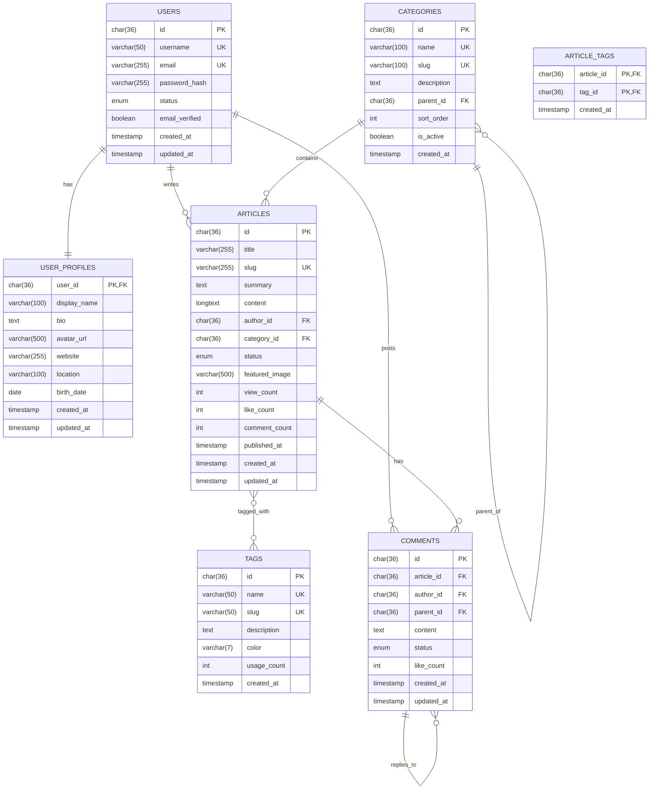

# 第9.3节 数据库设计与建模

> **数据驱动设计** - MySQL数据库的专业设计与建模实践

## 📚 本节学习目标

### 🎯 知识目标
- [ ] **掌握数据库设计原则**：学会企业级数据库的设计方法和规范
- [ ] **理解实体关系建模**：掌握ER图设计和关系模型转换
- [ ] **学会MySQL优化技巧**：掌握索引设计和查询优化策略
- [ ] **掌握数据迁移方案**：学会数据库版本管理和迁移策略

### 🛠️ 技能目标
- [ ] 能够设计完整的数据库表结构
- [ ] 能够绘制标准的ER图
- [ ] 能够编写高效的SQL查询
- [ ] 能够制定数据库迁移方案

### ⏰ 学习时长
- **理论学习**：3-4小时
- **实践练习**：3-4小时
- **总计时长**：6-8小时

### 📋 前置知识检查
- [ ] 掌握MySQL基础语法
- [ ] 理解关系数据库理论
- [ ] 了解数据库范式
- [ ] 熟悉TypeORM基本使用

---

## 9.3.1 数据库设计原则与规范

### 📊 数据库设计基础

#### 💡 什么是数据库设计？

**数据库设计就像建筑蓝图设计**：
- 🏗️ **建筑师**设计房屋结构 → **数据库设计师**设计数据结构
- 📐 **房间布局规划** → **表结构设计**
- 🚪 **房间连接通道** → **表关系设计**
- 🔧 **水电管道布局** → **索引和约束设计**

#### 🎯 设计原则

**1. 数据完整性原则**
- **实体完整性**：每个表都有主键
- **参照完整性**：外键关系正确
- **域完整性**：字段值符合约束
- **用户定义完整性**：业务规则约束

**2. 数据一致性原则**
- **ACID特性**：原子性、一致性、隔离性、持久性
- **事务管理**：确保数据操作的完整性
- **并发控制**：避免数据冲突

**3. 性能优化原则**
- **查询效率**：合理设计索引
- **存储效率**：选择合适的数据类型
- **维护效率**：避免过度规范化

**4. 可扩展性原则**
- **水平扩展**：支持分库分表
- **垂直扩展**：支持字段扩展
- **版本兼容**：支持结构升级

### 📋 命名规范

#### 🏷️ 表命名规范

**基本规则**：
- 使用小写字母和下划线
- 使用复数形式表示集合
- 避免使用MySQL保留字
- 名称要有意义且简洁

**示例**：
```sql
-- ✅ 好的命名
users              -- 用户表
user_profiles      -- 用户资料表
articles           -- 文章表
article_tags       -- 文章标签关联表

-- ❌ 不好的命名
User               -- 大写字母
user               -- 单数形式
t_user             -- 无意义前缀
user_info_detail   -- 过于冗长
```

#### 🏷️ 字段命名规范

**基本规则**：
- 使用小写字母和下划线
- 主键统一使用`id`
- 外键使用`表名_id`格式
- 时间字段使用`_at`后缀
- 布尔字段使用`is_`前缀

**示例**：
```sql
-- ✅ 好的命名
id                 -- 主键
user_id            -- 外键
username           -- 用户名
email_verified     -- 布尔字段
created_at         -- 创建时间
updated_at         -- 更新时间

-- ❌ 不好的命名
ID                 -- 大写
userId             -- 驼峰命名
user_name          -- 不必要的下划线
is_email_verified  -- 过于冗长
create_time        -- 不统一的后缀
```

### 🔢 数据类型选择

#### 📊 常用数据类型

**字符串类型**：
```sql
-- 固定长度字符串（性能好，但浪费空间）
CHAR(36)           -- UUID
CHAR(2)            -- 国家代码

-- 可变长度字符串（节省空间）
VARCHAR(50)        -- 用户名
VARCHAR(255)       -- 邮箱地址
VARCHAR(500)       -- URL地址

-- 大文本类型
TEXT               -- 文章摘要（< 65KB）
LONGTEXT           -- 文章内容（< 4GB）
```

**数值类型**：
```sql
-- 整数类型
TINYINT            -- 状态值（-128 到 127）
INT                -- 计数器（-2^31 到 2^31-1）
BIGINT             -- 大数值（-2^63 到 2^63-1）

-- 无符号整数（推荐用于计数）
INT UNSIGNED       -- 阅读量、点赞数
BIGINT UNSIGNED    -- 大计数器

-- 小数类型
DECIMAL(10,2)      -- 金额（精确）
FLOAT              -- 评分（近似）
```

**时间类型**：
```sql
-- 推荐使用TIMESTAMP（自动时区转换）
TIMESTAMP DEFAULT CURRENT_TIMESTAMP
TIMESTAMP DEFAULT CURRENT_TIMESTAMP ON UPDATE CURRENT_TIMESTAMP

-- 日期类型
DATE               -- 生日
DATETIME           -- 具体时间点
```

**枚举类型**：
```sql
-- 状态枚举
ENUM('active', 'inactive', 'banned')
ENUM('draft', 'published', 'archived')
ENUM('pending', 'approved', 'rejected')
```

---

## 9.3.2 实体关系建模

### 📊 ER图设计

#### 🎯 核心实体识别

**博客系统核心实体**：

**用户实体（User）**
- **属性**：用户ID、用户名、邮箱、密码、状态
- **关系**：一个用户可以写多篇文章、发多条评论

**文章实体（Article）**
- **属性**：文章ID、标题、内容、状态、发布时间
- **关系**：属于一个用户、属于一个分类、有多个标签

**分类实体（Category）**
- **属性**：分类ID、分类名、描述、父分类
- **关系**：包含多篇文章、可以有子分类

**标签实体（Tag）**
- **属性**：标签ID、标签名、描述、使用次数
- **关系**：可以标记多篇文章

**评论实体（Comment）**
- **属性**：评论ID、内容、状态、发布时间
- **关系**：属于一篇文章、属于一个用户、可以回复其他评论

#### 🔗 关系类型设计

**一对一关系（1:1）**
```
用户 ←→ 用户资料
一个用户对应一个详细资料
```

**一对多关系（1:N）**
```
用户 ←→ 文章
一个用户可以写多篇文章

文章 ←→ 评论
一篇文章可以有多条评论

分类 ←→ 文章
一个分类可以包含多篇文章
```

**多对多关系（M:N）**
```
文章 ←→ 标签
一篇文章可以有多个标签，一个标签可以标记多篇文章

用户 ←→ 用户（关注关系）
一个用户可以关注多个用户，也可以被多个用户关注
```

#### 📋 ER图绘制



### 🗄️ 完整表结构设计

#### 👥 用户相关表

**users表（用户基本信息）**
```sql
CREATE TABLE users (
    id CHAR(36) PRIMARY KEY COMMENT '用户ID（UUID）',
    username VARCHAR(50) UNIQUE NOT NULL COMMENT '用户名',
    email VARCHAR(255) UNIQUE NOT NULL COMMENT '邮箱地址',
    password_hash VARCHAR(255) NOT NULL COMMENT '密码哈希',
    status ENUM('active', 'inactive', 'banned') DEFAULT 'active' COMMENT '用户状态',
    email_verified BOOLEAN DEFAULT FALSE COMMENT '邮箱是否验证',
    last_login_at TIMESTAMP NULL COMMENT '最后登录时间',
    created_at TIMESTAMP DEFAULT CURRENT_TIMESTAMP COMMENT '创建时间',
    updated_at TIMESTAMP DEFAULT CURRENT_TIMESTAMP ON UPDATE CURRENT_TIMESTAMP COMMENT '更新时间',
    
    INDEX idx_email (email),
    INDEX idx_username (username),
    INDEX idx_status (status),
    INDEX idx_created_at (created_at)
) ENGINE=InnoDB DEFAULT CHARSET=utf8mb4 COLLATE=utf8mb4_unicode_ci COMMENT='用户基本信息表';
```

**user_profiles表（用户详细资料）**
```sql
CREATE TABLE user_profiles (
    user_id CHAR(36) PRIMARY KEY COMMENT '用户ID',
    display_name VARCHAR(100) COMMENT '显示名称',
    bio TEXT COMMENT '个人简介',
    avatar_url VARCHAR(500) COMMENT '头像URL',
    website VARCHAR(255) COMMENT '个人网站',
    location VARCHAR(100) COMMENT '所在地',
    birth_date DATE COMMENT '生日',
    gender ENUM('male', 'female', 'other') COMMENT '性别',
    created_at TIMESTAMP DEFAULT CURRENT_TIMESTAMP COMMENT '创建时间',
    updated_at TIMESTAMP DEFAULT CURRENT_TIMESTAMP ON UPDATE CURRENT_TIMESTAMP COMMENT '更新时间',
    
    FOREIGN KEY (user_id) REFERENCES users(id) ON DELETE CASCADE
) ENGINE=InnoDB DEFAULT CHARSET=utf8mb4 COLLATE=utf8mb4_unicode_ci COMMENT='用户详细资料表';
```

**roles表（角色表）**
```sql
CREATE TABLE roles (
    id CHAR(36) PRIMARY KEY COMMENT '角色ID',
    name VARCHAR(50) UNIQUE NOT NULL COMMENT '角色名称',
    description TEXT COMMENT '角色描述',
    permissions JSON COMMENT '权限列表',
    is_active BOOLEAN DEFAULT TRUE COMMENT '是否激活',
    created_at TIMESTAMP DEFAULT CURRENT_TIMESTAMP COMMENT '创建时间',
    updated_at TIMESTAMP DEFAULT CURRENT_TIMESTAMP ON UPDATE CURRENT_TIMESTAMP COMMENT '更新时间',
    
    INDEX idx_name (name),
    INDEX idx_is_active (is_active)
) ENGINE=InnoDB DEFAULT CHARSET=utf8mb4 COLLATE=utf8mb4_unicode_ci COMMENT='角色表';
```

**user_roles表（用户角色关联表）**
```sql
CREATE TABLE user_roles (
    user_id CHAR(36) NOT NULL COMMENT '用户ID',
    role_id CHAR(36) NOT NULL COMMENT '角色ID',
    assigned_at TIMESTAMP DEFAULT CURRENT_TIMESTAMP COMMENT '分配时间',
    assigned_by CHAR(36) COMMENT '分配者ID',
    
    PRIMARY KEY (user_id, role_id),
    FOREIGN KEY (user_id) REFERENCES users(id) ON DELETE CASCADE,
    FOREIGN KEY (role_id) REFERENCES roles(id) ON DELETE CASCADE,
    FOREIGN KEY (assigned_by) REFERENCES users(id),
    INDEX idx_user_id (user_id),
    INDEX idx_role_id (role_id)
) ENGINE=InnoDB DEFAULT CHARSET=utf8mb4 COLLATE=utf8mb4_unicode_ci COMMENT='用户角色关联表';
```

#### 📝 内容相关表

**categories表（文章分类）**
```sql
CREATE TABLE categories (
    id CHAR(36) PRIMARY KEY COMMENT '分类ID',
    name VARCHAR(100) UNIQUE NOT NULL COMMENT '分类名称',
    slug VARCHAR(100) UNIQUE NOT NULL COMMENT 'URL别名',
    description TEXT COMMENT '分类描述',
    parent_id CHAR(36) COMMENT '父分类ID',
    sort_order INT DEFAULT 0 COMMENT '排序权重',
    is_active BOOLEAN DEFAULT TRUE COMMENT '是否激活',
    article_count INT UNSIGNED DEFAULT 0 COMMENT '文章数量',
    created_at TIMESTAMP DEFAULT CURRENT_TIMESTAMP COMMENT '创建时间',
    updated_at TIMESTAMP DEFAULT CURRENT_TIMESTAMP ON UPDATE CURRENT_TIMESTAMP COMMENT '更新时间',
    
    FOREIGN KEY (parent_id) REFERENCES categories(id) ON DELETE SET NULL,
    INDEX idx_slug (slug),
    INDEX idx_parent_id (parent_id),
    INDEX idx_sort_order (sort_order),
    INDEX idx_is_active (is_active)
) ENGINE=InnoDB DEFAULT CHARSET=utf8mb4 COLLATE=utf8mb4_unicode_ci COMMENT='文章分类表';
```

**tags表（标签表）**
```sql
CREATE TABLE tags (
    id CHAR(36) PRIMARY KEY COMMENT '标签ID',
    name VARCHAR(50) UNIQUE NOT NULL COMMENT '标签名称',
    slug VARCHAR(50) UNIQUE NOT NULL COMMENT 'URL别名',
    description TEXT COMMENT '标签描述',
    color VARCHAR(7) DEFAULT '#007bff' COMMENT '标签颜色（HEX）',
    usage_count INT UNSIGNED DEFAULT 0 COMMENT '使用次数',
    is_active BOOLEAN DEFAULT TRUE COMMENT '是否激活',
    created_at TIMESTAMP DEFAULT CURRENT_TIMESTAMP COMMENT '创建时间',
    updated_at TIMESTAMP DEFAULT CURRENT_TIMESTAMP ON UPDATE CURRENT_TIMESTAMP COMMENT '更新时间',
    
    INDEX idx_slug (slug),
    INDEX idx_usage_count (usage_count DESC),
    INDEX idx_is_active (is_active)
) ENGINE=InnoDB DEFAULT CHARSET=utf8mb4 COLLATE=utf8mb4_unicode_ci COMMENT='标签表';
```

**articles表（文章主表）**
```sql
CREATE TABLE articles (
    id CHAR(36) PRIMARY KEY COMMENT '文章ID',
    title VARCHAR(255) NOT NULL COMMENT '文章标题',
    slug VARCHAR(255) UNIQUE NOT NULL COMMENT 'URL别名',
    summary TEXT COMMENT '文章摘要',
    content LONGTEXT NOT NULL COMMENT '文章内容',
    content_type ENUM('markdown', 'html', 'rich_text') DEFAULT 'markdown' COMMENT '内容类型',
    author_id CHAR(36) NOT NULL COMMENT '作者ID',
    category_id CHAR(36) COMMENT '分类ID',
    status ENUM('draft', 'published', 'archived', 'deleted') DEFAULT 'draft' COMMENT '文章状态',
    featured_image VARCHAR(500) COMMENT '特色图片URL',
    reading_time INT UNSIGNED COMMENT '预计阅读时间（分钟）',
    view_count INT UNSIGNED DEFAULT 0 COMMENT '浏览次数',
    like_count INT UNSIGNED DEFAULT 0 COMMENT '点赞次数',
    comment_count INT UNSIGNED DEFAULT 0 COMMENT '评论次数',
    is_featured BOOLEAN DEFAULT FALSE COMMENT '是否推荐',
    allow_comments BOOLEAN DEFAULT TRUE COMMENT '是否允许评论',
    published_at TIMESTAMP NULL COMMENT '发布时间',
    created_at TIMESTAMP DEFAULT CURRENT_TIMESTAMP COMMENT '创建时间',
    updated_at TIMESTAMP DEFAULT CURRENT_TIMESTAMP ON UPDATE CURRENT_TIMESTAMP COMMENT '更新时间',
    
    FOREIGN KEY (author_id) REFERENCES users(id) ON DELETE CASCADE,
    FOREIGN KEY (category_id) REFERENCES categories(id) ON DELETE SET NULL,
    INDEX idx_slug (slug),
    INDEX idx_author_id (author_id),
    INDEX idx_category_id (category_id),
    INDEX idx_status (status),
    INDEX idx_published_at (published_at DESC),
    INDEX idx_view_count (view_count DESC),
    INDEX idx_like_count (like_count DESC),
    INDEX idx_is_featured (is_featured),
    INDEX idx_author_status_published (author_id, status, published_at DESC),
    INDEX idx_category_status_published (category_id, status, published_at DESC),
    FULLTEXT INDEX idx_content_search (title, content)
) ENGINE=InnoDB DEFAULT CHARSET=utf8mb4 COLLATE=utf8mb4_unicode_ci COMMENT='文章主表';
```

**article_tags表（文章标签关联表）**
```sql
CREATE TABLE article_tags (
    article_id CHAR(36) NOT NULL COMMENT '文章ID',
    tag_id CHAR(36) NOT NULL COMMENT '标签ID',
    created_at TIMESTAMP DEFAULT CURRENT_TIMESTAMP COMMENT '创建时间',
    
    PRIMARY KEY (article_id, tag_id),
    FOREIGN KEY (article_id) REFERENCES articles(id) ON DELETE CASCADE,
    FOREIGN KEY (tag_id) REFERENCES tags(id) ON DELETE CASCADE,
    INDEX idx_article_id (article_id),
    INDEX idx_tag_id (tag_id)
) ENGINE=InnoDB DEFAULT CHARSET=utf8mb4 COLLATE=utf8mb4_unicode_ci COMMENT='文章标签关联表';
```

#### 💬 互动相关表

**comments表（评论表）**
```sql
CREATE TABLE comments (
    id CHAR(36) PRIMARY KEY COMMENT '评论ID',
    article_id CHAR(36) NOT NULL COMMENT '文章ID',
    author_id CHAR(36) NOT NULL COMMENT '评论者ID',
    parent_id CHAR(36) COMMENT '父评论ID',
    content TEXT NOT NULL COMMENT '评论内容',
    status ENUM('published', 'pending', 'spam', 'deleted') DEFAULT 'published' COMMENT '评论状态',
    like_count INT UNSIGNED DEFAULT 0 COMMENT '点赞次数',
    reply_count INT UNSIGNED DEFAULT 0 COMMENT '回复次数',
    ip_address VARCHAR(45) COMMENT 'IP地址',
    user_agent TEXT COMMENT '用户代理',
    created_at TIMESTAMP DEFAULT CURRENT_TIMESTAMP COMMENT '创建时间',
    updated_at TIMESTAMP DEFAULT CURRENT_TIMESTAMP ON UPDATE CURRENT_TIMESTAMP COMMENT '更新时间',
    
    FOREIGN KEY (article_id) REFERENCES articles(id) ON DELETE CASCADE,
    FOREIGN KEY (author_id) REFERENCES users(id) ON DELETE CASCADE,
    FOREIGN KEY (parent_id) REFERENCES comments(id) ON DELETE CASCADE,
    INDEX idx_article_id (article_id),
    INDEX idx_author_id (author_id),
    INDEX idx_parent_id (parent_id),
    INDEX idx_status (status),
    INDEX idx_created_at (created_at DESC),
    INDEX idx_article_status_created (article_id, status, created_at DESC)
) ENGINE=InnoDB DEFAULT CHARSET=utf8mb4 COLLATE=utf8mb4_unicode_ci COMMENT='评论表';
```

**likes表（点赞表）**
```sql
CREATE TABLE likes (
    id CHAR(36) PRIMARY KEY COMMENT '点赞ID',
    user_id CHAR(36) NOT NULL COMMENT '用户ID',
    target_type ENUM('article', 'comment') NOT NULL COMMENT '目标类型',
    target_id CHAR(36) NOT NULL COMMENT '目标ID',
    created_at TIMESTAMP DEFAULT CURRENT_TIMESTAMP COMMENT '创建时间',
    
    UNIQUE KEY uk_user_target (user_id, target_type, target_id),
    FOREIGN KEY (user_id) REFERENCES users(id) ON DELETE CASCADE,
    INDEX idx_user_id (user_id),
    INDEX idx_target (target_type, target_id),
    INDEX idx_created_at (created_at DESC)
) ENGINE=InnoDB DEFAULT CHARSET=utf8mb4 COLLATE=utf8mb4_unicode_ci COMMENT='点赞表';
```

**follows表（关注关系表）**
```sql
CREATE TABLE follows (
    id CHAR(36) PRIMARY KEY COMMENT '关注ID',
    follower_id CHAR(36) NOT NULL COMMENT '关注者ID',
    following_id CHAR(36) NOT NULL COMMENT '被关注者ID',
    created_at TIMESTAMP DEFAULT CURRENT_TIMESTAMP COMMENT '关注时间',
    
    UNIQUE KEY uk_follow_relation (follower_id, following_id),
    FOREIGN KEY (follower_id) REFERENCES users(id) ON DELETE CASCADE,
    FOREIGN KEY (following_id) REFERENCES users(id) ON DELETE CASCADE,
    CHECK (follower_id != following_id),
    INDEX idx_follower_id (follower_id),
    INDEX idx_following_id (following_id),
    INDEX idx_created_at (created_at DESC)
) ENGINE=InnoDB DEFAULT CHARSET=utf8mb4 COLLATE=utf8mb4_unicode_ci COMMENT='关注关系表';
```

**bookmarks表（收藏表）**
```sql
CREATE TABLE bookmarks (
    id CHAR(36) PRIMARY KEY COMMENT '收藏ID',
    user_id CHAR(36) NOT NULL COMMENT '用户ID',
    article_id CHAR(36) NOT NULL COMMENT '文章ID',
    created_at TIMESTAMP DEFAULT CURRENT_TIMESTAMP COMMENT '收藏时间',
    
    UNIQUE KEY uk_user_article (user_id, article_id),
    FOREIGN KEY (user_id) REFERENCES users(id) ON DELETE CASCADE,
    FOREIGN KEY (article_id) REFERENCES articles(id) ON DELETE CASCADE,
    INDEX idx_user_id (user_id),
    INDEX idx_article_id (article_id),
    INDEX idx_created_at (created_at DESC)
) ENGINE=InnoDB DEFAULT CHARSET=utf8mb4 COLLATE=utf8mb4_unicode_ci COMMENT='收藏表';
```

---

## 9.3.3 索引优化策略

### 🔍 索引设计原则

#### 📊 索引类型选择

**主键索引（PRIMARY KEY）**
- **特点**：唯一且非空，自动创建聚簇索引
- **使用场景**：每个表的主键
- **示例**：`id CHAR(36) PRIMARY KEY`

**唯一索引（UNIQUE）**
- **特点**：保证字段值唯一性
- **使用场景**：邮箱、用户名、slug等
- **示例**：`UNIQUE KEY uk_email (email)`

**普通索引（INDEX）**
- **特点**：提高查询性能，允许重复值
- **使用场景**：经常用于WHERE、ORDER BY的字段
- **示例**：`INDEX idx_created_at (created_at)`

**复合索引（Composite Index）**
- **特点**：多个字段组合的索引
- **使用场景**：多字段联合查询
- **示例**：`INDEX idx_author_status (author_id, status)`

**全文索引（FULLTEXT）**
- **特点**：支持全文搜索
- **使用场景**：文章内容搜索
- **示例**：`FULLTEXT INDEX idx_content_search (title, content)`

#### 🎯 索引设计策略

**1. 查询频率优先**
```sql
-- 高频查询：按作者查询已发布文章
SELECT * FROM articles 
WHERE author_id = ? AND status = 'published' 
ORDER BY published_at DESC;

-- 对应索引
INDEX idx_author_status_published (author_id, status, published_at DESC)
```

**2. 选择性优先**
```sql
-- 高选择性字段优先
INDEX idx_email (email)           -- 选择性高
INDEX idx_status (status)         -- 选择性低，但查询频繁
```

**3. 最左前缀原则**
```sql
-- 复合索引：(author_id, status, published_at)
-- 可以使用的查询
WHERE author_id = ?                           -- ✅
WHERE author_id = ? AND status = ?            -- ✅
WHERE author_id = ? AND status = ? AND published_at > ?  -- ✅

-- 不能使用的查询
WHERE status = ?                              -- ❌
WHERE published_at > ?                        -- ❌
```

### 📈 性能优化技巧

#### 🚀 查询优化

**1. 避免SELECT ***
```sql
-- ❌ 不推荐
SELECT * FROM articles WHERE status = 'published';

-- ✅ 推荐
SELECT id, title, summary, author_id, published_at 
FROM articles WHERE status = 'published';
```

**2. 使用LIMIT限制结果**
```sql
-- ✅ 分页查询
SELECT id, title, summary 
FROM articles 
WHERE status = 'published' 
ORDER BY published_at DESC 
LIMIT 20 OFFSET 0;
```

**3. 合理使用JOIN**
```sql
-- ✅ 高效的JOIN查询
SELECT a.id, a.title, u.username, c.name as category_name
FROM articles a
INNER JOIN users u ON a.author_id = u.id
LEFT JOIN categories c ON a.category_id = c.id
WHERE a.status = 'published'
ORDER BY a.published_at DESC
LIMIT 20;
```

#### 📊 索引监控

**1. 查看索引使用情况**
```sql
-- 查看表的索引信息
SHOW INDEX FROM articles;

-- 查看索引统计信息
SELECT 
    TABLE_NAME,
    INDEX_NAME,
    CARDINALITY,
    SUB_PART,
    NULLABLE
FROM INFORMATION_SCHEMA.STATISTICS 
WHERE TABLE_SCHEMA = 'blog_db' 
AND TABLE_NAME = 'articles';
```

**2. 分析查询执行计划**
```sql
-- 使用EXPLAIN分析查询
EXPLAIN SELECT * FROM articles 
WHERE author_id = 'uuid' AND status = 'published' 
ORDER BY published_at DESC;

-- 详细分析
EXPLAIN FORMAT=JSON SELECT * FROM articles 
WHERE author_id = 'uuid' AND status = 'published';
```

---

## 9.3.4 数据迁移与版本管理

### 🔄 数据库迁移策略

#### 📋 迁移文件组织

**迁移文件命名规范**：
```
migrations/
├── 001_create_users_table.sql
├── 002_create_user_profiles_table.sql
├── 003_create_categories_table.sql
├── 004_create_articles_table.sql
├── 005_create_tags_table.sql
├── 006_create_article_tags_table.sql
├── 007_create_comments_table.sql
├── 008_add_indexes_to_articles.sql
├── 009_add_fulltext_search_index.sql
└── 010_add_user_roles_system.sql
```

**迁移文件结构**：
```sql
-- 001_create_users_table.sql
-- Migration: Create users table
-- Created: 2024-01-01 10:00:00
-- Author: Developer Name

-- Up Migration
CREATE TABLE users (
    id CHAR(36) PRIMARY KEY,
    username VARCHAR(50) UNIQUE NOT NULL,
    email VARCHAR(255) UNIQUE NOT NULL,
    password_hash VARCHAR(255) NOT NULL,
    status ENUM('active', 'inactive', 'banned') DEFAULT 'active',
    email_verified BOOLEAN DEFAULT FALSE,
    created_at TIMESTAMP DEFAULT CURRENT_TIMESTAMP,
    updated_at TIMESTAMP DEFAULT CURRENT_TIMESTAMP ON UPDATE CURRENT_TIMESTAMP,
    
    INDEX idx_email (email),
    INDEX idx_username (username),
    INDEX idx_status (status)
) ENGINE=InnoDB DEFAULT CHARSET=utf8mb4 COLLATE=utf8mb4_unicode_ci;

-- Down Migration (Rollback)
DROP TABLE IF EXISTS users;
```

#### 🛠️ TypeORM迁移配置

**数据源配置**：
```typescript
// src/config/database.config.ts
import { DataSource } from 'typeorm';

export const AppDataSource = new DataSource({
  type: 'mysql',
  host: process.env.DB_HOST || 'localhost',
  port: parseInt(process.env.DB_PORT) || 3306,
  username: process.env.DB_USERNAME || 'root',
  password: process.env.DB_PASSWORD || '',
  database: process.env.DB_DATABASE || 'blog_db',
  charset: 'utf8mb4',
  timezone: '+00:00',
  synchronize: false, // 生产环境必须为false
  logging: process.env.NODE_ENV === 'development',
  entities: ['src/**/*.entity.ts'],
  migrations: ['src/migrations/*.ts'],
  migrationsTableName: 'migrations',
});
```

**迁移命令**：
```bash
# 生成迁移文件
npm run typeorm migration:generate -- src/migrations/CreateUsersTable

# 运行迁移
npm run typeorm migration:run

# 回滚迁移
npm run typeorm migration:revert

# 查看迁移状态
npm run typeorm migration:show
```

### 📊 数据初始化

#### 🌱 种子数据设计

**基础数据初始化**：
```sql
-- seeds/001_basic_roles.sql
INSERT INTO roles (id, name, description, permissions) VALUES
('admin-role-uuid', 'admin', '系统管理员', '["*"]'),
('editor-role-uuid', 'editor', '编辑', '["article:*", "comment:moderate"]'),
('author-role-uuid', 'author', '作者', '["article:create", "article:edit:own"]'),
('reader-role-uuid', 'reader', '读者', '["article:read", "comment:create"]');

-- seeds/002_default_categories.sql
INSERT INTO categories (id, name, slug, description) VALUES
('tech-category-uuid', '技术', 'technology', '技术相关文章'),
('life-category-uuid', '生活', 'lifestyle', '生活分享文章'),
('tutorial-category-uuid', '教程', 'tutorial', '教程类文章');

-- seeds/003_default_tags.sql
INSERT INTO tags (id, name, slug, description, color) VALUES
('javascript-tag-uuid', 'JavaScript', 'javascript', 'JavaScript相关', '#f7df1e'),
('typescript-tag-uuid', 'TypeScript', 'typescript', 'TypeScript相关', '#3178c6'),
('nodejs-tag-uuid', 'Node.js', 'nodejs', 'Node.js相关', '#339933'),
('mysql-tag-uuid', 'MySQL', 'mysql', 'MySQL数据库', '#4479a1');
```

#### 🔧 数据库维护

**定期维护任务**：
```sql
-- 1. 更新统计计数
UPDATE categories c SET article_count = (
    SELECT COUNT(*) FROM articles a 
    WHERE a.category_id = c.id AND a.status = 'published'
);

UPDATE tags t SET usage_count = (
    SELECT COUNT(*) FROM article_tags at 
    WHERE at.tag_id = t.id
);

-- 2. 清理软删除数据
DELETE FROM articles 
WHERE status = 'deleted' 
AND updated_at < DATE_SUB(NOW(), INTERVAL 30 DAY);

-- 3. 优化表结构
OPTIMIZE TABLE articles;
OPTIMIZE TABLE comments;
ANALYZE TABLE articles;
ANALYZE TABLE comments;
```

---

## 📊 本节总结

### 🎯 关键要点回顾

1. **数据库设计要遵循规范**
   - 合理的命名规范和数据类型选择
   - 完整的约束和关系设计
   - 考虑性能和扩展性

2. **实体关系建模要准确**
   - 正确识别实体和关系
   - 合理设计表结构
   - 避免数据冗余和不一致

3. **索引设计要科学**
   - 基于查询模式设计索引
   - 平衡查询性能和存储空间
   - 定期监控和优化

4. **数据迁移要规范**
   - 版本化管理数据库变更
   - 可回滚的迁移策略
   - 完整的数据初始化

### 📝 实践练习

#### 练习1：完整表结构设计
**任务**：设计博客系统的完整数据库表结构
**要求**：
- 包含所有核心业务表
- 设计合理的字段类型和约束
- 添加必要的索引

#### 练习2：ER图绘制
**任务**：绘制博客系统的完整ER图
**要求**：
- 标明所有实体和关系
- 包含字段类型和约束
- 体现业务逻辑

#### 练习3：性能优化方案
**任务**：制定数据库性能优化方案
**要求**：
- 分析查询模式
- 设计索引策略
- 制定监控方案

### 🔍 自我检测

- [ ] 我能够设计规范的数据库表结构
- [ ] 我理解实体关系建模的方法
- [ ] 我掌握了索引设计的原则
- [ ] 我能够制定数据迁移方案
- [ ] 我了解数据库性能优化技巧

### 🎯 下一步学习

完成本节学习后，你已经掌握了：
- ✅ MySQL数据库设计规范和原则
- ✅ 实体关系建模和表结构设计
- ✅ 索引优化策略和性能调优
- ✅ 数据迁移和版本管理方法

**准备好进入第9.4节了吗？** 🚀

在下一节中，我们将开始搭建开发环境，包括：
- 🛠️ 项目脚手架创建
- 🔧 开发工具配置
- �� 代码规范设置
- 🐛 调试环境配置 