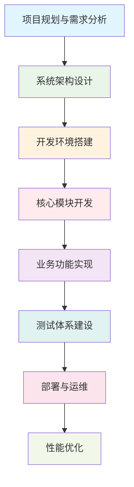
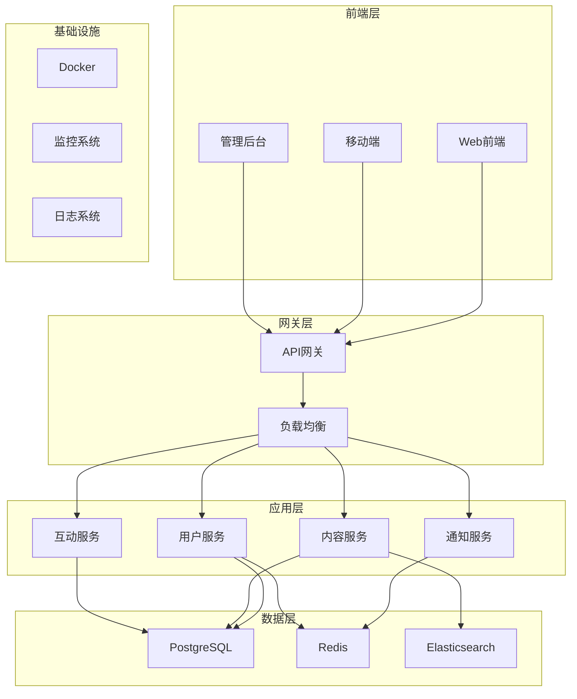

# 📚 第9章：企业级博客系统实战

> **从理论到实践** - 构建完整的企业级博客系统

## 🎯 章节概述

在前面8章的学习中，我们已经掌握了NestJS的核心技术、架构设计和业务模块开发。现在，我们将把所有知识整合起来，构建一个完整的企业级博客系统。这个项目将涵盖从需求分析到部署上线的完整开发流程。

### 🏗️ 项目特点

- **企业级标准**：符合企业级开发的质量要求和最佳实践
- **完整功能**：包含用户管理、内容管理、互动功能等完整业务模块
- **现代技术栈**：NestJS + TypeORM + PostgreSQL + Redis + Docker
- **工程化实践**：完整的测试、部署、监控体系

### 📊 学习路径设计

## 🎯 学习目标

通过本章学习，你将能够：

- 🎯 **掌握项目规划**：学会企业级项目的需求分析和规划方法
- 🏗️ **设计系统架构**：能够设计可扩展的企业级系统架构
- 💻 **实现核心功能**：独立开发完整的业务功能模块
- 🧪 **建设测试体系**：建立完整的自动化测试流程
- 🚀 **掌握部署运维**：学会容器化部署和生产环境运维
- 📊 **优化系统性能**：掌握性能分析和优化方法

## 📋 项目概览

### 🎯 项目目标

构建一个现代化的企业级博客平台，支持：
- 多用户内容创作和管理
- 丰富的互动功能
- 高性能和高可用性
- 完善的管理后台
- 移动端适配

### 🏗️ 技术架构

### 📊 功能模块

| 模块 | 功能描述 | 优先级 | 复杂度 |
|------|----------|--------|--------|
| 用户管理 | 注册登录、权限管理、用户资料 | 高 | ⭐⭐⭐ |
| 内容管理 | 文章发布、分类标签、富文本编辑 | 高 | ⭐⭐⭐⭐ |
| 互动功能 | 评论回复、点赞收藏、关注订阅 | 中 | ⭐⭐⭐ |
| 搜索功能 | 全文搜索、智能推荐、搜索统计 | 中 | ⭐⭐⭐⭐ |
| 通知系统 | 站内通知、邮件通知、推送通知 | 中 | ⭐⭐⭐ |
| 管理后台 | 内容审核、用户管理、数据统计 | 低 | ⭐⭐⭐⭐ |

## 🗂️ 章节结构

本章内容较多，分为以下几个部分：

### 📋 第一部分：项目规划（第9.1节）
- 需求分析与用户研究
- 项目范围和里程碑规划
- 技术选型和架构决策
- 团队协作和开发流程

### 🏗️ 第二部分：架构设计（第9.2节）
- 系统架构设计
- 数据库设计
- API设计
- 安全架构设计

### 🛠️ 第三部分：环境搭建（第9.3节）
- 开发环境配置
- 项目脚手架搭建
- 开发工具链配置
- 代码规范和质量工具

### 💻 第四部分：核心功能开发（第9.4节）
- 用户认证与授权
- 内容管理系统
- 互动功能实现
- 搜索和推荐系统

### 🧪 第五部分：测试与质量保证（第9.5节）
- 单元测试实践
- 集成测试设计
- E2E测试自动化
- 代码质量管理

### 🚀 第六部分：部署与运维（第9.6节）
- 容器化部署
- CI/CD流水线
- 监控和日志系统
- 性能优化实践

## 🎯 学习方式建议

### 📚 学习策略
1. **循序渐进**：按照章节顺序学习，每个部分都有前置依赖
2. **动手实践**：跟随教程一步步实现，不要只看不做
3. **理解原理**：不仅要知道怎么做，更要理解为什么这样做
4. **举一反三**：尝试扩展功能，应用到其他场景

### ⏰ 时间安排
- **总学习时间**：20-30小时
- **建议周期**：2-3周
- **每日学习**：1-2小时
- **实践时间**：占总时间的70%

### 🎯 学习检查点
- [ ] 完成需求分析和架构设计
- [ ] 搭建完整的开发环境
- [ ] 实现用户认证功能
- [ ] 完成内容管理系统
- [ ] 建立测试体系
- [ ] 成功部署到生产环境

## 🔗 相关资源

### 📖 参考文档
- [NestJS官方文档](https://docs.nestjs.com/)
- [TypeORM文档](https://typeorm.io/)
- [PostgreSQL文档](https://www.postgresql.org/docs/)
- [Docker文档](https://docs.docker.com/)

### 🛠️ 开发工具
- **IDE**: VS Code + NestJS插件
- **数据库工具**: pgAdmin, DBeaver
- **API测试**: Postman, Insomnia
- **版本控制**: Git + GitHub/GitLab

### 📊 项目模板
- 完整的项目代码仓库
- Docker配置文件
- CI/CD配置模板
- 部署脚本和文档

---

**准备好开始这个激动人心的实战项目了吗？** 🚀

让我们从第一部分开始，深入了解如何规划和设计一个企业级的博客系统！ 