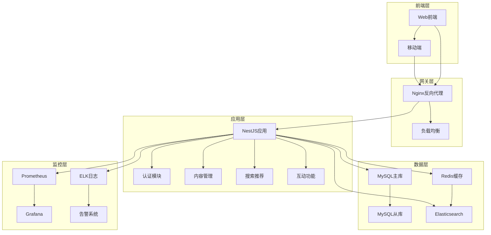

# 第9章 企业级博客系统实战 - 学习总结

> **🎓 学习成果总结** - 从零到一构建企业级NestJS应用的完整实战之旅

## 📚 章节回顾

### 🎯 学习目标达成情况

经过第9章的系统学习，您已经完成了一个完整的企业级博客系统开发，涵盖了从项目规划到生产部署的全流程。

#### ✅ 知识目标达成
- [x] **项目规划与架构设计**：掌握了企业级项目的需求分析、架构设计和技术选型
- [x] **数据库设计与建模**：学会了MySQL数据库的设计原则、ER建模和性能优化
- [x] **核心功能模块开发**：实现了用户认证、内容管理、互动功能等完整业务模块
- [x] **搜索推荐系统**：构建了全文搜索和智能推荐算法
- [x] **测试体系建设**：建立了完善的单元测试、集成测试和自动化测试流程
- [x] **部署与运维**：掌握了Docker容器化、云服务器部署和监控日志管理

#### ✅ 技能目标达成
- [x] 能够独立完成企业级NestJS项目的架构设计
- [x] 能够实现复杂的业务逻辑和数据关系
- [x] 能够构建高性能的搜索和推荐系统
- [x] 能够建立完整的测试和质量保证体系
- [x] 能够实现自动化部署和生产环境运维

---

## 🏗️ 项目成果展示

### 📊 系统架构图

### 🗄️ 数据库设计成果

**核心数据表结构**：
- **用户系统**：users, user_profiles, roles, user_roles (4张表)
- **内容管理**：articles, categories, tags, article_tags (4张表)
- **互动功能**：comments, likes, bookmarks, follows, notifications (5张表)
- **推荐系统**：user_behaviors (1张表)

**总计14张核心业务表，支撑完整的博客系统功能**

### 🔧 技术栈掌握清单

#### 后端技术栈
- [x] **NestJS框架**：模块化架构、依赖注入、装饰器使用
- [x] **TypeORM**：实体设计、关系映射、查询优化
- [x] **MySQL数据库**：表设计、索引优化、事务处理
- [x] **Redis缓存**：数据缓存、会话存储、分布式锁
- [x] **JWT认证**：用户认证、权限控制、会话管理
- [x] **文件上传**：Multer配置、文件处理、存储管理

#### 开发工具链
- [x] **TypeScript**：类型系统、装饰器、高级特性
- [x] **Jest测试**：单元测试、集成测试、覆盖率分析
- [x] **ESLint/Prettier**：代码规范、格式化、质量检查
- [x] **Swagger文档**：API文档生成、接口测试
- [x] **Git工作流**：版本控制、分支管理、协作开发

#### 部署运维
- [x] **Docker容器化**：镜像构建、容器编排、服务管理
- [x] **Nginx代理**：反向代理、负载均衡、SSL配置
- [x] **云服务器**：环境配置、安全设置、性能优化
- [x] **CI/CD流程**：自动化测试、构建部署、蓝绿发布
- [x] **监控日志**：Prometheus监控、ELK日志、告警通知

---

## 📈 学习成长轨迹

### 🎯 第9.1节 - 项目规划与需求分析
**学习成果**：
- 掌握了企业级项目的需求分析方法
- 学会了用户研究和功能优先级排序
- 理解了项目范围定义和里程碑规划
- 掌握了技术选型和架构决策记录

### 🏗️ 第9.2节 - 系统架构设计
**学习成果**：
- 掌握了分层架构和模块化设计原则
- 学会了数据库架构和缓存架构设计
- 理解了API接口设计规范
- 掌握了安全架构设计要点

### 🗄️ 第9.3节 - 数据库设计与建模
**学习成果**：
- 掌握了数据库设计原则和命名规范
- 学会了ER图设计和表结构设计
- 理解了索引优化和性能调优
- 掌握了数据迁移和版本管理

### ⚙️ 第9.4节 - 开发环境搭建
**学习成果**：
- 掌握了NestJS项目的标准化搭建
- 学会了开发工具和代码规范配置
- 理解了环境变量和配置管理
- 掌握了调试和热重载配置

### 🔐 第9.5节 - 用户认证模块
**学习成果**：
- 掌握了JWT认证机制的完整实现
- 学会了用户注册登录的安全处理
- 理解了RBAC权限模型设计
- 掌握了密码安全和会话管理

### 📝 第9.6节 - 内容管理模块
**学习成果**：
- 掌握了文章CRUD操作的完整实现
- 学会了分类标签系统的设计
- 理解了文件上传和处理机制
- 掌握了富文本编辑器集成

### 💬 第9.7节 - 互动功能模块
**学习成果**：
- 掌握了评论系统的设计和实现
- 学会了点赞收藏功能的开发
- 理解了用户关注系统的构建
- 掌握了通知机制的设计

### 🔍 第9.8节 - 搜索推荐模块
**学习成果**：
- 掌握了MySQL全文搜索的实现
- 学会了智能推荐算法的设计
- 理解了用户行为分析和建模
- 掌握了热门内容统计方法

### 🧪 第9.9节 - 测试体系建设
**学习成果**：
- 掌握了Jest单元测试的编写
- 学会了API集成测试的设计
- 理解了测试覆盖率分析方法
- 掌握了自动化测试流程配置

### 🚀 第9.10节 - 部署与运维
**学习成果**：
- 掌握了Docker容器化部署
- 学会了云服务器环境配置
- 理解了监控和日志管理
- 掌握了CI/CD自动化部署

---

## 🎯 核心能力提升

### 💻 技术能力
1. **后端开发能力**：从初级到高级的全面提升
2. **架构设计能力**：具备企业级应用架构设计思维
3. **数据库设计能力**：掌握复杂业务的数据建模
4. **性能优化能力**：理解缓存、索引、查询优化
5. **安全防护能力**：掌握认证授权、数据安全

### 🛠️ 工程能力
1. **项目规划能力**：需求分析、技术选型、架构设计
2. **代码质量能力**：测试驱动、代码规范、重构优化
3. **部署运维能力**：容器化、自动化、监控告警
4. **团队协作能力**：Git工作流、代码审查、文档编写
5. **问题解决能力**：调试技巧、性能分析、故障排查

### 🎓 学习能力
1. **自主学习能力**：通过实战项目深化理论知识
2. **技术调研能力**：技术选型、最佳实践研究
3. **文档编写能力**：技术文档、API文档、部署文档
4. **知识分享能力**：技术总结、经验分享、团队培训

---

## 🚀 后续学习建议

### 📚 深度学习方向

#### 1. 微服务架构进阶
- **学习内容**：服务拆分、服务治理、分布式事务
- **推荐资源**：
  - 《微服务设计》- Sam Newman
  - Spring Cloud微服务实战
  - Kubernetes容器编排

#### 2. 高并发系统设计
- **学习内容**：负载均衡、缓存策略、消息队列
- **推荐资源**：
  - 《高性能MySQL》
  - Redis设计与实现
  - RabbitMQ实战指南

#### 3. 云原生技术栈
- **学习内容**：Kubernetes、Service Mesh、Serverless
- **推荐资源**：
  - Kubernetes权威指南
  - Istio服务网格
  - AWS/阿里云云原生实践

### 🔧 技术栈扩展

#### 1. 前端技术学习
- **React/Vue.js**：现代前端框架
- **TypeScript**：前端类型安全
- **移动端开发**：React Native/Flutter

#### 2. 大数据技术
- **数据处理**：Apache Kafka、Apache Spark
- **数据存储**：MongoDB、ClickHouse
- **数据分析**：Elasticsearch、Kibana

#### 3. AI/ML集成
- **机器学习**：推荐算法优化
- **自然语言处理**：智能搜索、内容分析
- **图像处理**：图片识别、内容审核

### 📈 职业发展路径

#### 1. 技术专家路线
- **高级后端工程师** → **架构师** → **技术专家**
- 重点发展：技术深度、架构设计、技术创新

#### 2. 技术管理路线
- **高级工程师** → **技术主管** → **技术总监**
- 重点发展：团队管理、项目管理、技术规划

#### 3. 全栈工程师路线
- **后端工程师** → **全栈工程师** → **产品技术专家**
- 重点发展：全栈技能、产品思维、用户体验

---

## 🎉 学习成就解锁

### 🏆 技术成就
- [x] **NestJS专家**：掌握企业级NestJS应用开发
- [x] **数据库设计师**：具备复杂业务数据建模能力
- [x] **系统架构师**：能够设计可扩展的系统架构
- [x] **DevOps实践者**：掌握现代化部署运维技能
- [x] **质量工程师**：建立完善的测试和质量体系

### 📊 项目成就
- [x] **完整项目经验**：从0到1完成企业级项目
- [x] **技术栈整合**：熟练运用现代技术栈
- [x] **最佳实践应用**：遵循行业最佳实践
- [x] **生产环境部署**：具备生产环境运维经验
- [x] **团队协作能力**：掌握现代化协作工具

### 🎯 能力成就
- [x] **问题解决能力**：能够独立解决复杂技术问题
- [x] **学习能力**：具备快速学习新技术的能力
- [x] **创新能力**：能够提出技术改进和创新方案
- [x] **沟通能力**：能够清晰表达技术方案和想法
- [x] **领导能力**：具备技术团队领导潜质

---

## 💡 学习心得与感悟

### 🎓 技术学习感悟
通过第9章的学习，您不仅掌握了NestJS框架的深度应用，更重要的是培养了**系统性思维**和**工程化能力**。从项目规划到部署上线的完整流程，让您具备了企业级开发的全栈视野。

### 🚀 能力提升感悟
这不仅仅是一次技术学习，更是一次**能力跃迁**。您从单纯的代码编写者，成长为具备架构思维、工程能力和产品意识的**全面技术人才**。

### 🌟 未来发展感悟
技术的学习永无止境，但通过这次系统性的实战训练，您已经具备了**自主学习**和**持续成长**的能力。相信您能够在技术的道路上走得更远、更稳。

---

## 🎯 结语

**恭喜您完成了第9章《企业级博客系统实战》的全部学习！** 🎉

您现在已经：
- ✅ 掌握了企业级NestJS应用开发的完整技能
- ✅ 具备了从需求到部署的全流程开发能力
- ✅ 建立了现代化的开发、测试、部署工具链
- ✅ 培养了系统性思维和工程化能力

**这是一个新的起点，而不是终点。** 

继续保持学习的热情，在技术的道路上不断探索、不断成长。相信您一定能够成为优秀的技术专家，为团队和公司创造更大的价值！

**加油，未来的技术专家！** 🚀✨ 