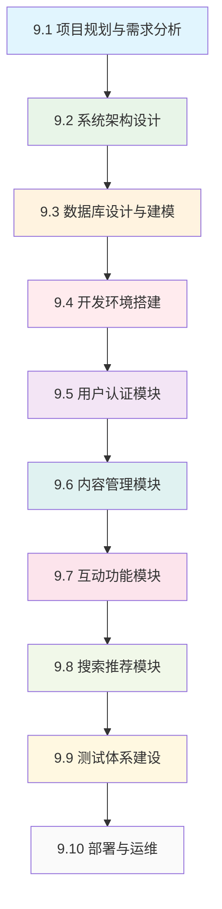

# 第9章 企业级博客系统实战

> **从理论到实践** - 构建完整的企业级博客系统

## 📚 本章学习目标

### 🎯 知识目标
- [ ] **掌握项目规划方法**：学会企业级项目的需求分析和规划流程
- [ ] **理解系统架构设计**：能够设计可扩展的企业级系统架构
- [ ] **掌握数据库设计**：学会设计高效的MySQL数据库架构
- [ ] **理解API设计规范**：建立RESTful API的设计标准和最佳实践
- [ ] **掌握安全架构**：构建完整的安全防护体系
- [ ] **学会测试体系建设**：建立完整的自动化测试流程

### 🛠️ 技能目标
- [ ] 能够独立完成企业级项目的需求分析和架构设计
- [ ] 能够使用NestJS + TypeORM + MySQL构建完整的后端系统
- [ ] 能够实现用户认证、内容管理、互动功能等核心业务模块
- [ ] 能够建立完整的测试体系和部署流程
- [ ] 能够进行系统性能优化和监控

### ⏰ 学习时长
- **理论学习**：8-10小时
- **实践开发**：15-20小时
- **测试部署**：3-5小时
- **总计时长**：26-35小时（建议分2-3周完成）

### 📋 前置知识检查
在开始本章学习前，请确保您已掌握以下知识：
- [ ] 前8章的所有内容（NestJS基础、模块系统、依赖注入等）
- [ ] MySQL数据库基础操作
- [ ] TypeORM的基本使用
- [ ] JWT认证机制
- [ ] RESTful API设计原则
- [ ] 基本的项目管理知识

---

## 🎯 项目概述

### 📊 项目背景

在当今数字化时代，内容创作和分享已成为互联网的核心活动。我们将构建一个现代化的企业级博客平台，它不仅仅是一个简单的内容发布工具，而是一个完整的内容生态系统。

**就像建造一座现代化的图书馆**：
- 📚 **图书管理系统** → 内容管理系统
- 👥 **读者服务系统** → 用户管理系统  
- 🔍 **图书检索系统** → 搜索推荐系统
- 💬 **读者交流区** → 评论互动系统
- 🛡️ **安全管理系统** → 权限安全系统

### 🏗️ 技术架构选型

#### 核心技术栈
```
后端框架：NestJS (TypeScript)
数据库：MySQL 8.0
ORM：TypeORM
缓存：Redis
搜索：Elasticsearch (可选)
文件存储：本地存储/云存储
```

#### 架构模式
- **分层架构**：表现层、业务层、数据层清晰分离
- **模块化设计**：按业务功能划分模块
- **RESTful API**：标准的API设计规范
- **事件驱动**：异步处理和解耦

### 📋 功能模块规划

#### 🔰 核心功能模块（MVP）
1. **用户管理模块**
   - 用户注册、登录、资料管理
   - 角色权限管理
   - 用户状态管理

2. **内容管理模块**
   - 文章创建、编辑、发布
   - 分类和标签管理
   - 富文本编辑支持

3. **互动功能模块**
   - 评论和回复
   - 点赞和收藏
   - 用户关注

#### 🚀 增强功能模块
4. **搜索推荐模块**
   - 全文搜索
   - 智能推荐
   - 热门内容

5. **通知系统模块**
   - 站内通知
   - 邮件通知
   - 实时推送

6. **管理后台模块**
   - 内容审核
   - 用户管理
   - 数据统计

### 🎯 学习路径设计



---

## 📖 章节内容导航

### 📋 第一部分：项目规划与设计（第9.1-9.3节）
**学习重点**：掌握企业级项目的规划和设计方法

#### 9.1 项目规划与需求分析
- 需求收集与分析方法
- 用户画像和场景分析
- 功能优先级排序
- 项目里程碑规划

#### 9.2 系统架构设计
- 整体架构设计
- 模块划分和依赖关系
- 技术选型决策
- 接口设计规范

#### 9.3 数据库设计与建模
- MySQL数据库设计
- 实体关系建模
- 索引优化策略
- 数据迁移方案

### 💻 第二部分：核心功能开发（第9.4-9.8节）
**学习重点**：实现完整的业务功能模块

#### 9.4 开发环境搭建
- 项目脚手架创建
- 开发工具配置
- 代码规范设置
- 调试环境配置

#### 9.5 用户认证模块
- JWT认证实现
- 角色权限系统
- 密码安全策略
- 会话管理

#### 9.6 内容管理模块
- 文章CRUD操作
- 富文本编辑器集成
- 文件上传处理
- 分类标签系统

#### 9.7 互动功能模块
- 评论系统实现
- 点赞收藏功能
- 用户关注系统
- 通知机制

#### 9.8 搜索推荐模块
- 全文搜索实现
- 搜索结果优化
- 推荐算法设计
- 热门内容统计

### 🧪 第三部分：质量保证与部署（第9.9-9.10节）
**学习重点**：建立完整的质量保证和部署体系

#### 9.9 测试体系建设
- 单元测试编写
- 集成测试设计
- API测试自动化
- 测试覆盖率分析

#### 9.10 部署与运维
- Docker容器化
- CI/CD流水线
- 生产环境部署
- 监控和日志

---

## 🎯 学习方法建议

### 📚 学习策略
1. **理论与实践结合**：每学完一个概念立即动手实践
2. **循序渐进**：按照章节顺序学习，确保前置知识扎实
3. **项目驱动**：以完成博客系统为目标，带着问题学习
4. **反复迭代**：先实现基本功能，再逐步完善和优化

### 🔄 实践方法
1. **代码跟随**：跟着教程一步步编写代码
2. **独立思考**：尝试自己解决遇到的问题
3. **扩展练习**：在基础功能上添加自己的创新
4. **代码审查**：定期回顾和重构自己的代码

### 📊 学习检查点
- [ ] 完成需求分析文档
- [ ] 绘制系统架构图
- [ ] 设计完整的数据库模型
- [ ] 实现用户认证功能
- [ ] 完成文章管理功能
- [ ] 实现评论互动功能
- [ ] 添加搜索功能
- [ ] 建立测试体系
- [ ] 成功部署到生产环境

---

## 🔗 相关资源

### 📖 参考文档
- [NestJS官方文档](https://docs.nestjs.com/)
- [TypeORM官方文档](https://typeorm.io/)
- [MySQL官方文档](https://dev.mysql.com/doc/)
- [Redis官方文档](https://redis.io/documentation)

### 🛠️ 开发工具
- **IDE**：VS Code + NestJS插件
- **数据库工具**：MySQL Workbench、phpMyAdmin
- **API测试**：Postman、Insomnia
- **版本控制**：Git + GitHub

### 📊 项目模板
- 完整的项目代码仓库
- Docker配置文件
- 数据库初始化脚本
- API文档模板

---

**准备好开始这个激动人心的企业级项目了吗？** 🚀

让我们从第一节开始，学习如何进行专业的项目规划和需求分析！ 