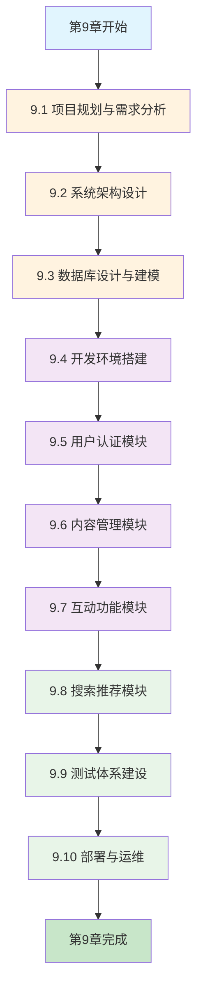

# 第9章 学习路径导航

> **🗺️ 学习指南** - 企业级博客系统实战的完整学习路径

## 📚 章节概览

第9章《企业级博客系统实战》是NestJS教学指南的核心实战章节，通过一个完整的企业级项目，将前8章的理论知识融会贯通，形成完整的技能体系。

### 🎯 学习目标
- 掌握企业级NestJS应用的完整开发流程
- 建立从需求分析到部署上线的全栈开发能力
- 培养系统性思维和工程化实践能力
- 具备独立承担企业级项目的技术实力

---

## 🛤️ 学习路径图



---

## 📖 分阶段学习指南

### 🎯 第一阶段：项目规划与设计（第9.1-9.3节）

#### 📋 学习重点
- **项目规划思维**：需求分析、用户研究、功能优先级
- **架构设计能力**：分层架构、模块化设计、技术选型
- **数据建模技能**：ER图设计、表结构设计、索引优化

#### 🎓 学习建议
1. **理论先行**：先理解企业级项目的规划方法
2. **实践跟进**：边学边做，完成需求文档和架构设计
3. **思维训练**：培养系统性思维和全局观念

#### ⏰ 建议学习时间：1-2周

---

### 🛠️ 第二阶段：核心功能开发（第9.4-9.7节）

#### 📋 学习重点
- **环境搭建**：标准化开发环境、工具链配置
- **认证授权**：JWT认证、RBAC权限、安全防护
- **业务模块**：CRUD操作、数据关系、业务逻辑
- **用户体验**：文件上传、富文本、互动功能

#### 🎓 学习建议
1. **循序渐进**：按模块顺序学习，确保每个模块都掌握
2. **代码实践**：亲自编写每一行代码，理解实现细节
3. **测试验证**：及时测试功能，确保代码质量

#### ⏰ 建议学习时间：3-4周

---

### 🚀 第三阶段：高级功能与部署（第9.8-9.10节）

#### 📋 学习重点
- **搜索推荐**：全文搜索、推荐算法、用户行为分析
- **质量保证**：单元测试、集成测试、自动化测试
- **部署运维**：容器化、云部署、监控日志

#### 🎓 学习建议
1. **深度理解**：重点理解算法原理和实现思路
2. **工程实践**：注重工程化能力和最佳实践
3. **生产思维**：以生产环境的标准要求自己

#### ⏰ 建议学习时间：2-3周

---

## 🎯 重点知识点梳理

### 🏗️ 架构设计知识点

#### 核心概念
- **分层架构**：表现层、业务层、数据层的职责划分
- **模块化设计**：功能模块的拆分和组织
- **依赖注入**：IoC容器的使用和最佳实践
- **设计模式**：工厂模式、策略模式、观察者模式

#### 实践要点
```typescript
// 模块化设计示例
@Module({
  imports: [TypeOrmModule.forFeature([User])],
  controllers: [UserController],
  providers: [UserService],
  exports: [UserService],
})
export class UserModule {}
```

### 🗄️ 数据库设计知识点

#### 核心概念
- **ER建模**：实体关系图的设计方法
- **范式理论**：第一、二、三范式的应用
- **索引优化**：B+树索引、全文索引、复合索引
- **查询优化**：SQL优化、执行计划分析

#### 实践要点
```sql
-- 索引设计示例
CREATE INDEX idx_articles_author_status ON articles(author_id, status);
CREATE FULLTEXT INDEX ft_articles_content ON articles(title, content);
```

### 🔐 认证授权知识点

#### 核心概念
- **JWT机制**：Token生成、验证、刷新
- **RBAC模型**：角色权限访问控制
- **安全防护**：密码加密、SQL注入防护、XSS防护
- **会话管理**：Session存储、过期处理

#### 实践要点
```typescript
// JWT策略示例
@Injectable()
export class JwtStrategy extends PassportStrategy(Strategy) {
  constructor(configService: ConfigService) {
    super({
      jwtFromRequest: ExtractJwt.fromAuthHeaderAsBearerToken(),
      secretOrKey: configService.get('JWT_SECRET'),
    });
  }
}
```

### 🔍 搜索推荐知识点

#### 核心概念
- **全文搜索**：MySQL全文索引、Elasticsearch
- **推荐算法**：协同过滤、内容推荐、混合推荐
- **用户行为**：行为收集、权重计算、兴趣建模
- **性能优化**：缓存策略、查询优化、分页处理

#### 实践要点
```typescript
// 推荐算法示例
async getPersonalizedRecommendations(userId: string) {
  const userInterests = await this.getUserInterests(userId);
  const contentBased = await this.getContentBasedRecommendations(userInterests);
  const collaborative = await this.getCollaborativeRecommendations(userId);
  return this.mergeRecommendations(contentBased, collaborative);
}
```

---

## 🛠️ 实践练习建议

### 📝 基础练习

#### 练习1：项目规划文档
**目标**：完成完整的项目规划文档
**内容**：
- 需求分析报告
- 用户画像设计
- 功能优先级排序
- 技术选型说明

#### 练习2：数据库设计
**目标**：设计完整的数据库结构
**内容**：
- ER图绘制
- 表结构设计
- 索引规划
- 数据迁移脚本

### 🚀 进阶练习

#### 练习3：核心功能实现
**目标**：实现所有核心业务功能
**内容**：
- 用户认证系统
- 文章管理系统
- 评论互动系统
- 搜索推荐系统

#### 练习4：测试与部署
**目标**：建立完整的测试和部署体系
**内容**：
- 单元测试编写
- 集成测试设计
- Docker容器化
- CI/CD流程配置

### 🎯 挑战练习

#### 练习5：性能优化
**目标**：优化系统性能和用户体验
**内容**：
- 数据库查询优化
- 缓存策略设计
- 接口响应时间优化
- 并发处理能力提升

#### 练习6：功能扩展
**目标**：扩展系统功能和技术栈
**内容**：
- 实时通知功能
- 图片处理服务
- 第三方登录集成
- 移动端API适配

---

## 📊 学习进度跟踪

### 🎯 学习检查清单

#### 第一阶段检查点
- [ ] 完成需求分析文档
- [ ] 绘制系统架构图
- [ ] 设计数据库ER图
- [ ] 编写技术选型说明

#### 第二阶段检查点
- [ ] 搭建开发环境
- [ ] 实现用户认证功能
- [ ] 完成文章管理模块
- [ ] 开发互动功能模块

#### 第三阶段检查点
- [ ] 实现搜索推荐功能
- [ ] 编写完整测试用例
- [ ] 完成Docker部署
- [ ] 配置监控日志系统

### 📈 能力评估标准

#### 初级水平（60-70分）
- 能够理解项目需求和架构设计
- 能够实现基本的CRUD功能
- 能够编写简单的单元测试
- 能够完成基础的Docker部署

#### 中级水平（70-85分）
- 能够独立完成模块设计和开发
- 能够处理复杂的业务逻辑
- 能够编写完整的测试用例
- 能够配置完整的部署流程

#### 高级水平（85-95分）
- 能够设计可扩展的系统架构
- 能够优化系统性能和用户体验
- 能够建立完善的质量保证体系
- 能够实现自动化运维流程

#### 专家水平（95-100分）
- 能够指导团队完成企业级项目
- 能够解决复杂的技术难题
- 能够制定技术标准和最佳实践
- 能够推动技术创新和改进

---

## 🎓 学习资源推荐

### 📚 必读文档
- [NestJS官方文档](https://docs.nestjs.com/)
- [TypeORM官方文档](https://typeorm.io/)
- [MySQL官方文档](https://dev.mysql.com/doc/)
- [Docker官方文档](https://docs.docker.com/)

### 🎥 视频教程
- NestJS实战教程系列
- TypeScript高级特性讲解
- MySQL性能优化实践
- Docker容器化部署指南

### 📖 推荐书籍
- 《Node.js设计模式》
- 《高性能MySQL》
- 《Docker技术入门与实战》
- 《微服务设计》

### 🛠️ 开发工具
- **IDE**：VS Code、WebStorm
- **数据库工具**：MySQL Workbench、Navicat
- **API测试**：Postman、Insomnia
- **版本控制**：Git、GitHub

---

## 🎯 常见问题解答

### ❓ 学习难点解答

#### Q1：如何理解NestJS的模块化设计？
**A1**：NestJS的模块化设计类似于Angular，每个模块都是一个独立的功能单元，包含控制器、服务和相关的依赖。通过`@Module`装饰器定义模块的导入、导出和提供者。

#### Q2：数据库设计时如何处理复杂的关系？
**A2**：使用ER图先梳理实体关系，然后根据业务需求选择合适的关系类型（一对一、一对多、多对多）。注意避免过度设计，保持数据结构的简洁性。

#### Q3：JWT认证的安全性如何保证？
**A3**：使用强密钥、设置合理的过期时间、实现Token刷新机制、在敏感操作时进行二次验证。

#### Q4：如何优化搜索功能的性能？
**A4**：使用全文索引、实现搜索结果缓存、采用分页查询、考虑使用Elasticsearch等专业搜索引擎。

### 🔧 技术问题解答

#### Q5：Docker部署时遇到网络问题怎么办？
**A5**：检查docker-compose网络配置、确保服务间的网络连通性、使用服务名而不是localhost进行内部通信。

#### Q6：测试覆盖率不达标怎么办？
**A6**：分析覆盖率报告、补充缺失的测试用例、重点关注业务逻辑和边界条件的测试。

#### Q7：生产环境部署需要注意什么？
**A7**：环境变量配置、数据库备份、SSL证书配置、监控告警设置、回滚方案准备。

---

## 🚀 下一步学习建议

### 📈 技能提升方向

#### 1. 深度技术学习
- **微服务架构**：学习服务拆分和治理
- **高并发处理**：学习缓存、队列、负载均衡
- **云原生技术**：学习Kubernetes、Service Mesh

#### 2. 技术栈扩展
- **前端技术**：React、Vue.js、移动端开发
- **大数据技术**：Kafka、Spark、数据分析
- **AI/ML技术**：机器学习、自然语言处理

#### 3. 软技能提升
- **项目管理**：敏捷开发、团队协作
- **技术写作**：文档编写、技术分享
- **架构设计**：系统设计、技术决策

### 🎯 职业发展路径

#### 技术专家路线
**高级工程师** → **架构师** → **技术专家** → **首席技术官**

#### 技术管理路线
**高级工程师** → **技术主管** → **技术经理** → **技术总监**

#### 全栈发展路线
**后端工程师** → **全栈工程师** → **产品技术专家** → **技术创业者**

---

## 🎉 结语

第9章的学习是一个完整的技术成长之旅，通过企业级博客系统的实战开发，您不仅掌握了NestJS的深度应用，更重要的是培养了系统性思维和工程化能力。

**记住**：
- 🎯 **理论与实践并重**：既要理解原理，也要动手实践
- 🚀 **持续学习改进**：技术在不断发展，保持学习的热情
- 🤝 **分享交流成长**：与同行交流，共同进步
- 💡 **创新思维突破**：在掌握基础的同时，勇于创新

**祝您在技术的道路上越走越远，成为优秀的技术专家！** 🌟 