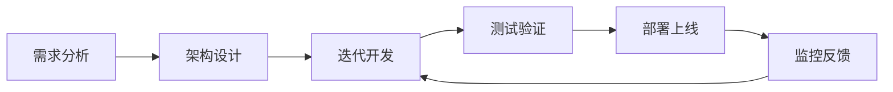

# 项目实施指南

> **📋 实战手册** - NestJS进阶项目的详细实施指南

## 🎯 使用说明

本指南为每个进阶项目提供详细的实施步骤、技术要点和评估标准，帮助您高效完成项目开发并达到预期的学习目标。

---

## 🌟 入门级项目实施指南

### 项目1：个人任务管理系统 (Todo List Pro)

#### 📋 项目实施步骤

**第1周：项目初始化与基础架构**
```bash
# 1. 创建项目
npm i -g @nestjs/cli
nest new todo-list-pro

# 2. 安装依赖
npm install @nestjs/typeorm typeorm sqlite3
npm install @nestjs/jwt @nestjs/passport passport passport-jwt
npm install @nestjs/swagger swagger-ui-express
npm install class-validator class-transformer

# 3. 安装开发依赖
npm install -D @types/passport-jwt
```

**第2周：数据库设计与实体创建**
- 设计用户表、任务表、分类表
- 创建TypeORM实体
- 配置数据库连接
- 实现数据库迁移

**第3周：核心功能开发**
- 用户认证模块（注册/登录）
- 任务CRUD操作
- 任务分类管理
- 基础的数据验证

**第4周：完善功能与测试**
- 任务状态管理
- 数据统计功能
- API文档完善
- 单元测试编写

#### 🔧 关键技术要点

**1. 数据库设计**
```sql
-- 用户表
CREATE TABLE users (
  id INTEGER PRIMARY KEY AUTOINCREMENT,
  username VARCHAR(50) UNIQUE NOT NULL,
  email VARCHAR(100) UNIQUE NOT NULL,
  password_hash VARCHAR(255) NOT NULL,
  created_at DATETIME DEFAULT CURRENT_TIMESTAMP
);

-- 任务表
CREATE TABLE tasks (
  id INTEGER PRIMARY KEY AUTOINCREMENT,
  title VARCHAR(200) NOT NULL,
  description TEXT,
  status ENUM('pending', 'in_progress', 'completed') DEFAULT 'pending',
  priority ENUM('low', 'medium', 'high') DEFAULT 'medium',
  due_date DATETIME,
  user_id INTEGER,
  category_id INTEGER,
  created_at DATETIME DEFAULT CURRENT_TIMESTAMP,
  FOREIGN KEY (user_id) REFERENCES users(id),
  FOREIGN KEY (category_id) REFERENCES categories(id)
);
```

**2. JWT认证实现**
```typescript
// auth.service.ts
@Injectable()
export class AuthService {
  async login(user: any) {
    const payload = { username: user.username, sub: user.id };
    return {
      access_token: this.jwtService.sign(payload),
    };
  }
}
```

#### 📊 评估标准

| 评估项目 | 优秀(90-100) | 良好(80-89) | 及格(70-79) | 不及格(<70) |
|---------|-------------|------------|------------|-------------|
| **功能完整性** | 所有功能完整实现 | 核心功能完整 | 基础功能完整 | 功能不完整 |
| **代码质量** | 规范、可读性强 | 较规范 | 基本规范 | 不规范 |
| **API设计** | RESTful、文档完善 | 基本RESTful | 接口可用 | 设计混乱 |
| **测试覆盖** | >80%覆盖率 | 60-80% | 40-60% | <40% |

---

### 项目2：在线书签管理器

#### 📋 项目实施步骤

**第1-2周：项目搭建与数据库设计**
- NestJS项目初始化
- MySQL数据库配置
- Redis缓存配置
- 实体设计与关系映射

**第3周：核心功能开发**
- 书签CRUD操作
- 标签系统实现
- 用户认证与授权
- 文件上传功能

**第4周：高级功能实现**
- 全文搜索功能
- 书签导入导出
- 缓存策略实现
- 性能优化

**第5周：测试与部署**
- 单元测试与集成测试
- API文档完善
- Docker容器化
- 部署配置

#### 🔧 关键技术要点

**1. Redis缓存策略**
```typescript
@Injectable()
export class BookmarkService {
  async findAll(userId: string) {
    const cacheKey = `bookmarks:${userId}`;
    
    // 尝试从缓存获取
    const cached = await this.redis.get(cacheKey);
    if (cached) {
      return JSON.parse(cached);
    }
    
    // 从数据库查询
    const bookmarks = await this.bookmarkRepository.find({
      where: { userId },
      relations: ['tags']
    });
    
    // 缓存结果
    await this.redis.setex(cacheKey, 300, JSON.stringify(bookmarks));
    
    return bookmarks;
  }
}
```

**2. 全文搜索实现**
```typescript
async searchBookmarks(query: string, userId: string) {
  return this.bookmarkRepository
    .createQueryBuilder('bookmark')
    .where('bookmark.userId = :userId', { userId })
    .andWhere(
      'MATCH(bookmark.title, bookmark.description) AGAINST(:query IN NATURAL LANGUAGE MODE)',
      { query }
    )
    .getMany();
}
```

---

## 🚀 初级项目实施指南

### 项目4：在线教育平台API

#### 📋 项目实施步骤

**第1-2周：架构设计与环境搭建**
- 系统架构设计
- PostgreSQL数据库设计
- Redis + Bull队列配置
- 第三方服务集成准备

**第3-4周：核心模块开发**
- 用户管理模块
- 课程管理模块
- 学习进度跟踪
- 权限控制系统

**第5-6周：高级功能实现**
- 在线考试系统
- 支付集成
- WebSocket实时通信
- 文件存储服务

**第7-8周：数据分析与优化**
- 学习数据分析
- 性能监控
- 缓存优化
- 安全加固

**第9-10周：测试与部署**
- 完整测试体系
- API文档
- 生产环境部署
- 监控告警

#### 🔧 关键技术要点

**1. Bull队列处理**
```typescript
// 视频处理队列
@Processor('video-processing')
export class VideoProcessor {
  @Process('transcode')
  async handleTranscode(job: Job<{ videoPath: string; quality: string }>) {
    const { videoPath, quality } = job.data;
    
    // 视频转码逻辑
    await this.videoService.transcode(videoPath, quality);
    
    // 更新进度
    job.progress(100);
  }
}
```

**2. WebSocket实时通信**
```typescript
@WebSocketGateway({
  cors: {
    origin: '*',
  },
})
export class ChatGateway {
  @SubscribeMessage('joinRoom')
  handleJoinRoom(client: Socket, payload: { courseId: string }) {
    client.join(`course_${payload.courseId}`);
  }
  
  @SubscribeMessage('sendMessage')
  handleMessage(client: Socket, payload: any) {
    this.server.to(`course_${payload.courseId}`).emit('newMessage', payload);
  }
}
```

---

## 💼 中级项目实施指南

### 项目5：电商平台微服务架构

#### 📋 项目实施步骤

**第1-3周：微服务架构设计**
- 服务拆分设计
- API Gateway配置
- 服务注册与发现
- 配置管理中心

**第4-6周：核心服务开发**
- 用户服务
- 商品服务
- 订单服务
- 支付服务

**第7-9周：服务集成与通信**
- 服务间通信
- 分布式事务
- 消息队列集成
- 数据一致性

**第10-12周：监控与部署**
- 服务监控
- 链路追踪
- Kubernetes部署
- CI/CD流程

**第13-16周：性能优化与扩展**
- 性能测试
- 缓存策略
- 数据库优化
- 弹性扩缩容

#### 🔧 关键技术要点

**1. 微服务通信**
```typescript
// 使用消息队列进行异步通信
@Injectable()
export class OrderService {
  async createOrder(orderData: CreateOrderDto) {
    // 创建订单
    const order = await this.orderRepository.save(orderData);
    
    // 发送库存扣减消息
    await this.messageQueue.send('inventory.reduce', {
      orderId: order.id,
      items: order.items
    });
    
    // 发送支付消息
    await this.messageQueue.send('payment.process', {
      orderId: order.id,
      amount: order.totalAmount
    });
    
    return order;
  }
}
```

**2. 分布式事务处理**
```typescript
// Saga模式实现分布式事务
@Injectable()
export class OrderSaga {
  async executeOrderTransaction(orderData: any) {
    const saga = new Saga();
    
    saga
      .addStep('createOrder', this.orderService.create.bind(this.orderService))
      .addStep('reduceInventory', this.inventoryService.reduce.bind(this.inventoryService))
      .addStep('processPayment', this.paymentService.process.bind(this.paymentService))
      .addCompensation('createOrder', this.orderService.cancel.bind(this.orderService))
      .addCompensation('reduceInventory', this.inventoryService.restore.bind(this.inventoryService));
    
    return saga.execute(orderData);
  }
}
```

---

## 🏆 高级项目实施指南

### 项目8：分布式视频流媒体平台

#### 📋 项目实施步骤

**第1-4周：系统架构设计**
- 分布式架构设计
- CDN架构规划
- 存储策略设计
- 技术选型确定

**第5-8周：核心服务开发**
- 视频上传服务
- 转码服务
- 存储服务
- 用户服务

**第9-12周：流媒体功能**
- 直播推流服务
- 播放服务
- 弹幕系统
- CDN集成

**第13-16周：高级功能**
- 推荐算法
- 数据分析
- 监控系统
- 性能优化

**第17-20周：扩展与优化**
- 全球化部署
- 边缘计算
- AI功能集成
- 安全加固

**第21-24周：生产部署**
- 压力测试
- 灾备方案
- 监控告警
- 运维自动化

#### 🔧 关键技术要点

**1. 视频转码服务**
```typescript
@Injectable()
export class VideoTranscodeService {
  async transcodeVideo(videoPath: string, formats: string[]) {
    const jobs = formats.map(format => ({
      input: videoPath,
      output: `${videoPath}_${format}`,
      format: format
    }));
    
    // 并行处理多种格式
    const results = await Promise.all(
      jobs.map(job => this.processTranscode(job))
    );
    
    return results;
  }
  
  private async processTranscode(job: any) {
    return new Promise((resolve, reject) => {
      ffmpeg(job.input)
        .format(job.format)
        .on('end', () => resolve(job.output))
        .on('error', reject)
        .save(job.output);
    });
  }
}
```

**2. CDN缓存策略**
```typescript
@Injectable()
export class CDNService {
  async getCachedVideo(videoId: string, quality: string) {
    const cacheKey = `video:${videoId}:${quality}`;
    
    // 检查边缘缓存
    let videoUrl = await this.edgeCache.get(cacheKey);
    
    if (!videoUrl) {
      // 从源站获取
      videoUrl = await this.originServer.getVideoUrl(videoId, quality);
      
      // 缓存到边缘节点
      await this.edgeCache.set(cacheKey, videoUrl, 3600);
    }
    
    return videoUrl;
  }
}
```

---

## 📊 通用实施建议

### 🎯 项目管理最佳实践

#### 1. 敏捷开发流程


#### 2. 代码质量保证
- **代码规范**：使用ESLint + Prettier
- **类型检查**：TypeScript严格模式
- **测试覆盖**：单元测试 + 集成测试
- **代码审查**：Pull Request流程

#### 3. 文档管理
- **API文档**：Swagger自动生成
- **架构文档**：系统设计文档
- **部署文档**：运维操作手册
- **用户文档**：功能使用说明

### 🔧 技术选型指南

#### 数据库选择
| 项目类型 | 推荐数据库 | 理由 |
|---------|-----------|------|
| **简单CRUD** | SQLite/MySQL | 轻量级，易于使用 |
| **复杂查询** | PostgreSQL | 功能强大，支持JSON |
| **高并发读写** | MongoDB | 水平扩展，灵活schema |
| **时序数据** | InfluxDB | 专为时序数据优化 |

#### 缓存策略
| 场景 | 推荐方案 | 配置建议 |
|------|---------|---------|
| **会话存储** | Redis | 内存模式，快速过期 |
| **数据缓存** | Redis Cluster | 分布式，持久化 |
| **CDN缓存** | 边缘节点 | 地理分布，长期缓存 |
| **应用缓存** | 内存缓存 | 进程内，热点数据 |

### 📈 性能优化策略

#### 1. 数据库优化
- **索引设计**：合理创建索引
- **查询优化**：避免N+1问题
- **连接池**：合理配置连接数
- **读写分离**：主从架构

#### 2. 缓存优化
- **多级缓存**：L1/L2/L3缓存
- **缓存预热**：提前加载热点数据
- **缓存更新**：合理的失效策略
- **缓存穿透**：布隆过滤器

#### 3. 应用优化
- **异步处理**：消息队列
- **批量操作**：减少数据库访问
- **资源池化**：连接池、线程池
- **监控告警**：实时性能监控

---

## 🎯 学习成果评估

### 📊 技能评估矩阵

| 技能项目 | 入门级 | 初级 | 中级 | 高级 | 专家级 |
|---------|--------|------|------|------|--------|
| **架构设计** | 单体应用 | 分层架构 | 微服务 | 分布式 | 云原生 |
| **性能优化** | 基础优化 | 缓存使用 | 并发处理 | 大规模优化 | 智能优化 |
| **问题解决** | 基础调试 | 日志分析 | 性能分析 | 故障排查 | 预防性维护 |
| **技术创新** | 学习新技术 | 应用新技术 | 技术选型 | 架构创新 | 技术引领 |

### 🏆 项目完成标准

#### 基础标准（必须达到）
- [ ] 功能完整实现
- [ ] 代码质量合格
- [ ] 测试覆盖率达标
- [ ] 文档完善

#### 进阶标准（建议达到）
- [ ] 性能优化到位
- [ ] 安全防护完善
- [ ] 监控告警完整
- [ ] 部署自动化

#### 专家标准（挑战目标）
- [ ] 技术创新应用
- [ ] 架构设计优秀
- [ ] 可扩展性强
- [ ] 运维友好

---

## 🎉 总结

通过这个详细的实施指南，您可以：

1. **明确项目目标**：每个项目都有清晰的学习目标和技术要求
2. **掌握实施步骤**：分阶段、有计划地完成项目开发
3. **理解技术要点**：掌握关键技术的实现方法
4. **评估学习成果**：通过标准化的评估体系检验学习效果

**记住**：项目实施不仅仅是完成功能，更重要的是在过程中学习和成长。每个项目都是您技术能力提升的重要里程碑！

**祝您项目实施顺利，技术能力不断提升！** 🚀✨ 